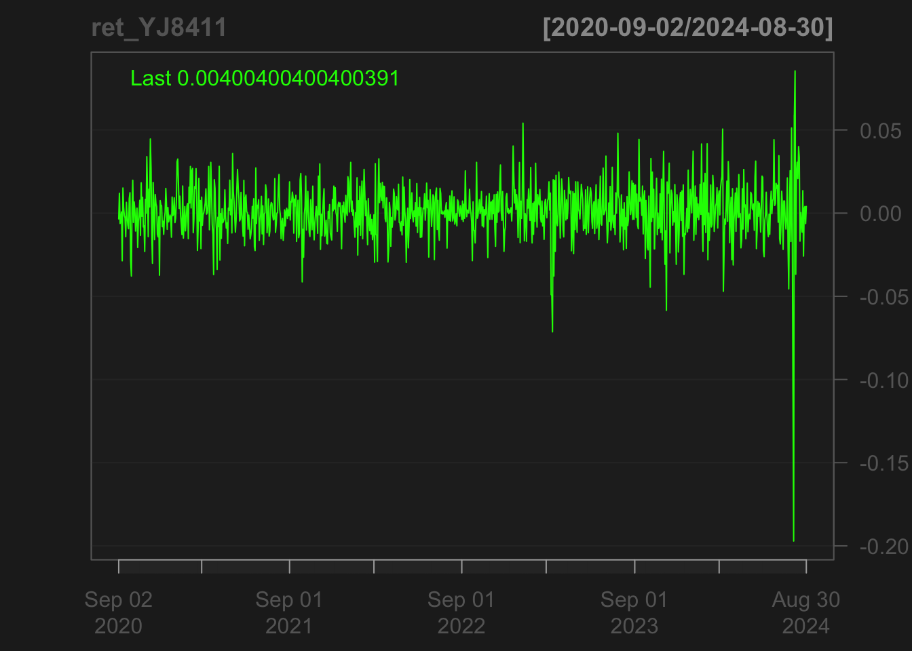

## 金融時系列データの特徴


### 金融時系列データの特徴: みずほ (8411) 株価データの例 {-}
- quantmod()による株価データの取得

```r
library('quantmod')
YJ8411.T <- getSymbols('8411.T',from = '2020-10-01', to = '2023-09-29', src = "yahoo", auto.assign = FALSE)
# 日次株価の時系列プロット
chartSeries(YJ8411.T)
```

<div class="figure" style="text-align: center">

<p class="caption">(\#fig:quantmod-1)...</p>
</div>

```r
# 日次4本値
chartSeries(OHLC(YJ8411.T))
```

<div class="figure" style="text-align: center">

<p class="caption">(\#fig:quantmod-2)...</p>
</div>

- 日次収益率の時系列プロット

```r
# 日次収益率の時系列プロット
ret_YJ8411 <- ClCl(YJ8411.T)
chartSeries(ret_YJ8411)
```



- 日次収益率のヒストグラム

```r
# 日次収益率のヒストグラム
hist(ret_YJ8411)
```


- 日次収益率の要約統計量

```r
library(psych)
describe(ret_YJ8411)
#>    vars   n mean   sd median trimmed  mad   min  max range  skew kurtosis se
#> X1    1 734    0 0.01      0       0 0.01 -0.07 0.05  0.13 -0.12     1.86  0
# 要約統計量を計算
# デフォルト出力
# mean
# standard deviation
# trimmed mean (with trim defaulting to .1) 
# median (standard or interpolated
# mad: median absolute deviation (from the median). 
# minimum
# maximum
# skew
# kurtosis
# standard error
# 注) kurtosisは-3した値
```

- 日次収益率の自己相関

```r
# 日次収益率の自己相関
acf(ret_YJ8411, na.action = na.pass)
```


- 日次収益率絶対値の自己相関

```r
# 日次収益率絶対値の自己相関
acf(abs(ret_YJ8411), na.action = na.pass)
```


## シミュレーションによるサンプルパス生成
- 時系列モデリングでは, 観測時系列データの特徴と比較し, 適切なモデルを見い出すため, シミュレーションを積極的に利用する
- 正規AR(1)モデルの例: $X(t)=\phi X(t-1) + W(t)$, $W(t) \sim_{i,i.d.} N(0,\sigma^2)$

```r
x.ts = NULL; Tlen = 50
phi = -0.8; s = 2
for (seed.tmp in 1:5){
set.seed(seed.tmp)
x = w = rnorm(Tlen) * s
for (t in 2:Tlen) x[t] = phi * x[t-1] + w[t]  # 
x.ts = ts.intersect(x.ts, ts(cumsum(x)))
}
ts.plot(x.ts, type="l", col=1:5, lty=1:5, ylab="",main="Simulated sample paths")
```


