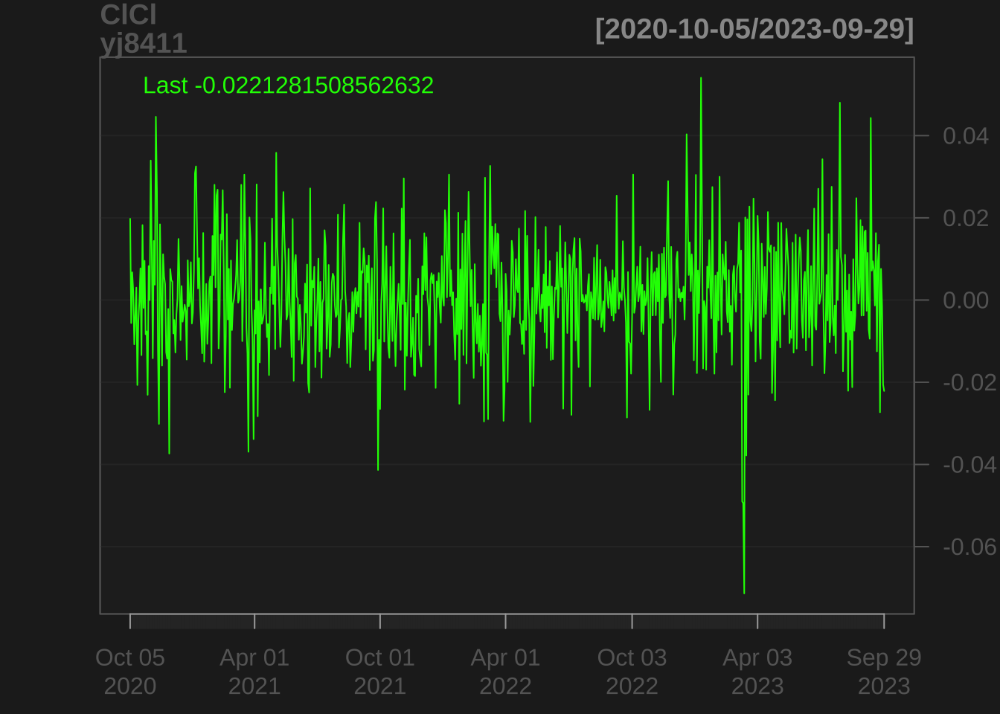

## Rにおける時系列オブジェクト・クラスおよび関数の例 


<!--
- 分かりにくい(作業中)
- Rのオブジェクト: type, mode, classの3種類の型が存在.
  - type: 基本型. ベクトル(vector), リスト(list), 関数(function), 等
  - mode: 基本型がベクトルであるオブジェクトについて, 格納されている値の種類を示す型. 整数型(integer(numeric)), 実数(double(numeric)), 複素数(complex), 文字(character), 論理(logical), 等
  - class型: そのオブジェクトがもつ属性. 行列, 配列, 因子, データフレーム, 等.
- 出所: https://stats.biopapyrus.jp/r/basic/data-type.html
- https://htsuda.net/stats/data-basics.html
- http://www.f.waseda.jp/sakas/R/Rdata.html

- Rコード出所:
  - CM, Ch.1
  - R Cookbook

-->

### 日付・時間データに対するクラス
#### Dateクラス
- 日付を表現する
- R内部的には, "Date"というclass属性を持つdouble型の値を持つ


```r
# as.Date(): 日付を表す文字列をDate型に変更する
tomorrow <- as.Date("2023-10-04")
tomorrow
## [1] "2023-10-04"
attributes(tomorrow) # 出力オブジェクトの属性(attribute)
## $class
## [1] "Date"
# typeof(tomorrow) # 出力オブジェクトの型(type)
# typeof("2023-10-23") # 入力オブジェクトの型(type)

today <- Sys.Date()
today
## [1] "2023-11-11"
```


#### POSIXctクラス
- 日時 (日-時間) を表現する
- Rの内部的には, "POSIXct"というclass属性を持つdouble型の値を持つ
- POSIX = Portable Operating System Interfaceの略
- POSIXct, POSXltの2種類: ct = calender time, lt = local time


```r
now_ct <- as.POSIXct("2023-10-05 19:00", tz = "UTC")
now_ct
## [1] "2023-10-05 19:00:00 UTC"
attributes(now_ct)
## $class
## [1] "POSIXct" "POSIXt" 
## 
## $tzone
## [1] "UTC"

tomorrow_ct <- as.POSIXct("2023-10-06 20:00", tz = "UTC")

tomorrow_ct - now_ct # 時間差(1日当たり)
## Time difference of 1.041667 days
attributes(tomorrow_ct - now_ct)
## $class
## [1] "difftime"
## 
## $units
## [1] "days"
```

#### difftimeクラス
- 時間差を表現する
- Rの内部的には, "POSIXct"というclass属性を持つdouble型の値を持つ


```r
onewk_1 <- as.difftime(1, units = "weeks")
onewk_1
## Time difference of 1 weeks
typeof(onewk_1)
## [1] "double"
attributes(onewk_1)
## $class
## [1] "difftime"
## 
## $units
## [1] "weeks"

onewk_2 <- as.difftime(7, units = "days")
onewk_2
## Time difference of 7 days
```

#### よりモダンかつ柔軟な日付や時間の操作
- lubridateパッケージ
- hmsパッケージ (日内時間の操作・蓄積に特化)


### 時系列データに対するクラス(1): tsクラス
- tsクラス: Rの時系列オブジェクトの基本クラス


```r
# AirPassengers, 
# Pan Am, # international passenger bokking (in 1000s) per month
# 1949--1960 (Brown, 1963)
data(AirPassengers)
ap <- AirPassengers
ap
##      Jan Feb Mar Apr May Jun Jul Aug Sep Oct Nov Dec
## 1949 112 118 132 129 121 135 148 148 136 119 104 118
## 1950 115 126 141 135 125 149 170 170 158 133 114 140
## 1951 145 150 178 163 172 178 199 199 184 162 146 166
## 1952 171 180 193 181 183 218 230 242 209 191 172 194
## 1953 196 196 236 235 229 243 264 272 237 211 180 201
## 1954 204 188 235 227 234 264 302 293 259 229 203 229
## 1955 242 233 267 269 270 315 364 347 312 274 237 278
## 1956 284 277 317 313 318 374 413 405 355 306 271 306
## 1957 315 301 356 348 355 422 465 467 404 347 305 336
## 1958 340 318 362 348 363 435 491 505 404 359 310 337
## 1959 360 342 406 396 420 472 548 559 463 407 362 405
## 1960 417 391 419 461 472 535 622 606 508 461 390 432
#is.ts(ap); is.vector(ap)
#attributes(ap)
class(ap)		# tsクラス
## [1] "ts"
start(ap); end(ap); frequency(ap)
## [1] 1949    1
## [1] 1960   12
## [1] 12
plot(ap, ylab = "Passengers (1000's)")
```


```r
layout(1:2)
plot(aggregate(ap))		# annual levelに累計, seasonal effectsの除去、trend
cycle(ap)					# データ内各アイテムのシーズン抽出
##      Jan Feb Mar Apr May Jun Jul Aug Sep Oct Nov Dec
## 1949   1   2   3   4   5   6   7   8   9  10  11  12
## 1950   1   2   3   4   5   6   7   8   9  10  11  12
## 1951   1   2   3   4   5   6   7   8   9  10  11  12
## 1952   1   2   3   4   5   6   7   8   9  10  11  12
## 1953   1   2   3   4   5   6   7   8   9  10  11  12
## 1954   1   2   3   4   5   6   7   8   9  10  11  12
## 1955   1   2   3   4   5   6   7   8   9  10  11  12
## 1956   1   2   3   4   5   6   7   8   9  10  11  12
## 1957   1   2   3   4   5   6   7   8   9  10  11  12
## 1958   1   2   3   4   5   6   7   8   9  10  11  12
## 1959   1   2   3   4   5   6   7   8   9  10  11  12
## 1960   1   2   3   4   5   6   7   8   9  10  11  12
boxplot(ap ~ cycle(ap))		# seasonal effects
```


### 時系列データに対するクラス(2): zooクラスとxtsクラス
- 有用な時系列オブジェクトのクラス: zoo, xts
  - zoo, xts共に, 多変量時系列を扱うことも可能
  - xtsは, zooに類似. かつ, 高速なため, 大規模DATAの処理に適している
  - zooやxtsのメリット. 有用な関数が多数用意されている:
  - differencing, merging, periodic sampling, applying rolling functions
  - xtsパッケージは, zooパッケージが出来ること全てできる

```
- zooクラス・オブジェクトの生成
  - ts <- zoo(x, dt)
  - 時間(index)は, Dateオブジェクト, POSIXctオブジェクト, 整数, 浮動小数点でも, 順序付き数値なら何でもOK
- xtsクラス・オブジェクトの生成
  - ts <- xts(x, dt)
  - 時間(index)は, Dateオブジェクト, POSIXctオブジェクト等、日付や時間のクラスのみに対応
```

```r
# R マニュアル
vignette("zoo")
vignette("xts")
```

- zooクラス
<!-- R Cookbook, pp.356--364参考 --> 

```r
library(zoo)
# 日経平均先物(ラージ), 2018年2月5日, 1日内約定データ
prices <- c(22790, 22800, 22790, 22790, 22790)
seconds <- c(32400.014, 32400.020, 32400.035, 32400.036) # タイムスタンプ (秒)
nkft_sec <- zoo(prices, seconds)
print(nkft_sec)
## 32400.014  32400.02 32400.035 32400.036 
##     22790     22800     22790     22790

# 同, 2023年9月25日〜9月29日(5営業日)
prices <- c(32480, 32080, 32150, 31850, 32020)
dates <- as.Date(c("2023-09-25", "2023-09-26", "2023-09-27", "2023-09-28", "2023-09-29")) # 日付
nkft_daily <- zoo(prices, dates)
print(nkft_daily)
## 2023-09-25 2023-09-26 2023-09-27 2023-09-28 2023-09-29 
##      32480      32080      32150      31850      32020


coredata(nkft_daily) # 株価の取り出し
## [1] 32480 32080 32150 31850 32020
index(nkft_daily) # 時間の取り出し
## [1] "2023-09-25" "2023-09-26" "2023-09-27" "2023-09-28" "2023-09-29"
coredata(nkft_sec)
## [1] 22790 22800 22790 22790
index(nkft_sec)
## [1] 32400.01 32400.02 32400.03 32400.04
```


```r
nkft_daily[2:4]
## 2023-09-26 2023-09-27 2023-09-28 
##      32080      32150      31850
nkft_daily[as.Date("2023-09-26")]
## 2023-09-26 
##      32080
nkft_daily["2023-09-26"]		# <-- NO
## 2023-09-26 
##      32080
window(nkft_daily, start = as.Date('2023-09-26'), end = as.Date('2023-09-28'))
## 2023-09-26 2023-09-27 2023-09-28 
##      32080      32150      31850

library(xts)
first(nkft_sec) # 最初のデータ
## 32400.014 
##     22790
last(nkft_sec) # 最後のデータ
## 32400.036 
##     22790
```


#### quantmodパッケージの利用による株価取得 & チャート作成


```r
library('quantmod')
yj8411 <- getSymbols('8411.T',from = '2020-10-01', to = '2023-09-29', src = "yahoo", auto.assign = FALSE)	# 注) R/RStudioや, guantmodのバージョンによっては, 動かないことがある
# 注) 画面に"Error in new.session() : Could not establish session after 5 attempts."が表示され,
# 株価を取得できない場合には, quantmodのバージョンを最新のものにすること.

chartSeries(ClCl(yj8411))
```



```r
chartSeries(yj8411)
```


```r
chartSeries(OHLC(yj8411))
```


```r

Mizuho_ret <- diff(log(Ad(yj8411)))	# Adjusted price
plot(Mizuho_ret)
```


```r
chartSeries(Mizuho_ret)
```


```r
class(Mizuho_ret)
## [1] "xts" "zoo"
```


```r
# 便利な関数の例
Mizuho_m <- apply.monthly(Mizuho_ret, mean, na.rm = T)		# xts
Mizuho_w <- apply.weekly(Mizuho_ret, mean, na.rm = T)			# xts
# zooオブジェクトの場合, 一旦xtsに変換して適用
# apply.monthly(as.xts(ts), df)

Mizuho_ma5 <- rollapply(Mizuho_ret, width = 5, mean, align = "right")	# zooパッケージ内
head(Mizuho_ma5)
##            8411.T.Adjusted
## 2020-10-02              NA
## 2020-10-05              NA
## 2020-10-06              NA
## 2020-10-07              NA
## 2020-10-08              NA
## 2020-10-09     0.002418758
#Mizuho_ma21 <- rollapply(Mizuho_ret, width = 21, mean, align = "right")	# zooパッケージ内
# timestamp is taken from the rightmost value

chartSeries(Mizuho_ma5)
```


```r
#chartSeries(Mizuho_ma21)
```

