## 時系列データの分解


```
- データセット: AirPassengers
- Pan Am, # international passenger bokking (in 1000s) per month
- 1949--1960 (Brown, 1963)
```

```r
data(AirPassengers)
ap <- AirPassengers
ap
##      Jan Feb Mar Apr May Jun Jul Aug Sep Oct Nov Dec
## 1949 112 118 132 129 121 135 148 148 136 119 104 118
## 1950 115 126 141 135 125 149 170 170 158 133 114 140
## 1951 145 150 178 163 172 178 199 199 184 162 146 166
## 1952 171 180 193 181 183 218 230 242 209 191 172 194
## 1953 196 196 236 235 229 243 264 272 237 211 180 201
## 1954 204 188 235 227 234 264 302 293 259 229 203 229
## 1955 242 233 267 269 270 315 364 347 312 274 237 278
## 1956 284 277 317 313 318 374 413 405 355 306 271 306
## 1957 315 301 356 348 355 422 465 467 404 347 305 336
## 1958 340 318 362 348 363 435 491 505 404 359 310 337
## 1959 360 342 406 396 420 472 548 559 463 407 362 405
## 1960 417 391 419 461 472 535 622 606 508 461 390 432
#is.ts(ap); is.vector(ap)
#attributes(ap)
class(ap)		# tsクラス
## [1] "ts"
start(ap); end(ap); frequency(ap)
## [1] 1949    1
## [1] 1960   12
## [1] 12
plot(ap, ylab = "Passengers (1000's)")
```


```r
layout(1:2)
plot(aggregate(ap))		# annual levelに累計, seasonal effectsの除去、trend
cycle(ap)					# データ内各アイテムのシーズン抽出
##      Jan Feb Mar Apr May Jun Jul Aug Sep Oct Nov Dec
## 1949   1   2   3   4   5   6   7   8   9  10  11  12
## 1950   1   2   3   4   5   6   7   8   9  10  11  12
## 1951   1   2   3   4   5   6   7   8   9  10  11  12
## 1952   1   2   3   4   5   6   7   8   9  10  11  12
## 1953   1   2   3   4   5   6   7   8   9  10  11  12
## 1954   1   2   3   4   5   6   7   8   9  10  11  12
## 1955   1   2   3   4   5   6   7   8   9  10  11  12
## 1956   1   2   3   4   5   6   7   8   9  10  11  12
## 1957   1   2   3   4   5   6   7   8   9  10  11  12
## 1958   1   2   3   4   5   6   7   8   9  10  11  12
## 1959   1   2   3   4   5   6   7   8   9  10  11  12
## 1960   1   2   3   4   5   6   7   8   9  10  11  12
boxplot(ap ~ cycle(ap))		# seasonal effects
```

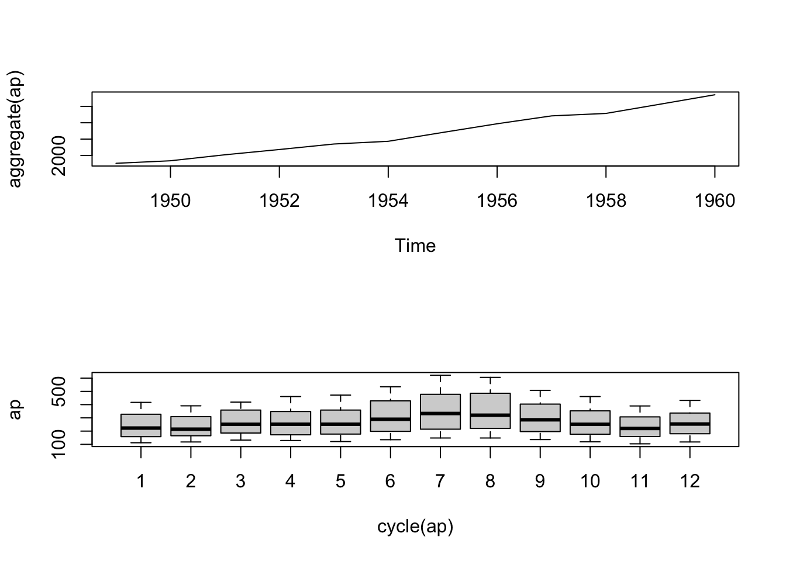

### トレンド抽出, 平滑化(smoothing)
- 対称移動平均法(centered moving average)

```r
# filter()関数の使用
f12 <- c(1/24, rep(1/12, 11), 1/24)
f12
##  [1] 0.04166667 0.08333333 0.08333333 0.08333333 0.08333333 0.08333333
##  [7] 0.08333333 0.08333333 0.08333333 0.08333333 0.08333333 0.08333333
## [13] 0.04166667

ap_m <- stats::filter(as.vector(ap), f12, sides = 2)	# vectorとして入力 --> 年情報が欠落
plot(cbind(as.vector(ap), ap_m))		# --> 年情報が欠落
```

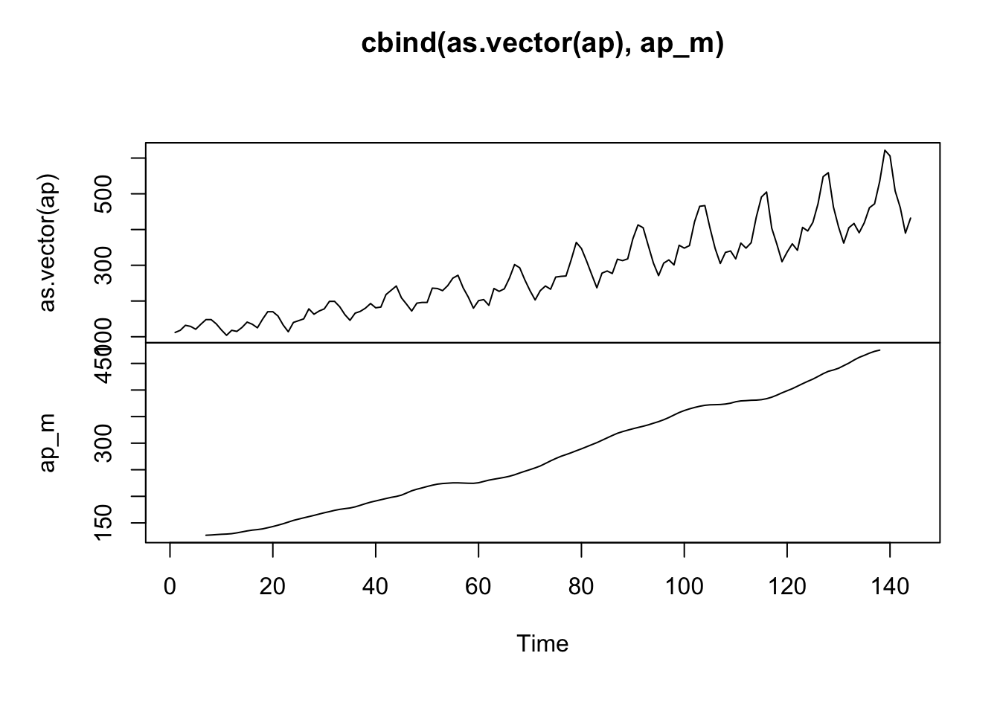

```r

#ap_m2 <- filter(ap, f12, sides = 2)	# tsとして入力
#plot(cbind(ap, ap_m2))

#または
ap_m <- ts(ap_m, start = c(1949,1), frequency = 12)		# <-- 年情報を戻す
#plot(cbind(ap, ap_m))

#grid()
#lines(1:length(ap_m), ap_m, col="blue")

# トレンド除去済データ
ap_s <- ap - ap_m		# 上のts()を使った式によるap_mの生成が必要
plot(ap_s)
```


### 時系列の分解
#### "古典的"方法
```
- decompose, "古典的"分解モデル (Rのデフォルト)
- The function first determines the trend component using a moving average 
(if filter is NULL, a symmetric window with equal weights is used), and 
removes it from the time series. Then, the seasonal figure is computed by averaging, 
for each time unit, over all periods. The seasonal figure is then centered. 
Finally, the error component is determined by removing trend and seasonal figure 
(recycled as needed) from the original time series.
```


```r
decompose(ap)
## $x
##      Jan Feb Mar Apr May Jun Jul Aug Sep Oct Nov Dec
## 1949 112 118 132 129 121 135 148 148 136 119 104 118
## 1950 115 126 141 135 125 149 170 170 158 133 114 140
## 1951 145 150 178 163 172 178 199 199 184 162 146 166
## 1952 171 180 193 181 183 218 230 242 209 191 172 194
## 1953 196 196 236 235 229 243 264 272 237 211 180 201
## 1954 204 188 235 227 234 264 302 293 259 229 203 229
## 1955 242 233 267 269 270 315 364 347 312 274 237 278
## 1956 284 277 317 313 318 374 413 405 355 306 271 306
## 1957 315 301 356 348 355 422 465 467 404 347 305 336
## 1958 340 318 362 348 363 435 491 505 404 359 310 337
## 1959 360 342 406 396 420 472 548 559 463 407 362 405
## 1960 417 391 419 461 472 535 622 606 508 461 390 432
## 
## $seasonal
##             Jan        Feb        Mar        Apr        May        Jun
## 1949 -24.748737 -36.188131  -2.241162  -8.036616  -4.506313  35.402778
## 1950 -24.748737 -36.188131  -2.241162  -8.036616  -4.506313  35.402778
## 1951 -24.748737 -36.188131  -2.241162  -8.036616  -4.506313  35.402778
## 1952 -24.748737 -36.188131  -2.241162  -8.036616  -4.506313  35.402778
## 1953 -24.748737 -36.188131  -2.241162  -8.036616  -4.506313  35.402778
## 1954 -24.748737 -36.188131  -2.241162  -8.036616  -4.506313  35.402778
## 1955 -24.748737 -36.188131  -2.241162  -8.036616  -4.506313  35.402778
## 1956 -24.748737 -36.188131  -2.241162  -8.036616  -4.506313  35.402778
## 1957 -24.748737 -36.188131  -2.241162  -8.036616  -4.506313  35.402778
## 1958 -24.748737 -36.188131  -2.241162  -8.036616  -4.506313  35.402778
## 1959 -24.748737 -36.188131  -2.241162  -8.036616  -4.506313  35.402778
## 1960 -24.748737 -36.188131  -2.241162  -8.036616  -4.506313  35.402778
##             Jul        Aug        Sep        Oct        Nov        Dec
## 1949  63.830808  62.823232  16.520202 -20.642677 -53.593434 -28.619949
## 1950  63.830808  62.823232  16.520202 -20.642677 -53.593434 -28.619949
## 1951  63.830808  62.823232  16.520202 -20.642677 -53.593434 -28.619949
## 1952  63.830808  62.823232  16.520202 -20.642677 -53.593434 -28.619949
## 1953  63.830808  62.823232  16.520202 -20.642677 -53.593434 -28.619949
## 1954  63.830808  62.823232  16.520202 -20.642677 -53.593434 -28.619949
## 1955  63.830808  62.823232  16.520202 -20.642677 -53.593434 -28.619949
## 1956  63.830808  62.823232  16.520202 -20.642677 -53.593434 -28.619949
## 1957  63.830808  62.823232  16.520202 -20.642677 -53.593434 -28.619949
## 1958  63.830808  62.823232  16.520202 -20.642677 -53.593434 -28.619949
## 1959  63.830808  62.823232  16.520202 -20.642677 -53.593434 -28.619949
## 1960  63.830808  62.823232  16.520202 -20.642677 -53.593434 -28.619949
## 
## $trend
##           Jan      Feb      Mar      Apr      May      Jun      Jul      Aug
## 1949       NA       NA       NA       NA       NA       NA 126.7917 127.2500
## 1950 131.2500 133.0833 134.9167 136.4167 137.4167 138.7500 140.9167 143.1667
## 1951 157.1250 159.5417 161.8333 164.1250 166.6667 169.0833 171.2500 173.5833
## 1952 183.1250 186.2083 189.0417 191.2917 193.5833 195.8333 198.0417 199.7500
## 1953 215.8333 218.5000 220.9167 222.9167 224.0833 224.7083 225.3333 225.3333
## 1954 228.0000 230.4583 232.2500 233.9167 235.6250 237.7500 240.5000 243.9583
## 1955 261.8333 266.6667 271.1250 275.2083 278.5000 281.9583 285.7500 289.3333
## 1956 309.9583 314.4167 318.6250 321.7500 324.5000 327.0833 329.5417 331.8333
## 1957 348.2500 353.0000 357.6250 361.3750 364.5000 367.1667 369.4583 371.2083
## 1958 375.2500 377.9167 379.5000 380.0000 380.7083 380.9583 381.8333 383.6667
## 1959 402.5417 407.1667 411.8750 416.3333 420.5000 425.5000 430.7083 435.1250
## 1960 456.3333 461.3750 465.2083 469.3333 472.7500 475.0417       NA       NA
##           Sep      Oct      Nov      Dec
## 1949 127.9583 128.5833 129.0000 129.7500
## 1950 145.7083 148.4167 151.5417 154.7083
## 1951 175.4583 176.8333 178.0417 180.1667
## 1952 202.2083 206.2500 210.4167 213.3750
## 1953 224.9583 224.5833 224.4583 225.5417
## 1954 247.1667 250.2500 253.5000 257.1250
## 1955 293.2500 297.1667 301.0000 305.4583
## 1956 334.4583 337.5417 340.5417 344.0833
## 1957 372.1667 372.4167 372.7500 373.6250
## 1958 386.5000 390.3333 394.7083 398.6250
## 1959 437.7083 440.9583 445.8333 450.6250
## 1960       NA       NA       NA       NA
## 
## $random
##              Jan         Feb         Mar         Apr         May         Jun
## 1949          NA          NA          NA          NA          NA          NA
## 1950   8.4987374  29.1047980   8.3244949   6.6199495  -7.9103535 -25.1527778
## 1951  12.6237374  26.6464646  18.4078283   6.9116162   9.8396465 -26.4861111
## 1952  12.6237374  29.9797980   6.1994949  -2.2550505  -6.0770202 -13.2361111
## 1953   4.9154040  13.6881313  17.3244949  20.1199495   9.4229798 -17.1111111
## 1954   0.7487374  -6.2702020   4.9911616   1.1199495   2.8813131  -9.1527778
## 1955   4.9154040   2.5214646  -1.8838384   1.8282828  -3.9936869  -2.3611111
## 1956  -1.2095960  -1.2285354   0.6161616  -0.7133838  -1.9936869  11.5138889
## 1957  -8.5012626 -15.8118687   0.6161616  -5.3383838  -4.9936869  19.4305556
## 1958 -10.5012626 -23.7285354 -15.2588384 -23.9633838 -13.2020202  18.6388889
## 1959 -17.7929293 -28.9785354  -3.6338384 -12.2967172   4.0063131  11.0972222
## 1960 -14.5845960 -34.1868687 -43.9671717  -0.2967172   3.7563131  24.5555556
##              Jul         Aug         Sep         Oct         Nov         Dec
## 1949 -42.6224747 -42.0732323  -8.4785354  11.0593434  28.5934343  16.8699495
## 1950 -34.7474747 -35.9898990  -4.2285354   5.2260101  16.0517677  13.9116162
## 1951 -36.0808081 -37.4065657  -7.9785354   5.8093434  21.5517677  14.4532828
## 1952 -31.8724747 -20.5732323  -9.7285354   5.3926768  15.1767677   9.2449495
## 1953 -25.1641414 -16.1565657  -4.4785354   7.0593434   9.1351010   4.0782828
## 1954  -2.3308081 -13.7815657  -4.6868687  -0.6073232   3.0934343   0.4949495
## 1955  14.4191919  -5.1565657   2.2297980  -2.5239899 -10.4065657   1.1616162
## 1956  19.6275253  10.3434343   4.0214646 -10.8989899 -15.9482323  -9.4633838
## 1957  31.7108586  32.9684343  15.3131313  -4.7739899 -14.1565657  -9.0050505
## 1958  45.3358586  58.5101010   0.9797980 -10.6906566 -31.1148990 -33.0050505
## 1959  53.4608586  61.0517677   8.7714646 -13.3156566 -30.2398990 -17.0050505
## 1960          NA          NA          NA          NA          NA          NA
## 
## $figure
##  [1] -24.748737 -36.188131  -2.241162  -8.036616  -4.506313  35.402778
##  [7]  63.830808  62.823232  16.520202 -20.642677 -53.593434 -28.619949
## 
## $type
## [1] "additive"
## 
## attr(,"class")
## [1] "decomposed.ts"
plot(decompose(ap))

ap_decom <- decompose(ap)		# additive
#ap_decom <- decompose(ap, type = "mult")	# multiplicative
plot(ap_decom)
```


```r
Trend <- ap_decom$trend
Seasonal <- ap_decom$seasonal
ts.plot(cbind(Trend, Trend * Seasonal), lty = 1:2) # トレンド成分 vs トレンド×季節性成分
```


→ トレンド×季節性成分が圧倒 → 季節性成分にトレンド成分混入!?

- 時系列を対数変換

```r
lnap <- log(ap)
lnap_decom <- decompose(lnap)
plot(lnap_decom)
```


```r
Trend <- lnap_decom$trend
Seasonal <- lnap_decom$seasonal
ts.plot(cbind(Trend, Trend * Seasonal), lty = 1:2)
```


または, オプション type="multiplicative"を指定

```r
ap_decom_m <- decompose(ap, type = "multiplicative")
plot(ap_decom_m)
```


- 参考文献: CM (2009), Ch.1

- (自主課題) decomposeと同じように3成分に分解する自作関数を作成せよ


#### 代替的方法
```
- stl(), Seasonal Decomposition of Time Series by Loess
- loess(locally weighted regression)によるsmoothingを行い, 3成分に分解
```

```r
#plot(stl(ap, s.window = 13))
#plot(stl(ap, s.window = 5))
plot(stl(ap, s.window = "per"))
```

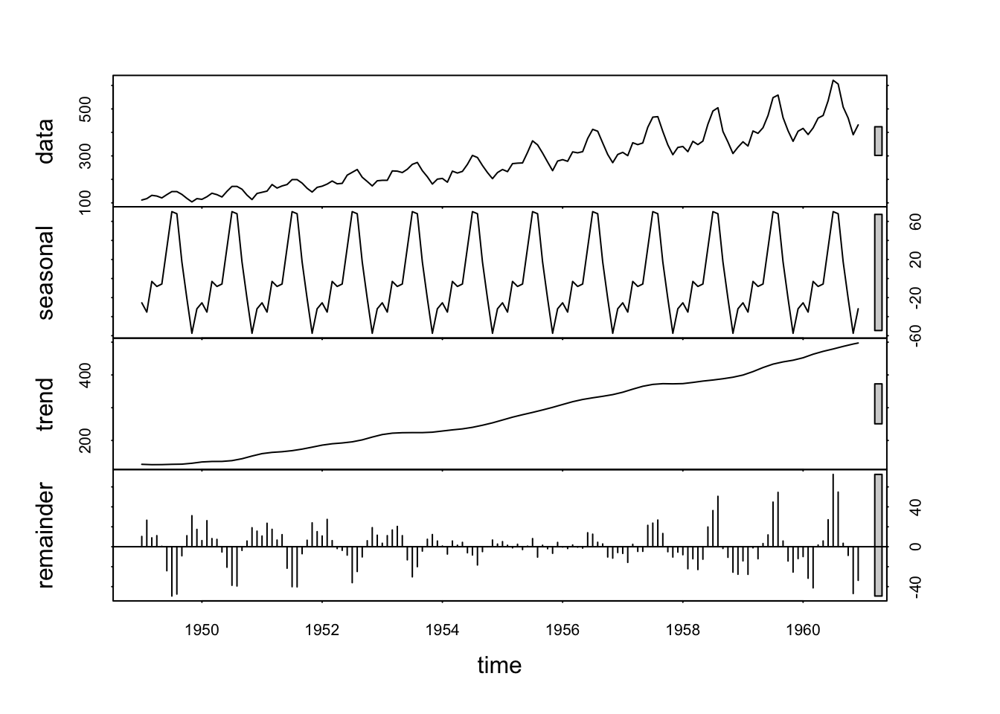

```
- "timsac": 統数研開発パッケージ
- H.Akaike, T.Ozaki, M.Ishiguro, Y.Ogata, G.Kitagawa, Y-H.Tamura, E.Arahata, K.Katsura and Y.Tamura (1984) Computer Science Monographs, Timsac-84 Part 1. The Institute of Statistical Mathematics.
```


```r
library(timsac)
# decomp()
# Decompose a nonstationary time series into several possible components by square-root filter.
# トレンド成分、AR成分、季節変動成分、曜日効果、白色雑音

# データセット: Blsallfood
data(Blsallfood)
# アメリカの食品産業に従事する労働者の人数を毎月調べた時系列 (合衆国 Bureau of Labor Statistics (BLS) 公表)
#z <- decomp(Blsallfood, trade = TRUE, year = 1973)	# year: the first year of the data
z <- decomp(Blsallfood, year = 1973)
```


```r
z$aic; z$lkhd
## [1] 1204.446
## [1] -581.2231
z$sigma2; z$tau1; z$tau2; z$tau3
## [1] 27.75967
## [1] 0.00516679
## [1] 0.9953483
## [1] 0.0001000029

z <- decomp(Blsallfood, trade = TRUE, year = 1973)
```

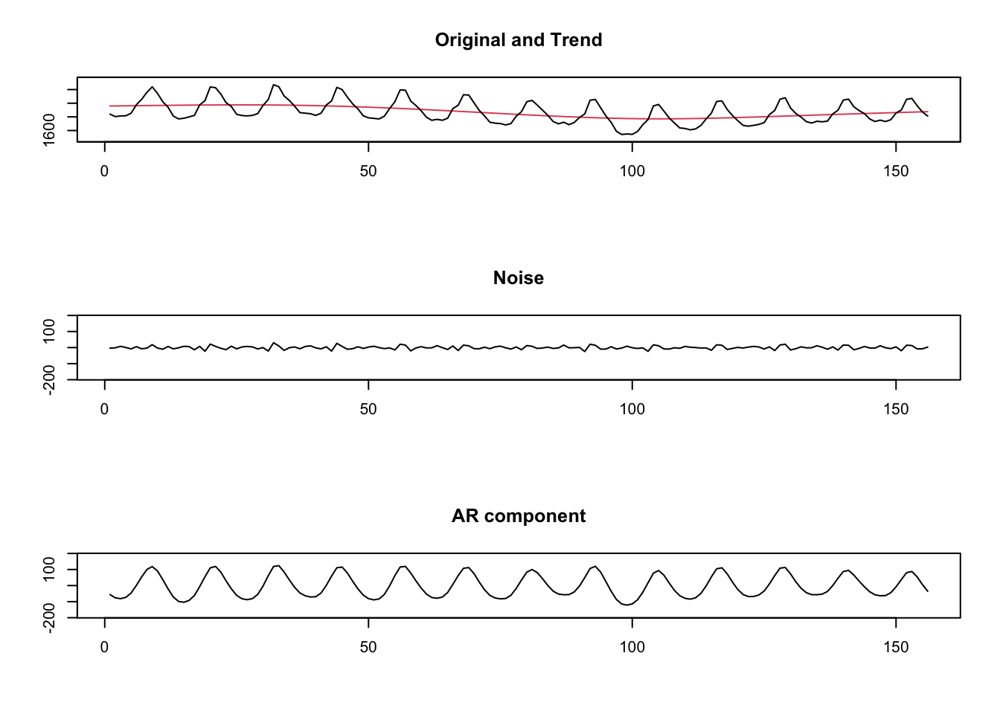

```r

#decomp(as.vector(ap), year = 1949)	# OK?
z <- decomp(ap, year = 1949)
```


```
- baysea()
- Decompose a nonstationary time series into several possible components
```

```r
# データセット: LaborData
data(LaborData)
# Labor force U.S. unemployed 16 years or over (1972-1978) data
head(LaborData)
## [1] 5447 5412 5215 4697 4344 5426
z <- baysea(LaborData, forecast = 12)
```

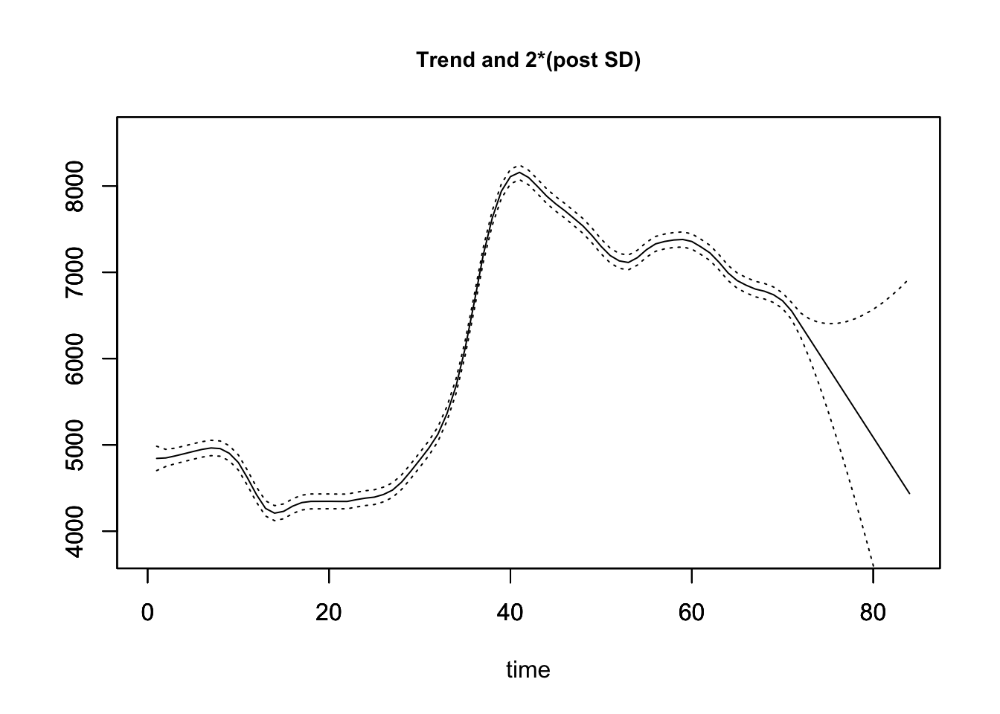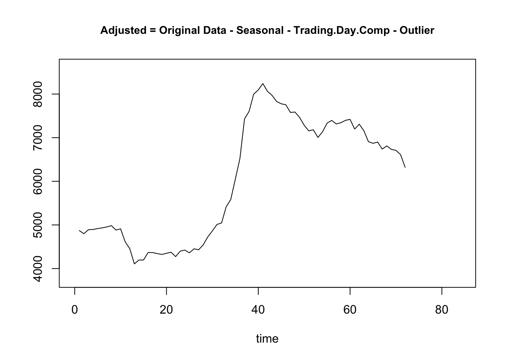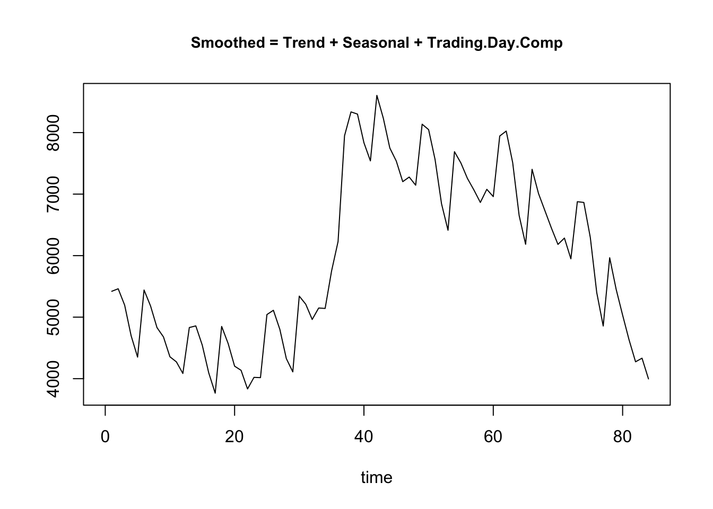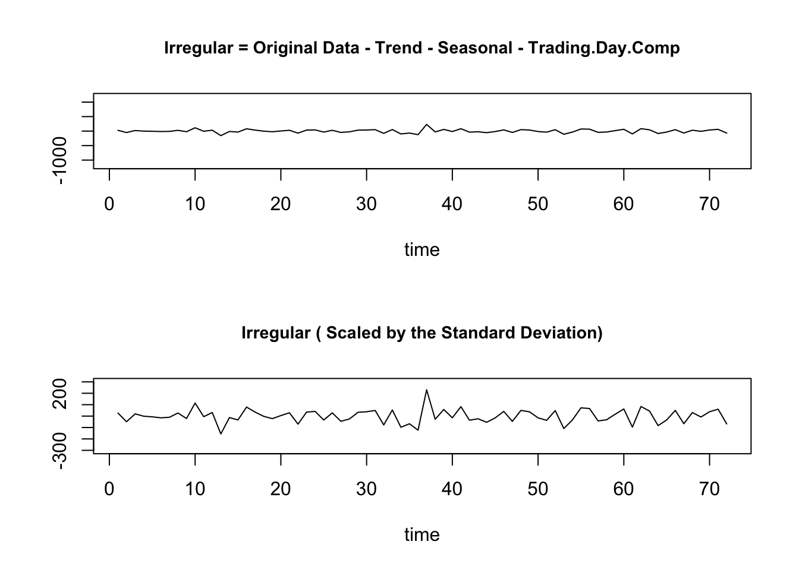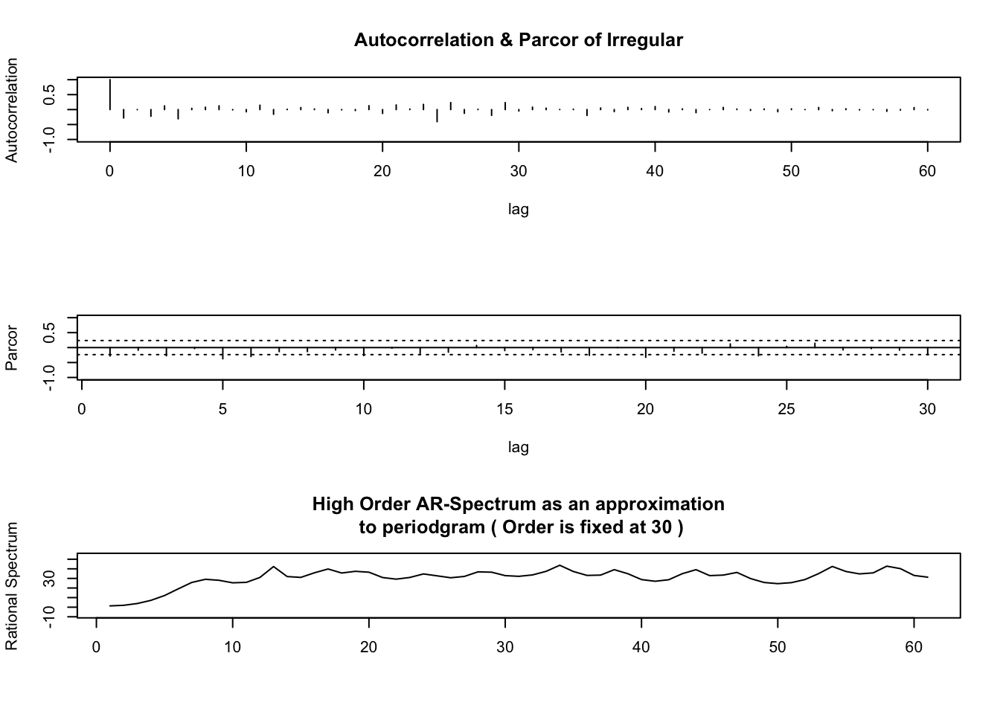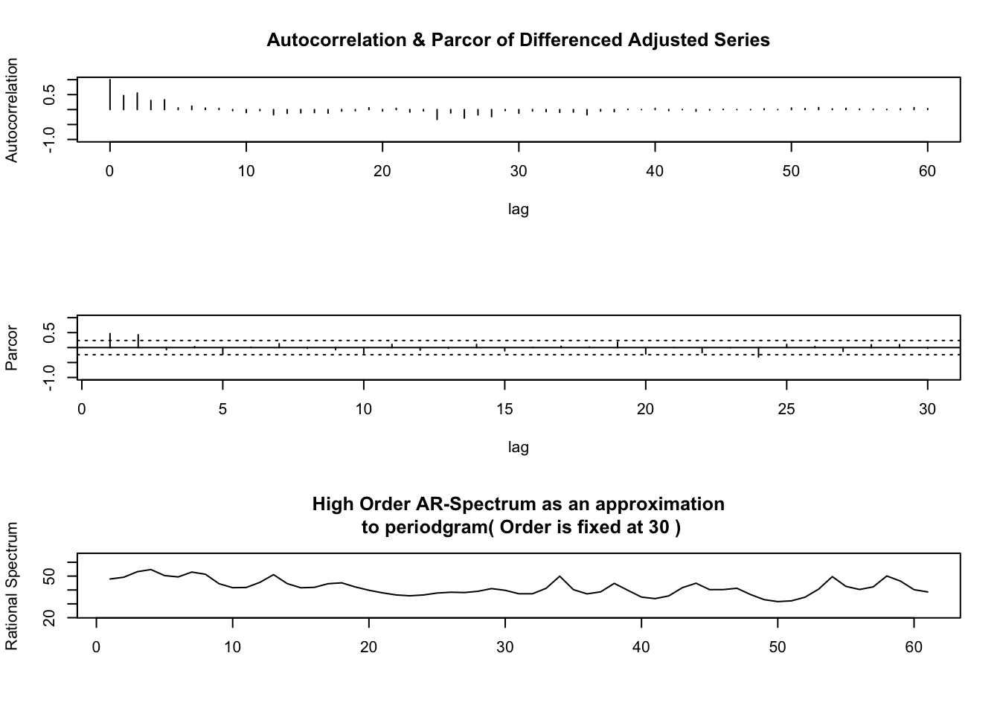

```r

#baysea(as.vector(ap), forecast = 12)	# OK?
z <- baysea(ap, forecast = 12)
```

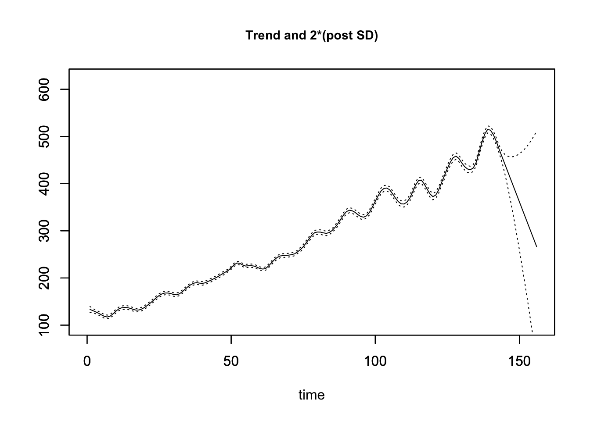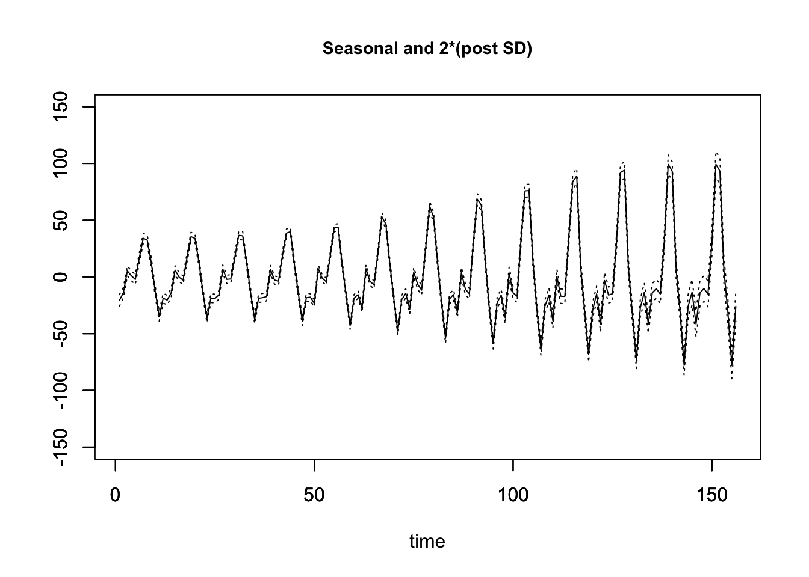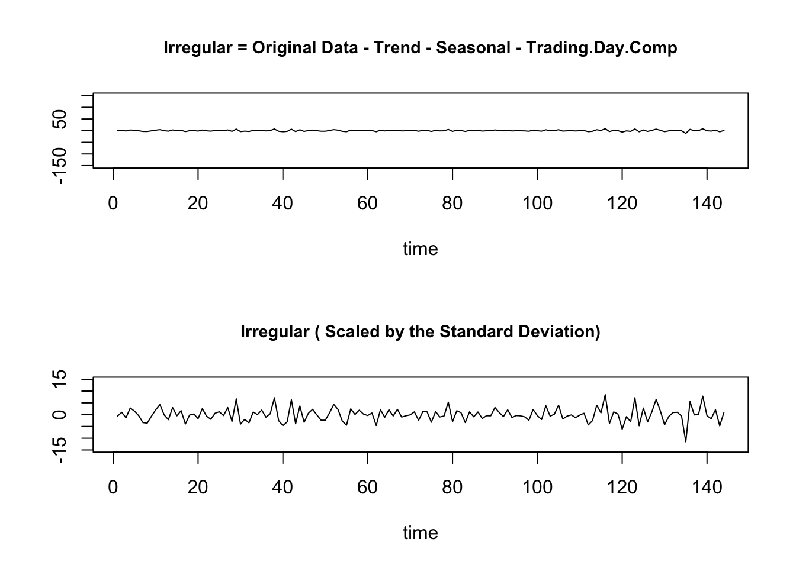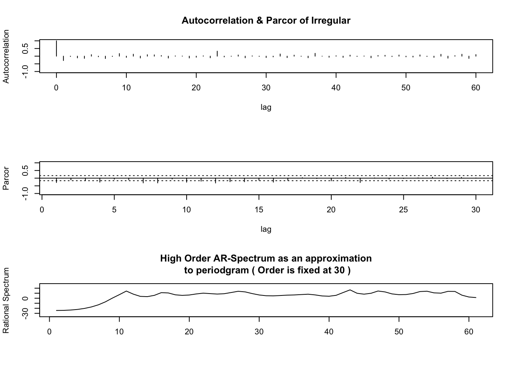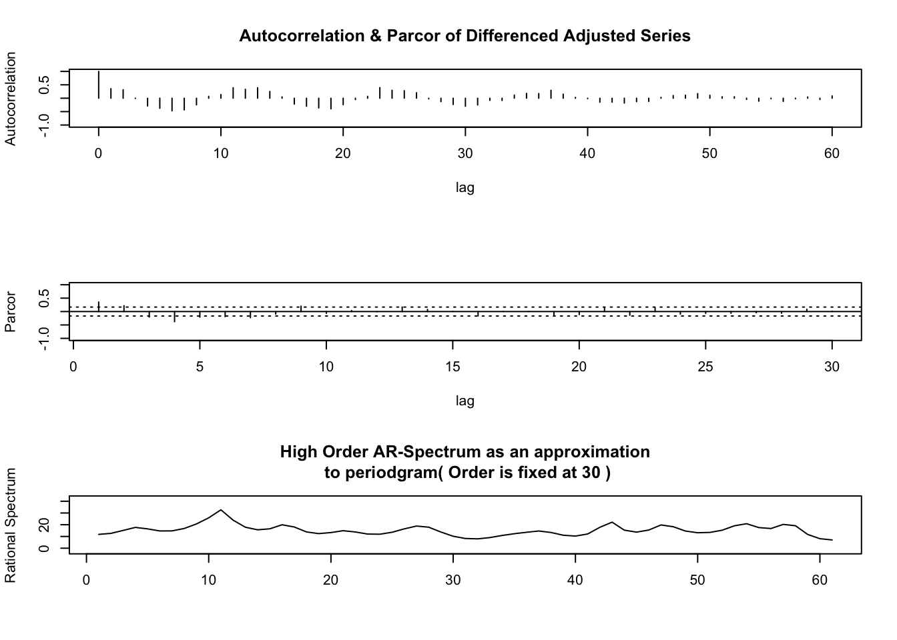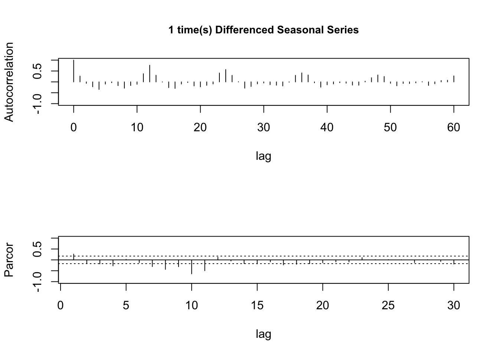


#### 代替的方法 (続き)
- prophet()
 - https://facebook.github.io/prophet/docs/quick_start.html#r-api
 - https://cran.r-project.org/web/packages/prophet/prophet.pdf
 - "非線形のトレンドに年次・週次・日次の季節性, さらに       休日効果を加えた加法モデルに基づいて時系列データを予測する手続を実装.
 強い季節性があり, 数シーズンの過去データを持つ時系列データに対して良く機能.
 欠損値やトレンドのシフトに対して頑強. 通常, 外れ値をうまく処理."

```
prophet()の主な引数
- growth: "linear"(デフォルト), "logisitc", "flat"
- changepoints (変化点): 日付ベクトルをユーザー指定 or 潜在的な変化点の自動選択(デフォルト)
- n.changepoints (変化点の数): 25 (デフォルト)
- yearly.seasonality (年次季節性への適合): "auto"(デフォルト), T, F, 生成するFourier項の数
- weekly.seasonality (週次季節性への適合): 同上
- daily.seasonality (週次季節性への適合): 同上
- holidays (休日の指定): なし(デフォルト
- seasonality.mode (季節性の入り方): "additive"(加法的)(デフォルト), "multiplictive"(乗法的)
```


```r
#install.packages("prophet")
library(prophet)
library(zoo) # index, yearmon

# 以下, 生データのまま使用 (対数変換せず)
# 年月の取り出し
tt <- as.Date(yearmon(index(ap)))
```


```r
# prophetモデルの生成
ap_df <- data.frame(ds = tt, y = ap)
ap_ppht <- prophet(ap_df)
```


```r
# 予測年月の生成
dates_ft <- make_future_dataframe(ap_ppht, periods = 12, freq = "month")
tail(dates_ft)
##             ds
## 151 1961-07-01
## 152 1961-08-01
## 153 1961-09-01
## 154 1961-10-01
## 155 1961-11-01
## 156 1961-12-01
```


```r
# 予測値の生成
ap_forecast <- predict(ap_ppht, dates_ft)
tail(ap_forecast[c('ds', 'yhat', 'yhat_lower', 'yhat_upper')])
##             ds     yhat yhat_lower yhat_upper
## 151 1961-07-01 576.8046   549.3932   605.1768
## 152 1961-08-01 577.2261   548.1432   606.1719
## 153 1961-09-01 528.6678   499.1612   556.8158
## 154 1961-10-01 493.5023   464.3281   522.4365
## 155 1961-11-01 459.6479   431.2205   489.0928
## 156 1961-12-01 489.0093   463.2631   518.0519
str(ap_forecast)
## 'data.frame':	156 obs. of  16 variables:
##  $ ds                        : POSIXct, format: "1949-01-01" "1949-02-01" ...
##  $ trend                     : num  107 109 111 114 116 ...
##  $ additive_terms            : num  -21.433 -30.103 -0.467 -4.937 -3.629 ...
##  $ additive_terms_lower      : num  -21.433 -30.103 -0.467 -4.937 -3.629 ...
##  $ additive_terms_upper      : num  -21.433 -30.103 -0.467 -4.937 -3.629 ...
##  $ yearly                    : num  -21.433 -30.103 -0.467 -4.937 -3.629 ...
##  $ yearly_lower              : num  -21.433 -30.103 -0.467 -4.937 -3.629 ...
##  $ yearly_upper              : num  -21.433 -30.103 -0.467 -4.937 -3.629 ...
##  $ multiplicative_terms      : num  0 0 0 0 0 0 0 0 0 0 ...
##  $ multiplicative_terms_lower: num  0 0 0 0 0 0 0 0 0 0 ...
##  $ multiplicative_terms_upper: num  0 0 0 0 0 0 0 0 0 0 ...
##  $ yhat_lower                : num  55.6 50.7 82.6 79.4 82.4 ...
##  $ yhat_upper                : num  115 107 139 138 142 ...
##  $ trend_lower               : num  107 109 111 114 116 ...
##  $ trend_upper               : num  107 109 111 114 116 ...
##  $ yhat                      : num  85.9 79.4 110.9 108.6 112 ...

plot(ap_ppht, ap_forecast)
```


```r
# prophetによる予測の各成分のプロット
prophet_plot_components(ap_ppht, ap_forecast)
```

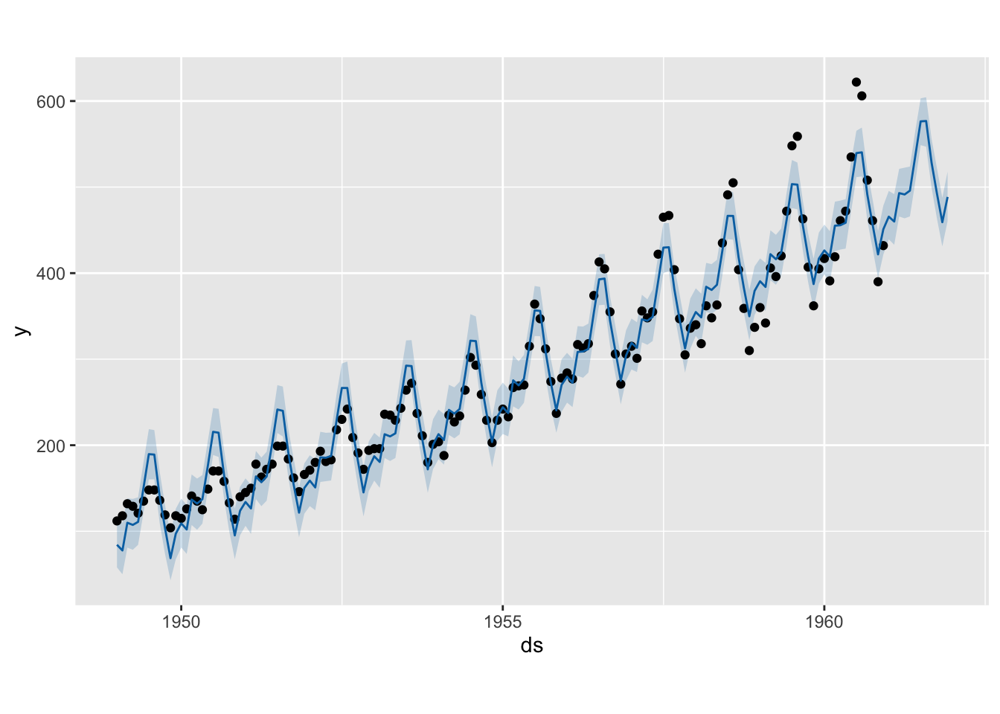
