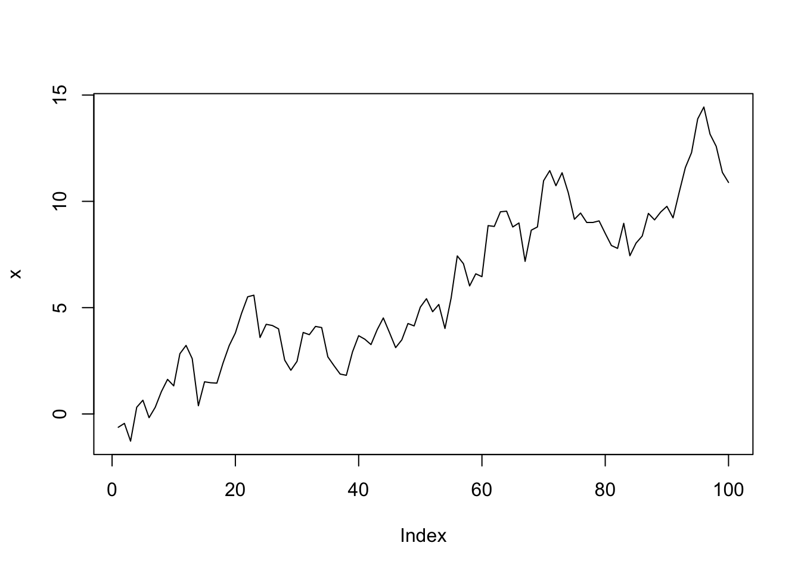
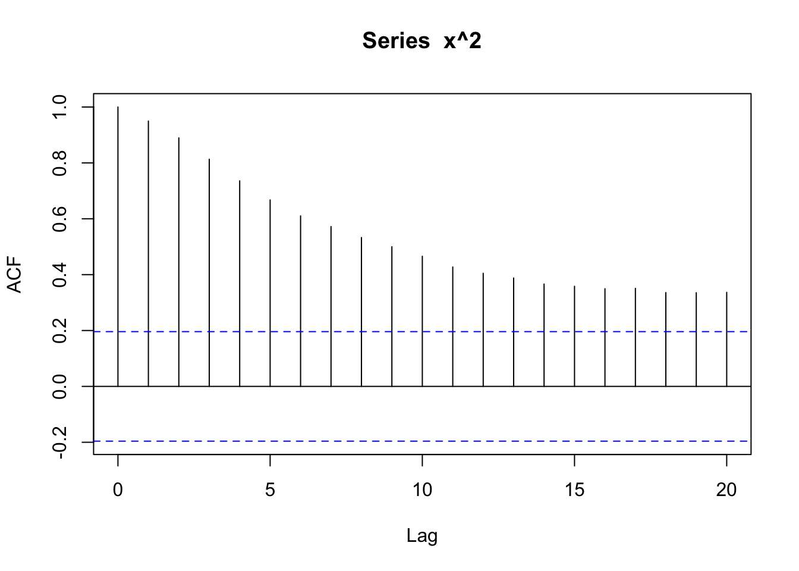
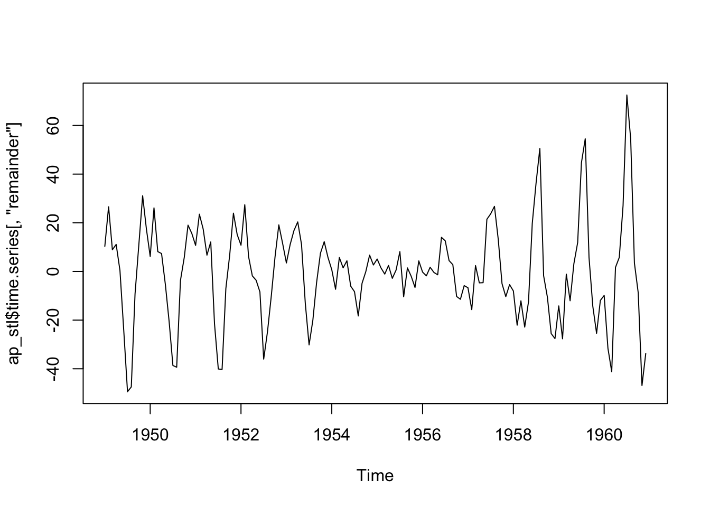
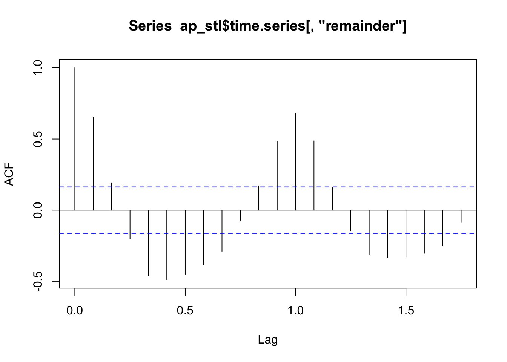
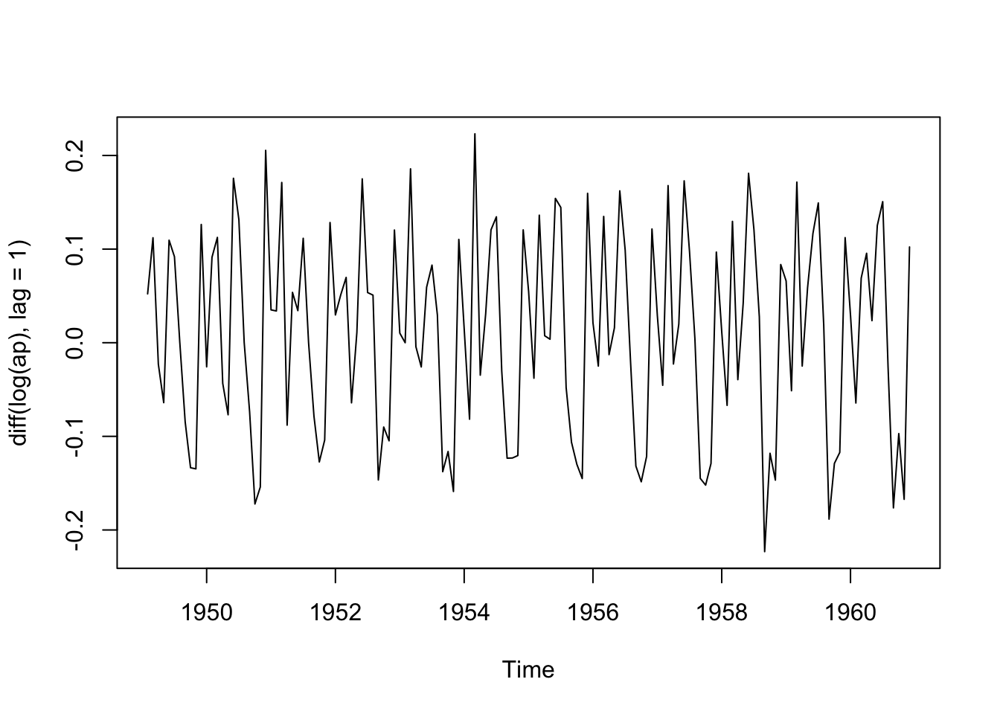
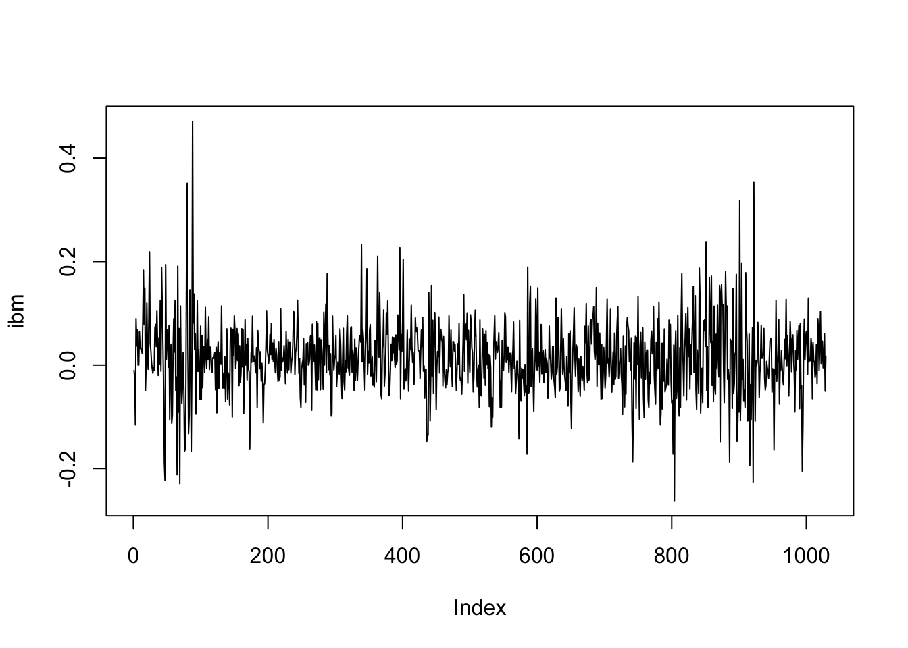
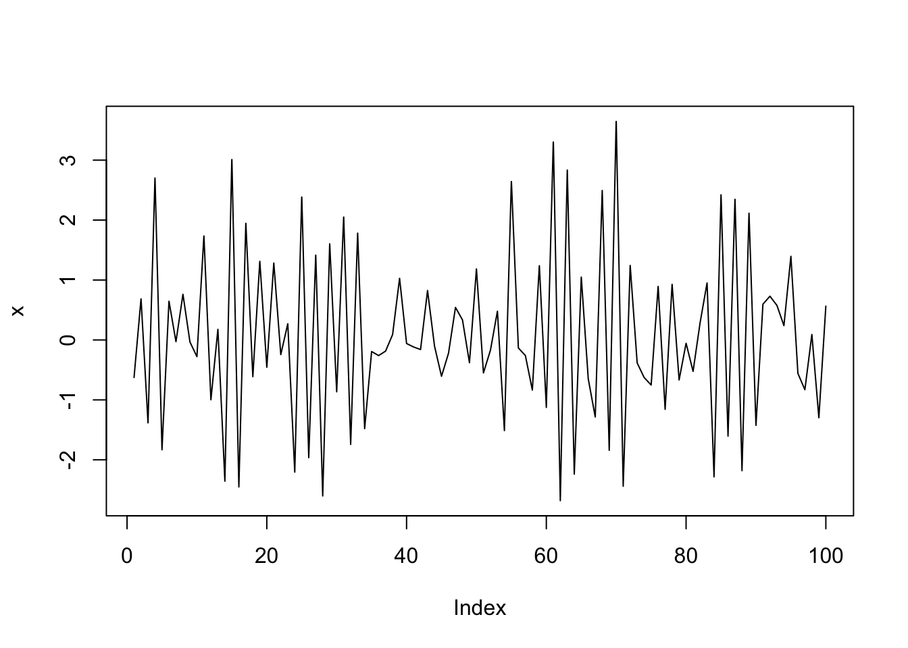
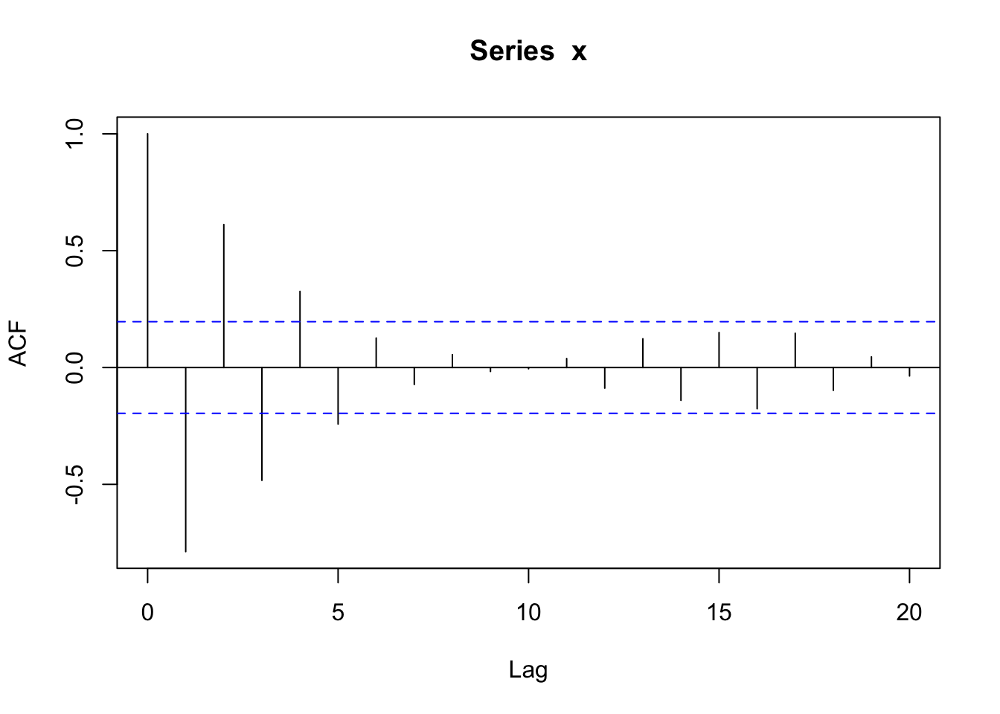
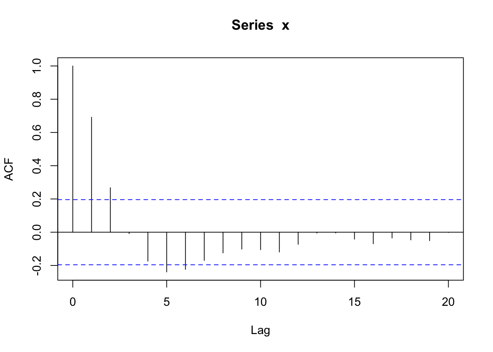
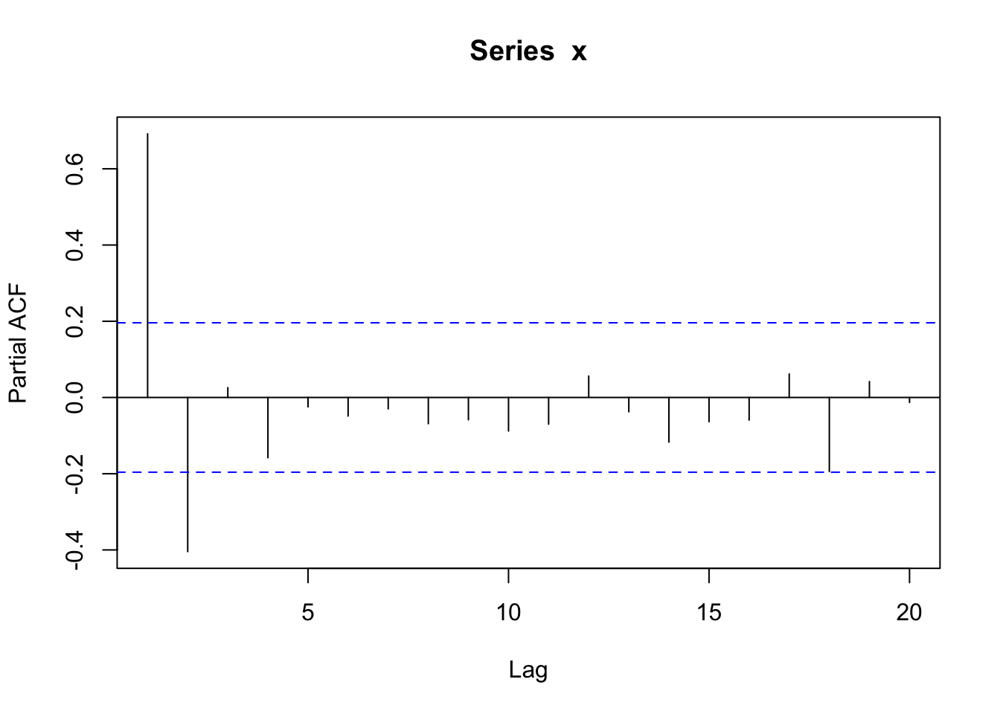

## 標本自己相関関数


- 参考文献: CM, Ch.2 & 4, Tsay, Ch.2

### 白色ノイズ
- (正規) 白色ノイズ ((Gaussian) white noise)
<!--- - CM, pp.68-- -->

```r
# 乱数のシード設定
set.seed(1)
w <- rnorm(100)
# 時系列プロット
plot(w, type = "l")
```


```r
# ヒストグラム
z <- seq(-3, 3, length = 1000)
hist(rnorm(100), prob = T, xlim = c(-3, 3)); points(z, dnorm(z), type = "l")
```


```r
# 自己相関関数(ACF)
acf(w)
```


```r
# 2乗系列のACF
acf(w^2)
```


```r
# 絶対値系列のACF
acf(abs(w))
```


### ランダムウォーク
- (正規) ランダムウォーク ((Gaussian) random walk)

```r
x <- cumsum(w)
# 時系列プロット
plot(x, type = "l")
```



```r
# ACF
acf(x)
```


```r
# 2乗系列のACF
acf(x ^ 2)
```



```r
# 絶対値系列のACF
acf(abs(x))
```


### 非定常成分を含む時系列
#### AirPassengersデータ (出所: CM, Ch.2)

```r
data(AirPassengers)
ap <- AirPassengers
acf(ap) 
```


#### 時系列の分解
- decompose関数の利用

```r
# 乗法モデルを仮定
ap_decom <- decompose(ap, "multiplicative")
# トレンド成分
plot(ts(ap_decom$trend[7:138]))
```


```r
acf(ts(ap_decom$trend[7:138]))
```


```r
# 季節性成分
plot(ts(ap_decom$seasonal[7:138]))
```


```r
acf(ts(ap_decom$seasonal[7:138]))
```


```r
# ランダムノイズ成分
plot(ts(ap_decom$random[7:138]))
```


```r
acf(ts(ap_decom$random[7:138]))
```


```r
#library(zoo)		# na.trim()使用
#acf(ap_decom$random, na.action = na.trim)		# ← NA除去
# 標準偏差
sd(ap[7:138])		# sd of the original series
#> [1] 109.4187
sd(ap[7:138] - ap_decom$trend[7:138])	# after substracting the trend estimate
#> [1] 41.11491
sd(ap_decom$random[7:138])	# the error component
#> [1] 0.0333884
# → std dev gets smaller

#または
#library(zoo)
#ap_d_zoo = zoo(ap_decom$random)
```

- stl関数の利用

```r
# stl(): Seasonal Decomposition of Time Series by Loess
ap_stl<- stl(ap, "period")
# トレンド成分
plot(ap_stl$time.series[, "trend"])
```


```r
# 季節性成分
plot(ap_stl$time.series[, "seasonal"])
```


```r
# ランダムノイズ成分
plot(ap_stl$time.series[, "remainder"])
```



```r
acf(ap_stl$time.series[, "remainder"])
```



#### 階差 (differencing)

```r
ap <- AirPassengers
is.ts(ap); is.vector(ts)
#> [1] TRUE
#> [1] FALSE
# ACF
acf(ap)
```



```r
# 対数値の階差系列のACF
acf(diff(log(ap), lag = 1)) # 前月との階差
```


```r
acf(diff(log(ap), lag = 12))# 1年前との階差
```


- かばん検定

```r
# かばん検定 (portmanteau test)
Box.test(diff(log(ap), lag = 12)) # Box-Pierce検定 (デフォルト)
#> 
#> 	Box-Pierce test
#> 
#> data:  diff(log(ap), lag = 12)
#> X-squared = 67.234, df = 1, p-value = 2.22e-16
Box.test(diff(log(ap), lag = 12), type = "Ljung")# Ljung-Box検定
#> 
#> 	Box-Ljung test
#> 
#> data:  diff(log(ap), lag = 12)
#> X-squared = 68.774, df = 1, p-value < 2.2e-16
```

#### 株価データの例 (出所: Tsay, Ch.2)


```r
ifl <- file.path(idir, "m-ibmsp-2611.txt")
da <- read.table("m-ibmsp-2611.txt", header = T)
#da <- read.table("m-ibmsp6709.txt", header = T)
head(da)
#>       data       ibm        sp
#> 1 19260130 -0.010381  0.022472
#> 2 19260227 -0.024476 -0.043956
#> 3 19260331 -0.115591 -0.059113
#> 4 19260430  0.089783  0.022688
#> 5 19260528  0.036932  0.007679
#> 6 19260630  0.068493  0.043184
ibm <- da$ibm
sp5 <- da$sp
plot(sp5, ibm)
```


```r
plot(ibm, type = "l")
```



```r
plot(cumsum(log(ibm + 1)), type = "l")
```


```r

# 原系列に対する自己相関性の検証
acf(ibm)
acf(ibm)$acf
```


```
#> , , 1
#> 
#>               [,1]
#>  [1,]  1.000000000
#>  [2,]  0.037561974
#>  [3,] -0.008664145
#>  [4,] -0.016156989
#>  [5,] -0.030554233
#>  [6,]  0.015370816
#>  [7,] -0.041809301
#>  [8,]  0.003236462
#>  [9,]  0.063082544
#> [10,]  0.048232274
#> [11,]  0.037150816
#> [12,]  0.011816712
#> [13,]  0.010848647
#> [14,] -0.067274698
#> [15,] -0.011545286
#> [16,] -0.038790792
#> [17,]  0.031043139
#> [18,]  0.029670820
#> [19,]  0.065795548
#> [20,]  0.019771486
#> [21,] -0.013009184
#> [22,] -0.012984508
#> [23,]  0.002353094
#> [24,] -0.072724702
#> [25,]  0.053508492
#> [26,] -0.010189813
#> [27,]  0.036015597
#> [28,]  0.019976030
#> [29,]  0.032989584
#> [30,]  0.004650878
#> [31,] -0.016390330
Box.test(ibm, lag = 30)		# Box-Pierce (デフォルト)
#> 
#> 	Box-Pierce test
#> 
#> data:  ibm
#> X-squared = 38.094, df = 30, p-value = 0.1473
Box.test(ibm, lag = 30, type = 'Ljung')	# Ljung-Box
#> 
#> 	Box-Ljung test
#> 
#> data:  ibm
#> X-squared = 38.75, df = 30, p-value = 0.1314
#lnibm <- log(ibm + 1) # Transfer to log returns
#Box.test(lnibm, lag = 30, type = 'Ljung')

# 絶対値系列, 2乗系列に対する自己相関性の検証
acf(abs(ibm))
```


```r
acf(ibm ^ 2)
```


```r
Box.test(abs(ibm), lag = 30, type = 'Ljung')		# Ljung-Box
#> 
#> 	Box-Ljung test
#> 
#> data:  abs(ibm)
#> X-squared = 256.75, df = 30, p-value < 2.2e-16
Box.test(ibm^2, lag = 30, type = 'Ljung')		# Ljung-Box
#> 
#> 	Box-Ljung test
#> 
#> data:  ibm^2
#> X-squared = 189.3, df = 30, p-value < 2.2e-16
```


### 線形時系列モデル
#### MA(1)・AR(1)モデル
##### シミュレーションによるパス生成
- AR(1)モデル

```r
#par(mfrow = c(3,1))
Tlen = 100
set.seed(1)
phi <- - 0.8
x <- w <- rnorm(100)
for (t in 2:100) x[t] = phi * x[t-1] + w[t]
plot(x, type = "l") # 時系列プロット
```



```r
acf(x) # 自己相関(ACF)
```



```r
pacf(x)	# 偏自己相関(PACF)
```


- MA(1)モデル

```r
theta <- - 0.8
for (t in 2:100) x[t] <- w[t] + theta * w[t-1]
plot(x, type = "l") # 時系列プロット
```


```r
acf(x) # 自己相関(ACF)
```


```r
pacf(x)	# 偏自己相関(PACF)
```


#### ARMA(1,1)モデル
- ARMA(1,1)モデル

```r
phi <- 0.5; theta <- 0.5
set.seed(1)
x <- arima.sim(n = Tlen, model = list(order = c(1,0,1), ar = phi, ma = theta))
plot(x, type = "l") # 時系列プロット
```


```r
acf(x) # 自己相関(ACF)
```



```r
pacf(x)	# 偏自己相関(PACF)
```


<!---
***
### 自主課題:

#### 課題1

1. AR(1)や, MA(1)のパラメータを順に-1.1,-0.9,-0.5,0.5,0.9,1.1
と変えてシミュレーションを行い, 生成されたパスや,
ACF, PACFのコレログラムの形状を観察しなさい.結果が"安定"しないのはどちらのモデルのどのパラメータの場合か.

#### 課題2 

2. AR(2)について, パラメータを任意に変えて同様に行いなさい. 
結果が"安定"する, しないパラメータの組み合せの例を挙げなさい.

3. 日本株式の株価時系列データを, 日次, 週次, 月次, それぞれ適当なデータ期間について入手し, 収益率のacf, pacfを調べなさい.同様に, 絶対値や2乗のacf, pacfも調べなさい. 

4. 3で用いた収益率, 絶対収益率, 2乗収益率データに対して, Ljung-Box検定を行いなさい. どのような結論が言えるか.
-->
