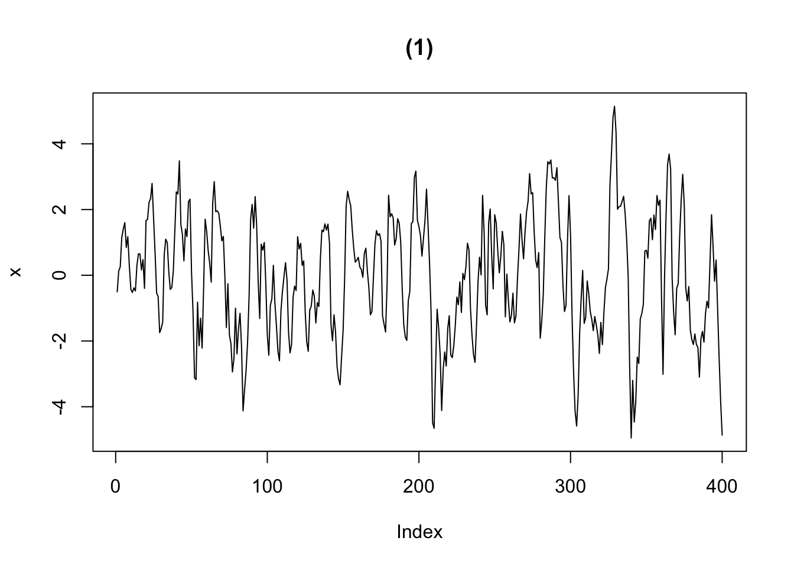
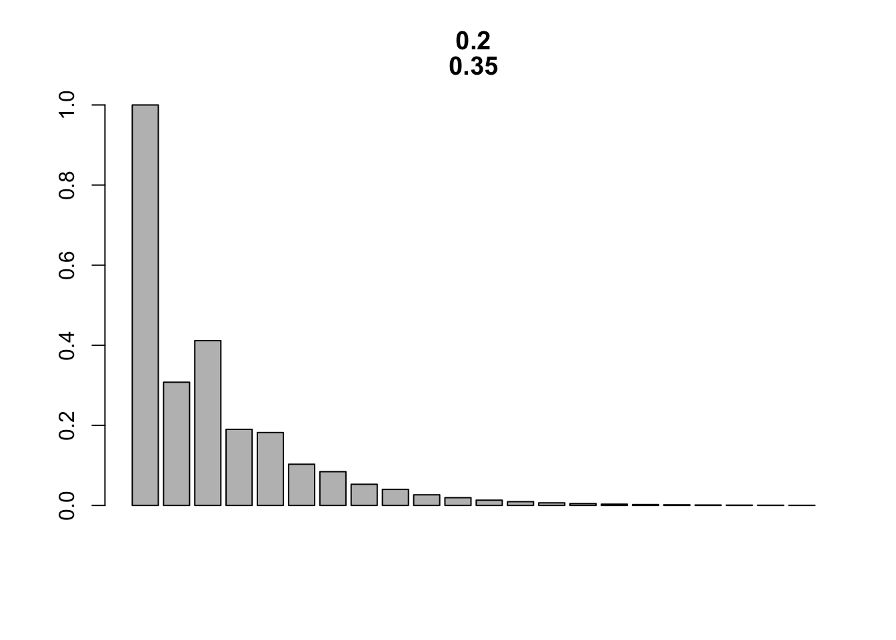
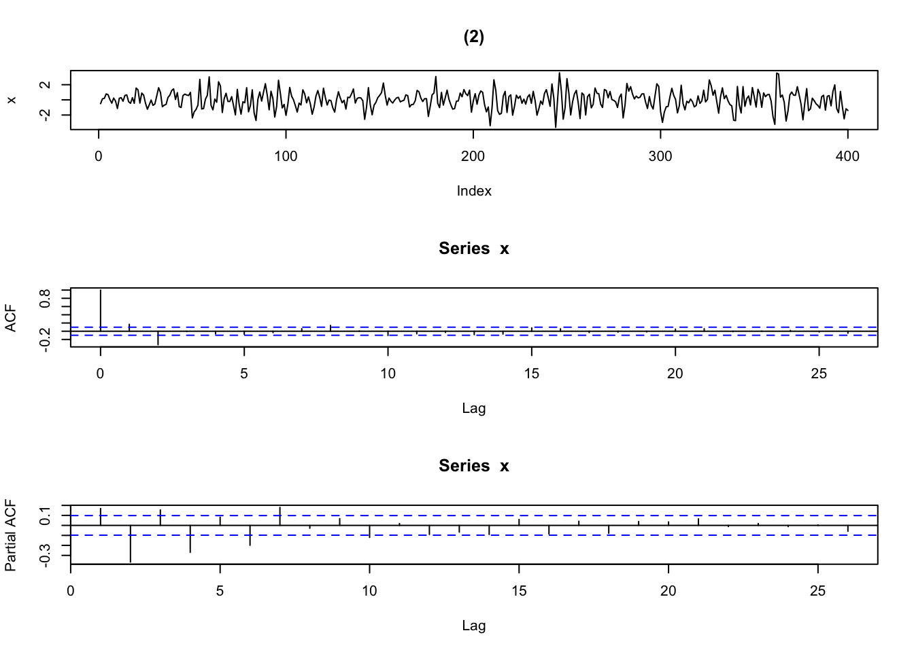
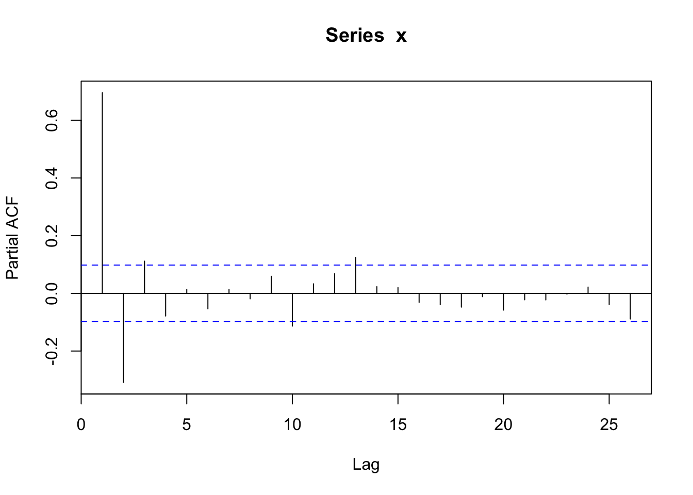

## 自己相関関数 (標本値 vs 理論値)

### AR(2) モデル {-}
- シミュレーション

```r
sim_AR2 <- function(phi_par, n_sim = 100, seed = 1, ...){
	set.seed(seed)
	par(mfrow = c(3, 1))
	x <- w <- rnorm(n_sim)
	for (t in 3:n_sim) {x[t] <- phi_par[1] * x[t-1] + phi_par[2] * x[t-2] + w[t]}
	plot(x, type = "l", ...)
	acf(x); pacf(x)
	par(mfrow = c(1,1))
}

# Tsay, p_57, Fig 2_9のパラメータ例
phi_par1 <- c(1.2, -0.35)	# (phi1, phi2)
phi_par2 <- c(0.6, -0.4)	# (phi1, phi2)
phi_par3 <- c(0.2, 0.35)	# (phi1, phi2)
phi_par4 <- c(-0.2, 0.35)	# (phi1, phi2)

N <- 400
Sd <- 100
sim_AR2(phi_par1, n_sim = N, seed = Sd, main = "(1)")
```



```r
sim_AR2(phi_par2, n_sim = N, seed = Sd, main = "(2)")
```


```r
sim_AR2(phi_par3, n_sim = N, seed = Sd, main = "(3)")
```


```r
sim_AR2(phi_par4, n_sim = N, seed = Sd, main = "(4)")
```


- AR(2)の特性方程式の解

```r
sol_AR2eqn <- function(phi_par){
	D <- phi_par[1]^2 + 4 * phi_par[2]
	if (D>= 0){
	z1 <- (phi_par[1] + sqrt(D)) / (-2 * phi_par[2])
	z2 <- (phi_par[1] - sqrt(D)) / (-2 * phi_par[2])
	}
	else{
	z1 <- complex(re = phi_par[1] / (-2 * phi_par[2]), im = sqrt(-D)/(-2 * phi_par[2]))
	z2 <- complex(re = phi_par[1] / (-2 * phi_par[2]), im = -sqrt(-D)/(-2 * phi_par[2]))
	}
	return(c(z1,z2))
}
sol_AR2eqn(phi_par1)
```

```
## [1] 2.000000 1.428571
```

```r
sol_AR2eqn(phi_par2)
```

```
## [1] 0.75+1.391941i 0.75-1.391941i
```

```r
sol_AR2eqn(phi_par3)
```

```
## [1] -2.000000  1.428571
```

```r
sol_AR2eqn(phi_par4)
```

```
## [1] -1.428571  2.000000
```

- AR(2)のACF理論値: rhoに関する差分方程式(漸化式)より計算

```r
plot_ACF_AR2 <- function(phi_par, hlen=10){
	rho_0 <- 1
	rho_1 <- phi_par[1]/(1-phi_par[2])
	ACF_h <- c(rho_0, rho_1)
	for (h in 1:hlen){
		rho_2 = phi_par[1]*rho_1 + phi_par[2]*rho_0
		ACF_h = c(ACF_h, rho_2)
		rho_0 =  rho_1; rho_1 = rho_2
	}
	barplot(ACF_h, main=phi_par)
}
```

- 代替的アプローチ: 特性方程式の解を使って導出

```r
plot_ACF_AR2_2 <- function(phi_par, hlen=10){
	zvec <- sol_AR2eqn(phi_par)	# 特性方程式の解
	rho_0 <- 1
	rho_1 <- phi_par[1]/(1-phi_par[2])
	# c1, c2に関する連立方程式
	cvec <- solve(matrix(c(1, 1 , 1 / zvec[1], 1 / zvec[2]), 2, byrow = T), c(rho_0, rho_1) )
	hvec <- 0:hlen
	if (! is_complex(zvec)){	# 実根の場合
		if (zvec[1] != zvec[2]) ACF_h <- cvec[1] * zvec[1] ^ (-hvec) + cvec[2] * zvec[2] ^ (-hvec)
		else ACF_h <- zvec[1]^(-hvec) * (cvec[1] + cvec[2] * hvec)	# 重根
	}
	else{		# 複素共役 (complex conjugates) の場合
		z_mod <- Mod(zvec[1])
		th <- Arg(zvec[1])
		ACF_h <- z_mod ^ (-hvec) * cos(hvec * th)
	}
	barplot(ACF_h, main = phi_par)
}
plot_ACF_AR2(phi_par1)
```


```r
plot_ACF_AR2(phi_par2)
```


```r
plot_ACF_AR2(phi_par3)
```



```r
plot_ACF_AR2(phi_par4)
```


<!---
### MA(2)モデル
- シミュレーションと標本ACF・標本PACF

```r
sim_MA2 <- function(theta_par, n_sim = 100, seed = 1, ...){
	set.seed(seed)
	par(mfrow = c(3, 1))
	x <- w <- rnorm(n_sim)
	for (t in 3:n_sim) {x[t] <- w[t] + theta_par[1] * w[t-1] + theta_par[2] * w[t-2]}
	plot(x, type = "l", ...)
	acf(x); pacf(x)
	par(mfrow = c(1, 1))
}

theta_par1 <- c(1.2, -0.35)	# (theta1, theta2)
theta_par2 <- c(0.6, -0.4)	# (theta1, theta2)
theta_par3 <- c(0.2, 0.35)	# (theta1, theta2)
theta_par4 <- c(-0.2, 0.35)	# (theta1, theta2)

Sd <- 100
sim_MA2(theta_par1, n_sim = N, seed = Sd, main = "(1)")
```


```r
sim_MA2(theta_par2, n_sim = N, seed = Sd, main = "(2)")
```



```r
sim_MA2(theta_par3, n_sim = N, seed = Sd, main = "(3)")
```


```r
sim_MA2(theta_par4, n_sim = N, seed = Sd, main = "(4)")
```


### ARMA(1,1)モデル
- シミュレーションと標本ACF・標本PACF

```r
phi <- 0.5; theta <- 0.5
set.seed(1)
x  <-  arima.sim(n  =  N, model = list(order = c(1, 0, 1), ar = phi, ma = theta))
plot(x, type = "l") # 時系列プロット
```


```r
acf(x) # 自己相関(ACF)
```


```r
pacf(x)	# 偏自己相関(PACF)
```


--!>
