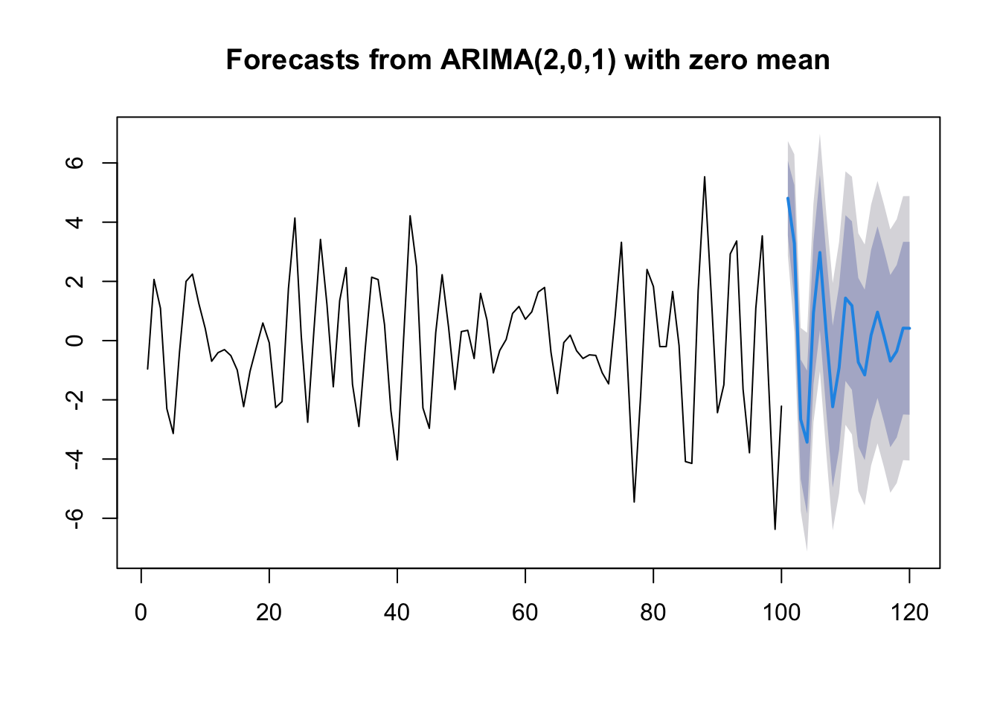

# ARMA$(p,q)$モデル

## ARMA$(p,q)$モデルとは
- 定常, かつ
- 次の差分方程式を満たす${X_t}$:

$$ X_t - \phi_1 X_{t-1} - \cdots - \phi_p X_{t-p}= Z_t + \theta_1 X_{t-1} + \cdots + \theta_q Z_{t-q} \tag{1}$$
コンパクトな代替表現:
$$ \phi(B)X_t = \theta(B) Z_t \tag{2}$$

- Backward shift operator $B$
- AR多項式 $\phi(z)=1 - \phi_1 z - \cdots - \phi_p z^p$
- MA多項式 $\theta(z)=1 + \theta_1 z + \cdots + \theta_q z^q$

### 因果性と反転可能性 {-}
- 差分方程式の解${X_t}$

形式的に解くと,
$$ X_t = \frac{\theta(B)}{\phi(B)} Z_t \tag{3}$$
解が存在 (定常, 因果的) するための条件?

- 定常性: $\phi(z) \ne 0,\  \forall |z|=1$
- 因果性: $\phi(z) \ne 0,\  \forall |z|\le 1$
- +反転可能性: $\theta(z) \ne 0,\  \forall |z|\le 1$

※ $\phi(z)=0, \theta(z)=0$は共通根を持たない (識別可能性)

※ 因果性は実用上不可欠: $X_t = \sum_{i=0}^{\infty}\psi_i Z_{t-i}$ <span style="color: red; ">(with $\sum_{i=0}^{\infty}|\psi_i|<\infty$) </span> (MA$(\infty)$表現)

※ 反転可能性は推定のために付加する条件: $Z_t = \sum_{i=0}^{\infty}\pi_i X_{t-i}$ <span style="color: red; ">  (with $\sum_{i=0}^{\infty}|\pi_i|<\infty$)</span> (AR$(\infty)$表現)

<!-- 
- 識別可能性条件:$\theta(z) \ne 0,\  \forall |z|\ge 1$
-->

### ARMA$(p,q)$モデルの意義 {-}
- なぜ必要か?
  - AR(_p_)過程
    - 実際の時系列データの記述 → 大きな$p$が必要となる可能性
  - MA$(q)$過程. 反転可能な場合, AR$(\infty)$表現が可能
  $$ Z_t = X_t + \sum_{i=1}^{\infty}\pi_i X_{t-i} $$
  - ∴ AR$(p)$過程にMA$(q)$項を付与することで, 少ないパラメータで, 現象を表現できることが期待される

## ARMA$(p,q)$モデルによる予測
- 過去データ$X_t,X_{t-1},\cdots,X_1$に基づき, $h$期先の値$X_{t+h}$を予測したい
- モデルを推定 → 推定モデルを使って予測
- どのように予測するか?
  - 定常過程の予測 (当然, ARMA$(p,q)$過程を含む)
  - 線形予測 (Best Linear Prediction)
    - 線形回帰問題を解く(正規方程式の解)
    - AR$(p)$モデル → <span style="color: red; ">$\phi$</span>係数をそのまま予測に使用
    - 一般的解法 (MA$(q)$, ARMA$(p,q)$モデル等にも適用):  アルゴリズムによる予測(Duribin-Levinsonアルゴリズム, Innovationアルゴリズム)
  
## ARMA$(p,q)$モデルの推定
- モデルをどのように推定するか?
  - 次数$p,q$の同定(identification) (モデル選択)
  - モデルパラメータ<span style="color: red; ">$\phi$ </span>,  $\theta$の推定

- 予備的な推定 (→ 最尤法の初期値に利用可能)
  - AR$(p)$モデルのみ: Yule-Walker法, Burg法
  - MA$(q)$, ARMA$(p,q)$モデル: Innovationアルゴリズム, Hannan-Rissanenアルゴリズム等
  
- 最尤法
  - 標準的には, $Z_t$が正規ホワイトノイズ (IID + 正規分布)
    - → $X_t$は, Gaussian過程
  - $Z_t$が非正規のIIDノイズの場合でも, 大標本ならば使用OK
    
- モデル診断
  - 適合モデルから得られた残差系列がホワイトノイズか?
    - 時系列プロット, 標本ACFプロット
    - 自己相関の検定, かばん検定
    - 正規性検定 (qqプロット, Jarque-Bera検定など)
- <span style="color: red; ">参考文献: Brockwell and Davis, Introduction to Time Series and Forecasting.</span>

## ARMA$(p,q)$モデルの同定 (次数の特定)
- 標本自己相関(ACF), 標本偏自己相関(PACF)の使用
  - 定常過程は, ACVF/ACFによって特徴付けられる
  - →時系列データから標本SACFをプロット
    - AR$(p)$ → PACFが$(p+1)$次<span style="color: red; ">以降のラグが値$0$</span>
    - MA$(q)$ → ACFが$(q+1)$次<span style="color: red; ">以降のラグが値$0$</span>
    - ARMA$(p,q)$ →Extended ACF(EACF)の表内で, "○"(値が有意でない)の領域中で最も左上の要素の位置(行$p$,列$q$)を見つける
  
- AIC, BICなどのモデル選択基準の使用
  - モデル推定と同時に行う
  - モデル選択基準 = - 2・対数尤度 + 罰則項(パラメータ数の増加関数)
  
## Rによる実行例  
### ARMA$(p,q)$モデルの同定 (ACF/PACF/EACFの利用)
- AR(3)モデル

```r
#par(mfrow = c(3,1))
Tlen = 100
phi=c(0.5,-0.8, 0.5); theta = NULL
set.seed(10)
x = arima.sim(n = Tlen, model = list(order = c(3,0,0), ar = phi, ma = theta))
#plot(x, type = "l") # 時系列プロット
par(mfrow = c(1,2))
acf(x) # 自己相関(ACF)
pacf(x)	# 偏自己相関(PACF)
```


- MA(2)モデル

```r
phi = NULL; theta=c(0.3,0.4)
set.seed(10)
x = arima.sim(n = Tlen, model = list(order = c(0,0,2), ar = phi, ma = theta))
#plot(x, type = "l") # 時系列プロット
par(mfrow = c(1,2))
acf(x) # 自己相関(ACF)
pacf(x)	# 偏自己相関(PACF)
```


- ARMA(2,1)モデル

```r
phi = c(0.3,-0.8); theta = 0.9
set.seed(10)
x = arima.sim(n = Tlen, model = list(order = c(2,0,1), ar = phi, ma = theta))
#plot(x, type="l") # 時系列プロット
par(mfrow = c(1,2))
acf(x) # 自己相関(ACF)
pacf(x)	# 偏自己相関(PACF)
```


```r
require(TSA)
```

```
## Loading required package: TSA
```

```
## 
## Attaching package: 'TSA'
```

```
## The following objects are masked from 'package:stats':
## 
##     acf, arima
```

```
## The following object is masked from 'package:utils':
## 
##     tar
```

```r
m1 = eacf(x, 6, 8)      # Simplified table 
```

```
## AR/MA
##   0 1 2 3 4 5 6 7 8
## 0 x x x x x o x o o
## 1 x x x x x x x o o
## 2 x o o o o o o o o
## 3 x o o o o o o o o
## 4 x x x o o o o o o
## 5 x o x o o o o o o
## 6 x o o o o o o o o
```

```r
print(m1$eacf, digits = 2)
```

```
##      [,1]   [,2]  [,3]   [,4]    [,5]   [,6]   [,7]   [,8]   [,9]
## [1,] 0.30 -0.613 -0.41  0.304  0.3518 -0.131 -0.269  0.048  0.197
## [2,] 0.34 -0.767 -0.43  0.462  0.3388 -0.214 -0.250  0.088  0.182
## [3,] 0.50 -0.021 -0.13 -0.135 -0.0102  0.053  0.033 -0.095 -0.205
## [4,] 0.51 -0.097 -0.11 -0.140 -0.0241  0.116  0.031 -0.062 -0.183
## [5,] 0.26 -0.364  0.40 -0.137 -0.0169 -0.032  0.012 -0.078 -0.104
## [6,] 0.47 -0.028  0.23 -0.162  0.0055 -0.045  0.055 -0.055 -0.114
## [7,] 0.49  0.052  0.17 -0.067 -0.1727 -0.019  0.038 -0.070 -0.059
```
→  EACFは$(p,q)=(2,1)$を示唆.

### ARMA$(p,q)$モデルの推定・診断
- 仮に$(p,q)=(2,2)$を選んだとすると,

```r
(x.fit = arima(x,order = c(2,0,2))) # ARMA(2,2)モデルの推定(制約なし)
```

```
## 
## Call:
## arima(x = x, order = c(2, 0, 2))
## 
## Coefficients:
##          ar1      ar2     ma1      ma2  intercept
##       0.3556  -0.7777  0.8059  -0.0712    -0.0247
## s.e.  0.0887   0.0687  0.1279   0.1353     0.1187
## 
## sigma^2 estimated as 0.9372:  log likelihood = -140.93,  aic = 291.87
```

```r
# --> 有意でない係数=0を指定
(x.fit2 = arima(x,order = c(2,0,2), fixed = c(NA,NA,NA,0,NA))) # 制約付き推定
```

```
## 
## Call:
## arima(x = x, order = c(2, 0, 2), fixed = c(NA, NA, NA, 0, NA))
## 
## Coefficients:
##          ar1      ar2     ma1  ma2  intercept
##       0.3270  -0.7772  0.8604    0    -0.0260
## s.e.  0.0706   0.0691  0.0802    0     0.1249
## 
## sigma^2 estimated as 0.9407:  log likelihood = -141.07,  aic = 290.15
```

```r
tsdiag(x.fit2, gof = 20)  # モデル診断
```


```r
Box.test(x.fit2$residuals, lag = 20, type = 'Ljung')  # Ljung-Box検定
```

```
## 
## 	Box-Ljung test
## 
## data:  x.fit2$residuals
## X-squared = 13.785, df = 20, p-value = 0.8412
```

### パッケージ{forecast}の利用
- モデルの自動選択・推定

```r
require(forecast)
```

```
## Loading required package: forecast
```

```
## Registered S3 method overwritten by 'quantmod':
##   method            from
##   as.zoo.data.frame zoo
```

```
## Registered S3 methods overwritten by 'forecast':
##   method       from
##   fitted.Arima TSA 
##   plot.Arima   TSA
```

```r
(x.fit3 = auto.arima(x)) # AIC/AICc(デフォルト)/BICによりモデルを自動選択&推定
```

```
## Series: x 
## ARIMA(2,0,1) with zero mean 
## 
## Coefficients:
##          ar1      ar2     ma1
##       0.3273  -0.7773  0.8606
## s.e.  0.0706   0.0691  0.0801
## 
## sigma^2 = 0.9702:  log likelihood = -141.1
## AIC=290.19   AICc=290.61   BIC=300.61
```

- 推定モデルを使った予測

```r
(x.pred = forecast(x.fit3, h=20))
```

```
##     Point Forecast      Lo 80      Hi 80      Lo 95     Hi 95
## 101      4.8076600  3.5453579  6.0699620  2.8771355 6.7381844
## 102      3.2942800  1.3342557  5.2543043  0.2966815 6.2918785
## 103     -2.6587345 -4.6791846 -0.6382845 -5.7487463 0.4312772
## 104     -3.4306758 -5.8473695 -1.0139821 -7.1266899 0.2653382
## 105      0.9437980 -1.4734713  3.3610674 -2.7530964 4.6406925
## 106      2.9754436  0.3543532  5.5965340 -1.0331682 6.9840554
## 107      0.2401888 -2.4072595  2.8876371 -3.8087340 4.2891116
## 108     -2.2341203 -4.9639829  0.4957423 -6.4090848 1.9408442
## 109     -0.9178543 -3.6944931  1.8587845 -5.1643569 3.3286483
## 110      1.4361307 -1.3626481  4.2349096 -2.8442321 5.7164936
## 111      1.1834256 -1.6613440  4.0281953 -3.1672741 5.5341253
## 112     -0.7289626 -3.5757196  2.1177945 -5.0827018 3.6247766
## 113     -1.1584110 -4.0375796  1.7207575 -5.5617193 3.2448973
## 114      0.1874876 -2.6922716  3.0672467 -4.2167240 4.5916991
## 115      0.9617589 -1.9352597  3.8587775 -3.4688487 5.3923665
## 116      0.1690270 -2.7318039  3.0698578 -4.2674110 4.6054649
## 117     -0.6922301 -3.5997273  2.2152671 -5.1388633 3.7544032
## 118     -0.3579265 -3.2709875  2.5551344 -4.8130688 4.0972157
## 119      0.4209117 -2.4936672  3.3354906 -4.0365521 4.8783755
## 120      0.4159582 -2.5036126  3.3355289 -4.0491400 4.8810563
```

```r
plot(x.pred)　# 
```


