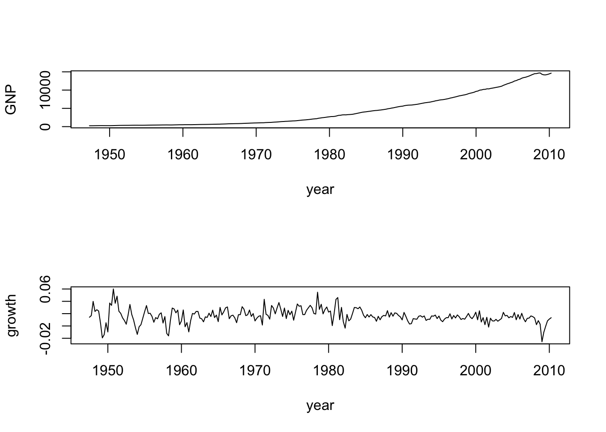
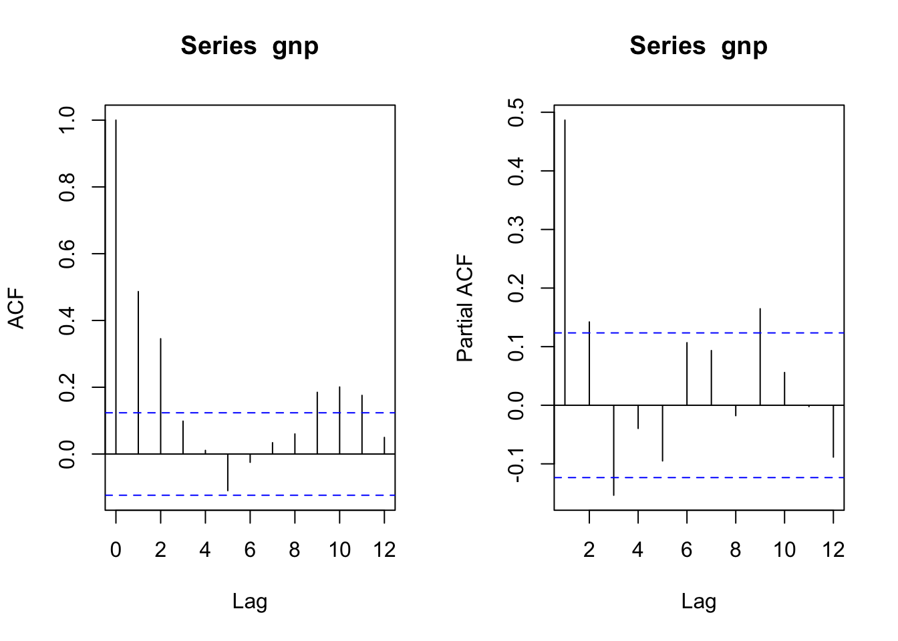
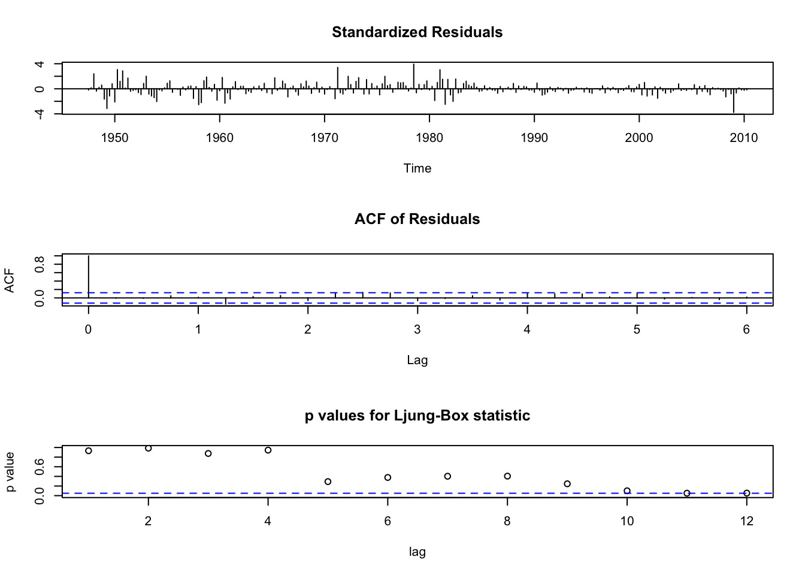
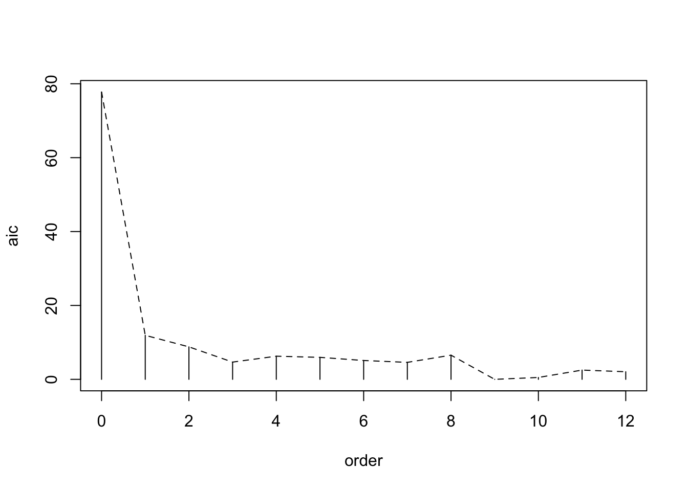

## ARMAモデル: データ分析例 (Tsay, Ch2)

- 出所: Tsay, Ch.2 (一部改変)


### 標本ACF
- pp.46--47
- Example 2.1

```r
ifl <- file.path(dir_introTS, "m-dec12910.txt")
da = read.table(ifl, header=T)
#da = read.table("m-dec12910.txt", header = T)
head(da)
```

```
##       date      dec1      dec2      dec9    dec10
## 1 19670131  0.068568  0.080373  0.180843 0.211806
## 2 19670228  0.008735  0.011044  0.048767 0.064911
## 3 19670331  0.039698  0.035364  0.067494 0.068904
## 4 19670428  0.044030  0.037541  0.040785 0.044602
## 5 19670531 -0.050631 -0.036233 -0.002191 0.000295
## 6 19670630  0.014998  0.018870  0.102075 0.118678
```

```r
d10 = da$dec10 # select the Decile 10 returns
dec10 = ts(d10, frequency = 12, start = c(1967, 1))
par(mfcol = c(2, 1))
plot(dec10, xlab = 'year', ylab = 'returns')
# matplot(da[, -1], type = "l")
title(main = '(a): Simple returns')
```


```r
acf(d10, lag = 24) # command to obtain sample ACF of the data
# RK: 有意性確認
f1 = acf(d10, lag = 24)
```


```r
f1$acf
```

```
## , , 1
## 
##               [,1]
##  [1,]  1.000000000
##  [2,]  0.227386585
##  [3,] -0.019026447
##  [4,] -0.021258247
##  [5,]  0.011011345
##  [6,]  0.002676057
##  [7,] -0.027654887
##  [8,] -0.016910608
##  [9,] -0.049183690
## [10,] -0.039617756
## [11,]  0.013265549
## [12,]  0.061013220
## [13,]  0.130411045
## [14,] -0.036881195
## [15,] -0.082462743
## [16,] -0.020950139
## [17,]  0.016726386
## [18,] -0.013961209
## [19,] -0.059422809
## [20,] -0.082246074
## [21,] -0.063641596
## [22,] -0.039858376
## [23,]  0.017770989
## [24,] -0.015413528
## [25,]  0.052212082
```

```r
# (tt = f1$acf[13] * sqrt(516))		# nrow(da) = 516
(tt = f1$acf[13] * sqrt(length(d10)))	# 絶対値の大きいh = 13でのt値
```

```
## [1] 2.962369
```

- Ljung-Box Q statistics
- P.48, Example 2.2

```r
ifl <- file.path(dir_introTS, "m-ibmsp6709.txt")
da = read.table(ifl, header=T)
#da = read.table("m-ibmsp6709.txt", header = T)
ibm = da$ibm
lnibm = log(ibm + 1) # Transfer to log returns
Box.test(ibm, lag = 12, type = 'Ljung')
```

```
## 
## 	Box-Ljung test
## 
## data:  ibm
## X-squared = 7.5666, df = 12, p-value = 0.818
```

```r
Box.test(lnibm, lag = 12, type = 'Ljung')
```

```
## 
## 	Box-Ljung test
## 
## data:  lnibm
## X-squared = 7.4042, df = 12, p-value = 0.8298
```

### AR, MA, ARMA (2.4--2.6)
- p.58, Example 2.3
- GNP, 1947.Q1--2010.Q1

```r
par(mfrow = c(1, 1))
ifl <- file.path(dir_introTS, "q-gnp4710.txt")
da = read.table(ifl, header=T)
#da = read.table("q-gnp4710.txt", header = T)
head(da); tail(da); nrow(da)
```

```
##   Year Mon Dat VALUE
## 1 1947   1   1 238.1
## 2 1947   4   1 241.5
## 3 1947   7   1 245.6
## 4 1947  10   1 255.6
## 5 1948   1   1 261.7
## 6 1948   4   1 268.7
```

```
##     Year Mon Dat   VALUE
## 248 2008  10   1 14317.2
## 249 2009   1   1 14172.2
## 250 2009   4   1 14164.2
## 251 2009   7   1 14281.9
## 252 2009  10   1 14442.8
## 253 2010   1   1 14637.6
```

```
## [1] 253
```

```r
G = da$VALUE
plot(G, type = "l")
```


```r
LG = log(G)
gnp = diff(LG)
dim(da)
```

```
## [1] 253   4
```

```r
#tdx = c(1:253) / 4 + 1947 # create the time index
tdx = c(1:length(G)) / 4 + 1947 # 1947スタート, 四半期データ
par(mfcol = c(2, 1))
plot(tdx, G, xlab = 'year', ylab = 'GNP', type = 'l')
#plot(tdx[2:253], gnp, type = 'l', xlab = 'year', ylab = 'growth') 
plot(tdx[-1], gnp, type = 'l', xlab = 'year', ylab = 'growth') 	# 
```



```r
acf(gnp, lag = 12)
pacf(gnp, lag = 12) # compute PACF
```



- arima(): 一変量arimaモデルの適合 (次数order, 分析者が指定)

```r
(m1 = arima(gnp, order = c(3, 0, 0)))		# ARIMA(3, 0, 0) = AR(3)
```

```
## 
## Call:
## arima(x = gnp, order = c(3, 0, 0))
## 
## Coefficients:
##          ar1     ar2      ar3  intercept
##       0.4386  0.2063  -0.1559     0.0163
## s.e.  0.0620  0.0666   0.0626     0.0012
## 
## sigma^2 estimated as 9.549e-05:  log likelihood = 808.56,  aic = -1607.12
```

```r
tsdiag(m1, gof = 12) # model checking discussed later
```


```r
p1 = c(1, -m1$coef[1:3]) # set-up the polynomial (AR係数)
(r1 = polyroot(p1)) # solve the polynomial equation (AR特性方程式の解)
```

```
## [1]  1.616116+0.864212i -1.909216+0.000000i  1.616116-0.864212i
```

```r
Mod(r1)	# compute absolute value
```

```
## [1] 1.832674 1.909216 1.832674
```

```r
(k = 2 * pi / acos(1.616116 / 1.832674)) # compute length of the period
```

```
## [1] 12.79523
```

```r
# <-- (ACF)周期の計算, p.56内, k = の式
```

- (参考) zooクラスにして実行した場合

```r
library(zoo)
```

```
## 
## Attaching package: 'zoo'
```

```
## The following objects are masked from 'package:base':
## 
##     as.Date, as.Date.numeric
```

```r
G.zoo = zoo(G, tdx)
plot(G.zoo)
```


```r
m1.zoo = arima(diff(log(G.zoo)), order = c(3, 0, 0))
tsdiag(m1.zoo, gof = 12)
```



```r
# gnp.zoo = zoo(gnp, tdx[-1])
gnp.zoo = diff(log(G.zoo))	# zoo クラス
plot(gnp.zoo)
```


```r
# Q statistic: based on lag autocorrelation coefficients
Box.test(m1.zoo$residuals, lag = 1, type = "Ljung-Box")	
```

```
## 
## 	Box-Ljung test
## 
## data:  m1.zoo$residuals
## X-squared = 0.0071647, df = 1, p-value = 0.9325
```

```r
Box.test(m1.zoo$residuals, lag = 5, type = "Ljung-Box")
```

```
## 
## 	Box-Ljung test
## 
## data:  m1.zoo$residuals
## X-squared = 6.1525, df = 5, p-value = 0.2917
```

```r
Box.test(m1.zoo$residuals, lag = 12, type = "Ljung-Box")	# → p = 0.05271
```

```
## 
## 	Box-Ljung test
## 
## data:  m1.zoo$residuals
## X-squared = 20.844, df = 12, p-value = 0.05271
```

- p.63

```r
mm1 = ar(gnp, method = 'mle')		# yule-walker(デフォルト), burg, ols, yw
# aic = T (デフォルト) --> 次数選択実行
mm1$order 		# Find the identified order 
```

```
## [1] 9
```

```r
names(mm1)
```

```
##  [1] "order"        "ar"           "var.pred"     "x.mean"       "aic"         
##  [6] "n.used"       "n.obs"        "order.max"    "partialacf"   "resid"       
## [11] "method"       "series"       "frequency"    "call"         "asy.var.coef"
```

```r
print(mm1$aic, digits = 3)
```

```
##      0      1      2      3      4      5      6      7      8      9     10 
## 77.767 11.915  8.792  4.669  6.265  5.950  5.101  4.596  6.541  0.000  0.509 
##     11     12 
##  2.504  2.057
```

```r
aic = mm1$aic # For plotting below.
length(aic)
```

```
## [1] 13
```

```r
plot(c(0:12), aic, type = 'h', xlab = 'order', ylab = 'aic')
lines(0:12, aic, lty = 2)
```



```r
# RK: In ar.yw the variance matrix of the innovations is computed from the fitted coefficients and the autocovariance of x.
```

- (参考) zooクラス利用の場合

```r
aic.zoo = zoo(aic, order.by = c(0:12))
plot(aic.zoo)
```


- table 2.1 (p.61)の例, Value-weighted Index

```r
# AR係数は小さいが有意. 定数項の有意性⇒期待値非ゼロ?
#vw = read.table('m-ibm3dx.txt', header = T)[, 3]
ifl <- file.path(dir_introTS, 'm-ibm3dx2608.txt')
vw = read.table(ifl, header=T)[, 3]
ar(vw, method = "mle")		# demean = T
```

```
## 
## Call:
## ar(x = vw, method = "mle")
## 
## Coefficients:
##       1        2        3        4        5        6        7        8  
##  0.1167  -0.0112  -0.1126   0.0217   0.0735  -0.0452   0.0254   0.0462  
##       9  
##  0.0660  
## 
## Order selected 9  sigma^2 estimated as  0.002831
```

```r
#ar(vw)
# average annual simple gross returnの計算
(t1 = prod(vw + 1))
```

```
## [1] 1592.953
```

```r
# t1^(12 / 996)-1	# 年平均成長率
t1^(12 / length(vw))-1	# 年平均成長率
```

```
## [1] 0.09290084
```

```r
#tmp <- ar(vw, method = "mle")
# tmp$ar / sqrt(diag(tmp$asy))

(m3 = arima(vw, order = c(3, 0, 0)))		# include.mean = T (デフォルト)
```

```
## 
## Call:
## arima(x = vw, order = c(3, 0, 0))
## 
## Coefficients:
##          ar1      ar2      ar3  intercept
##       0.1158  -0.0187  -0.1042     0.0089
## s.e.  0.0315   0.0317   0.0317     0.0017
## 
## sigma^2 estimated as 0.002875:  log likelihood = 1500.86,  aic = -2991.73
```

```r
# --> phi2有意でない
(1-.1158 + .0187 + .1042)*mean(vw) # Compute the intercept phi(0).
```

```
## [1] 0.008967611
```

```r
# m3$coef

sqrt(m3$sigma2) # Compute standard error of residuals
```

```
## [1] 0.0536189
```

```r
Box.test(m3$residuals, lag = 12, type = 'Ljung')
```

```
## 
## 	Box-Ljung test
## 
## data:  m3$residuals
## X-squared = 16.352, df = 12, p-value = 0.1756
```

```r
# --> X-squared = 16.352
(pv = 1-pchisq(16.35, 9)) # Compute p value using 12 degrees of freedom
```

```
## [1] 0.05992276
```

```r
# ← カイ2乗分布の自由度12-3 = 9(AR多項式の次数p = 3)

(m3 = arima(vw, order = c(3, 0, 0), fixed = c(NA, 0, NA, NA)))
```

```
## Warning in arima(vw, order = c(3, 0, 0), fixed = c(NA, 0, NA, NA)): some AR
## parameters were fixed: setting transform.pars = FALSE
```

```
## 
## Call:
## arima(x = vw, order = c(3, 0, 0), fixed = c(NA, 0, NA, NA))
## 
## Coefficients:
##          ar1  ar2      ar3  intercept
##       0.1136    0  -0.1063     0.0089
## s.e.  0.0313    0   0.0315     0.0017
## 
## sigma^2 estimated as 0.002876:  log likelihood = 1500.69,  aic = -2993.38
```

```r
# ← パラメータを推定する場合には"NA"指定: この例では, phi2 = 0
(1-.1136 + .1063)*.0089 # compute phi(0)
```

```
## [1] 0.00883503
```

```r
sqrt(m3$sigma2) # compute residual standard error
```

```
## [1] 0.05362832
```

```r
Box.test(m3$residuals, lag = 12, type = 'Ljung')
```

```
## 
## 	Box-Ljung test
## 
## data:  m3$residuals
## X-squared = 16.828, df = 12, p-value = 0.1562
```

```r
(pv = 1-pchisq(16.83, 10))
```

```
## [1] 0.07821131
```

```r
# ← カイ2乗分布の自由度12-2 = 10(AR多項式の次数p = 2)
```


- p.77

```r
ifl <- file.path(dir_introTS, 'm-ibm3dx2608.txt')
da = read.table(ifl, header=T)
head(da)
```

```
##       date    ibmrtn     vwrtn     ewrtn     sprtn
## 1 19260130 -0.010381  0.000724  0.023174  0.022472
## 2 19260227 -0.024476 -0.033374 -0.053510 -0.043956
## 3 19260331 -0.115591 -0.064341 -0.096824 -0.059113
## 4 19260430  0.089783  0.038358  0.032946  0.022688
## 5 19260528  0.036932  0.012172  0.001035  0.007679
## 6 19260630  0.068493  0.056888  0.050487  0.043184
```

```r
ew = da$ewrtn

(m1 = arima(ew, order = c(0, 0, 9))) # unrestricted model
```

```
## 
## Call:
## arima(x = ew, order = c(0, 0, 9))
## 
## Coefficients:
##          ma1     ma2      ma3      ma4     ma5      ma6     ma7      ma8
##       0.2144  0.0374  -0.1203  -0.0425  0.0232  -0.0302  0.0482  -0.0276
## s.e.  0.0316  0.0321   0.0328   0.0336  0.0319   0.0318  0.0364   0.0354
##          ma9  intercept
##       0.1350     0.0122
## s.e.  0.0323     0.0028
## 
## sigma^2 estimated as 0.005043:  log likelihood = 1220.86,  aic = -2419.72
```

```r
# --> 有意でない係数 = 0を指定
(m1 = arima(ew, order = c(0, 0, 9), fixed = c(NA, 0, NA, 0, 0, 0, 0, 0, NA, NA)))
```

```
## 
## Call:
## arima(x = ew, order = c(0, 0, 9), fixed = c(NA, 0, NA, 0, 0, 0, 0, 0, NA, NA))
## 
## Coefficients:
##          ma1  ma2      ma3  ma4  ma5  ma6  ma7  ma8     ma9  intercept
##       0.1909    0  -0.1199    0    0    0    0    0  0.1227     0.0122
## s.e.  0.0293    0   0.0338    0    0    0    0    0  0.0312     0.0027
## 
## sigma^2 estimated as 0.005097:  log likelihood = 1215.61,  aic = -2421.22
```

```r
sqrt(0.005097)
```

```
## [1] 0.07139328
```

```r
Box.test(m1$residuals, lag = 12, type = 'Ljung') # model checking
```

```
## 
## 	Box-Ljung test
## 
## data:  m1$residuals
## X-squared = 17.604, df = 12, p-value = 0.1283
```

```r
(pv = 1-pchisq(17.6, 9)) # compute p-value after adjusting the d.f.
```

```
## [1] 0.04010828
```

```r
# ← カイ2乗分布の自由度12-3 = 9(AR多項式の次数p = 3)

# Out-of-sample prediction
(m1 = arima(ew[1:986], order = c(0, 0, 9), fixed = c(NA, 0, NA, 0, 0, 0, 0, 0, NA, NA)))
```

```
## 
## Call:
## arima(x = ew[1:986], order = c(0, 0, 9), fixed = c(NA, 0, NA, 0, 0, 0, 0, 0, 
##     NA, NA))
## 
## Coefficients:
##          ma1  ma2      ma3  ma4  ma5  ma6  ma7  ma8     ma9  intercept
##       0.1844    0  -0.1206    0    0    0    0    0  0.1218     0.0128
## s.e.  0.0295    0   0.0338    0    0    0    0    0  0.0312     0.0027
## 
## sigma^2 estimated as 0.005066:  log likelihood = 1206.44,  aic = -2402.88
```

```r
predict(m1, 10) # prediction 
```

```
## $pred
## Time Series:
## Start = 987 
## End = 996 
## Frequency = 1 
##  [1] 0.004282626 0.013558874 0.015024191 0.014453445 0.012046343 0.001805558
##  [7] 0.012211538 0.005514814 0.008513456 0.012791824
## 
## $se
## Time Series:
## Start = 987 
## End = 996 
## Frequency = 1 
##  [1] 0.07117456 0.07237493 0.07237493 0.07288176 0.07288176 0.07288176
##  [7] 0.07288176 0.07288176 0.07288176 0.07339566
```

- EACF table

```r
ifl <- file.path(dir_introTS, 'm-3m4608.txt')
da = read.table(ifl, header=T)
head(da)
```

```
##       date       rtn
## 1 19460228 -0.077922
## 2 19460330  0.018592
## 3 19460430 -0.100000
## 4 19460531  0.209877
## 5 19460628  0.005128
## 6 19460731  0.076531
```

```r
mmm = log(da$rtn + 1)
library(TSA)   # Load the package 
```

```
## 
## Attaching package: 'TSA'
```

```
## The following objects are masked from 'package:stats':
## 
##     acf, arima
```

```
## The following object is masked from 'package:utils':
## 
##     tar
```

```r
m1 = eacf(mmm, 6, 12)   # Simplified table 
```

```
## AR/MA
##   0 1 2 3 4 5 6 7 8 9 10 11 12
## 0 o o x o o x o o o x o  x  o 
## 1 x o x o o x o o o o o  x  o 
## 2 x x x o o x o o o o o  o  o 
## 3 x x x o o o o o o o o  o  o 
## 4 x o x o o o o o o o o  o  o 
## 5 x x x o x o o o o o o  o  o 
## 6 x x x x x o o o o o o  o  o
```

```r
print(m1$eacf, digits = 2)
```

```
##        [,1]    [,2]   [,3]    [,4]     [,5]    [,6]    [,7]   [,8]     [,9]
## [1,] -0.056 -0.0380 -0.082 -0.0046  0.01774  0.0821  0.0080 0.0127 -0.03014
## [2,] -0.474  0.0096 -0.074 -0.0209  0.00196  0.0772 -0.0288 0.0026 -0.00683
## [3,] -0.383 -0.3476 -0.074  0.0160 -0.00553  0.0772  0.0269 0.0120  0.00045
## [4,] -0.177  0.1381  0.384 -0.0224  0.00232  0.0419 -0.0232 0.0154 -0.00440
## [5,]  0.421  0.0287  0.454 -0.0079  0.00071  0.0025 -0.0140 0.0305  0.01159
## [6,] -0.114  0.2135  0.449  0.0096  0.20242 -0.0063 -0.0038 0.0403 -0.01294
## [7,] -0.208 -0.2504  0.243  0.3111  0.16745 -0.0388 -0.0034 0.0429 -0.01009
##        [,10]  [,11]   [,12]  [,13]
## [1,] -0.0778 0.0488  0.0909 -0.011
## [2,] -0.0694 0.0372  0.0938 -0.024
## [3,] -0.0268 0.0221  0.0428  0.042
## [4,] -0.0254 0.0185  0.0100  0.043
## [5,]  0.0042 0.0191 -0.0043  0.013
## [6,] -0.0123 0.0315  0.0117  0.028
## [7,] -0.0260 0.0078  0.0106  0.037
```

```r
# --> ARMA(0, 0)モデル
```
