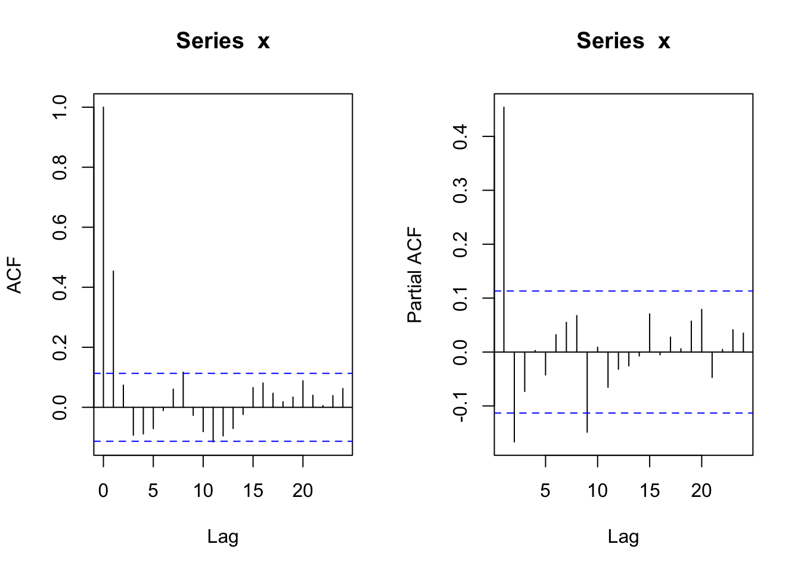
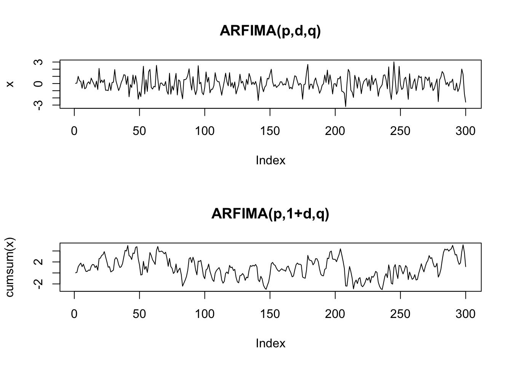
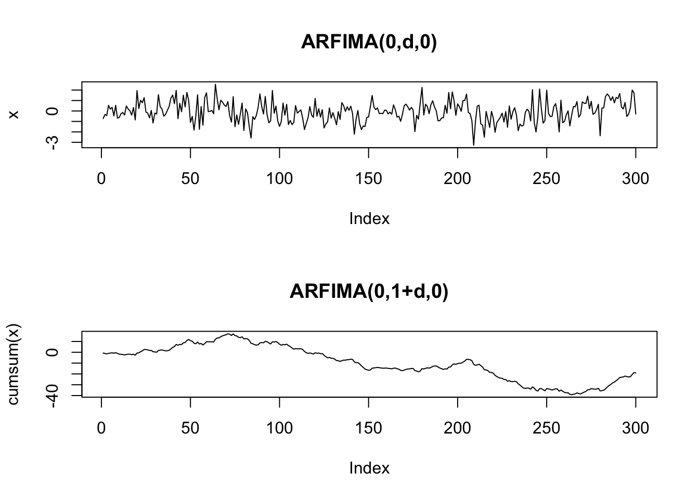
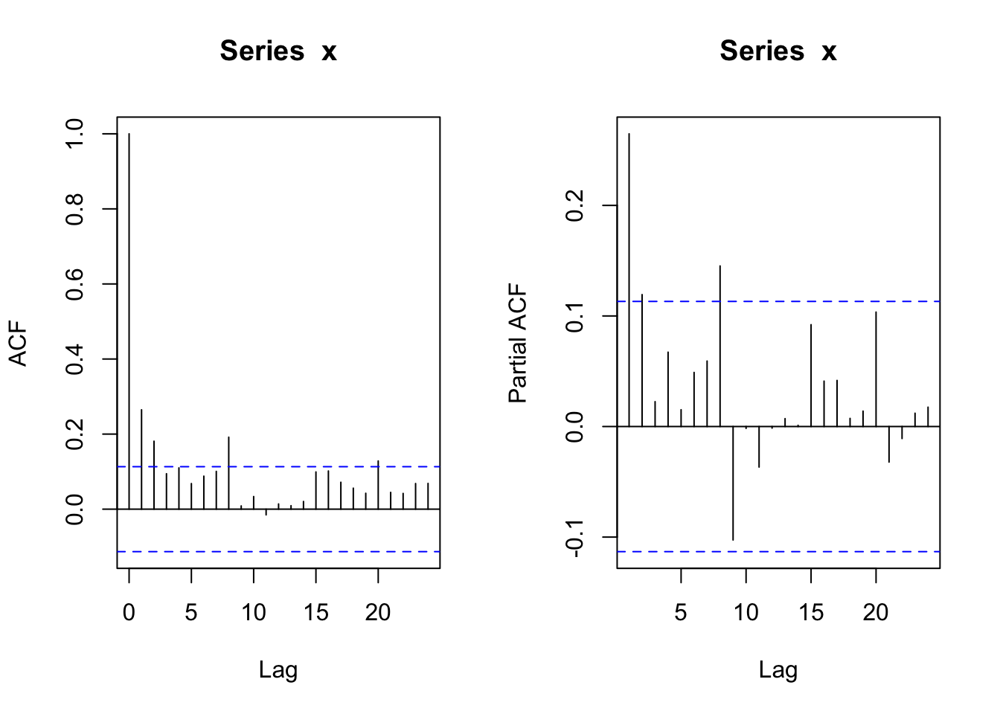
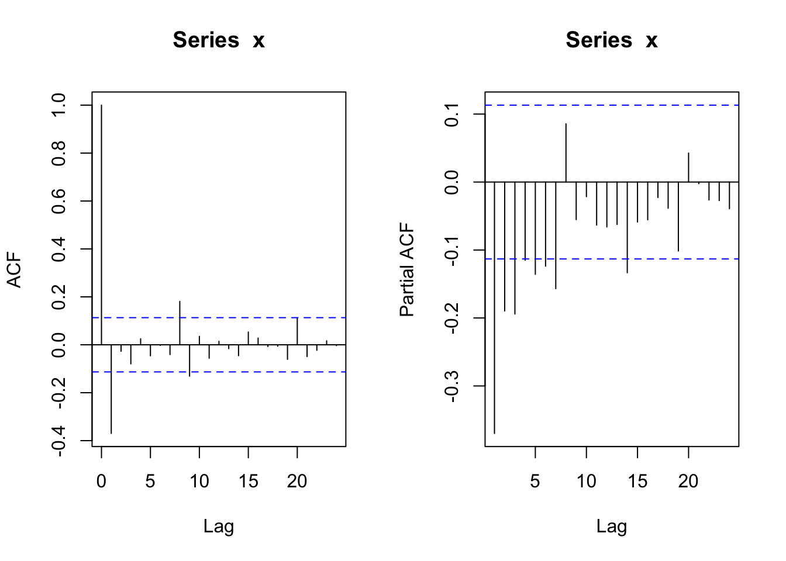
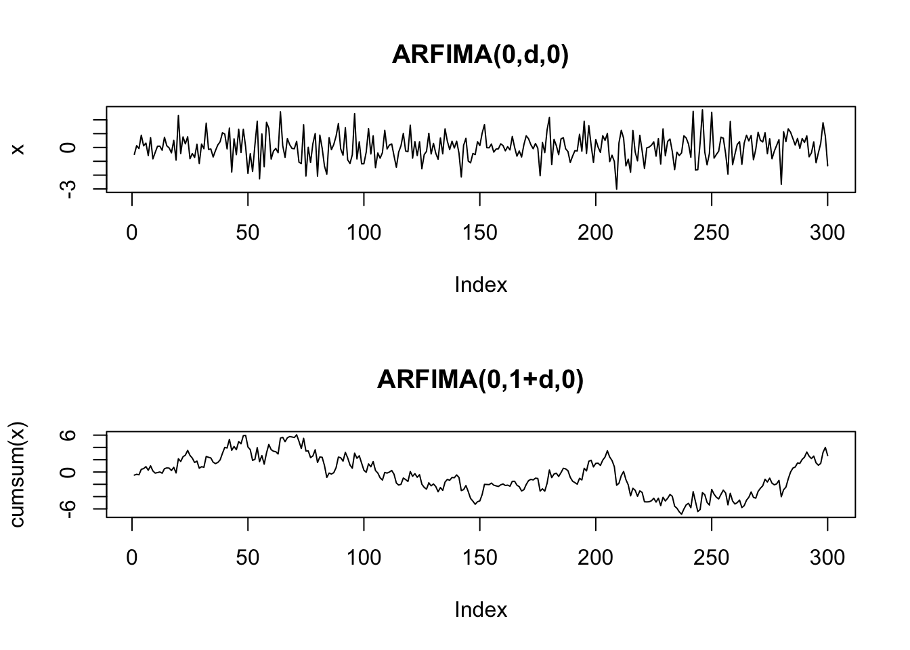
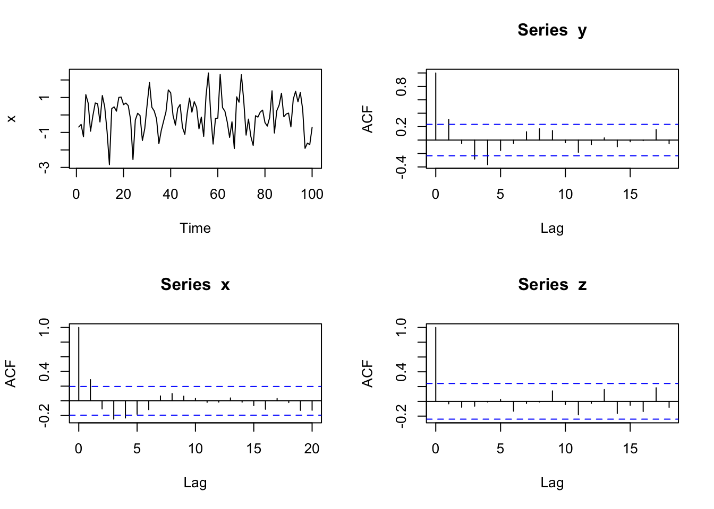
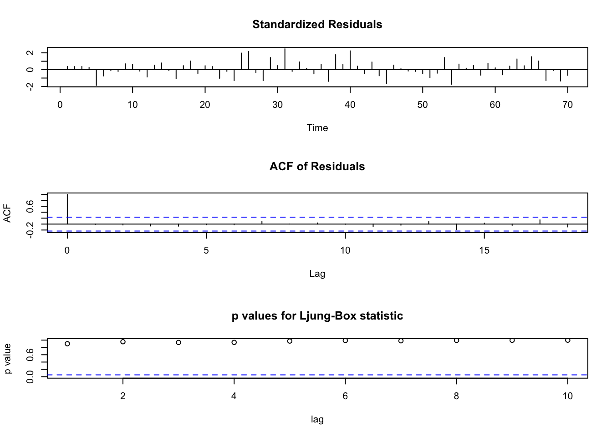
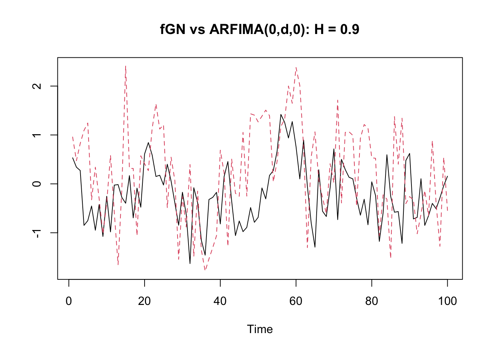
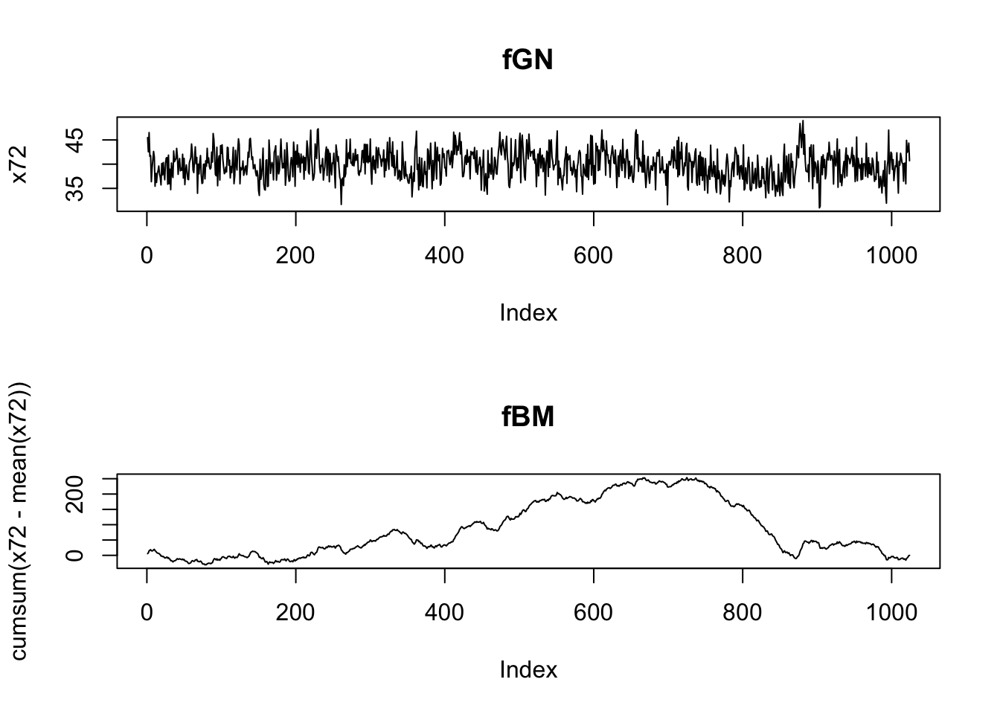

# 長期記憶過程


## ARFIMA(p,d,q)過程のシミュレーション
- **fracdiff**パッケージの利用
- サンプルパス生成(1): p = 2, d = 0.49, q = 0
  - 簡単のため, MA項入れず

```r
Tlen = 300
Seedv = 100; set.seed(Seedv)
library(fracdiff)
fds_sim <- fracdiff.sim(Tlen, ar = c(0.7, -0.2), d = 0.49)	# -0.5<=d<=0.5
x <- fds_sim$series				# 長期記憶系列
plot(x, type = "l")
```


```r
par(mfrow = c(1, 2))
acf(x) # 自己相関(ACF)
pacf(x)	# 偏自己相関(PACF)
```


- サンプルパス生成(2): p = 2, d = 0.1, q = 0

```r
set.seed(Seedv)
fds_sim <- fracdiff.sim(Tlen, ar = c(0.7, -0.2), d = 0.1)
x <- fds_sim$series				# 長期記憶系列
plot(x, type = "l")
```


```r
par(mfrow = c(1, 2))
acf(x) # 自己相関(ACF)
pacf(x)	# 偏自己相関(PACF)
```



- サンプルパス生成(3): p = 2, d = -0.49, q = 0

```r
set.seed(Seedv)
fds_sim <- fracdiff.sim(Tlen, ar = c(0.7, -0.2), d = -0.49)
x <- fds_sim$series				# 長期記憶系列
plot(x, type = "l")
```



```r
par(mfrow = c(1, 2))
acf(x) # 自己相関(ACF)
pacf(x)	# 偏自己相関(PACF)
```


## ARFIMA, fractional Gaussian過程のシミュレーション
- **longmemo**パッケージの利用
```
- ckARMA0(n, H)
  - Compute the Autocovariances of a fractional ARIMA(0,d,0) process (d = H - 1/2).
  - The theoretical formula, C(k) = (-1)^k Γ(1-2d) / (Γ(k+1-d) Γ(1-k-d)) ,
  where d = H - 1/2, leads to over-/underflow for larger lags k;
  hence use the asymptotical formula there.
- ckFGN0(n, H)
  - Compute the Autocovariances of a fractional Gaussian process
```

```r
###########################################################
#install.packages("longmemo")
library(longmemo)
#data("NileMin") # Nile River Minima, yearly 622-1284
#nile <- NileMin
Seedv <- 1
Tlen <- 100; Hval <- 0.9
plot(ckARMA0(Tlen, H = Hval), type = "h")
```



```r
# H > 0.5の時のみ
plot(x = 0:(Tlen-1), ckARMA0(Tlen, H = Hval),
      type = "h", log = "xy",
       main = paste0("Log-Log ACF for ARFIMA(0,d,0) with H = ", Hval))
```




```r
# ckFGN0(n, H)
# Compute the Autocovariances of a fractional Gaussian process
plot(ckFGN0(Tlen, H = Hval), type = "h")
```


```r
# (H > 0.5の時のみ)
plot(x = 0:(Tlen-1), ckFGN0(Tlen, H = Hval), 
       type = "h", log = "xy",
        main = paste0("Log-Log ACF for frac. Gauss. Noise(H = ", Hval, ")"))
```



```
- simGauss: implements the method by Davies and Harte which is relatively fast using the FFT (fft) twice.
  - To simulate ARIMA(p, d, q), (for d in (-1/2, 1,2), you can use arima.sim(n, model = list(ar= .., ma = ..), innov= simARMA0(n,H=d+1/2) , n.start = 0).
  - simFGN.fft() is about twice as fast as simFGN0() and uses Paxson's proposal, by default via B.specFGN(*, k.approx = 3, adjust = TRUE).
```


```r
Seedv <- 1
set.seed(Seedv)
x1 <- simFGN0(Tlen, H = Hval)
x2 <- simARMA0(Tlen, H = Hval)
ts.plot(ts.union(x1, x2), col = 1:2, lty = 1:2,
        main = paste0("frac. Gauss. Noise vs ARFIMA(0,d,0): H = ", Hval))
```



```r
#ts.plot(cbind(x1, x2), col = 1:2, lty = 1:2)
fBM_path <- function(tlen = 100, H = 0.5, sd_val = 1) {
  set.seed(sd_val)
  cumsum(simFGN0(tlen, H))
}
#
plot(fBM_path(Tlen, Hval, Seedv), type = "l")
```


```r
# 異なるHの値でのサンプルパスの比較
hvals <- c(0.5, 0.1, 0.8)
fBM1 <- fBM_path(Tlen, hvals[1], Seedv)
fBM2 <- fBM_path(Tlen, hvals[2], Seedv)
fBM3 <- fBM_path(Tlen, hvals[3], Seedv)
ts.plot(cbind(fBM1, fBM2, fBM3), col = c("black", "blue", "red"), lty = 1, lwd = c(1, 3, 3),
        main = paste0("frac. Brownian Motions: H = ", paste(hvals, collapse = ",")))
```


## Hurst指数の推定
- **pracma**パッケージの利用
```
- hurstexp: R/S分析によるHurst指数推定
- 出力:
  - Hs - simplified R over S approach
  - Hrs - corrected R over S Hurst exponent
  - He - empirical Hurst exponent
  - Hal - corrected empirical Hurst exponent
  - Ht - theoretical Hurst exponent
```

```r
library(pracma)
data(brown72)
x72 <- brown72                          #  H = 0.72
xgn <- rnorm(1024)                      #  H = 0.50
xlm <- numeric(1024); xlm[1] <- 0.1     #  H = 0.43
for (i in 2:1024) xlm[i] <- 4 * xlm[i-1] * (1 - xlm[i-1])

plot(x72, type = "l")
```


```r
plot(xgn, type = "l")
```


```r
plot(xlm, type = "l")
```


```r

hurstexp(brown72) # d: smallest box size (default = 50)
## Simple R/S Hurst estimation:         0.6628842 
## Corrected R over S Hurst exponent:   0.7378703 
## Empirical Hurst exponent:            0.6920439 
## Corrected empirical Hurst exponent:  0.6577233 
## Theoretical Hurst exponent:          0.5404756
hurstexp(xgn)
## Simple R/S Hurst estimation:         0.4784489 
## Corrected R over S Hurst exponent:   0.4898617 
## Empirical Hurst exponent:            0.5041802 
## Corrected empirical Hurst exponent:  0.4636032 
## Theoretical Hurst exponent:          0.5404756
hurstexp(xlm)
## Simple R/S Hurst estimation:         0.4762169 
## Corrected R over S Hurst exponent:   0.4722421 
## Empirical Hurst exponent:            0.4872281 
## Corrected empirical Hurst exponent:  0.4460807 
## Theoretical Hurst exponent:          0.5404756
```

- **fractal**パッケージの利用

```r
library(fractal)
x <- x72
hurstSpec(x)
RoverS(x)
hurstBlock(x, method="aggAbs")
hurstBlock(x, method="aggVar")
hurstBlock(x, method="diffvar")
hurstBlock(x, method="higuchi")
```

## ARFIMAモデルの推定
### 最尤法
- 誤ってARモデルを選択した場合

```r
set.seed(Seedv)
fds_sim <- fracdiff.sim(Tlen, ar = c(0.7, -0.2), d = -0.49)
x <- fds_sim$series				# 長期記憶系列
#
(ar_fit <- ar(x, method = "mle"))
## 
## Call:
## ar(x = x, method = "mle")
## 
## Coefficients:
##       1        2        3        4        5        6  
##  0.2060  -0.2321  -0.2082  -0.1717  -0.1534  -0.1875  
## 
## Order selected 6  sigma^2 estimated as  0.7814
```
- → 大きい$p$を選択

- AR係数, MA係数, 階差次数$d$を最尤推定 (以下, $p=2$を正しくしていたと仮定)

```r
# nar=p, nma=q		# AR, MAパラメーター数
(fds_fit <- fracdiff(x, nar = 2))
## 
## Call:
##   fracdiff(x = x, nar = 2) 
## 
## Coefficients:
##             d           ar1           ar2 
##  4.583013e-05  3.478729e-01 -2.143891e-01 
## sigma[eps] = 0.9577181 
## a list with components:
##  [1] "log.likelihood"  "n"               "msg"             "d"              
##  [5] "ar"              "ma"              "covariance.dpq"  "fnormMin"       
##  [9] "sigma"           "stderror.dpq"    "correlation.dpq" "h"              
## [13] "d.tol"           "M"               "hessian.dpq"     "length.w"       
## [17] "residuals"       "fitted"          "call"
```
- → 通常は$p,q$は未知　→　複数のnar, nmaを試すべき

- **nsarfima**パッケージの利用

```r
library(nsarfima)
# nar = p, nma = q		# AR, MAパラメーター数
(arfima.fit <- mle.arfima(x, p = 2))
## $pars
##            mu          sig2             d          ar.1          ar.2 
## -1.267263e-02  9.022758e-01  5.522776e-08  3.414323e-01 -2.625068e-01 
## 
## $std.errs
##        mu      sig2         d      ar.1      ar.2 
## 0.1016556 0.1395288 0.1733823 0.2163811 0.1612114 
## 
## $cov.mat
##              sig2           d        ar.1         ar.2
## sig2  0.019468294  0.00740705 -0.01170439 -0.004266261
## d     0.007407050  0.03006142 -0.03229578 -0.021628130
## ar.1 -0.011704389 -0.03229578  0.04682076  0.024479505
## ar.2 -0.004266261 -0.02162813  0.02447951  0.025989126
## 
## $fit.obj
## $fit.obj$par
##             d          ar.1          ar.2 
##  5.522776e-08  3.414323e-01 -2.625068e-01 
## 
## $fit.obj$value
## [1] 89.3253
## 
## $fit.obj$counts
## function gradient 
##      208       NA 
## 
## $fit.obj$convergence
## [1] 0
## 
## $fit.obj$message
## NULL
## 
## 
## $p.val
## [1] 0.8912225
## 
## $residuals
##   [1] -0.6764961052 -0.2968632520 -1.2310910722  1.4561378726 -0.0388534504
##   [6] -0.8423204011  0.4686722844  0.4643382756  0.4107973532 -0.4309650411
##  [11]  1.4299789135 -0.0006787575 -0.7857763053 -2.3890626204  1.1014635252
##  [16] -0.3966402031  0.1652482404  1.0616568645  0.7446050471  0.5154245086
##  [21]  0.7564241338  0.4668174692 -0.2693729499 -2.3064083881  0.5227350640
##  [26] -0.4642720829 -0.1309552624 -1.4100725427 -0.2774497899  0.4650877267
##  [31]  1.4649891568 -0.0290343810  0.5782727746 -0.1757284573 -1.4912805335
##  [36] -0.3789621380 -0.4655630075  0.0738483187  1.2914770769  0.8336925539
##  [41] -0.0737873115 -0.2251819617  0.5774490180  0.3286308280 -0.8047251630
##  [46] -0.6986673145  0.2958393665  0.6510135686 -0.1339248247  0.9675384987
##  [51]  0.2259759735 -0.7281405491  0.2716268869 -1.3784731074  1.4943394505
##  [56]  1.7164276897 -0.5272803532 -1.0201592423  0.3729804733 -0.5359889283
##  [61]  2.3350415888 -0.4086512940  0.6924717331 -0.3606512486 -1.0759283895
##  [66] -0.0506511539 -2.1101132511  1.5976097508 -0.1172982949  2.3325016401
##  [71]  0.2254993256 -0.8129057325  0.3788283790 -1.4331970583 -1.3747001462
##  [76]  0.2411732472 -0.5537230862  0.2049218798  0.2004499504 -0.4766722677
##  [81] -0.4042575452 -0.0270582246  1.2728679869 -1.5304518129  0.9624356049
##  [86]  0.2186716228  1.1235112273 -0.3688834767  0.4233844401  0.0726586865
##  [91] -0.6954346528  1.1689570269  0.8808727109  0.5369119812  1.3879840390
##  [96]  0.0879308998 -1.6719344153 -0.8630402713 -1.6381541198 -0.5431240556
```

- モデル診断/残差チェック方法の例
  - 時系列データ$x_t$と$d$の推定値(初期値)があるとする
  - 推定された$d$が正しい値ならば, $Y_t=(1-B)^d X_t$はARMA過程になるはず
  - $x_t$より, パス$y_t$を(近似的に)生成する (get_fracdiff_ts関数使用. 配布のRコード参照)
  - ARMAモデルを生成パス$y_t$に適合する. 得られる残差系列が白色ノイズか?
  - (納得いくまで) 候補を変えて試す.
- ここでは, AR(p)モデルに限定. 以下, 上で生成したパス$x_t$, 得られた$d$の推定値をそのまま使用.

- 長期記憶過程xより非整数階差系列yを生成する関数 (以下で使用)

```r
# 参考: Cowpertwait and Metcalfe(2009), Ch.8
get_fracdiff_ts <- function(x, d, L = 30){	
# L: 項の打ち切り数
	n <- length(x)

	# fdc: (1-B)^dの2項展開係数ベクトルを生成
	fdc <- d				
	fdc[1] <- fdc
	for (k in 2:L) fdc[k] <- fdc[k-1] * (d+1-k) / k 
	
  	# y, 非整数階差系列(fractionally differenced series)を生成
	y <- rep(0, L)
  	for (i in (L+1):n) {
   	 	csm <- x[i]		# x, 原系列（長期記憶過程)
    	
    		for (j in 1:L) csm <- csm + ((-1)^j) * fdc[j] * x[i-j]
    			y[i] <- csm		
  	}
	y <- y[(L+1):n]
	return(y)
}
```


```r
y <- get_fracdiff_ts(x, fds_fit$d)	# {x_t}より非整数階差系列{y_t}を生成
(z.ar <- ar(y))		# ARモデルをフィット
## 
## Call:
## ar(x = y)
## 
## Coefficients:
##       1        2        3        4  
##  0.2598  -0.0943  -0.1637  -0.2469  
## 
## Order selected 4  sigma^2 estimated as  0.8692
ns <- 1 + z.ar$order
z <- z.ar$res [ns:length(y)]  # z.ar$resの最初のns個は欠損
par(mfcol = c(2, 2))
plot(as.ts(x), ylab = "x")
acf(x) ; acf(y) ; acf(z)
```



```r
Box.test(z, lag = 30, type = "Ljung")
## 
## 	Box-Ljung test
## 
## data:  z
## X-squared = 29.658, df = 30, p-value = 0.4833
```


### 階差次数$d$の代替的推定法
- **fracdiff**パッケージ利用
- Geweke and Porter-Hudak(83), Reisen(94)
  - 時系列データのperidogram (スペクトル密度の推定値) ベース

```r
# library(fracdiff)
# Geweke and Porter-Hudak(83)の方法
(d_GPH = fdGPH(x))
## $d
## [1] -0.7167363
## 
## $sd.as
## [1] 0.2935592
## 
## $sd.reg
## [1] 0.2232167
# Reisen(94)の方法
(d_Sper = fdSperio(x))
## $d
## [1] -0.6491031
## 
## $sd.as
## [1] 0.1334138
## 
## $sd.reg
## [1] 0.08329104
```


```r
# GPH推定値の使用
y <- get_fracdiff_ts(x, d_GPH$d) # {x_t}より非整数階差系列{y_t}を生成
# ARMAモデルの適合に, forecastパッケージのauto.arima関数使用
library(forecast)
(y_fit <- auto.arima(y))		# ARモデルをフィット
## Series: y 
## ARIMA(0,0,3) with zero mean 
## 
## Coefficients:
##          ma1     ma2     ma3
##       0.8403  0.5521  0.2549
## s.e.  0.1171  0.1411  0.1297
## 
## sigma^2 = 0.8098:  log likelihood = -90.83
## AIC=189.66   AICc=190.27   BIC=198.65
y_resid <- y_fit$res
par(mfcol = c(1, 2))
acf(y_resid); pacf(y_resid)
```



```r
Box.test(y_resid, lag = 30, type = "Ljung")
## 
## 	Box-Ljung test
## 
## data:  y_resid
## X-squared = 17.267, df = 30, p-value = 0.9692
```

- よりフォーマルなモデル同定・推定の手順は, 配布資料参照.

## ARFIMAモデル: データ分析例 (Tsay, 2.11, pp.119--120)
- データ&コードの出所: https://sites.google.com/site/econometricsr/home/rcode
- コードは一部改


```r
#library(fracdiff)
ifl <- file.path(dir_introTS, "d-ibm3dx7008.txt")
da = read.table(ifl, header = T)
head(da)
##       Date       rtn    vwretd    ewretd    sprtrn
## 1 19700102  0.000686  0.012137  0.033450  0.010211
## 2 19700105  0.009596  0.006375  0.018947  0.004946
## 3 19700106  0.000679 -0.007233 -0.005776 -0.006848
## 4 19700107  0.000678 -0.001272  0.003559 -0.002047
## 5 19700108  0.002034  0.000564  0.002890  0.000540
## 6 19700109 -0.001353 -0.002797 -0.002923 -0.003021
ew = abs(da$vwretd)		# daily abs ret's of value-weighted CRSP, 1970--2008
plot(as.ts(ew))
```



- 次数dの推定

```r
# pure fractionally differenced modelに対して(p=0, q=0)
# Geweke-Porter-Hudak(83) estimate
#(m3 = fdGPH(da$vwretd))		# d=0.05282
(m3 = fdGPH(ew))
## $d
## [1] 0.372226
## 
## $sd.as
## [1] 0.0698385
## 
## $sd.reg
## [1] 0.06868857
```
- → 0<d<0.5　∴ stationary, invertible


```r
# Reisen (94) estimate
# (m3.2 = fdSperio(ew))		# 0.3784656
```


```r
# 最尤法 (nar, nmaの指定必要)
#m3.0 = fracdiff(ew,nar = 0, nma = 0)		# デフォルト: nar = 0, nma = 0
#summary(m3.0)

# ARFIMA(1,d,1)の最尤推定
m2 = fracdiff(ew, nar = 1, nma = 1)
summary(m2)
## 
## Call:
##   fracdiff(x = ew, nar = 1, nma = 1) 
## 
## Coefficients:
##    Estimate Std. Error z value Pr(>|z|)    
## d  0.490938   0.007997   61.39   <2e-16 ***
## ar 0.113389   0.005988   18.94   <2e-16 ***
## ma 0.575895   0.005946   96.85   <2e-16 ***
## ---
## Signif. codes:  0 '***' 0.001 '**' 0.01 '*' 0.05 '.' 0.1 ' ' 1
## sigma[eps] = 0.0065619 
## [d.tol = 0.0001221, M = 100, h = 0.0003742]
## Log likelihood: 3.551e+04 ==> AIC = -71021.02 [4 deg.freedom]
coef(m2)
##         d        ar        ma 
## 0.4909382 0.1133893 0.5758949
confint(m2)
##        2.5 %    97.5 %
## d  0.4752637 0.5066127
## ar 0.1016536 0.1251250
## ma 0.5642407 0.5875491
```
- 注: MA係数の符号が, arima()の符号とは反対

Table: (\#tab:unnamed-chunk-11)パラメータ推定値

|   |          |     2.5 %|    97.5 %|
|:--|---------:|---------:|---------:|
|d  | 0.4909382| 0.4752637| 0.5066127|
|ar | 0.1133893| 0.1016536| 0.1251250|
|ma | 0.5758949| 0.5642407| 0.5875491|
- → dの値, 非定常境界(d=0.5)に近い


```r
set.seed(101)
m2_sim <- fracdiff.sim(512, ar = coef(m2)["ar"], ma = - coef(m2)["ma"], d = coef(m2)["d"])
plot(as.ts(m2_sim$series))
```




```r
hurstexp(ew) # ハースト指数
## Simple R/S Hurst estimation:         0.7368679 
## Corrected R over S Hurst exponent:   0.8540535 
## Empirical Hurst exponent:            0.9058207 
## Corrected empirical Hurst exponent:  0.8784372 
## Theoretical Hurst exponent:          0.5264069
```
