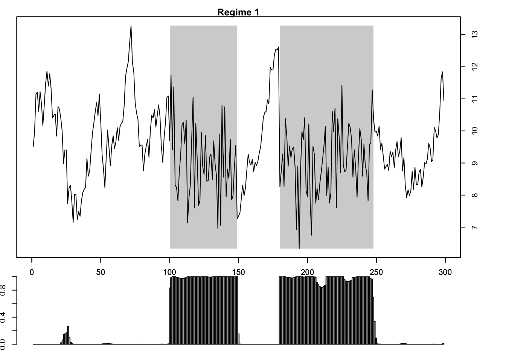

# レジーム・スイッチング・モデル


## 自己相関マルコフ・スイッチング・モデル (MSM-AR)
- パッケージ**MSwM**
- 出所: Jose A. Sanchez-Espigares and Alberto Lopez-Moreno (2018). "MSwM examples."
- サンプルデータ (example): シミュレーションにより生成
$$y_{t}=\begin{cases}
8+2x_{t}+\epsilon_{t}^{(1)} & \epsilon_{t}^{(1)}\sim N(0,1),\quad t=101:150,181:250\\
1+0.9y_{t-1}+\epsilon_{t}^{(2)} & \epsilon_{t}^{(2)}\sim N(0,0.5),\quad t=1:100,151:180,251:300
\end{cases}$$
ここで, $x_t$は外生変数 (共変量).


```r
library(MSwM)
data(example)
#vignette("examples") # マニュアル参照
plot(ts(example))
```


```r
mod <- lm(y ~ x, example)
summary(mod)
## 
## Call:
## lm(formula = y ~ x, data = example)
## 
## Residuals:
##     Min      1Q  Median      3Q     Max 
## -2.8998 -0.8429 -0.0427  0.7420  4.0337 
## 
## Coefficients:
##             Estimate Std. Error t value Pr(>|t|)    
## (Intercept)   9.0486     0.1398  64.709  < 2e-16 ***
## x             0.8235     0.2423   3.398  0.00077 ***
## ---
## Signif. codes:  0 '***' 0.001 '**' 0.01 '*' 0.05 '.' 0.1 ' ' 1
## 
## Residual standard error: 1.208 on 298 degrees of freedom
## Multiple R-squared:  0.03731,	Adjusted R-squared:  0.03408 
## F-statistic: 11.55 on 1 and 298 DF,  p-value: 0.0007701
par(mfrow = c(1, 2))
qqnorm(resid(mod)); qqline(resid(mod), col = 2); acf(resid(mod))
```


```r
par(mfrow = c(1, 1))
plot(resid(mod), type = "l"); abline(v=c(100, 150, 180, 250), lty = "dotted", col = "red")
```


→ 単回帰係数は有意. が, 残差は正規分布から乖離& 有意な自己相関が持続

## MSM-ARモデルの適合
```
- 関数msmFit(): Fitting Markov Switching Models using the EM algorithm
  - msmFit(object, k, sw, p, data, family, control)
  - k: numeric, レジーム数
  - sw: a logical vector, スイッチングする係数の指定
    ← intercept, sigmaはベクトルの両端に配置
  - p: integer, AR次数 (デフォルト値=0)
  - p>0のケース → the last values of sw have to contain the AR coefficients which have switching
  - family: モデルのクラス (It is only required when the object is a "General linear formula")
```
- 正しいレジーム数 ($k=2$), 正しいモデル構造を想定出来たものとして推定した場合:  

```r
mod.mswm <- msmFit(mod, k = 2, p = 1, sw = c(T, T, T, T), control = list(parallel = F))
summary(mod.mswm)
## Markov Switching Model
## 
## Call: msmFit(object = mod, k = 2, sw = c(T, T, T, T), p = 1, control = list(parallel = F))
## 
##        AIC     BIC    logLik
##   637.0736 693.479 -312.5368
## 
## Coefficients:
## 
## Regime 1 
## ---------
##                Estimate Std. Error t value  Pr(>|t|)    
## (Intercept)(S)   0.8417     0.3030  2.7779  0.005471 ** 
## x(S)            -0.0533     0.1397 -0.3815  0.702832    
## y_1(S)           0.9208     0.0306 30.0915 < 2.2e-16 ***
## ---
## Signif. codes:  0 '***' 0.001 '**' 0.01 '*' 0.05 '.' 0.1 ' ' 1
## 
## Residual standard error: 0.5034675
## Multiple R-squared: 0.8375
## 
## Standardized Residuals:
##           Min            Q1           Med            Q3           Max 
## -1.5153665614 -0.0906543479  0.0001873641  0.1656717255  1.2020898999 
## 
## Regime 2 
## ---------
##                Estimate Std. Error t value  Pr(>|t|)    
## (Intercept)(S)   8.6393     0.7394 11.6842 < 2.2e-16 ***
## x(S)             1.8771     0.3108  6.0396 1.545e-09 ***
## y_1(S)          -0.0569     0.0815 -0.6982    0.4851    
## ---
## Signif. codes:  0 '***' 0.001 '**' 0.01 '*' 0.05 '.' 0.1 ' ' 1
## 
## Residual standard error: 0.9339683
## Multiple R-squared: 0.2408
## 
## Standardized Residuals:
##         Min          Q1         Med          Q3         Max 
## -2.31102193 -0.03317756  0.01034139  0.04509106  2.85245598 
## 
## Transition probabilities:
##            Regime 1   Regime 2
## Regime 1 0.98499728 0.02290885
## Regime 2 0.01500272 0.97709115
par(mfrow = c(1, 2))
qqnorm(mod.mswm@Fit@error[, 1]); qqline(mod.mswm@Fit@error[, 1], col = 2); 
qqnorm(mod.mswm@Fit@error[, 2]); qqline(mod.mswm@Fit@error[, 2],col = 2); 
```


```r
plot(ts(mod.mswm@Fit@error))
```


→ 

- モデルは2つのレジームを良く検出: 共変量$x$が有意なレジーム, 1期前ラグ変数$y_{t-1}$が有意なレジームを推定.
- 状態推定確率の対角要素(同じレジームに留まる確率)は, いずれも約0.98

- レジーム#1にある状態確率の推定値 (smoothed/ filtered probabilities)

```r
par("mar" = c(1, 1, 1, 1))
plotProb(mod.mswm, which = 1)
```


- レジーム#2にある状態確率の推定値 (平滑化 (smoothed) 確率,  フィルター化 (filtered) 確率)

```r
par("mar" = c(1, 1, 1, 1))
plotProb(mod.mswm, which = 2)
```



- 指定のレジームにおける, 反応変数, 説明変数, 状態確率の推定値 (平滑化確率) の同時プロット

```r
par("mar" = c(1, 1, 1, 1))
plotReg(mod.mswm, expl = "x")
```


