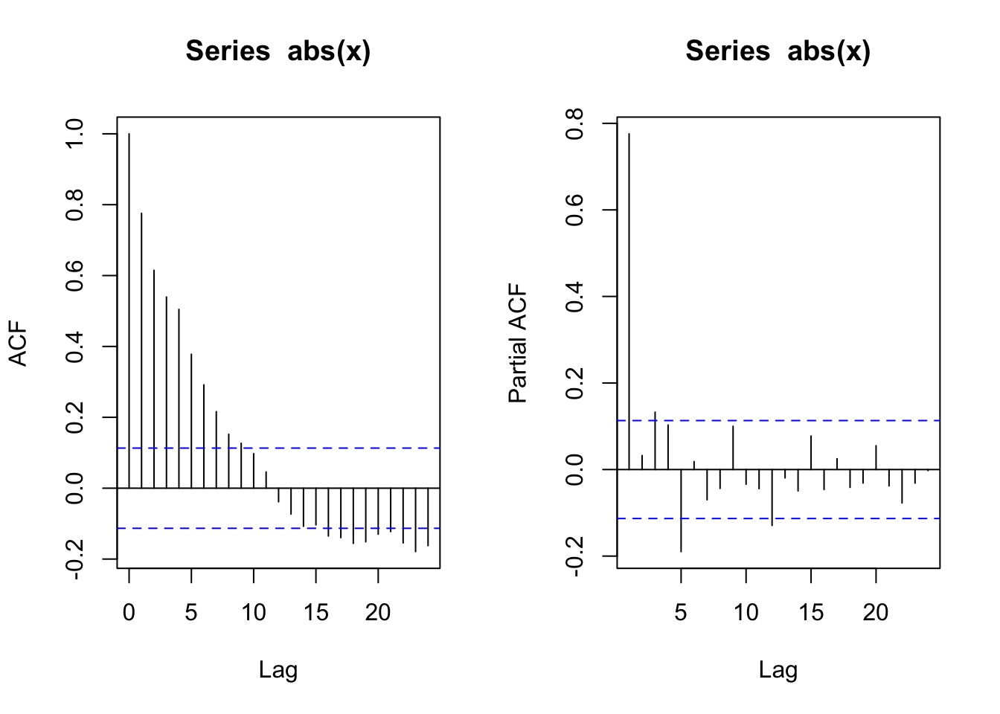
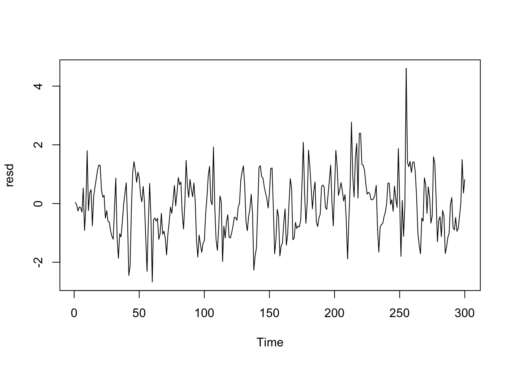

# GARCHモデル

## GARCHモデル
### GARCH(p,q)モデルのサンプルパス生成
- ボラティリティ方程式 $$ \sigma_t^2=\omega+\alpha_1 u_{t-1}^2+\cdots+\alpha_p u_{t-p}^2+\beta_1 \sigma_{t-1}^2+\cdots+\beta_q \sigma_{t-q}^2$$
- パッケージ**fGarch**
- https://www.rdocumentation.org/packages/fGarch/versions/3042.83.2/topics/garchSim

#### ARCH(p)モデル
- パラメータ設定例
  - ボラティリティ方程式 ($p=2, q=0$): $\omega=10^{-6}$ (デフォルト), $\alpha_1=0.5, \alpha_2=0.1$

```r
Seedv <- 10
Tlen <- 300
library(fGarch)
```

```
## NOTE: Packages 'fBasics', 'timeDate', and 'timeSeries' are no longer
## attached to the search() path when 'fGarch' is attached.
## 
## If needed attach them yourself in your R script by e.g.,
##         require("timeSeries")
```

```r
# ARCH(2) - use default omega and specify alpha, set beta=0!
spec <- garchSpec(model = list(alpha = c(0.5, 0.1), beta = 0))
set.seed(Seedv)
x <- garchSim(spec, n = Tlen)
plot(x)
```


```r
par(mfrow = c(1, 2))
acf(x); pacf(x)
```


```r
acf(x ^ 2); pacf(x ^ 2)
```


```r
acf(abs(x)); pacf(abs(x))
```


#### GARCH(p,q)モデル
- パラメータ設定例
  - ボラティリティ方程式 (次数$p=2,q=1$): $\omega=10^{-6}$(デフォルト), $\alpha_1=0.5, \alpha_2=0.1, \beta_1=0.35$

```r
spec <- garchSpec(model = list(alpha = c(0.5, 0.1), beta = 0.35))
set.seed(Seedv)
x <- garchSim(spec, n = Tlen)
plot(x)
```


```r
par(mfrow = c(1, 2))
acf(x); pacf(x)
```


```r
acf(x ^ 2); pacf(x ^ 2)
```


```r
acf(abs(x)); pacf(abs(x))
```


#### ARMA(p',q')-GARCH(p,q)モデル
- パラメータ設定例
  - 平均方程式 ($p'=1,q'=2$): $\phi_1=0.7,\theta_1=0.3,\theta_2=-0.3$
  - ボラティリティ方程式 ($p=1,q=1$): $\omega=10^{-6}$(デフォルト), $\alpha_1=0.5, \alpha_2=0.1, \beta_1=0.35$

```r
spec <- garchSpec(model = list(ar = 0.7, ma = c(0.3, -0.3), 
                               alpha = c(0.5, 0.1), beta = 0.35))
set.seed(Seedv)
x <- garchSim(spec, n = Tlen)
plot(x)
```


```r
par(mfrow = c(1, 2))
acf(x); pacf(x)
```


```r
acf(x ^ 2); pacf(x ^ 2)
```


```r
acf(abs(x)); pacf(abs(x))
```



## GARCHモデルの推定
- garchFit関数: 1変量ARMA-GARCHモデルを適合
  - 最尤法
  - ARMAおよびGARCHのモデル次数を引数に与える (デフォルト, GARCH(1,1))
- 参考:
  - 福地・伊藤(2011). Rによる計量経済分析. Sec.8.3
    - https://sites.google.com/site/econometricsr/
  - Tsay, Ch.4

```r
data("dem2gbp") # DEM/GBP日次対数リターン,Jan/31984〜Dec/31/1991 (1974件)
x <- dem2gbp; Tlen = nrow(dem2gbp)
ts.plot(x)
```


```r
par(mfrow = c(1, 2))
acf(x); pacf(x, main = "dem2gbp")
```


```r
acf(x ^ 2, main = "dem2gbp^2"); pacf(x ^ 2, main = "dem2gbp^2")
```


- ARCH効果の検定
  - 例. ラグ$p=5$を指定した場合

```r
library("FinTS")
```

```
## Loading required package: zoo
```

```
## 
## Attaching package: 'zoo'
```

```
## The following objects are masked from 'package:base':
## 
##     as.Date, as.Date.numeric
```

```r
ArchTest(unlist(x), lags = 5, demean = TRUE) # xは数値ベクトルであること
```

```
## 
## 	ARCH LM-test; Null hypothesis: no ARCH effects
## 
## data:  unlist(x)
## Chi-squared = 182.43, df = 5, p-value < 2.2e-16
```

→  帰無仮説 ($\alpha_1=  \ldots=\alpha_{5}=0$) を棄却

- 例. ARCH(5)モデルの適合

```r
fit.ARCH <- garchFit(formula = ~ garch(5, 0), data = x,
                    trace = FALSE, include.mean = TRUE)
summary(fit.ARCH)
```

```
## 
## Title:
##  GARCH Modelling 
## 
## Call:
##  garchFit(formula = ~garch(5, 0), data = x, include.mean = TRUE, 
##     trace = FALSE) 
## 
## Mean and Variance Equation:
##  data ~ garch(5, 0)
## <environment: 0x1233c2af8>
##  [data = x]
## 
## Conditional Distribution:
##  norm 
## 
## Coefficient(s):
##          mu        omega       alpha1       alpha2       alpha3       alpha4  
## -0.00056152   0.07923959   0.24685075   0.14579950   0.08569068   0.08462437  
##      alpha5  
##  0.12554584  
## 
## Std. Errors:
##  based on Hessian 
## 
## Error Analysis:
##          Estimate  Std. Error  t value Pr(>|t|)    
## mu     -0.0005615   0.0087236   -0.064  0.94868    
## omega   0.0792396   0.0065155   12.162  < 2e-16 ***
## alpha1  0.2468507   0.0344795    7.159 8.11e-13 ***
## alpha2  0.1457995   0.0332818    4.381 1.18e-05 ***
## alpha3  0.0856907   0.0261307    3.279  0.00104 ** 
## alpha4  0.0846244   0.0280620    3.016  0.00256 ** 
## alpha5  0.1255458   0.0286415    4.383 1.17e-05 ***
## ---
## Signif. codes:  0 '***' 0.001 '**' 0.01 '*' 0.05 '.' 0.1 ' ' 1
## 
## Log Likelihood:
##  -1118.366    normalized:  -0.5665483 
## 
## Description:
##  Thu Nov 30 17:15:05 2023 by user:  
## 
## 
## Standardised Residuals Tests:
##                                   Statistic   p-Value
##  Jarque-Bera Test   R    Chi^2  817.1076908 0.0000000
##  Shapiro-Wilk Test  R    W        0.9662238 0.0000000
##  Ljung-Box Test     R    Q(10)   10.0952896 0.4321734
##  Ljung-Box Test     R    Q(15)   17.3953461 0.2957850
##  Ljung-Box Test     R    Q(20)   19.3641366 0.4982825
##  Ljung-Box Test     R^2  Q(10)   11.9517121 0.2883012
##  Ljung-Box Test     R^2  Q(15)   20.9630142 0.1380152
##  Ljung-Box Test     R^2  Q(20)   23.9746987 0.2434991
##  LM Arch Test       R    TR^2    11.5479259 0.4826340
## 
## Information Criterion Statistics:
##      AIC      BIC      SIC     HQIC 
## 1.140189 1.160004 1.140164 1.147469
```

```r
resd = residuals(fit.ARCH, standardize = T)
par(mfcol = c(3, 1))
ts.plot(resd)
acf(resd); pacf(resd ^ 2)
```



- 例. GARCH(1,1)モデルの適合

```r
fit.GARCH <- garchFit(formula = ~ garch(1, 1), data = x,
                     trace = FALSE, include.mean = TRUE)
summary(fit.GARCH)
```

```
## 
## Title:
##  GARCH Modelling 
## 
## Call:
##  garchFit(formula = ~garch(1, 1), data = x, include.mean = TRUE, 
##     trace = FALSE) 
## 
## Mean and Variance Equation:
##  data ~ garch(1, 1)
## <environment: 0x125404268>
##  [data = x]
## 
## Conditional Distribution:
##  norm 
## 
## Coefficient(s):
##         mu       omega      alpha1       beta1  
## -0.0061903   0.0107614   0.1531341   0.8059737  
## 
## Std. Errors:
##  based on Hessian 
## 
## Error Analysis:
##         Estimate  Std. Error  t value Pr(>|t|)    
## mu     -0.006190    0.008462   -0.732 0.464447    
## omega   0.010761    0.002838    3.793 0.000149 ***
## alpha1  0.153134    0.026422    5.796  6.8e-09 ***
## beta1   0.805974    0.033381   24.144  < 2e-16 ***
## ---
## Signif. codes:  0 '***' 0.001 '**' 0.01 '*' 0.05 '.' 0.1 ' ' 1
## 
## Log Likelihood:
##  -1106.608    normalized:  -0.5605916 
## 
## Description:
##  Thu Nov 30 17:15:05 2023 by user:  
## 
## 
## Standardised Residuals Tests:
##                                    Statistic   p-Value
##  Jarque-Bera Test   R    Chi^2  1059.8512562 0.0000000
##  Shapiro-Wilk Test  R    W         0.9622848 0.0000000
##  Ljung-Box Test     R    Q(10)    10.1214138 0.4299066
##  Ljung-Box Test     R    Q(15)    17.0434914 0.3162711
##  Ljung-Box Test     R    Q(20)    19.2976364 0.5025619
##  Ljung-Box Test     R^2  Q(10)     9.0625558 0.5261773
##  Ljung-Box Test     R^2  Q(15)    16.0776904 0.3769072
##  Ljung-Box Test     R^2  Q(20)    17.5071550 0.6198388
##  LM Arch Test       R    TR^2      9.7712175 0.6360237
## 
## Information Criterion Statistics:
##      AIC      BIC      SIC     HQIC 
## 1.125236 1.136559 1.125228 1.129396
```

```r
coef(fit.GARCH)
```

```
##           mu        omega       alpha1        beta1 
## -0.006190315  0.010761384  0.153134057  0.805973750
```

```r
resd <- residuals(fit.GARCH, standardize = T)  # 標準化残差
tail(resd, 10)
```

```
##  [1]  1.39586970 -0.78568123 -0.11839598  0.34278825 -1.35175440 -1.06335162
##  [7] -0.06248781 -0.30590821 -0.65122452  1.57675562
```

```r
par(mfcol = c(3, 1))
ts.plot(resd)
acf(resd); pacf(resd ^ 2)
```


- → 残差の系列相関は概ね消滅, 非正規性残る→ 改善余地有り
  - Tsay, Ch.4を参照のこと

- ボラティリティ推定値 (内挿予測)

```r
# ボラティリティ推定値
vola <- volatility(fit.GARCH)  # 標準偏差表示
tail(vola, 10)
```

```
##  [1] 0.3659949 0.3983608 0.3919991 0.3673416 0.3492097 0.3783784 0.3885138
##  [8] 0.3640161 0.3456269 0.3388205
```

```r
par(mfcol = c(2, 1))
ts.plot(x); ts.plot(vola)
```


- $l$期先予測 (外挿予測)

```r
# n.ahead(=20)期先予測
# nx:表示する観測データ数
par(mfrow = c(1,1))
# 収益率系列xの予測 (& 95%信頼区間) 
x.pred <- predict(fit.GARCH, n.ahead = 20, plot = TRUE, conf = .95, nx = 300) 
```


```r
# ボラティリティのl期先予測値 (標準偏差表示)
(v.pred <- x.pred[, "standardDeviation"])
```

```
##  [1] 0.3833961 0.3895421 0.3953471 0.4008358 0.4060303 0.4109507 0.4156151
##  [8] 0.4200402 0.4242410 0.4282312 0.4320237 0.4356301 0.4390611 0.4423269
## [15] 0.4454366 0.4483989 0.4512218 0.4539128 0.4564788 0.4589264
```

```r
# プロット (実績値&予測値)
v.pred <- c(vola[(Tlen - 99):Tlen], v.pred) #; length(v.pred)
plot(v.pred, type = "l", ylab = "vola")
abline(v = 101, col = "red", lty = "dotted")
```


- GARCH(1,1)モデルの$l$-期先ボラティリティ予測値
  - $T$: データ期間 (モデル推定に使用) の最終時点 (予測の起点)
  - $u_T, \sigma_T^2$: モデル適合による時点$T$における推定値 (所与)
  - $l=1$のケース: $$\sigma_T^2 (1) = \omega + \alpha_1 u_T^2 + \beta_1 \sigma_T^2$$
  - $l\ge2$のケース: $$\sigma_T^2 (l) = \omega \frac{1-(\alpha_1 + \beta_1)^{l-1}}{1-(\alpha_1 + \beta_1)} + (\alpha_1 + \beta_1)^{l-1} \sigma_T^2 (1)$$
  - 参考: Tsay, pp.200-201

- 代替パッケージ: **rugarch**

```r
library(rugarch)
```

```
## Loading required package: parallel
```

```
## 
## Attaching package: 'rugarch'
```

```
## The following object is masked from 'package:stats':
## 
##     sigma
```

```r
spec <- ugarchspec(variance.model = list(garchOrder = c(1, 1))) # モデルの特定
fit.GARCH <- ugarchfit(data = x, spec = spec)                   # モデルの適合
(x.pred <- ugarchforecast(fitORspec = fit.GARCH, n.ahead = 20)) #  収益率系列, ボラティリティの予測 (→ x.predに2系列を格納)
```

```
## 
## *------------------------------------*
## *       GARCH Model Forecast         *
## *------------------------------------*
## Model: sGARCH
## Horizon: 20
## Roll Steps: 0
## Out of Sample: 0
## 
## 0-roll forecast [T0=1975-05-29]:
##         Series  Sigma
## T+1   0.027201 0.3850
## T+2  -0.019745 0.3915
## T+3  -0.000501 0.3976
## T+4  -0.008390 0.4034
## T+5  -0.005156 0.4088
## T+6  -0.006482 0.4139
## T+7  -0.005938 0.4187
## T+8  -0.006161 0.4233
## T+9  -0.006070 0.4276
## T+10 -0.006107 0.4317
## T+11 -0.006092 0.4356
## T+12 -0.006098 0.4393
## T+13 -0.006095 0.4427
## T+14 -0.006096 0.4460
## T+15 -0.006096 0.4492
## T+16 -0.006096 0.4522
## T+17 -0.006096 0.4550
## T+18 -0.006096 0.4577
## T+19 -0.006096 0.4603
## T+20 -0.006096 0.4627
```

```r
# 別々に表示
#fitted(x.pred)            # 収益率系列の予測値
#x.pred@forecast$seriesFor  # 同
sigma(x.pred)             # ボラティリティ(条件付標準偏差)の予測値
```

```
##      1975-05-29
## T+1   0.3850252
## T+2   0.3915069
## T+3   0.3976058
## T+4   0.4033513
## T+5   0.4087695
## T+6   0.4138840
## T+7   0.4187159
## T+8   0.4232846
## T+9   0.4276075
## T+10  0.4317004
## T+11  0.4355781
## T+12  0.4392539
## T+13  0.4427400
## T+14  0.4460480
## T+15  0.4491882
## T+16  0.4521704
## T+17  0.4550037
## T+18  0.4576965
## T+19  0.4602565
## T+20  0.4626911
```

```r
#x.pred@forecast$sigmaFor # 同
```
