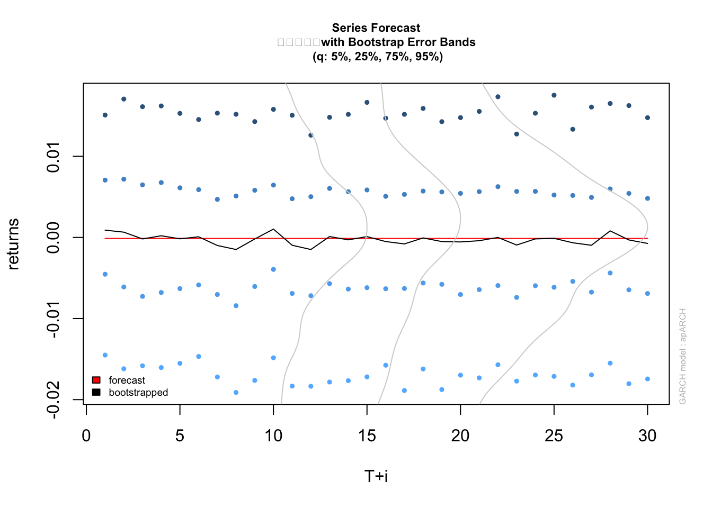
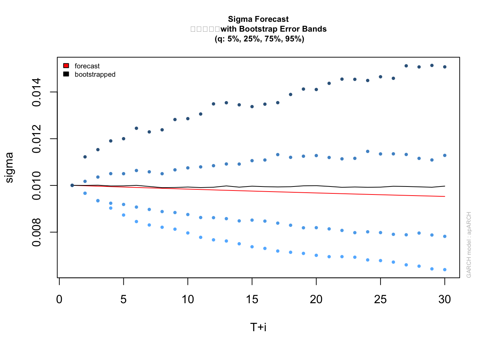

<!-- # GARCHモデル(2) -->

## GARCHモデルのバリエーション
- パッケージ**rugarch**
```
- ugarchspec(): 一変量GARCHモデルの特定 (specification)
  - modelの選択肢: “sGARCH”, “fGARCH”, “eGARCH”, “gjrGARCH”, “apARCH”, “iGARCH”, “csGARCH”
  - submodelの選択肢(model=“fGARCH”の場合): “GARCH”, “TGARCH”, “AVGARCH”, “NGARCH”, “NAGARCH”, “APARCH”, “GJRGARCH”, “ALL- GARCH”.
  - distribution.mpdel(イノベーションに用いる条件付確率密度)の選択肢: "norm", "snorm"(skew-normal), "std"(student t), "sstd"(skew-student), "ged"(generalized error), "sged"(skew-ged), "nig"(normal inverse gaussian), "ghyp"(Generalized Hyperbolic), "jsu"(Johnson's SU).
- ugarchfit(): 一変量GARCHモデルの適合
  - solverの選択肢: “nlminb”, “solnp”, “lbfgs”, “gosolnp”, “nloptr” or “hybrid”
- 注): 本パッケージでは, "NAGARCH (Nonlinear Asymmetric GARCH)", "NGARCH (Nonlinear GARCH)"である. Tsay, 4.12で紹介されているEngle and Ng (1993)の"NGARCH (Nonsymmetric GARCH)"は, 前者に対応する.  
```
- https://www.rdocumentation.org/packages/rugarch/versions/1.4-4

- データセット: spyreal
```
- SPDR Standard and Poors 500 Open-Close Daily Return and Realized Kernel Volatility
  - SPDR(スパイダー) S\&P500インデックス: 始値-終値(open-close)リターン, 実現カーネル(realized kernel)ボラティリティ.
  - 期間: 2002-01-02 〜 2008-08-29
  - Reference: Hansen, P. R., Huang, Z., and Shek, H. H. (2012). Realized GARCH: a joint model for returns and realized measures of volatility. Journal of Applied Econometrics, 27(6), 877–906.
```
  

```r
library(rugarch)
```

```
## Loading required package: parallel
```

```
## 
## Attaching package: 'rugarch'
```

```
## The following object is masked from 'package:stats':
## 
##     sigma
```

```r
data(spyreal)
head(spyreal)
```

```
##                   SPY_OC      SPY_RK
## 2002-01-02  0.0051151007 0.010044750
## 2002-01-03  0.0101514981 0.005342828
## 2002-01-04  0.0009369278 0.007978535
## 2002-01-07 -0.0097245499 0.005772834
## 2002-01-08 -0.0033463500 0.006452759
## 2002-01-09 -0.0078317023 0.007684824
```

### IARCH(1,1)

```r
spec1 <- ugarchspec(
		variance.model = list(model = "iGARCH", garchOrder = c(1, 1)), 
		mean.model = list(armaOrder = c(0, 0), include.mean = TRUE),  
		distribution.model = "norm", fixed.pars = list(omega = 0))
# 平均方程式にARMA(1,1)の場合: mean.model=list(armaOrder = c(1, 1)
mod_igarch <- ugarchfit(spec = spec1, data = spyreal[, 1], solver = 'hybrid')
mod_igarch
```

```
## 
## *---------------------------------*
## *          GARCH Model Fit        *
## *---------------------------------*
## 
## Conditional Variance Dynamics 	
## -----------------------------------
## GARCH Model	: iGARCH(1,1)
## Mean Model	: ARFIMA(0,0,0)
## Distribution	: norm 
## 
## Optimal Parameters
## ------------------------------------
##         Estimate  Std. Error  t value Pr(>|t|)
## mu     -0.000028    0.000177 -0.15908   0.8736
## omega   0.000000          NA       NA       NA
## alpha1  0.043186    0.006677  6.46763   0.0000
## beta1   0.956814          NA       NA       NA
## 
## Robust Standard Errors:
##         Estimate  Std. Error  t value Pr(>|t|)
## mu     -0.000028    0.000212 -0.13345 0.893837
## omega   0.000000          NA       NA       NA
## alpha1  0.043186    0.010297  4.19426 0.000027
## beta1   0.956814          NA       NA       NA
## 
## LogLikelihood : 5630.331 
## 
## Information Criteria
## ------------------------------------
##                     
## Akaike       -6.7730
## Bayes        -6.7664
## Shibata      -6.7730
## Hannan-Quinn -6.7705
## 
## Weighted Ljung-Box Test on Standardized Residuals
## ------------------------------------
##                         statistic  p-value
## Lag[1]                      5.479 0.019252
## Lag[2*(p+q)+(p+q)-1][2]     8.207 0.005702
## Lag[4*(p+q)+(p+q)-1][5]    10.148 0.008436
## d.o.f=0
## H0 : No serial correlation
## 
## Weighted Ljung-Box Test on Standardized Squared Residuals
## ------------------------------------
##                         statistic p-value
## Lag[1]                    0.07752  0.7807
## Lag[2*(p+q)+(p+q)-1][5]   0.87181  0.8880
## Lag[4*(p+q)+(p+q)-1][9]   1.85043  0.9221
## d.o.f=2
## 
## Weighted ARCH LM Tests
## ------------------------------------
##             Statistic Shape Scale P-Value
## ARCH Lag[3]    0.9841 0.500 2.000  0.3212
## ARCH Lag[5]    1.3879 1.440 1.667  0.6223
## ARCH Lag[7]    2.0139 2.315 1.543  0.7144
## 
## Nyblom stability test
## ------------------------------------
## Joint Statistic:  0.1404
## Individual Statistics:              
## mu     0.02297
## alpha1 0.08852
## 
## Asymptotic Critical Values (10% 5% 1%)
## Joint Statistic:     	 0.61 0.749 1.07
## Individual Statistic:	 0.35 0.47 0.75
## 
## Sign Bias Test
## ------------------------------------
##                    t-value   prob sig
## Sign Bias          1.24939 0.2117    
## Negative Sign Bias 0.07504 0.9402    
## Positive Sign Bias 0.78468 0.4328    
## Joint Effect       5.84998 0.1191    
## 
## 
## Adjusted Pearson Goodness-of-Fit Test:
## ------------------------------------
##   group statistic p-value(g-1)
## 1    20     40.09    0.0031807
## 2    30     58.61    0.0009158
## 3    40     63.78    0.0073916
## 4    50     83.13    0.0016808
## 
## 
## Elapsed time : 0.01861095
```

### GJR-GARCH(1,1)

```r
spec2 <- ugarchspec(
		variance.model = list(model = "gjrGARCH", garchOrder = c(1, 1)), 
		mean.model = list(armaOrder = c(0, 0), include.mean = TRUE),  
		distribution.model = "norm")
mod_gjr <- ugarchfit(spec = spec2, data = spyreal[, 1], solver = 'hybrid')
mod_gjr
```

```
## 
## *---------------------------------*
## *          GARCH Model Fit        *
## *---------------------------------*
## 
## Conditional Variance Dynamics 	
## -----------------------------------
## GARCH Model	: gjrGARCH(1,1)
## Mean Model	: ARFIMA(0,0,0)
## Distribution	: norm 
## 
## Optimal Parameters
## ------------------------------------
##         Estimate  Std. Error    t value Pr(>|t|)
## mu     -0.000235    0.000166  -1.410892  0.15828
## omega   0.000001    0.000001   1.071102  0.28412
## alpha1  0.000000    0.001536   0.000029  0.99998
## beta1   0.946145    0.009443 100.195459  0.00000
## gamma1  0.090962    0.015265   5.958717  0.00000
## 
## Robust Standard Errors:
##         Estimate  Std. Error   t value Pr(>|t|)
## mu     -0.000235    0.000398 -0.590324 0.554973
## omega   0.000001    0.000003  0.176169 0.860161
## alpha1  0.000000    0.067909  0.000001 0.999999
## beta1   0.946145    0.079992 11.827974 0.000000
## gamma1  0.090962    0.024658  3.688997 0.000225
## 
## LogLikelihood : 5665.74 
## 
## Information Criteria
## ------------------------------------
##                     
## Akaike       -6.8120
## Bayes        -6.7957
## Shibata      -6.8120
## Hannan-Quinn -6.8059
## 
## Weighted Ljung-Box Test on Standardized Residuals
## ------------------------------------
##                         statistic  p-value
## Lag[1]                      5.697 0.016993
## Lag[2*(p+q)+(p+q)-1][2]     7.483 0.008869
## Lag[4*(p+q)+(p+q)-1][5]     8.806 0.018531
## d.o.f=0
## H0 : No serial correlation
## 
## Weighted Ljung-Box Test on Standardized Squared Residuals
## ------------------------------------
##                         statistic p-value
## Lag[1]                      3.883 0.04878
## Lag[2*(p+q)+(p+q)-1][5]     5.237 0.13523
## Lag[4*(p+q)+(p+q)-1][9]     6.736 0.22230
## d.o.f=2
## 
## Weighted ARCH LM Tests
## ------------------------------------
##             Statistic Shape Scale P-Value
## ARCH Lag[3]    0.1657 0.500 2.000  0.6840
## ARCH Lag[5]    0.4472 1.440 1.667  0.8991
## ARCH Lag[7]    1.9375 2.315 1.543  0.7306
## 
## Nyblom stability test
## ------------------------------------
## Joint Statistic:  292.4172
## Individual Statistics:               
## mu      0.04326
## omega  55.96148
## alpha1  0.22053
## beta1   0.17934
## gamma1  0.19934
## 
## Asymptotic Critical Values (10% 5% 1%)
## Joint Statistic:     	 1.28 1.47 1.88
## Individual Statistic:	 0.35 0.47 0.75
## 
## Sign Bias Test
## ------------------------------------
##                    t-value   prob sig
## Sign Bias           0.9606 0.3369    
## Negative Sign Bias  0.8427 0.3995    
## Positive Sign Bias  0.6544 0.5129    
## Joint Effect        2.4783 0.4792    
## 
## 
## Adjusted Pearson Goodness-of-Fit Test:
## ------------------------------------
##   group statistic p-value(g-1)
## 1    20     37.13     0.007635
## 2    30     53.67     0.003532
## 3    40     68.35     0.002521
## 4    50     83.07     0.001704
## 
## 
## Elapsed time : 0.108568
```

### APARCH

```r
spec3 <- ugarchspec(
		variance.model = list(model = "apARCH", garchOrder = c(1, 1)), 
		mean.model = list(armaOrder = c(0, 0), include.mean = TRUE),  
		distribution.model = "std")
#	一般誤差分布使用の場合: distribution.model="ged")
mod_aparch <- ugarchfit(spec = spec3, data = spyreal[, 1], solver = 'hybrid')
mod_aparch
```

```
## 
## *---------------------------------*
## *          GARCH Model Fit        *
## *---------------------------------*
## 
## Conditional Variance Dynamics 	
## -----------------------------------
## GARCH Model	: apARCH(1,1)
## Mean Model	: ARFIMA(0,0,0)
## Distribution	: std 
## 
## Optimal Parameters
## ------------------------------------
##         Estimate  Std. Error    t value Pr(>|t|)
## mu     -0.000125    0.000172   -0.72685 0.467320
## omega   0.000027    0.000032    0.84129 0.400187
## alpha1  0.041590    0.012433    3.34503 0.000823
## beta1   0.951150    0.008932  106.49292 0.000000
## gamma1  1.000000    0.000767 1303.38424 0.000000
## delta   1.226669    0.100403   12.21741 0.000000
## shape  15.225663    4.931263    3.08758 0.002018
## 
## Robust Standard Errors:
##         Estimate  Std. Error  t value Pr(>|t|)
## mu     -0.000125         NaN      NaN      NaN
## omega   0.000027         NaN      NaN      NaN
## alpha1  0.041590         NaN      NaN      NaN
## beta1   0.951150         NaN      NaN      NaN
## gamma1  1.000000         NaN      NaN      NaN
## delta   1.226669         NaN      NaN      NaN
## shape  15.225663         NaN      NaN      NaN
## 
## LogLikelihood : 5675.851 
## 
## Information Criteria
## ------------------------------------
##                     
## Akaike       -6.8217
## Bayes        -6.7989
## Shibata      -6.8218
## Hannan-Quinn -6.8133
## 
## Weighted Ljung-Box Test on Standardized Residuals
## ------------------------------------
##                         statistic  p-value
## Lag[1]                      5.897 0.015171
## Lag[2*(p+q)+(p+q)-1][2]     7.942 0.006704
## Lag[4*(p+q)+(p+q)-1][5]     9.441 0.012796
## d.o.f=0
## H0 : No serial correlation
## 
## Weighted Ljung-Box Test on Standardized Squared Residuals
## ------------------------------------
##                         statistic p-value
## Lag[1]                      4.402  0.0359
## Lag[2*(p+q)+(p+q)-1][5]     5.693  0.1061
## Lag[4*(p+q)+(p+q)-1][9]     7.269  0.1777
## d.o.f=2
## 
## Weighted ARCH LM Tests
## ------------------------------------
##             Statistic Shape Scale P-Value
## ARCH Lag[3]   0.03822 0.500 2.000  0.8450
## ARCH Lag[5]   0.17688 1.440 1.667  0.9709
## ARCH Lag[7]   1.85908 2.315 1.543  0.7471
## 
## Nyblom stability test
## ------------------------------------
## Joint Statistic:  NaN
## Individual Statistics:              
## mu     0.06082
## omega  0.10137
## alpha1 0.19391
## beta1  0.19336
## gamma1     NaN
## delta  0.12311
## shape  0.58877
## 
## Asymptotic Critical Values (10% 5% 1%)
## Joint Statistic:     	 1.69 1.9 2.35
## Individual Statistic:	 0.35 0.47 0.75
## 
## Sign Bias Test
## ------------------------------------
##                    t-value   prob sig
## Sign Bias           0.9891 0.3227    
## Negative Sign Bias  1.4526 0.1465    
## Positive Sign Bias  0.8096 0.4183    
## Joint Effect        3.4471 0.3277    
## 
## 
## Adjusted Pearson Goodness-of-Fit Test:
## ------------------------------------
##   group statistic p-value(g-1)
## 1    20     29.34     0.060884
## 2    30     41.07     0.067923
## 3    40     46.78     0.183213
## 4    50     81.80     0.002274
## 
## 
## Elapsed time : 0.883219
```

- 係数の推定値

```r
coef(mod_aparch)
```

```
##            mu         omega        alpha1         beta1        gamma1 
## -1.252560e-04  2.654268e-05  4.159036e-02  9.511501e-01  1.000000e+00 
##         delta         shape 
##  1.226669e+00  1.522566e+01
```

```r
#infocriteria(mod_aparch)["Akaike",]
infocriteria(mod_aparch)
```

```
##                       
## Akaike       -6.821722
## Bayes        -6.798912
## Shibata      -6.821757
## Hannan-Quinn -6.813268
```

- 推定されたボラティリティ系列

```r
#dat <- spyreal[, 1]
dat <- spyreal
dat$GARCH <- sigma(mod_aparch)
```


- プロット

```r
library(ggplot2)
library(xts)		#library(zoo)
autoplot(dat)		# 時系列プロット
# ボラティリティ推定値同士の比較
plot(as.vector(sqrt(dat$SPY_RK)), as.vector(dat$GARCH))
#plot(as.vector(dat$SPY_RK), as.vector(dat$GARCH))		
```

- Bootstrap法に基づく予測
  - GARCHモデルによるn期先予測には2種類の不確実性: 予測確率分布に起因するもの & パラメータ推定誤差に起因するもの.
  - Bootstrap法: 適合GARCHモデルの経験分布よりイノベーションをリサンプルすることで, 将来の時系列(series)と標準偏差(sigma)を生成.
  - “full”法(Pascual et al (2006)): パラメータのシミュレーション分布を発生させることで, パラメータ不確実性を考慮(実行時間がかかる). 
  - “partial”法: 分布の不確実性のみ考慮 

```r
dat.pred <- ugarchboot(mod_aparch, n.ahead = 30, method = "Partial")
#plot(dat.pred, which = "all")
# 時系列(リターン)
plot(dat.pred, which = 2)
```



```r
# 標準偏差(ボラティリティ)
plot(dat.pred, which = 3)
```



```r
# which=1は, "full"法のみ (Parameter Density Plots生成)
dat.pred
```

```
## 
## *-----------------------------------*
## *     GARCH Bootstrap Forecast      *
## *-----------------------------------*
## Model : apARCH
## n.ahead : 30
## Bootstrap method:  partial
## Date (T[0]): 2008-08-29
## 
## Series (summary):
##            min      q.25      mean     q.75      max forecast[analytic]
## t+1  -0.055262 -0.005764 -0.000187 0.005750 0.030391          -0.000125
## t+2  -0.038297 -0.006844  0.000061 0.006573 0.028299          -0.000125
## t+3  -0.036241 -0.007133 -0.000602 0.005950 0.036360          -0.000125
## t+4  -0.031457 -0.006337 -0.000118 0.006301 0.030326          -0.000125
## t+5  -0.028510 -0.007150  0.000062 0.006484 0.039269          -0.000125
## t+6  -0.036443 -0.006302  0.000095 0.006515 0.046772          -0.000125
## t+7  -0.036293 -0.006744 -0.000378 0.005479 0.034738          -0.000125
## t+8  -0.032886 -0.006599 -0.000726 0.004936 0.029578          -0.000125
## t+9  -0.040465 -0.005505  0.000626 0.006583 0.038580          -0.000125
## t+10 -0.034318 -0.007223 -0.000627 0.006010 0.052561          -0.000125
## .....................
## 
## Sigma (summary):
##           min    q0.25     mean    q0.75      max forecast[analytic]
## t+1  0.010004 0.010004 0.010004 0.010004 0.010004           0.010004
## t+2  0.009665 0.009665 0.009981 0.010060 0.015776           0.009985
## t+3  0.009341 0.009341 0.009958 0.010243 0.018470           0.009967
## t+4  0.009030 0.009194 0.009983 0.010386 0.017785           0.009948
## t+5  0.008733 0.009016 0.009955 0.010541 0.017128           0.009930
## t+6  0.008447 0.008967 0.009947 0.010590 0.017770           0.009912
## t+7  0.008174 0.008906 0.009938 0.010631 0.017114           0.009894
## t+8  0.007911 0.008805 0.009935 0.010689 0.016484           0.009877
## t+9  0.007660 0.008738 0.009940 0.010829 0.017070           0.009859
## t+10 0.007428 0.008679 0.009896 0.010755 0.016442           0.009842
## .....................
```
