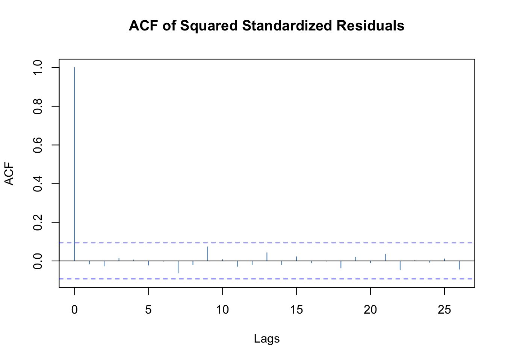

<!-- # GARCHモデル(3) -->

<!---
TH(120923): Tsay教科書から乖離するが, web一般公開するなら,
関数は別のパッケージのものに変えた方が良い
出来れば, 分析データセットも!
再現性, Tsayのホームページから直接読み込む?
######################################################
# 出所: Tsay, Ch4より抜粋（適宜, 補足説明挿入, または修正)
# 出所: http://faculty.chicagobooth.edu/ruey.tsay/teaching/introTS/
######################################################
--->


## GARCHモデル: データ分析例 (Tsay, Ch4)
- 出所: http://faculty.chicagobooth.edu/ruey.tsay/teaching/introTS/ (一部改変)


<!---
cf. RRRR, pp.123-124, p.91
# library(foreign)
# Reading and writing data stored by some versions of 'Epi Info', 'Minitab', 'S', 'SAS', 'SPSS', 'Stata', 'Systat', 'Weka', and for reading and writing some 'dBase' files.
--->

### 必要な関数やデータセットの入手
- 教科書ホームページからのRコードへの直接の読み込みの方法

```r
# 教科書著者(Tsay)の関数
fctns <- c("igarch.r", "garchm.r", "egarch.r", "ngarch.r", "tgarch11.r", "vold2m.r")
url_home <- "https://faculty.chicagobooth.edu/-/media/faculty/ruey-s-tsay/teaching/introts/"
for (fct in fctns) {
  url_tmp <- file.path(url_home, fct)
  source(url_tmp)
}
```


```r
# データセット
# 単一テキストファイルの入手
#library(rio)
#url_tmp <- "https://faculty.chicagobooth.edu/-/media/faculty/ruey-s-tsay/teaching/introts/d-spy-0111.txt"
#rio::import(url_tmp)

# 複数データセットの入った圧縮フォルダ(*.zip)からのデータセット入手
url_tmp <- "https://faculty.chicagobooth.edu/-/media/faculty/ruey-s-tsay/teaching/introts/ch4data.zip"
tmp <- tempfile()
tmp2 <- tempfile()
download.file(url_tmp, tmp)
unzip(tmp, exdir = tmp2)
dir(tmp2, recursive = T)
## [1] "d-pg-0111.txt"    "d-sp58010.txt"    "d-spy-0111.txt"   "d-useu9910.txt"  
## [5] "m-ibmsp6709.txt"  "m-intcsp7309.txt" "m-ko-6111.txt"    "m-sp56710.txt"
setwd(tmp2)
unlink(tmp)
```


### Integrated GARCH モデル
- Tsay 4.7, pp.211--212

```
Igarch(): Estimation of a Gaussian IGARCH(1,1) model.
- Igarch(rtn, include.mean = F, volcnt = F)
  - rtn: return series
  - include.mean: flag for the constant in the mean equation.
  - volcnt: flag for the constant term of the volatility equation.
```


```r
# source("Igarch.R")
#
da <- read.table("m-intcsp7309.txt", header = T)
head(da)						# monthly returns of Intel & S&P, Jan73--Dec09
##       date      intc        sp
## 1 19730131  0.010050 -0.017111
## 2 19730228 -0.139303 -0.037490
## 3 19730330  0.069364 -0.001433
## 4 19730430  0.086486 -0.040800
## 5 19730531 -0.104478 -0.018884
## 6 19730629  0.133333 -0.006575
intc <- log(da$intc + 1)		# monthly log-returns of Intel
```


```r
#mm <- Igarch(intc, include.mean = T, volcnt = T)	# --> エラー
#mm <- Igarch(intc, include.mean = T)	# --> mu, beta
#mm <- Igarch(intc, volcnt = T)		# --> omega, beta
mm <- Igarch(intc)	# --> beta
## Estimates:  0.9217433 
## Maximized log-likehood:  -301.412 
## 
## Coefficient(s):
##       Estimate  Std. Error  t value   Pr(>|t|)    
## beta 0.9217433   0.0155534  59.2633 < 2.22e-16 ***
## ---
## Signif. codes:  0 '***' 0.001 '**' 0.01 '*' 0.05 '.' 0.1 ' ' 1
names(mm)
## [1] "par"        "volatility"
mm$par	# --> beta
##      beta 
## 0.9217433
head(mm$volatility)
## [1] 0.1275742 0.1225127 0.1248833 0.1213562 0.1187993 0.1181597
```


```r
summary(mm)
##            Length Class  Mode   
## par          1    -none- numeric
## volatility 444    ts     numeric
```

- --> 教科書の記載と出力が相違(??)


```r
plot(mm$vola)
```


### GARCH-M モデル
- Tsay 4.8, pp.213--214
```
garchM(): Estimation of a Gaussian GARCH(1, 1)-M model.
- The program uses GARCH(1, 1) results as initial values.
- garchM(rtn, type = 1)
  - rtn: return series
  - type = 1 for Variance-in-mean
  -      = 2 for volatility-in-mean
  -      = 3 for log(variance)-in-mean
```


```r
# source("garchM.R") # Compile the script
y <- intc * 100  # Intel stock returns in percentages
garchM(y)
## Maximized log-likehood:  -1731.983 
## 
## Coefficient(s):
##         Estimate  Std. Error  t value   Pr(>|t|)    
## mu    0.07760995  1.33185168  0.05827  0.9535318    
## gamma 0.00794320  0.00925126  0.85861  0.3905577    
## omega 9.45891460  3.94127823  2.39996  0.0163968 *  
## alpha 0.08761597  0.02673487  3.27722  0.0010484 ** 
## beta  0.84933817  0.03949061 21.50734 < 2.22e-16 ***
## ---
## Signif. codes:  0 '***' 0.001 '**' 0.01 '*' 0.05 '.' 0.1 ' ' 1
```

- --> 教科書の記載と出力が相違(??)
  - リスクプレミアム(gamma), 有意でない


```r
garchM(y, type = 2)
garchM(y, type = 3)
## 注: (最適化にnlminb()使用) 実行時間かかる
```
- --> 通常のGARCH(1,1)へ
  - #> library(fGarch)
  - #> fGarch::garchFit(~ garch(1, 1), data = y, trace = F)


```r
#sp5 <- scan(file = "sp500.txt")	# <-- データ無. 誤植?
da <- read.table("m-intcsp7309.txt", header = T)
# <-- 代わりに使用. --> 教科書と結果が異なる
#head(da)						# monthly returns of Intel & S&P, Jan73--Dec09
#da <- read.table("m-ibmsp-2611.txt", header = T)
#da <- da[da$data< = 20091231, ]
#head(da)						# monthly returns of IBM & S&P, Jan26--Sep11
sp5 <- log(da$sp + 1)		# monthly log-returns of S&P
#
library(fGarch)
sp5 <- sp5 * 100
m2 <- fGarch::garchFit(~ 1 + garch(1, 1), data = sp5, trace = F)
summary(m2)
## 
## Title:
##  GARCH Modelling 
## 
## Call:
##  fGarch::garchFit(formula = ~1 + garch(1, 1), data = sp5, trace = F) 
## 
## Mean and Variance Equation:
##  data ~ 1 + garch(1, 1)
## <environment: 0x11edfa510>
##  [data = sp5]
## 
## Conditional Distribution:
##  norm 
## 
## Coefficient(s):
##      mu    omega   alpha1    beta1  
## 0.56091  0.72752  0.11733  0.85910  
## 
## Std. Errors:
##  based on Hessian 
## 
## Error Analysis:
##         Estimate  Std. Error  t value Pr(>|t|)    
## mu       0.56091     0.18951    2.960 0.003078 ** 
## omega    0.72752     0.45322    1.605 0.108447    
## alpha1   0.11733     0.03157    3.717 0.000202 ***
## beta1    0.85910     0.03023   28.415  < 2e-16 ***
## ---
## Signif. codes:  0 '***' 0.001 '**' 0.01 '*' 0.05 '.' 0.1 ' ' 1
## 
## Log Likelihood:
##  -1289.671    normalized:  -2.904663 
## 
## Description:
##  Thu Dec 21 22:47:34 2023 by user:  
## 
## 
## Standardised Residuals Tests:
##                                 Statistic p-Value     
##  Jarque-Bera Test   R    Chi^2  175.7289  0           
##  Shapiro-Wilk Test  R    W      0.9655541 1.058946e-08
##  Ljung-Box Test     R    Q(10)  10.2148   0.4218546   
##  Ljung-Box Test     R    Q(15)  12.76468  0.6204685   
##  Ljung-Box Test     R    Q(20)  15.32494  0.7575226   
##  Ljung-Box Test     R^2  Q(10)  5.082012  0.8856326   
##  Ljung-Box Test     R^2  Q(15)  6.778888  0.9634974   
##  Ljung-Box Test     R^2  Q(20)  7.665347  0.9938604   
##  LM Arch Test       R    TR^2   5.295219  0.9473846   
## 
## Information Criterion Statistics:
##      AIC      BIC      SIC     HQIC 
## 5.827345 5.864244 5.827184 5.841896
```


|       |  Estimate|  Std. Error|   t value| Pr(>&#124;t&#124;)|
|:------|---------:|-----------:|---------:|------------------:|
|mu     | 0.5609132|   0.1895067|  2.959859|          0.0030778|
|omega  | 0.7275158|   0.4532207|  1.605213|          0.1084469|
|alpha1 | 0.1173334|   0.0315668|  3.716989|          0.0002016|
|beta1  | 0.8590999|   0.0302342| 28.414854|          0.0000000|

- --> GARCH(1,1), $\alpha_1,\beta_1$とも (5%) 有意.


```r
plot(m2, which = 1:13)
```



- --> モデル診断,  正規性を除き, データによく適合


```r
garchM(sp5)
## Maximized log-likehood:  -1289.449 
## 
## Coefficient(s):
##        Estimate  Std. Error  t value   Pr(>|t|)    
## mu    0.3467741   0.3849340  0.90087 0.36765941    
## gamma 0.0122469   0.0188799  0.64867 0.51655173    
## omega 0.7612141   0.4796083  1.58716 0.11247694    
## alpha 0.1163726   0.0317729  3.66264 0.00024963 ***
## beta  0.8581959   0.0308425 27.82511 < 2.22e-16 ***
## ---
## Signif. codes:  0 '***' 0.001 '**' 0.01 '*' 0.05 '.' 0.1 ' ' 1
```
- --> リスクプレミアム (gamma), 有意でない (5%水準)
  - --> GARCH(1,1)を選択せよ


### Exponential GARCH Model
- Tsay 4.9, pp.218--220
```
Egarch(): Estimation of an EGARCH(1, 1) model. Assume normal innovations
- Egarch(rtn)
```


```r
# source("Egarch.R") # Compile R script
da <- read.table("m-ibmsp6709.txt", header = T) # Load data
dim(da) # Check sample size of the data
## [1] 516   3
ibm <- log(da$ibm + 1) # Take log transformation
Box.test(ibm, lag = 12, type = 'Ljung') # Check serial correlations
## 
## 	Box-Ljung test
## 
## data:  ibm
## X-squared = 7.4042, df = 12, p-value = 0.8298
m1 <- Egarch(ibm) # Model fitting
##   
## Estimation results of EGARCH(1,1) model: 
## estimates:  0.006732418 -0.5983265 0.2176024 -0.4243194 0.9201499 
## std.errors:  0.002877668 0.2349184 0.05916505 0.1683056 0.03886579 
## t-ratio:  2.339539 -2.546954 3.677888 -2.521125 23.67506
names(m1)
## [1] "residuals"  "volatility"
```
- 上記出力の見方:
  - Estimation results of EGARCH(1, 1) model:
  - estimates: 0.006732389 -0.5983263 0.217603 -0.4243245 0.92015
  - std.errors: 0.002877666 0.2349172 0.05916528 0.1683064 0.0388656
  - t-ratio: 2.339531 -2.546967 3.677882 -2.521144 23.67518
  - <-- mu, omega, alpha1, gamma1, beta1の順に出力
  - --> 値が教科書(p.220)と若干相違


- モデル診断

```r
stresi <- m1$residuals/m1$volatility # Obtain standardized residuals
tdx <- c(1:516)/12 + 1967 # Compute time index
par(mfcol = c(2, 1)) # Plotting
plot(tdx, ibm, xlab = 'year', ylab = 'logrtn', type = 'l')
plot(tdx, stresi, xlab = 'year', ylab = 'stresi', type = 'l')
```


```r
Box.test(stresi, lag = 10, type = 'Ljung') # Model checking
## 
## 	Box-Ljung test
## 
## data:  stresi
## X-squared = 5.2866, df = 10, p-value = 0.8712
Box.test(stresi, lag = 20, type = 'Ljung')
## 
## 	Box-Ljung test
## 
## data:  stresi
## X-squared = 20.983, df = 20, p-value = 0.3981
Box.test(stresi^2, lag = 10, type = 'Ljung')
## 
## 	Box-Ljung test
## 
## data:  stresi^2
## X-squared = 5.0469, df = 10, p-value = 0.888
Box.test(stresi^2, lag = 20, type = 'Ljung')
## 
## 	Box-Ljung test
## 
## data:  stresi^2
## X-squared = 14.261, df = 20, p-value = 0.817
```

- --> Tsay, "The model fits the data reasonably well."


### Threshold GARCH モデル
- Tsay 4.10, pp.222--223
```
Tgarch(): Estimation of TGARCH(1, 1) model with Gaussian or Student-t innovations
- Tgarch11(x, cond.dist = "norm")
```

```r
da <- read.table("d-useu9910.txt", header = T)		 # daily USD/EUR, Jan/4/99--Aug/20/10
fx <- log(da$rate)
eu <- diff(fx) * 100
#
# source('Tgarch11.R')
m1 <- Tgarch11(eu)
## Log likelihood at MLEs:  
## [1] -2731.832
## 
## Coefficient(s):
##          Estimate  Std. Error   t value   Pr(>|t|)    
## mu    0.012242608 0.010727558   1.14123   0.253774    
## omega 0.001275116 0.000618444   2.06181   0.039226 *  
## alpha 0.022346602 0.005249249   4.25710 2.0709e-05 ***
## gam1  0.012518109 0.007062079   1.77258   0.076298 .  
## beta  0.968719987 0.004357842 222.29351 < 2.22e-16 ***
## ---
## Signif. codes:  0 '***' 0.001 '**' 0.01 '*' 0.05 '.' 0.1 ' ' 1
```

- --> muは有意でない
  - volatility方程式の係数は有意
  - 特に, レバレッジ効果 (H0: gamma<=0, H1: gamma>0)は(片側) 5%で有意. t=1.772, p=0.038.


```r
# モデル診断
names(m1)
## [1] "residuals"  "volatility" "par"
at <- m1$residuals
sigt <- m1$volatility
resi <- at/sigt
Box.test(resi, lag = 10, type = 'Ljung')
## 
## 	Box-Ljung test
## 
## data:  resi
## X-squared = 13.382, df = 10, p-value = 0.2031
Box.test(resi, lag = 20, type = 'Ljung')
## 
## 	Box-Ljung test
## 
## data:  resi
## X-squared = 22.873, df = 20, p-value = 0.2951
Box.test(resi^2, lag = 10, type = 'Ljung')
## 
## 	Box-Ljung test
## 
## data:  resi^2
## X-squared = 12.893, df = 10, p-value = 0.2297
Box.test(resi^2, lag = 20, type = 'Ljung')
## 
## 	Box-Ljung test
## 
## data:  resi^2
## X-squared = 27.229, df = 20, p-value = 0.1289
```


```r
# 追加
plot(sigt, xlab = 'year', ylab = 'volatility', type = 'l')
```


```r
plot(resi, xlab = 'year', ylab = 'residuals', type = 'l')
```


- → 残差プロット, heavy tailの存在?

### Asymmetric Power ARCH モデル
- Tsay 4.11, pp.224--225

```r
m1 <- fGarch::garchFit(~ 1 + aparch(1, 1), data = eu, trace = F)
summary(m1)
## 
## Title:
##  GARCH Modelling 
## 
## Call:
##  fGarch::garchFit(formula = ~1 + aparch(1, 1), data = eu, trace = F) 
## 
## Mean and Variance Equation:
##  data ~ 1 + aparch(1, 1)
## <environment: 0x10f8d28b0>
##  [data = eu]
## 
## Conditional Distribution:
##  norm 
## 
## Coefficient(s):
##        mu      omega     alpha1     gamma1      beta1      delta  
## 0.0127648  0.0015919  0.0313680  0.1135337  0.9689156  1.6743076  
## 
## Std. Errors:
##  based on Hessian 
## 
## Error Analysis:
##         Estimate  Std. Error  t value Pr(>|t|)    
## mu     0.0127648   0.0107626    1.186   0.2356    
## omega  0.0015919   0.0007226    2.203   0.0276 *  
## alpha1 0.0313680   0.0053350    5.880 4.11e-09 ***
## gamma1 0.1135337   0.0711912    1.595   0.1108    
## beta1  0.9689156   0.0038404  252.293  < 2e-16 ***
## delta  1.6743076   0.4057123    4.127 3.68e-05 ***
## ---
## Signif. codes:  0 '***' 0.001 '**' 0.01 '*' 0.05 '.' 0.1 ' ' 1
## 
## Log Likelihood:
##  -2731.172    normalized:  -0.9324587 
## 
## Description:
##  Thu Dec 21 22:47:39 2023 by user:  
## 
## 
## Standardised Residuals Tests:
##                                 Statistic p-Value     
##  Jarque-Bera Test   R    Chi^2  50.2052   1.253364e-11
##  Shapiro-Wilk Test  R    W      0.9956711 1.608397e-07
##  Ljung-Box Test     R    Q(10)  13.37689  0.2033562   
##  Ljung-Box Test     R    Q(15)  20.19634  0.1645295   
##  Ljung-Box Test     R    Q(20)  22.84736  0.2963516   
##  Ljung-Box Test     R^2  Q(10)  13.15609  0.2150749   
##  Ljung-Box Test     R^2  Q(15)  16.58007  0.3445807   
##  Ljung-Box Test     R^2  Q(20)  27.44886  0.1231013   
##  LM Arch Test       R    TR^2   14.35737  0.2784718   
## 
## Information Criterion Statistics:
##      AIC      BIC      SIC     HQIC 
## 1.869014 1.881269 1.869006 1.873428
m1
## 
## Title:
##  GARCH Modelling 
## 
## Call:
##  fGarch::garchFit(formula = ~1 + aparch(1, 1), data = eu, trace = F) 
## 
## Mean and Variance Equation:
##  data ~ 1 + aparch(1, 1)
## <environment: 0x10f8d28b0>
##  [data = eu]
## 
## Conditional Distribution:
##  norm 
## 
## Coefficient(s):
##        mu      omega     alpha1     gamma1      beta1      delta  
## 0.0127648  0.0015919  0.0313680  0.1135337  0.9689156  1.6743076  
## 
## Std. Errors:
##  based on Hessian 
## 
## Error Analysis:
##         Estimate  Std. Error  t value Pr(>|t|)    
## mu     0.0127648   0.0107626    1.186   0.2356    
## omega  0.0015919   0.0007226    2.203   0.0276 *  
## alpha1 0.0313680   0.0053350    5.880 4.11e-09 ***
## gamma1 0.1135337   0.0711912    1.595   0.1108    
## beta1  0.9689156   0.0038404  252.293  < 2e-16 ***
## delta  1.6743076   0.4057123    4.127 3.68e-05 ***
## ---
## Signif. codes:  0 '***' 0.001 '**' 0.01 '*' 0.05 '.' 0.1 ' ' 1
## 
## Log Likelihood:
##  -2731.172    normalized:  -0.9324587 
## 
## Description:
##  Thu Dec 21 22:47:39 2023 by user:
```


|       |  Estimate|  Std. Error|    t value| Pr(>&#124;t&#124;)|
|:------|---------:|-----------:|----------:|------------------:|
|mu     | 0.0127648|   0.0107626|   1.186042|          0.2356059|
|omega  | 0.0015919|   0.0007226|   2.203001|          0.0275947|
|alpha1 | 0.0313680|   0.0053350|   5.879685|          0.0000000|
|gamma1 | 0.1135337|   0.0711912|   1.594772|          0.1107632|
|beta1  | 0.9689156|   0.0038404| 252.292918|          0.0000000|
|delta  | 1.6743076|   0.4057123|   4.126835|          0.0000368|

- --> モデル診断, データに良く適合.
- delta = 1.67の解釈難.
- --> delta = 2とは、有意に乖離していない(標準誤差0.406)
- --> delta = 2 (TGARCH(1, 1))でも良い?


```r
m2 <- fGarch::garchFit(~ 1 + aparch(1, 1), data = eu, delta = 2, include.delta = F, trace = F)
summary(m2)
## 
## Title:
##  GARCH Modelling 
## 
## Call:
##  fGarch::garchFit(formula = ~1 + aparch(1, 1), data = eu, delta = 2, 
##     include.delta = F, trace = F) 
## 
## Mean and Variance Equation:
##  data ~ 1 + aparch(1, 1)
## <environment: 0x119d7e768>
##  [data = eu]
## 
## Conditional Distribution:
##  norm 
## 
## Coefficient(s):
##        mu      omega     alpha1     gamma1      beta1  
## 0.0122646  0.0012745  0.0282723  0.1100239  0.9687115  
## 
## Std. Errors:
##  based on Hessian 
## 
## Error Analysis:
##         Estimate  Std. Error  t value Pr(>|t|)    
## mu     0.0122646   0.0107289    1.143   0.2530    
## omega  0.0012745   0.0005752    2.216   0.0267 *  
## alpha1 0.0282723   0.0038637    7.317 2.53e-13 ***
## gamma1 0.1100239   0.0649051    1.695   0.0900 .  
## beta1  0.9687115   0.0039421  245.735  < 2e-16 ***
## ---
## Signif. codes:  0 '***' 0.001 '**' 0.01 '*' 0.05 '.' 0.1 ' ' 1
## 
## Log Likelihood:
##  -2731.85    normalized:  -0.9326902 
## 
## Description:
##  Thu Dec 21 22:47:39 2023 by user:  
## 
## 
## Standardised Residuals Tests:
##                                 Statistic p-Value     
##  Jarque-Bera Test   R    Chi^2  49.97678  1.405009e-11
##  Shapiro-Wilk Test  R    W      0.9956803 1.655878e-07
##  Ljung-Box Test     R    Q(10)  13.38285  0.203047    
##  Ljung-Box Test     R    Q(15)  20.29833  0.1607845   
##  Ljung-Box Test     R    Q(20)  22.87265  0.2950909   
##  Ljung-Box Test     R^2  Q(10)  12.89586  0.229553    
##  Ljung-Box Test     R^2  Q(15)  16.55288  0.3462875   
##  Ljung-Box Test     R^2  Q(20)  27.24037  0.1286359   
##  LM Arch Test       R    TR^2   14.29662  0.2821694   
## 
## Information Criterion Statistics:
##      AIC      BIC      SIC     HQIC 
## 1.868795 1.879007 1.868789 1.872472
plot(m2, which = 1:13)
```


```r
m2
## 
## Title:
##  GARCH Modelling 
## 
## Call:
##  fGarch::garchFit(formula = ~1 + aparch(1, 1), data = eu, delta = 2, 
##     include.delta = F, trace = F) 
## 
## Mean and Variance Equation:
##  data ~ 1 + aparch(1, 1)
## <environment: 0x119d7e768>
##  [data = eu]
## 
## Conditional Distribution:
##  norm 
## 
## Coefficient(s):
##        mu      omega     alpha1     gamma1      beta1  
## 0.0122646  0.0012745  0.0282723  0.1100239  0.9687115  
## 
## Std. Errors:
##  based on Hessian 
## 
## Error Analysis:
##         Estimate  Std. Error  t value Pr(>|t|)    
## mu     0.0122646   0.0107289    1.143   0.2530    
## omega  0.0012745   0.0005752    2.216   0.0267 *  
## alpha1 0.0282723   0.0038637    7.317 2.53e-13 ***
## gamma1 0.1100239   0.0649051    1.695   0.0900 .  
## beta1  0.9687115   0.0039421  245.735  < 2e-16 ***
## ---
## Signif. codes:  0 '***' 0.001 '**' 0.01 '*' 0.05 '.' 0.1 ' ' 1
## 
## Log Likelihood:
##  -2731.85    normalized:  -0.9326902 
## 
## Description:
##  Thu Dec 21 22:47:39 2023 by user:
```


|       |  Estimate|  Std. Error|    t value| Pr(>&#124;t&#124;)|
|:------|---------:|-----------:|----------:|------------------:|
|mu     | 0.0122646|   0.0107289|   1.143134|          0.2529831|
|omega  | 0.0012745|   0.0005752|   2.215693|          0.0267125|
|alpha1 | 0.0282723|   0.0038637|   7.317487|          0.0000000|
|gamma1 | 0.1100239|   0.0649051|   1.695150|          0.0900469|
|beta1  | 0.9687115|   0.0039421| 245.735369|          0.0000000|

- --> m1と結果類似


### Nonsymmetric GARCH モデル
- Tsay 4.12, pp.227--228
```
Ngarch(): Estimation of a non-symmertic GARCH, NGARCH(1, 1), model.
- Assume normal innovations
- Ngarch(rtn)
```

```r
da <- read.table("d-useu9910.txt", header = T)
fx <- log(da$rate)
eu <- diff(fx) * 100
#
source("Ngarch.R")
m1 <- Ngarch(eu)
##   
## Estimation results of NGARCH(1,1) model: 
## estimates:  -0.001094043 0.002366721 0.9618047 0.02118565 0.7309616 
## std.errors:  0.01080893 0.000580552 0.006045803 0.003604727 0.2501548 
## t-ratio:  -0.1012166 4.076674 159.0863 5.877186 2.922037
res <- m1$residuals
vol <- m1$volatility
resi <- res / vol
Box.test(resi, lag = 10, type = 'Ljung')
## 
## 	Box-Ljung test
## 
## data:  resi
## X-squared = 14.776, df = 10, p-value = 0.1404
Box.test(resi^2, lag = 10, type = 'Ljung')
## 
## 	Box-Ljung test
## 
## data:  resi^2
## X-squared = 12.943, df = 10, p-value = 0.2269
# Estimation results of NGARCH(1, 1) model:
# estimates: -0.001094043 0.002366721 0.9618047 0.02118565 0.7309616
#std.errors: 0.01080893 0.000580552 0.006045803 0.003604727 0.2501548
# t-ratio: -0.1012166 4.076674 159.0863 5.877186 2.922037
# <-- mu, beta0, beta1, beta2, thetaの順
```

- --> muを除いて(5%)有意
  - 特に, レバレッジ効果(theta), t=2.92で(5%)有意
  - --> 上記TGARCH(1, 1)の結果と同様


```r
# 追加
plot(vol, xlab = 'year', ylab = 'volatility', type = 'l')
```


```r
plot(resi, xlab = 'year', ylab = 'residuals', type = 'l')
```


- → 両モデルは, 類似のvolatility推定値

### 代替的アプリーチ間の比較
- Tsay 4.15.1, pp.234--235

#### (日次データから)月次ボラティリティの推定 {-}
  -  "ルートT・ルール"の適用

```r
da <- read.table("d-sp58010.txt", header = T)
x <- da[, c(1:3, 9)]
dim(x)
## [1] 7737    4
```

- 方法1: 日次対数リターン使用 (white noiseを仮定)
<!--  - 不偏分散 + "ルートT・ルール"(!) -->

```r
# source("vold2m.R") ## Compile the script
m1 <- vold2m(x)
names(m1)
## [1] "volatility" "ndays"
v1 <- m1$volatility
cnt <- m1$ndays
cnt[1:5]
## [1] 20 20 21 21 21
```

- 方法2: 日次対数リターン使用 (MA過程を仮定)

```r
m2 <- vold2m(x, ma = 1) # Use MA(1) dependence
names(m2)
## [1] "volatility" "ndays"
v2 <- m2$volatility
```

#### 月次データの使用 {-}

```r
da1 <- read.table("m-sp56710.txt", header = T)
sp <- log(da1[, 9])
sp5 <- diff(sp)
```

- 方法3: GARCH(1,1)を月次対数リターンに適用

```r
# library(fGarch)
m3 <- fGarch::garchFit(~ 1 + garch(1, 1), data = sp5, trace = F)
summary(m3)
## 
## Title:
##  GARCH Modelling 
## 
## Call:
##  fGarch::garchFit(formula = ~1 + garch(1, 1), data = sp5, trace = F) 
## 
## Mean and Variance Equation:
##  data ~ 1 + garch(1, 1)
## <environment: 0x10a6c7070>
##  [data = sp5]
## 
## Conditional Distribution:
##  norm 
## 
## Coefficient(s):
##         mu       omega      alpha1       beta1  
## 5.3471e-03  9.3263e-05  1.1422e-01  8.4864e-01  
## 
## Std. Errors:
##  based on Hessian 
## 
## Error Analysis:
##         Estimate  Std. Error  t value Pr(>|t|)    
## mu     5.347e-03   1.742e-03    3.069 0.002149 ** 
## omega  9.326e-05   4.859e-05    1.919 0.054942 .  
## alpha1 1.142e-01   3.003e-02    3.804 0.000142 ***
## beta1  8.486e-01   3.186e-02   26.634  < 2e-16 ***
## ---
## Signif. codes:  0 '***' 0.001 '**' 0.01 '*' 0.05 '.' 0.1 ' ' 1
## 
## Log Likelihood:
##  899.7817    normalized:  1.717141 
## 
## Description:
##  Thu Dec 21 22:47:57 2023 by user:  
## 
## 
## Standardised Residuals Tests:
##                                 Statistic p-Value     
##  Jarque-Bera Test   R    Chi^2  172.5211  0           
##  Shapiro-Wilk Test  R    W      0.9690782 4.639274e-09
##  Ljung-Box Test     R    Q(10)  11.17329  0.3441774   
##  Ljung-Box Test     R    Q(15)  15.451    0.4194449   
##  Ljung-Box Test     R    Q(20)  17.56469  0.61606     
##  Ljung-Box Test     R^2  Q(10)  5.466795  0.8578981   
##  Ljung-Box Test     R^2  Q(15)  7.031543  0.9567685   
##  Ljung-Box Test     R^2  Q(20)  8.200425  0.9904566   
##  LM Arch Test       R    TR^2   5.62988   0.9335791   
## 
## Information Criterion Statistics:
##       AIC       BIC       SIC      HQIC 
## -3.419014 -3.386484 -3.419129 -3.406275
v3 <- volatility(m3)
v3 <- v3[158:524]
```


|       |  Estimate|  Std. Error|   t value| Pr(>&#124;t&#124;)|
|:------|---------:|-----------:|---------:|------------------:|
|mu     | 0.0053471|   0.0017424|  3.068779|          0.0021494|
|omega  | 0.0000933|   0.0000486|  1.919333|          0.0549423|
|alpha1 | 0.1142231|   0.0300281|  3.803878|          0.0001424|
|beta1  | 0.8486414|   0.0318635| 26.633652|          0.0000000|


- 3つの方法の比較

```r
v1 <- ts(v1, frequency = 12, start = c(1980, 1))
v2 <- ts(v2, frequency = 12, start = c(1980, 1))
v3 <- ts(v3, frequency = 12, start = c(1980, 1))
max(v1, v2, v3)
## [1] 0.2870294
#
# par(mfcol=c(3,1))
# plot(v1, xlab='year', ylab='vol', type='l', ylim=c(0,.3))
# title(main='(a) No correlations')
# plot(v2, xlab='year', ylab='vol', type='l', ylim=c(0,.3))
# title(main='(b) Lag-1 correlation')
# plot(v3, xlab='year', ylab='vol', type='l', ylim=c(0,.3))
# title(main='(c) GARCH(1,1)')
plot(ts.intersect(v1, v2, v3))
```


