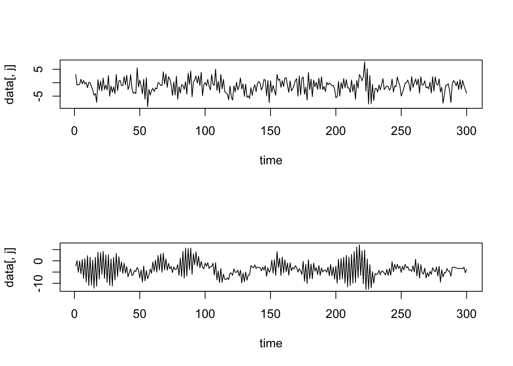

# VARモデル


## VARモデル
- 以下では, **MTS**パッケージ, **vars**パッケージを利用
  - https://www.rdocumentation.org/packages/MTS/versions/1.0
  - https://www.rdocumentation.org/packages/vars/versions/1.5-3

### VAR($p$)モデルのシミュレーション
- MTS::VARMAsim()関数 (VARMA($p,q$)モデルのパス生成)
- VAR(2)モデル例:
$$Y_{1,t}=0.3 + 0.2 Y_{1,t-1} + 0.3 Y_{2,t-1} - 0.5 Y_{1,t-2} (+0 \cdot Y_{2,t-2}) + \epsilon_{1,t}$$
$$Y_{2,t}=-0.3  -0.6 Y_{1,t-1} + 1.1 Y_{2,t-1} (+0 \cdot Y_{1,t-2}) - 0.6 Y_{2,t-2} + \epsilon_{2,t}$$
$$ \left[
    \begin{array}{r}
      \epsilon_{1,t} \\ \epsilon_{2,t}
    \end{array}
  \right] \sim_{\it i.i.d.} N \Big(\left[
    \begin{array}{r}
      0 \\ 0
    \end{array}
  \right], \left[
    \begin{array}{rr}
      4 & 0.8 \\ 0.8 & 1
    \end{array}
  \right]\Big) $$


```r
library(MTS)
Nlen <- 300
Seedv <- 1
set.seed(Seedv)
p0 <- c(0.3, -0.3)				# Phi0 (定数項)
p1 <- matrix(c(0.2, -0.6, 0.3, 1.1), 2, 2)	# Phi1 (ラグ1のVAR係数行列)
p2 <- matrix(c(-0.5, 0, 0, -0.6), 2, 2) 		# Phi2 (ラグ2のVAR係数行列)
Pmat <- cbind(p1, p2)						# VAR係数行列を重ねた行列
Sig <- matrix(c(4, 0.8, 0.8, 1), 2, 2)		# イノベーションの分散共分散行列 (正値定符号)
Pmat; Sig
##      [,1] [,2] [,3] [,4]
## [1,]  0.2  0.3 -0.5  0.0
## [2,] -0.6  1.1  0.0 -0.6
##      [,1] [,2]
## [1,]  4.0  0.8
## [2,]  0.8  1.0
ysim <- VARMAsim(Nlen, arlags = 2, cnst = p0, phi = Pmat, sigma = Sig)
Yt = ysim$series
acf(Yt)　　　# クロス相関
```



```r
MTSplot(Yt)　# 時系列プロット
```


### VAR($p$)モデルの次数同定
- 分析者による最適なラグ次数の選択を支援
```
- MTS::VARorder()関数
  - maxp: ラグ次数の最大値 (デフォルト=13)
  - 出力: BIC, HQ (Hannan and Quinn情報量規準), M(p), p-value (カイ二乗検定統計量 & p値)
```

```r
VARorder(Yt, maxp = 10, output = T)
## selected order: aic =  2 
## selected order: bic =  2 
## selected order: hq =  2 
## Summary table:  
##        p    AIC    BIC     HQ     M(p) p-value
##  [1,]  0 4.2159 4.2159 4.2159   0.0000  0.0000
##  [2,]  1 3.8924 3.9418 3.9122 100.3170  0.0000
##  [3,]  2 1.5169 1.6157 1.5564 683.4158  0.0000
##  [4,]  3 1.5299 1.6781 1.5892   3.8619  0.4250
##  [5,]  4 1.5434 1.7409 1.6224   3.6978  0.4484
##  [6,]  5 1.5325 1.7794 1.6313  10.4626  0.0333
##  [7,]  6 1.5548 1.8511 1.6734   1.2025  0.8777
##  [8,]  7 1.5575 1.9032 1.6958   6.5850  0.1595
##  [9,]  8 1.5799 1.9750 1.7381   1.1470  0.8867
## [10,]  9 1.5896 2.0340 1.7674   4.6092  0.3298
## [11,] 10 1.6099 2.1037 1.8075   1.7109  0.7887
```

```
- vars::VARselect()関数
  - lag.max: ラグ次数の最大値 (デフォルト=10)
  - type: 確定的な(定数・トレンド)項の種類
    "const"(定数項有), "trend"(トレンド有), "both"(定数項・トレンド共有), "none"(両方無)
  - 出力: AIC, HQ, SC (Schwarz情報量規準), FPE (forecast prediction error)
```

```r
library(vars)
vars::VARselect(Yt, lag.max = 10, type = "const")
## $selection
## AIC(n)  HQ(n)  SC(n) FPE(n) 
##      2      2      2      2 
## 
## $criteria
##                1        2        3        4        5        6        7        8
## AIC(n)  3.907125 1.532547 1.546463 1.560866 1.550885 1.574122 1.577719 1.601096
## HQ(n)   3.937546 1.583248 1.617444 1.652128 1.662427 1.705945 1.729823 1.773480
## SC(n)   3.983054 1.659094 1.723629 1.788652 1.829289 1.903146 1.957362 2.031358
## FPE(n) 49.755778 4.629985 4.694921 4.763133 4.715983 4.827081 4.844789 4.959798
##               9       10
## AIC(n) 1.611643 1.632857
## HQ(n)  1.804307 1.845802
## SC(n)  2.092524 2.164357
## FPE(n) 5.012920 5.121076
```
<!--
"In statistics, the Bayesian information criterion (BIC) or Schwarz information criterion (also SIC, SBC, SBIC) is a criterion for model selection ..." (wiki)
- パッケージ**vars**の用法: https://www.google.com/url?sa=t&rct=j&q=&esrc=s&source=web&cd=&ved=2ahUKEwjZ5trv742DAxXHr1YBHcPVBrkQFnoECA0QAQ&url=https%3A%2F%2Fwww.researchgate.net%2Fprofile%2FDavid-Booth-7%2Fpost%2FHow_to_select_optimal_lag_between_dependent_variable_and_independent_variables%2Fattachment%2F59d649eb79197b80779a450a%2FAS%253A473055043559424%25401489796519099%2Fdownload%2FVARS_how_to_use.pdf&usg=AOvVaw0WQ5jq3ZBjvAgOHYlLtqv3&opi=89978449
-->

### VAR($p$)モデルの推定
- 最小2乗法によるパラメータ推定
```
- MTS::VAR()関数
  - p: ラグ次数
  - include.mean: 平均ベクトルを加える(推定する)か (デフォルト=T)
  - fixed: パラメータに制約を付与する論理値行列. 制約付推定 (主に有意でない推定値の除去) に使用
```

```r
est.VAR1 <- MTS::VAR(Yt, p = 2, output = T, include.mean = T, fixed = NULL)	
## Constant term: 
## Estimates:  0.7010694 -0.4390955 
## Std.Error:  0.2935926 0.1458662 
## AR coefficient matrix 
## AR( 1 )-matrix 
##         [,1]    [,2]
## [1,] -0.0928  0.0954
## [2,] -0.0197 -0.0286
## standard error 
##        [,1]   [,2]
## [1,] 0.0575 0.0462
## [2,] 0.0286 0.0230
## AR( 2 )-matrix 
##        [,1]  [,2]
## [1,]  0.105 0.402
## [2,] -0.616 1.117
## standard error 
##        [,1]   [,2]
## [1,] 0.0575 0.0465
## [2,] 0.0285 0.0231
##   
## Residuals cov-mtx: 
##           [,1]      [,2]
## [1,] 4.4990390 0.8786783
## [2,] 0.8786783 1.1105526
##   
## det(SSE) =  4.224344 
## AIC =  1.494197 
## BIC =  1.592965 
## HQ  =  1.533724
```
```
- vars::VAR()関数
  - p: ラグ次数
  - type: 確定的な(定数・トレンド)項の種類
    "const"(定数項有), "trend"(トレンド有), "both"(定数項・トレンド共有), "none"(両方無)
  - season: 中心化済の季節性ダミー変数の追加 (frequencyを表す整数を指定)
  - exogen: 外生変数の追加
  - lag.max: ラグ次数の最大値 (ラグ次数選択において)
  - in: 情報量規準 (lag.maxを指定している場合)
```
<!-- 8/26/22時点: Build Book時, 以下でエラー発生(→解決済)
- Error in match.fun(FUN) : object 'stdev' not found -->

```r
est.VAR2 <- vars::VAR(Yt, p = 2, type = "const")	
# 最小2乗法によるパラメータ推定
# type: "const"(定数項有), trend:("トレンド有"), "both", "none"
summary(est.VAR2)
## 
## VAR Estimation Results:
## ========================= 
## Endogenous variables: y1, y2 
## Deterministic variables: const 
## Sample size: 298 
## Log Likelihood: -1060.376 
## Roots of the characteristic polynomial:
## 0.9308 0.7541 0.7541 0.6891
## Call:
## vars::VAR(y = Yt, p = 2, type = "const")
## 
## 
## Estimation results for equation y1: 
## =================================== 
## y1 = y1.l1 + y2.l1 + y1.l2 + y2.l2 + const 
## 
##       Estimate Std. Error t value Pr(>|t|)    
## y1.l1 -0.09285    0.05751  -1.614   0.1075    
## y2.l1  0.09536    0.04624   2.062   0.0401 *  
## y1.l2  0.10498    0.05745   1.827   0.0687 .  
## y2.l2  0.40175    0.04645   8.648 3.49e-16 ***
## const  0.70107    0.29359   2.388   0.0176 *  
## ---
## Signif. codes:  0 '***' 0.001 '**' 0.01 '*' 0.05 '.' 0.1 ' ' 1
## 
## 
## Residual standard error: 2.139 on 293 degrees of freedom
## Multiple R-Squared: 0.3636,	Adjusted R-squared: 0.3549 
## F-statistic: 41.86 on 4 and 293 DF,  p-value: < 2.2e-16 
## 
## 
## Estimation results for equation y2: 
## =================================== 
## y2 = y1.l1 + y2.l1 + y1.l2 + y2.l2 + const 
## 
##       Estimate Std. Error t value Pr(>|t|)    
## y1.l1 -0.01967    0.02857  -0.688  0.49185    
## y2.l1 -0.02859    0.02297  -1.244  0.21435    
## y1.l2 -0.61604    0.02854 -21.583  < 2e-16 ***
## y2.l2  1.11695    0.02308  48.395  < 2e-16 ***
## const -0.43910    0.14587  -3.010  0.00284 ** 
## ---
## Signif. codes:  0 '***' 0.001 '**' 0.01 '*' 0.05 '.' 0.1 ' ' 1
## 
## 
## Residual standard error: 1.063 on 293 degrees of freedom
## Multiple R-Squared: 0.9232,	Adjusted R-squared: 0.9222 
## F-statistic: 880.9 on 4 and 293 DF,  p-value: < 2.2e-16 
## 
## 
## 
## Covariance matrix of residuals:
##        y1     y2
## y1 4.5758 0.8937
## y2 0.8937 1.1295
## 
## Correlation matrix of residuals:
##        y1     y2
## y1 1.0000 0.3931
## y2 0.3931 1.0000
```

### VAR($p$)モデル予測
```
- MTS::VARpred()関数
  - h: 予測期間の長さ
  - orig: 予測の起点 (デフォルト=0, 最終のデータ点)
  - Out.level: 出力の詳細のコントロール (T/F)
```

```r
pred.VAR1 = VARpred(est.VAR1, h = 20, orig = 0, Out.level = F, output = T)
## orig  300 
## Forecasts at origin:  300 
##          [,1]   [,2]
##  [1,] -1.6935 -4.659
##  [2,] -1.5588 -2.224
##  [3,] -1.4159 -4.506
##  [4,] -0.6541 -1.806
##  [5,] -1.3692 -4.535
##  [6,] -0.3984 -1.896
##  [7,] -1.4084 -4.599
##  [8,] -0.4105 -2.153
##  [9,] -1.4616 -4.638
## [10,] -0.5135 -2.429
## [11,] -1.4999 -4.640
## [12,] -0.6321 -2.674
## [13,] -1.5169 -4.609
## [14,] -0.7383 -2.875
## [15,] -1.5155 -4.556
## [16,] -0.8252 -3.035
## [17,] -1.5012 -4.491
## [18,] -0.8939 -3.163
## [19,] -1.4795 -4.423
## [20,] -0.9480 -3.266
## Standard Errors of predictions:  
##        [,1]  [,2]
##  [1,] 2.121 1.054
##  [2,] 2.129 1.056
##  [3,] 2.199 1.729
##  [4,] 2.205 1.734
##  [5,] 2.269 2.315
##  [6,] 2.270 2.333
##  [7,] 2.357 2.728
##  [8,] 2.358 2.760
##  [9,] 2.432 3.010
## [10,] 2.435 3.050
## [11,] 2.488 3.207
## [12,] 2.493 3.249
## [13,] 2.528 3.349
## [14,] 2.535 3.388
## [15,] 2.557 3.453
## [16,] 2.564 3.486
## [17,] 2.579 3.530
## [18,] 2.586 3.557
## [19,] 2.596 3.588
## [20,] 2.602 3.609
## Root mean square errors of predictions:  
##        [,1]  [,2]
##  [1,] 2.139 1.063
##  [2,] 2.154 1.061
##  [3,] 2.408 2.994
##  [4,] 2.226 1.751
##  [5,] 2.460 3.586
##  [6,] 2.275 2.391
##  [7,] 2.616 3.717
##  [8,] 2.359 2.859
##  [9,] 2.656 3.698
## [10,] 2.444 3.174
## [11,] 2.649 3.664
## [12,] 2.510 3.378
## [13,] 2.636 3.650
## [14,] 2.557 3.508
## [15,] 2.628 3.653
## [16,] 2.587 3.591
## [17,] 2.626 3.667
## [18,] 2.607 3.643
## [19,] 2.627 3.683
## [20,] 2.620 3.678
```
```
- predict()関数 (vars::VARの出力に対して適用)
  - n.ahead: 予測期間の長さ
  - ci: 予測信頼区間
```

```r
pred.VAR2 = predict(est.VAR2, n.ahead = 10)
plot(pred.VAR2)
```


```r
pred.VAR2$fcst
## $y1
##             fcst     lower    upper       CI
##  [1,] -1.6935489 -5.886138 2.499040 4.192589
##  [2,] -1.5588289 -5.766916 2.649258 4.208087
##  [3,] -1.4158594 -5.761805 2.930087 4.345946
##  [4,] -0.6541053 -5.012838 3.704628 4.358733
##  [5,] -1.3691744 -5.853357 3.115008 4.484182
##  [6,] -0.3983955 -4.885523 4.088732 4.487127
##  [7,] -1.4084408 -6.067917 3.251035 4.659476
##  [8,] -0.4104564 -5.070912 4.250000 4.660456
##  [9,] -1.4615648 -6.269351 3.346221 4.807786
## [10,] -0.5135316 -5.326625 4.299561 4.813093
## 
## $y2
##            fcst      lower       upper       CI
##  [1,] -4.659151  -6.742164 -2.57613758 2.083013
##  [2,] -2.223532  -4.309952 -0.13711248 2.086420
##  [3,] -4.505606  -7.922276 -1.08893531 3.416670
##  [4,] -1.805711  -5.233098  1.62167648 3.427387
##  [5,] -4.534908  -9.110020  0.04020335 4.575112
##  [6,] -1.896451  -6.507997  2.71509585 4.611547
##  [7,] -4.598833  -9.990735  0.79306982 5.391903
##  [8,] -2.152730  -7.607556  3.30209602 5.454826
##  [9,] -4.638479 -10.588832  1.31187382 5.950353
## [10,] -2.429372  -8.458542  3.59979824 6.029170
```
<!---
  - dumvar: ca.jo()関数においてdumvar引数が, または, VAR()関数においてexogen引数が使われた時に得られた'vec2var'や'varest'クラスのオブジェクトに対する行列
--->

- **MTS**パッケージは, 外生変数有りのVARXモデル, VMAモデル, さらには, 一般のVARMAモデルに対しても, 次数同定, モデル推定, 予測のための関数を用意.
