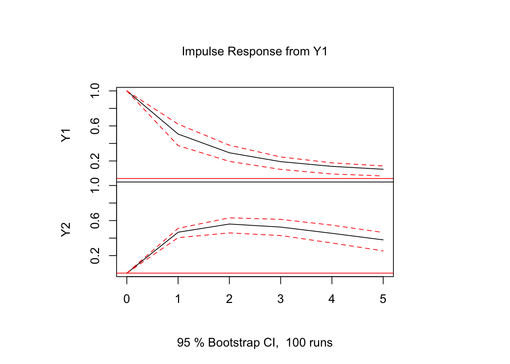
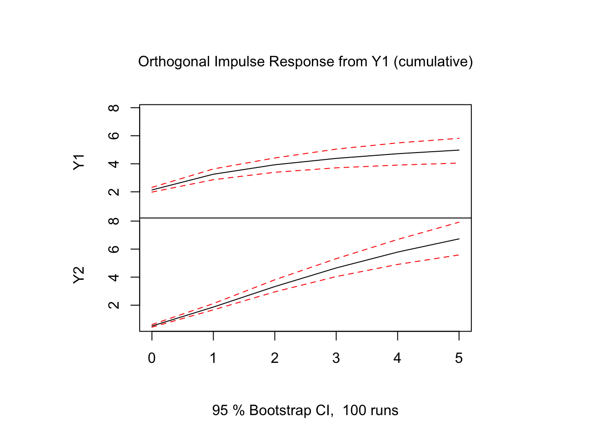
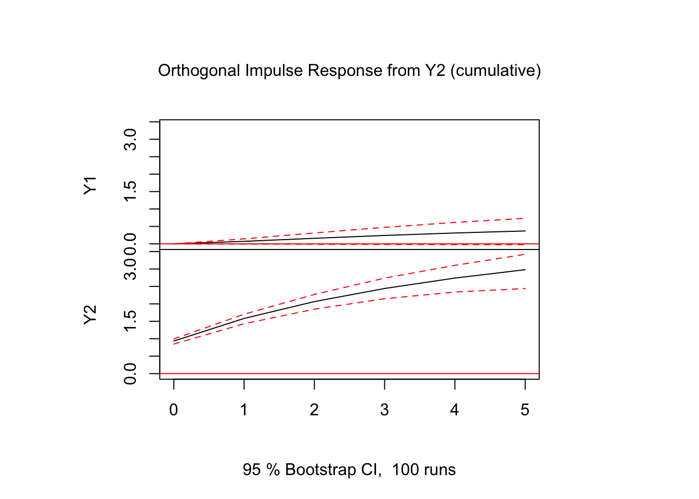
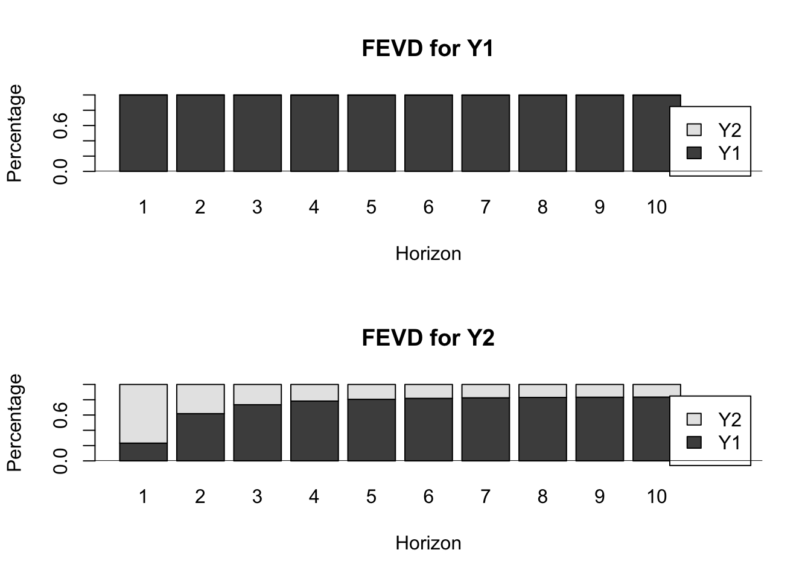

## VARモデルによる変数間の動学的関係性の分析

- 以下, **MTS**パッケージ, **vars**パッケージを利用
  - https://www.rdocumentation.org/packages/MTS/versions/1.0
  - https://www.rdocumentation.org/packages/vars/versions/1.5-3

### VAR($p$)モデルの推定(復習)
- 以下では, シミュレーションデータを使用
- MTSパッケージのVARsim関数でパスを生成
- varパッケージのVARselect,VAR関数を使って, 次数同定およびモデル推定

$$Y_{1,t}=1.0 + 0.6 Y_{1,t-1} + 0.1 Y_{2,t-1} + \epsilon_{1,t}$$
$$Y_{2,t}=-1.0 +0.5 Y_{1,t-1} + 0.7 Y_{2,t-1} + \epsilon_{2,t}$$
$$ \left[
    \begin{array}{r}
      \epsilon_{1,t} \\ \epsilon_{2,t}
    \end{array}
  \right] \sim_{\it i.i.d.} N \Big(\left[
    \begin{array}{r}
      0 \\ 0
    \end{array}
  \right], \left[
    \begin{array}{rr}
      4 & 1 \\ 1 & 1
    \end{array}
  \right]\Big) $$


```r
library(MTS)
Nlen <- 300
Seedv <- 1
set.seed(Seedv)
p0 <- c(1, -1)			# Phi0 (定数項)
Pmat <- matrix(c(0.6, 0.5, 0.1, 0.7), 2, 2)	# Phi1 (ラグ1のVAR係数行列)
Sig <- matrix(c(4, 1, 1, 1), 2, 2)		# イノベーションの分散共分散行列 (正値定符号)
Pmat; Sig
```

```
##      [,1] [,2]
## [1,]  0.6  0.1
## [2,]  0.5  0.7
```

```
##      [,1] [,2]
## [1,]    4    1
## [2,]    1    1
```

```r
ysim <- VARMAsim(Nlen, arlags = 1, cnst = p0, phi = Pmat, sigma = Sig)
Yt <- ysim$series
acf(Yt)　　　# クロス相関
```


```r
MTSplot(Yt)　# 時系列プロット
```


#### VAR($p$)モデルの次数同定 {-}
- vars::VARselect()関数

```r
library(vars)
```

```
## Loading required package: MASS
```

```
## Loading required package: strucchange
```

```
## Loading required package: zoo
```

```
## 
## Attaching package: 'zoo'
```

```
## The following objects are masked from 'package:base':
## 
##     as.Date, as.Date.numeric
```

```
## Loading required package: sandwich
```

```
## Loading required package: urca
```

```
## Loading required package: lmtest
```

```
## 
## Attaching package: 'vars'
```

```
## The following object is masked from 'package:MTS':
## 
##     VAR
```

```r
Yt <- data.frame(Y1 = Yt[,1], Y2 = Yt[,2])
VARselect(Yt, lag.max = 5,  type = "const")
```

```
## $selection
## AIC(n)  HQ(n)  SC(n) FPE(n) 
##      1      1      1      1 
## 
## $criteria
##               1        2        3        4        5
## AIC(n) 1.417189 1.432965 1.454790 1.471126 1.460469
## HQ(n)  1.447216 1.483011 1.524855 1.561208 1.570570
## SC(n)  1.492178 1.557947 1.629765 1.696094 1.735430
## FPE(n) 4.125512 4.191134 4.283662 4.354299 4.308277
```

#### VAR($p$)モデルの推定 {-}
- vars::VAR()関数

```r
est_VAR1 <- vars::VAR(Yt, p = 1, type = "const")
summary(est_VAR1)
```

```
## 
## VAR Estimation Results:
## ========================= 
## Endogenous variables: Y1, Y2 
## Deterministic variables: const 
## Sample size: 299 
## Log Likelihood: -1051.693 
## Roots of the characteristic polynomial:
## 0.8123 0.3886
## Call:
## vars::VAR(y = Yt, p = 1, type = "const")
## 
## 
## Estimation results for equation Y1: 
## =================================== 
## Y1 = Y1.l1 + Y2.l1 + const 
## 
##       Estimate Std. Error t value Pr(>|t|)    
## Y1.l1  0.50728    0.06004   8.449 1.35e-15 ***
## Y2.l1  0.07759    0.04514   1.719   0.0866 .  
## const  1.08864    0.17861   6.095 3.40e-09 ***
## ---
## Signif. codes:  0 '***' 0.001 '**' 0.01 '*' 0.05 '.' 0.1 ' ' 1
## 
## 
## Residual standard error: 2.133 on 296 degrees of freedom
## Multiple R-Squared: 0.3322,	Adjusted R-squared: 0.3277 
## F-statistic: 73.64 on 2 and 296 DF,  p-value: < 2.2e-16 
## 
## 
## Estimation results for equation Y2: 
## =================================== 
## Y2 = Y1.l1 + Y2.l1 + const 
## 
##       Estimate Std. Error t value Pr(>|t|)    
## Y1.l1  0.46669    0.03001   15.55   <2e-16 ***
## Y2.l1  0.69357    0.02256   30.74   <2e-16 ***
## const -0.97716    0.08928  -10.95   <2e-16 ***
## ---
## Signif. codes:  0 '***' 0.001 '**' 0.01 '*' 0.05 '.' 0.1 ' ' 1
## 
## 
## Residual standard error: 1.066 on 296 degrees of freedom
## Multiple R-Squared: 0.9054,	Adjusted R-squared: 0.9048 
## F-statistic:  1417 on 2 and 296 DF,  p-value: < 2.2e-16 
## 
## 
## 
## Covariance matrix of residuals:
##       Y1    Y2
## Y1 4.551 1.096
## Y2 1.096 1.137
## 
## Correlation matrix of residuals:
##       Y1    Y2
## Y1 1.000 0.482
## Y2 0.482 1.000
```

上で推定されたVAR(1)モデルを使用して, VARモデルによる変数間の動学的関係性の分析を行う.


### グレンジャーの因果性検定
```
- vars::causality()関数
  - x: VAR()関数により生成された'varest'クラスのオブジェクト
  - cause: cause変数 (デフォルトは入力x$yの第1列の変数)	
  - vcov.: 推定係数の共分散行列の指定
  - boot: 棄却点を計算する際にwildブートストラップを使用するか否か(T/F)	
  - boot.runs: boot=TRUEの場合のブートストラップの反復数
```


```r
vars::causality(est_VAR1, cause = "Y1")	
```

```
## $Granger
## 
## 	Granger causality H0: Y1 do not Granger-cause Y2
## 
## data:  VAR object est_VAR1
## F-Test = 241.8, df1 = 1, df2 = 592, p-value < 2.2e-16
## 
## 
## $Instant
## 
## 	H0: No instantaneous causality between: Y1 and Y2
## 
## data:  VAR object est_VAR1
## Chi-squared = 56.374, df = 1, p-value = 5.995e-14
```

```r
# VAR(1)の推定結果var1を用い, Y1に関するGranger因果性検定
vars::causality(est_VAR1, cause = "Y2")	
```

```
## $Granger
## 
## 	Granger causality H0: Y2 do not Granger-cause Y1
## 
## data:  VAR object est_VAR1
## F-Test = 2.9555, df1 = 1, df2 = 592, p-value = 0.08611
## 
## 
## $Instant
## 
## 	H0: No instantaneous causality between: Y2 and Y1
## 
## data:  VAR object est_VAR1
## Chi-squared = 56.374, df = 1, p-value = 5.995e-14
```

```r
# 同, Y2に関するGranger因果性検定
```

### インパルス応答
#### 直交インパルス応答 {-}
```
- vars::irf()関数
  - x: VAR()関数により生成された'varest'クラスのオブジェクト等
  - impulse: インパルス変数 (デフォルト=全変数)	
  - response: 応答変数 (デフォルト=全変数)
  - n.ahead: 将来区間の長さ
  - ortho: 直交インパルス応答か (デフォルト=T)	
  - cumulative: 累積インパルス応答か (デフォルト=F)
  - boot: インパルス応答係数のブートストラップ誤差バンド計算の有無 (T/F)	
  - ci: bootstrap誤差バンドの信頼区間
  - runs: bootstrap回数
```

```r
# vars::irf()関数 (ortho = T (デフォルト))
ip1 <- vars::irf(est_VAR1, impulse = c("Y1"), response = c("Y1", "Y2"),
                 n.ahead = 5, boot = T)
ip2 <- vars::irf(est_VAR1, impulse = c("Y2"), response = c("Y1", "Y2"),
                 n.ahead = 5, boot = T)
plot(ip1)
```


```r
plot(ip2)
```


```r
# 破線は信頼区間
# ip1; ip2
```

#### 非直交インパルス応答 {-}

```r
# vars::irf()関数 (ortho = F)
ip1 <- vars::irf(est_VAR1, impulse = c("Y1"), response = c("Y1", "Y2"), 
                 ortho = F, n.ahead = 5, boot = T)
ip2 <- vars::irf(est_VAR1, impulse = c("Y2"), response = c("Y1", "Y2"), 
                 ortho = F, n.ahead = 5, boot = T)
plot(ip1)
```



```r
plot(ip2)
```


```r
# ip1; ip2
```

- 累積インパルス応答

```r
ip1_cum <- vars::irf(est_VAR1, impulse = c("Y1"), response = c("Y1","Y2"), 
                     n.ahead = 5, boot = TRUE, cumulative=T)
ip2_cum <- vars::irf(est_VAR1, impulse = c("Y2"), response = c("Y2","Y1"), 
                     n.ahead = 5, boot = TRUE, cumulative=T)
plot(ip1_cum)
```



```r
plot(ip2_cum)
```



### 予測誤差分散分解 (forecast error variance decomposition)
```
- vars::fevd()関数
  - x: VAR()関数により生成された'varest'クラスのオブジェクト等
  - n.ahead: 予測区間の長さ
```
- 直交化インパルス応答関数を使い, 第$j(=1,2)$変数の第$k(=1,2)$変数の$h(=1,\ldots,10)$先予測誤差分散への寄与を評価

```r
res_fevd <- vars::fevd(est_VAR1, n.ahead = 10) 	# 10期先まで評価する
plot(res_fevd)
```


