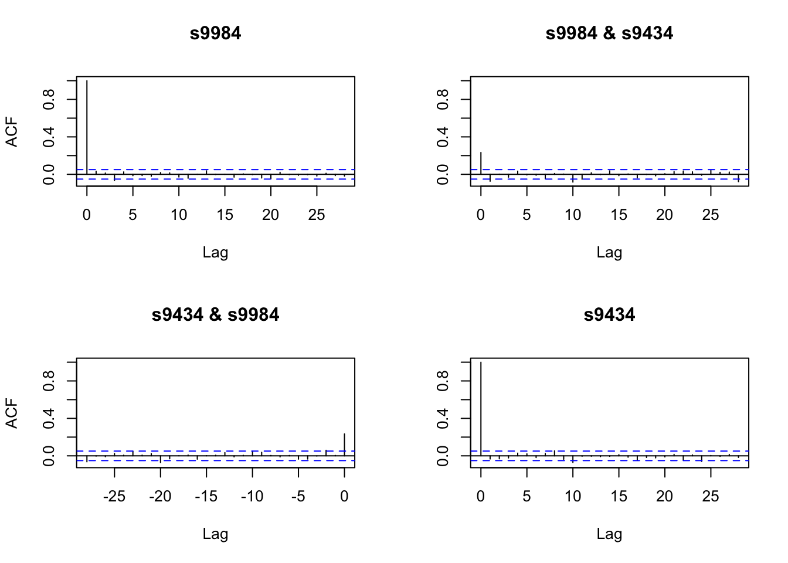
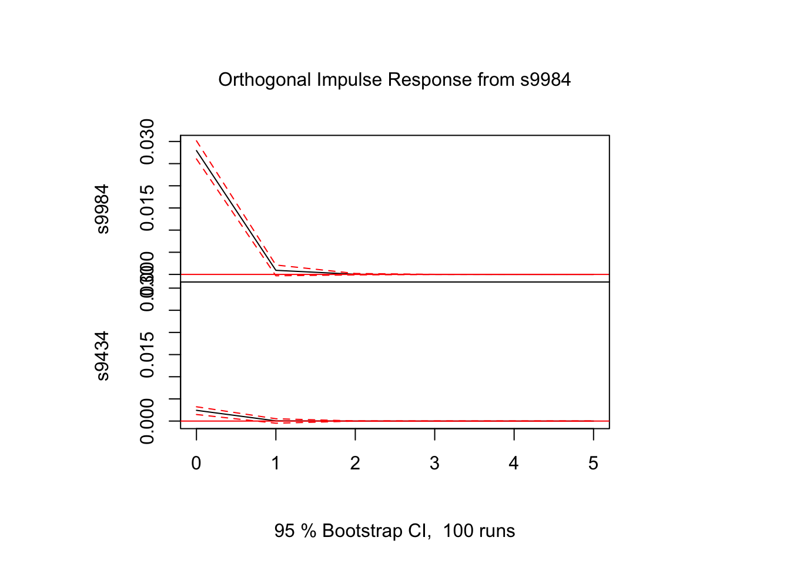
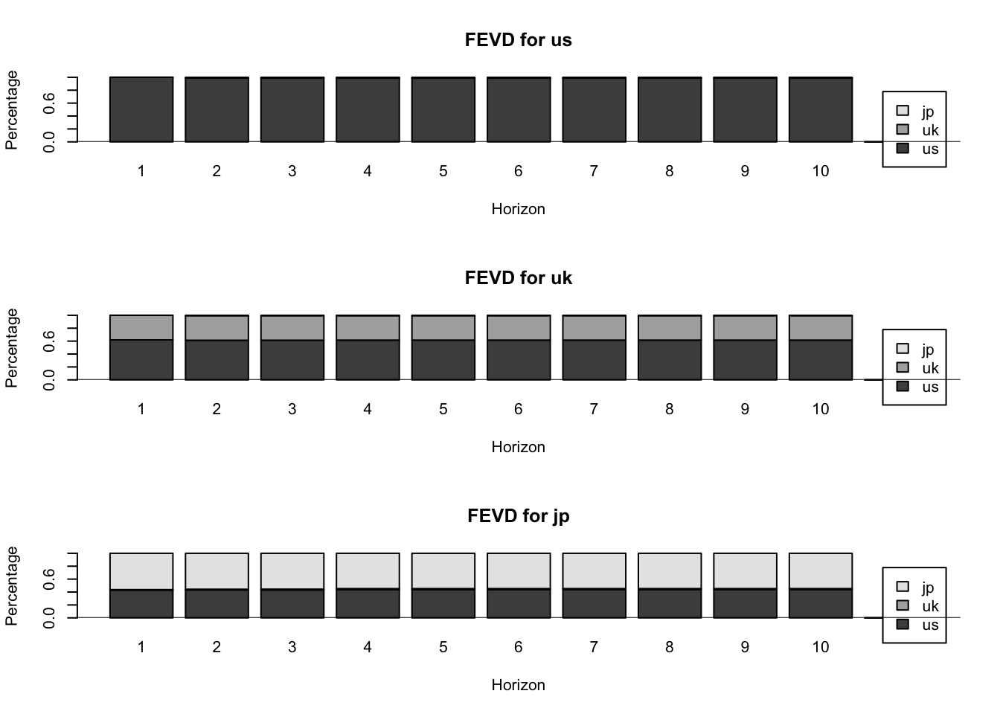
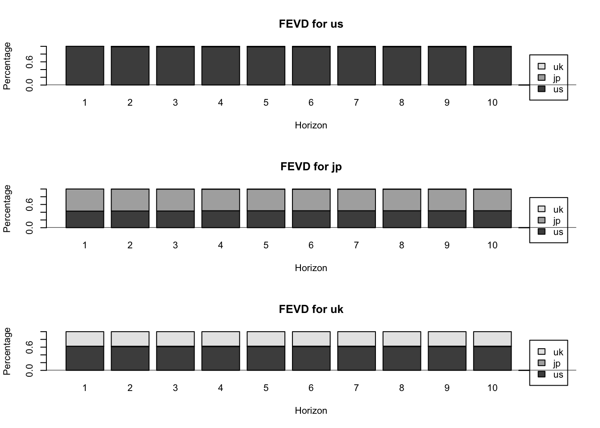
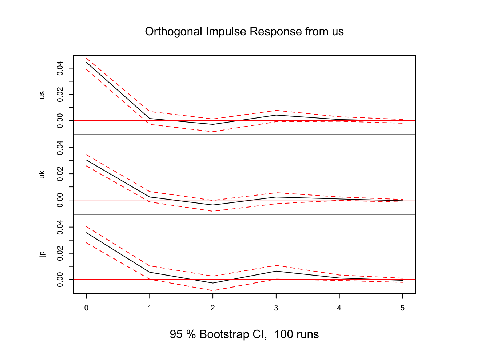
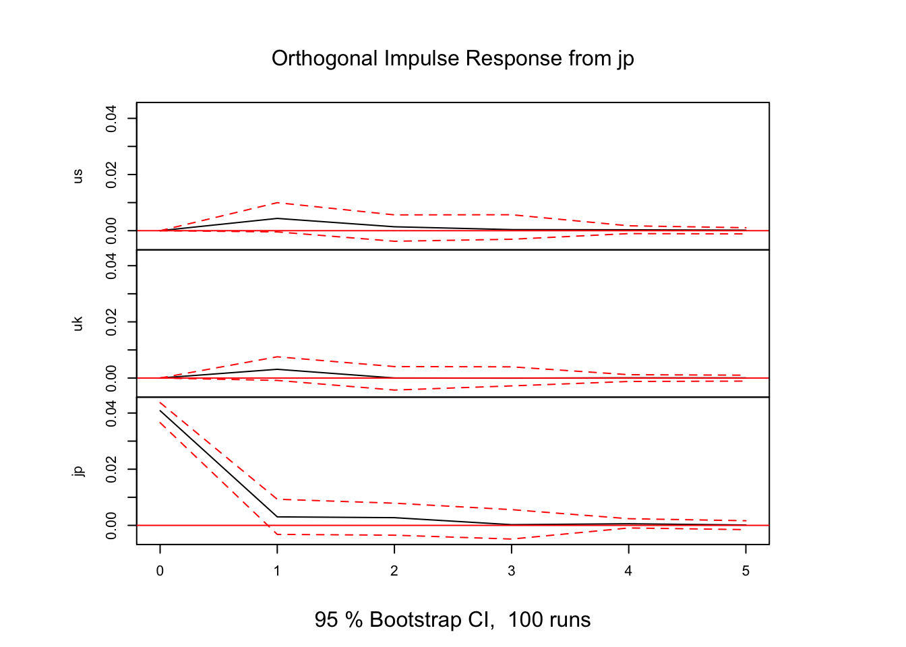

## VAR解析 (データ分析例)
VARモデルによる変数間の動学的関係性の分析

### 事例1: ソフトバンク(9434) vs ソフトバンクグループ(9984) {-}
- ソフトバンク(9434): 上場日 2018年12月19日
- 親会社ソフトバンクG (9984)
  - 保有比率(%): 66.49 (2019.03), 67.13 (2020.03), 40.86 (2021.03), 40.68 (2022.03), 40.47 (2023.03)
  - cf. https://www.buffett-code.com/company/9434/mainshareholder

- データをYahoo!ファイナンスより入手

```r
library(quantmod)
```

```
## Loading required package: xts
```

```
## Loading required package: zoo
```

```
## 
## Attaching package: 'zoo'
```

```
## The following objects are masked from 'package:base':
## 
##     as.Date, as.Date.numeric
```

```
## Loading required package: TTR
```

```
## Registered S3 method overwritten by 'quantmod':
##   method            from
##   as.zoo.data.frame zoo
```

```r
s9984 <- getSymbols('9984.T', from = '2018-12-19', auto.assign = FALSE)
s9434 <- getSymbols('9434.T', from = '2018-12-19', auto.assign = FALSE)

s9984ret <- diff(log(s9984$`9984.T.Adjusted`))[-1]
s9434ret <- diff(log(s9434$`9434.T.Adjusted`))[-1]
sb <- merge.xts(s9984ret, s9434ret, join = "inner")
colnames(sb) <- c("s9984", "s9434")
```

- 各変数の単位根検定

```r
library(fUnitRoots)
#unitrootTest(s9984, type = "c", lags = 1)	# type: "nc", "c", "ct"
unitrootTest(s9984ret, type = "c", lags = 1)
```

```
## 
## Title:
##  Augmented Dickey-Fuller Test
## 
## Test Results:
##   PARAMETER:
##     Lag Order: 1
##   STATISTIC:
##     DF: -23.9567
##   P VALUE:
##     t: < 2.2e-16 
##     n: 0.004234 
## 
## Description:
##  Thu Jan 18 13:57:59 2024 by user:
```

```r
unitrootTest(s9434ret, type = "c", lags = 1)
```

```
## 
## Title:
##  Augmented Dickey-Fuller Test
## 
## Test Results:
##   PARAMETER:
##     Lag Order: 1
##   STATISTIC:
##     DF: -26.5442
##   P VALUE:
##     t: < 2.2e-16 
##     n: 0.00221 
## 
## Description:
##  Thu Jan 18 13:57:59 2024 by user:
```
- --> 帰無仮説($\phi_1 = 1$)を棄却 (単位根なし)

- 標本自己共分散行列

```r
acf(sb)
```



#### VARモデルの推定 {-}
- 以下, パッケージ**vars**を利用
- VAR(p)モデルの次数の決定

```r
library(vars)
```

```
## Loading required package: MASS
```

```
## Loading required package: strucchange
```

```
## Loading required package: sandwich
```

```
## Loading required package: urca
```

```
## 
## Attaching package: 'urca'
```

```
## The following objects are masked from 'package:fUnitRoots':
## 
##     punitroot, qunitroot, unitrootTable
```

```
## Loading required package: lmtest
```

```r
vars::VARselect(sb, lag.max = 5,  type = "const")	# "const"(定数項有), trend:("トレンド有"), "both", "none"
```

```
## $selection
## AIC(n)  HQ(n)  SC(n) FPE(n) 
##      3      1      1      3 
## 
## $criteria
##                    1             2             3             4             5
## AIC(n) -1.643819e+01 -1.643944e+01 -1.644231e+01 -1.643832e+01 -1.643348e+01
## HQ(n)  -1.642881e+01 -1.642381e+01 -1.642042e+01 -1.641018e+01 -1.639909e+01
## SC(n)  -1.641325e+01 -1.639789e+01 -1.638413e+01 -1.636352e+01 -1.634206e+01
## FPE(n)  7.260835e-08  7.251726e-08  7.230939e-08  7.259888e-08  7.295072e-08
```
- --> AIC, FPEでは3, HQ, SCでは1が最適

- VAR(1)モデルの推定 (OLS推定)

```r
var1 <- vars::VAR(sb, p = 1, type = "const")
summary(var1)
```

```
## 
## VAR Estimation Results:
## ========================= 
## Endogenous variables: s9984, s9434 
## Deterministic variables: const 
## Sample size: 1235 
## Log Likelihood: 6641.894 
## Roots of the characteristic polynomial:
## 0.05713 0.03535
## Call:
## vars::VAR(y = sb, p = 1, type = "const")
## 
## 
## Estimation results for equation s9984: 
## ====================================== 
## s9984 = s9984.l1 + s9434.l1 + const 
## 
##            Estimate Std. Error t value Pr(>|t|)    
## s9984.l1  0.0442416  0.0288798   1.532 0.125799    
## s9434.l1 -0.2625268  0.0776155  -3.382 0.000741 ***
## const     0.0005738  0.0007746   0.741 0.459016    
## ---
## Signif. codes:  0 '***' 0.001 '**' 0.01 '*' 0.05 '.' 0.1 ' ' 1
## 
## 
## Residual standard error: 0.02718 on 1232 degrees of freedom
## Multiple R-Squared: 0.009821,	Adjusted R-squared: 0.008214 
## F-statistic:  6.11 on 2 and 1232 DF,  p-value: 0.002288 
## 
## 
## Estimation results for equation s9434: 
## ====================================== 
## s9434 = s9984.l1 + s9434.l1 + const 
## 
##            Estimate Std. Error t value Pr(>|t|)  
## s9984.l1 -0.0039087  0.0108066  -0.362   0.7176  
## s9434.l1 -0.0224581  0.0290432  -0.773   0.4395  
## const     0.0005769  0.0002899   1.990   0.0468 *
## ---
## Signif. codes:  0 '***' 0.001 '**' 0.01 '*' 0.05 '.' 0.1 ' ' 1
## 
## 
## Residual standard error: 0.01017 on 1232 degrees of freedom
## Multiple R-Squared: 0.000708,	Adjusted R-squared: -0.0009143 
## F-statistic: 0.4364 on 2 and 1232 DF,  p-value: 0.6464 
## 
## 
## 
## Covariance matrix of residuals:
##           s9984     s9434
## s9984 7.388e-04 5.472e-05
## s9434 5.472e-05 1.034e-04
## 
## Correlation matrix of residuals:
##       s9984 s9434
## s9984 1.000 0.198
## s9434 0.198 1.000
```
- --> 2式とも, 9984_{t-1}の係数, 有意でない. 一方, 9434_{t-1} → 9984_tの係数, 有意


#### インパルス応答 {-}
- **直交化インパルス応答**

```r
# s9434 --> 将来のs9434, s9984の変動を調べる
ip <- vars::irf(var1, impulse = c("s9434"), response = c("s9434", "s9984"),
                n.ahead = 5, boot = TRUE)
#ip <- vars::irf(var1, impulse = c("s9984"), response = c("s9984", "s9434"),
#                n.ahead = 5, boot = TRUE)
# ortho = T (デフォルト): 直交化インパルス応答; ortho = F: 非直交化インパルス応答
# boot = T: ブートストラップ法により, 信頼区間計算
# cumulative = T: 累積インパルス応答. デフォルトはF.
plot(ip)
```


```r
# 破線は信頼区間
ip
```

```
## 
## Impulse response coefficients
## $s9434
##              s9984         s9434
## [1,]  0.000000e+00  9.969413e-03
## [2,] -2.617238e-03 -2.238937e-04
## [3,] -5.701271e-05  1.525810e-05
## [4,] -6.527993e-06 -1.198244e-07
## [5,] -2.573517e-07  2.820668e-08
## [6,] -1.879066e-08  3.724312e-10
## 
## 
## Lower Band, CI= 0.95 
## $s9434
##              s9984         s9434
## [1,]  0.000000e+00  9.162166e-03
## [2,] -3.789247e-03 -6.709767e-04
## [3,] -3.358542e-04 -3.440056e-05
## [4,] -4.068687e-05 -5.188678e-06
## [5,] -3.710919e-06 -1.721196e-07
## [6,] -5.443953e-07 -4.483663e-08
## 
## 
## Upper Band, CI= 0.95 
## $s9434
##              s9984        s9434
## [1,]  0.000000e+00 1.071131e-02
## [2,] -1.194192e-03 4.185756e-04
## [3,]  1.168481e-04 9.556895e-05
## [4,]  8.285700e-06 6.538167e-06
## [5,]  9.813426e-07 1.017655e-06
## [6,]  1.278573e-08 9.413478e-08
```


```r
ip_2 <- vars::irf(var1, impulse = c("s9984"), response = c("s9984", "s9434"),
                n.ahead = 5, boot = TRUE)
plot(ip_2)
```



```r
ip_2
```

```
## 
## Impulse response coefficients
## $s9984
##             s9984         s9434
## [1,] 2.718029e-02  2.013318e-03
## [2,] 6.739494e-04 -1.514535e-04
## [3,] 6.957721e-05  7.671187e-07
## [4,] 2.876818e-06 -2.891812e-07
## [5,] 2.031928e-07 -4.750034e-09
## [6,] 1.023659e-08 -6.875338e-10
## 
## 
## Lower Band, CI= 0.95 
## $s9984
##              s9984         s9434
## [1,]  2.491913e-02  1.184473e-03
## [2,] -6.153993e-04 -7.566657e-04
## [3,] -1.234440e-04 -2.331559e-05
## [4,] -6.354991e-06 -6.358001e-06
## [5,] -2.877937e-08 -2.889297e-07
## [6,] -6.172491e-08 -5.436576e-08
## 
## 
## Upper Band, CI= 0.95 
## $s9984
##             s9984        s9434
## [1,] 2.930732e-02 2.815570e-03
## [2,] 1.842879e-03 5.305100e-04
## [3,] 2.302657e-04 2.871722e-05
## [4,] 1.859794e-05 3.959511e-07
## [5,] 2.568070e-06 3.195025e-07
## [6,] 2.146023e-07 8.176324e-09
```

- **非直交化インパルス応答**

```r
ip_3 <- vars::irf(var1, impulse = c("s9434"), response = c("s9434", "s9984"),
                  ortho = F, n.ahead = 5, boot = TRUE)
plot(ip_3)
```


```r
ip_3
```

```
## 
## Impulse response coefficients
## $s9434
##              s9984         s9434
## [1,]  0.000000e+00  1.000000e+00
## [2,] -2.625268e-01 -2.245806e-02
## [3,] -5.718763e-03  1.530491e-03
## [4,] -6.548021e-04 -1.201920e-05
## [5,] -2.581413e-05  2.829322e-06
## [6,] -1.884831e-06  3.735739e-08
## 
## 
## Lower Band, CI= 0.95 
## $s9434
##              s9984         s9434
## [1,]  0.000000e+00  1.000000e+00
## [2,] -3.733072e-01 -7.188920e-02
## [3,] -2.523148e-02 -3.375044e-03
## [4,] -2.450888e-03 -4.214012e-04
## [5,] -2.164152e-04 -8.409141e-06
## [6,] -2.515614e-05 -3.965529e-06
## 
## 
## Upper Band, CI= 0.95 
## $s9434
##              s9984        s9434
## [1,]  0.000000e+00 1.000000e+00
## [2,] -9.616284e-02 2.987894e-02
## [3,]  1.140817e-02 7.974779e-03
## [4,]  7.638063e-04 3.735245e-04
## [5,]  1.115825e-04 6.818528e-05
## [6,]  4.686436e-07 4.215081e-06
```

- **累積インパルス応答**

```r
ip_cum <- vars::irf(var1, impulse = c("s9434"), response = c("s9434", "s9984"),
                    n.ahead = 5, boot = TRUE, cumulative = T)
plot(ip_cum)
```


#### Grangerの因果性検定 {-}

```r
vars::causality(var1, cause = "s9434")	# VAR(1)の推定結果var1を用い, 9434をcauseとするGranger因果性検定
```

```
## $Granger
## 
## 	Granger causality H0: s9434 do not Granger-cause s9984
## 
## data:  VAR object var1
## F-Test = 11.441, df1 = 1, df2 = 2464, p-value = 0.0007298
## 
## 
## $Instant
## 
## 	H0: No instantaneous causality between: s9434 and s9984
## 
## data:  VAR object var1
## Chi-squared = 46.569, df = 1, p-value = 8.844e-12
```
- --> 帰無仮説(因果性なし)棄却　→　9434をcauseとするGranger因果性の存在を示唆


```r
vars::causality(var1, cause = "s9984")
```

```
## $Granger
## 
## 	Granger causality H0: s9984 do not Granger-cause s9434
## 
## data:  VAR object var1
## F-Test = 0.13082, df1 = 1, df2 = 2464, p-value = 0.7176
## 
## 
## $Instant
## 
## 	H0: No instantaneous causality between: s9984 and s9434
## 
## data:  VAR object var1
## Chi-squared = 46.569, df = 1, p-value = 8.844e-12
```
- --> 帰無仮説(因果性なし)棄却できず　→　9984をcauseとするGranger因果性存在せず
- 一方、Grangerの瞬時因果性, 9984, 9434, いずれの方向も棄却できず → 存在を示唆


### 事例2: 米英日3株式市場 (S&P500, FTSE, 日経平均) {-}
- データをYahoo!ファイナンスより入手

```r
library(vars)

gspc <- getSymbols('^GSPC', periodicity = "monthly", from = '1999-12-31', auto.assign = FALSE)
ftse <- getSymbols('^FTSE', periodicity = "monthly", from = '1999-12-31', auto.assign = FALSE)
n225 <- getSymbols('^N225', periodicity = "monthly", from = '1999-12-31', auto.assign = FALSE)

us <- diff(log(gspc$GSPC.Adjusted))[-1]
uk <- diff(log(ftse$FTSE.Adjusted))[-1]
jp <- diff(log(n225$N225.Adjusted))[-1]
mkt <- cbind(us, uk, jp)

idx <- complete.cases(mkt) # 欠損値(NA)のあるレコードの除去
mkt <- mkt[idx]
colnames(mkt) <- c("us", "uk", "jp")

plot(cumsum(mkt), type = "l", col = c("black", "blue", "red"),
     main = "Market indices: S&P500 (black), FTSE (blue), NK225 (red)")
```


#### VARモデルの推定 {-}
- 以下, 引き続きパッケージ**vars**を利用
- 3変量VAR(2)モデルを仮定した場合の推定

```r
usukjp <- data.frame(mkt$us, mkt$uk, mkt$jp)
head(usukjp, 5)
```

```
##                     us           uk          jp
## 2000-02-01 -0.02031300 -0.005743495  0.02125795
## 2000-03-01  0.09232375  0.048174179  0.01875144
## 2000-04-01 -0.03127991 -0.033078382 -0.12354810
## 2000-05-01 -0.02215875  0.005044624 -0.09575560
## 2000-06-01  0.02365163 -0.007370510  0.06395117
```

```r
var2usukjp <- vars::VAR(usukjp, p = 2, type = "const")
#summary(var2usukjp)

# 係数推定値 (値のみ）
coef(var2usukjp)
```

```
## $us
##           Estimate Std. Error    t value   Pr(>|t|)
## us.l1 -0.094052447 0.10699664 -0.8790224 0.38014555
## uk.l1  0.047807342 0.11396027  0.4195088 0.67516713
## jp.l1  0.107133138 0.06519323  1.6433171 0.10144378
## us.l2 -0.133224905 0.10723103 -1.2424100 0.21512856
## uk.l2  0.022080173 0.11395953  0.1937545 0.84650909
## jp.l2  0.047652319 0.06506606  0.7323683 0.46455862
## const  0.004656757 0.00270469  1.7217344 0.08622603
## 
## $uk
##            Estimate  Std. Error    t value   Pr(>|t|)
## us.l1  0.0875184421 0.093401743  0.9370108 0.34956338
## uk.l1 -0.1472951339 0.099480581 -1.4806421 0.13983035
## jp.l1  0.0746857943 0.056909831  1.3123531 0.19047962
## us.l2 -0.1658857052 0.093606348 -1.7721630 0.07745883
## uk.l2  0.1058304950 0.099479933  1.0638376 0.28832214
## jp.l2 -0.0092536541 0.056798825 -0.1629198 0.87069951
## const  0.0006888313 0.002361034  0.2917498 0.77069471
## 
## $jp
##           Estimate  Std. Error    t value  Pr(>|t|)
## us.l1 -0.034307652 0.131547826 -0.2607998 0.7944393
## uk.l1  0.127810879 0.140109315  0.9122226 0.3624391
## jp.l1  0.068272334 0.080152300  0.8517826 0.3950653
## us.l2 -0.188429556 0.131835994 -1.4292725 0.1540446
## uk.l2  0.073697157 0.140108402  0.5260010 0.5993054
## jp.l2  0.082373182 0.079995959  1.0297168 0.3040348
## const  0.002457766 0.003325301  0.7391109 0.4604610
```

```r
# 係数推定値の行列表示 (t値や標準誤差は非表示)
vars::Acoef(var2usukjp)		# as a list of matrices
```

```
## [[1]]
##          us.l1       uk.l1      jp.l1
## us -0.09405245  0.04780734 0.10713314
## uk  0.08751844 -0.14729513 0.07468579
## jp -0.03430765  0.12781088 0.06827233
## 
## [[2]]
##         us.l2      uk.l2        jp.l2
## us -0.1332249 0.02208017  0.047652319
## uk -0.1658857 0.10583050 -0.009253654
## jp -0.1884296 0.07369716  0.082373182
```

```r
vars::Bcoef(var2usukjp)		# as a matrix
```

```
##          us.l1       uk.l1      jp.l1      us.l2      uk.l2        jp.l2
## us -0.09405245  0.04780734 0.10713314 -0.1332249 0.02208017  0.047652319
## uk  0.08751844 -0.14729513 0.07468579 -0.1658857 0.10583050 -0.009253654
## jp -0.03430765  0.12781088 0.06827233 -0.1884296 0.07369716  0.082373182
##           const
## us 0.0046567569
## uk 0.0006888313
## jp 0.0024577660
```

- 次数$p$を選択する場合
- VAR()関数によって, 情報量規準により最適な次数を選択
  - 最大次数lag.max と採用する情報量規準icを指定

```r
varusukjp <- vars::VAR(usukjp, type = "const", lag.max = 5, ic = "AIC")
summary(varusukjp)
```

```
## 
## VAR Estimation Results:
## ========================= 
## Endogenous variables: us, uk, jp 
## Deterministic variables: const 
## Sample size: 287 
## Log Likelihood: 1666.389 
## Roots of the characteristic polynomial:
## 0.1995 0.1098 0.1074
## Call:
## vars::VAR(y = usukjp, type = "const", lag.max = 5, ic = "AIC")
## 
## 
## Estimation results for equation us: 
## =================================== 
## us = us.l1 + uk.l1 + jp.l1 + const 
## 
##        Estimate Std. Error t value Pr(>|t|)  
## us.l1 -0.087707   0.105712  -0.830    0.407  
## uk.l1  0.038856   0.111793   0.348    0.728  
## jp.l1  0.105901   0.064893   1.632    0.104  
## const  0.004482   0.002676   1.675    0.095 .
## ---
## Signif. codes:  0 '***' 0.001 '**' 0.01 '*' 0.05 '.' 0.1 ' ' 1
## 
## 
## Residual standard error: 0.04492 on 283 degrees of freedom
## Multiple R-Squared: 0.01102,	Adjusted R-squared: 0.0005351 
## F-statistic: 1.051 on 3 and 283 DF,  p-value: 0.3704 
## 
## 
## Estimation results for equation uk: 
## =================================== 
## uk = us.l1 + uk.l1 + jp.l1 + const 
## 
##         Estimate Std. Error t value Pr(>|t|)  
## us.l1  0.1045307  0.0923428   1.132   0.2586  
## uk.l1 -0.1737916  0.0976544  -1.780   0.0762 .
## jp.l1  0.0720371  0.0566860   1.271   0.2048  
## const  0.0001641  0.0023375   0.070   0.9441  
## ---
## Signif. codes:  0 '***' 0.001 '**' 0.01 '*' 0.05 '.' 0.1 ' ' 1
## 
## 
## Residual standard error: 0.03924 on 283 degrees of freedom
## Multiple R-Squared: 0.01713,	Adjusted R-squared: 0.006706 
## F-statistic: 1.644 on 3 and 283 DF,  p-value: 0.1795 
## 
## 
## Estimation results for equation jp: 
## =================================== 
## jp = us.l1 + uk.l1 + jp.l1 + const 
## 
##        Estimate Std. Error t value Pr(>|t|)
## us.l1 -0.007994   0.129182  -0.062    0.951
## uk.l1  0.103646   0.136612   0.759    0.449
## jp.l1  0.064319   0.079300   0.811    0.418
## const  0.001842   0.003270   0.563    0.574
## 
## 
## Residual standard error: 0.05489 on 283 degrees of freedom
## Multiple R-Squared: 0.01387,	Adjusted R-squared: 0.003419 
## F-statistic: 1.327 on 3 and 283 DF,  p-value: 0.2658 
## 
## 
## 
## Covariance matrix of residuals:
##          us       uk       jp
## us 0.002018 0.001407 0.001622
## uk 0.001407 0.001540 0.001255
## jp 0.001622 0.001255 0.003013
## 
## Correlation matrix of residuals:
##        us     uk     jp
## us 1.0000 0.7983 0.6578
## uk 0.7983 1.0000 0.5827
## jp 0.6578 0.5827 1.0000
```

```r
# ic = AIC, HQ, SC, FPE
# HQ: Hannan-Quinn 情報量規準,  FPE: forecast prediction error 規準
```
- --> $p=1$を選択

- 推定されたVARモデルによる予測

```r
predict(var2usukjp, n.ahead = 10, ci = 0.95) 	# 95%区間予測を 10期先まで
```

```
## $us
##              fcst       lower      upper         CI
##  [1,] 0.004729262 -0.08300495 0.09246347 0.08773421
##  [2,] 0.006951201 -0.08129811 0.09520051 0.08824931
##  [3,] 0.003833024 -0.08471751 0.09238356 0.08855054
##  [4,] 0.003849574 -0.08470227 0.09240142 0.08855185
##  [5,] 0.004042756 -0.08450991 0.09259542 0.08855267
##  [6,] 0.004069253 -0.08448342 0.09262192 0.08855267
##  [7,] 0.004064952 -0.08448772 0.09261763 0.08855268
##  [8,] 0.004064999 -0.08448768 0.09261767 0.08855268
##  [9,] 0.004066532 -0.08448614 0.09261921 0.08855268
## [10,] 0.004066323 -0.08448635 0.09261900 0.08855268
## 
## $uk
##                fcst       lower      upper         CI
##  [1,]  0.0067790272 -0.06980775 0.08336580 0.07658678
##  [2,] -0.0036426967 -0.08080508 0.07351968 0.07716238
##  [3,]  0.0022600401 -0.07562961 0.08014969 0.07788965
##  [4,] -0.0007935761 -0.07870408 0.07711693 0.07791050
##  [5,]  0.0008551043 -0.07706321 0.07877341 0.07791831
##  [6,]  0.0003210138 -0.07759820 0.07824023 0.07791921
##  [7,]  0.0005425769 -0.07737679 0.07846194 0.07791937
##  [8,]  0.0004513947 -0.07746800 0.07837079 0.07791939
##  [9,]  0.0004876917 -0.07743170 0.07840709 0.07791939
## [10,]  0.0004735159 -0.07744588 0.07839291 0.07791939
## 
## $jp
##               fcst      lower     upper        CI
##  [1,] -0.003663050 -0.1115285 0.1042024 0.1078655
##  [2,]  0.006152330 -0.1024839 0.1147885 0.1086362
##  [3,]  0.001480469 -0.1075994 0.1105603 0.1090798
##  [4,]  0.001644716 -0.1074385 0.1107279 0.1090832
##  [5,]  0.001902812 -0.1071809 0.1109866 0.1090837
##  [6,]  0.001909892 -0.1071739 0.1109937 0.1090838
##  [7,]  0.001947566 -0.1071362 0.1110313 0.1090838
##  [8,]  0.001934833 -0.1071490 0.1110186 0.1090838
##  [9,]  0.001942551 -0.1071412 0.1110263 0.1090838
## [10,]  0.001939886 -0.1071439 0.1110237 0.1090838
```

#### Granger因果性の検定 {-}
- 日本をcauseとする因果性

```r
var3usukjp <- vars::VAR(usukjp, p = 3, type = "const")
head(var3usukjp$y)		#
```

```
##                     us           uk          jp
## 2000-02-01 -0.02031300 -0.005743495  0.02125795
## 2000-03-01  0.09232375  0.048174179  0.01875144
## 2000-04-01 -0.03127991 -0.033078382 -0.12354810
## 2000-05-01 -0.02215875  0.005044624 -0.09575560
## 2000-06-01  0.02365163 -0.007370510  0.06395117
## 2000-07-01 -0.01647627  0.008297825 -0.10169496
```

```r
vars::causality(var3usukjp, cause = "jp") # jp --> us, uk
```

```
## $Granger
## 
## 	Granger causality H0: jp do not Granger-cause us uk
## 
## data:  VAR object var3usukjp
## F-Test = 0.78801, df1 = 6, df2 = 825, p-value = 0.5794
## 
## 
## $Instant
## 
## 	H0: No instantaneous causality between: jp and us uk
## 
## data:  VAR object var3usukjp
## Chi-squared = 86.933, df = 2, p-value < 2.2e-16
```
- --> Gragnerの意味での因果性なし. 同時因果性あり

- 日英をcauseとする因果性

```r
vars::causality(var3usukjp, cause = c("jp", "uk"))	# jp, uk --> us
```

```
## $Granger
## 
## 	Granger causality H0: uk jp do not Granger-cause us
## 
## data:  VAR object var3usukjp
## F-Test = 0.62144, df1 = 6, df2 = 825, p-value = 0.7133
## 
## 
## $Instant
## 
## 	H0: No instantaneous causality between: uk jp and us
## 
## data:  VAR object var3usukjp
## Chi-squared = 116.62, df = 2, p-value < 2.2e-16
```
- --> Grangerの意味での因果性なし. 同時因果性あり
```
- vars::causality()
  - causeを指定なし (デフォルト) では, 第1列の変数がcause
  - K変量VARモデルに対する因果性検定 (対応する係数にゼロ制約を課す)
  - ← 特定の2変量のみの因果性を調べる検定ではない
```

#### 予測誤差分散分解 (forecast error variance decomposition) {-}
- 直交化インパルス応答関数を使い, 第j変数の第k変数のh先予測誤差分散への寄与

```r
# library(vars)
var3_fevd <- vars::fevd(var3usukjp, n.ahead = 10) 	# 10期先まで評価する
plot(var3_fevd)

varmkt <- vars::VAR(mkt, p = 3, type = "const")
varmkt_fevd <- vars::fevd(varmkt, n.ahead = 10) 	# 10期先まで評価する
plot(varmkt_fevd)
```



- 変数の順番の影響の確認
- 分散分解 (変数の順序入れ替え)

```r
usjpuk <- data.frame(mkt$us, mkt$jp, mkt$uk)
cov(usukjp)
```

```
##             us          uk          jp
## us 0.002013806 0.001397059 0.001618812
## uk 0.001397059 0.001544705 0.001243908
## jp 0.001618812 0.001243908 0.003014064
```

```r
cov(usjpuk)
```

```
##             us          jp          uk
## us 0.002013806 0.001618812 0.001397059
## jp 0.001618812 0.003014064 0.001243908
## uk 0.001397059 0.001243908 0.001544705
```

```r
var3usjpuk <- vars::VAR(usjpuk, p = 3, type = "const")
var3_fevd_2 <- vars::fevd(var3usjpuk, n.ahead = 10) 	# 10期先まで評価する
plot(var3_fevd_2)
```



- 直交インパルス応答
- 米国 → 他市場
  - (米国, 英国, 日本)の順序 vs (米国, 日本, 英国)の順序

```r
# (us, uk, jp)
ip1 <- vars::irf(var3usukjp, impulse = c("us"), n.ahead = 5, boot = TRUE)
# ortho = T (デフォルト): 直交化インパルス応答; ortho = F: 非直交化インパルス応答
# boot = T: ブートストラップ法により, 信頼区間計算
# cumulative = T: 累積インパルス応答. デフォルトはF.
plot(ip1)
```



```r
#
# (us, jp, uk)
ip2 <- vars::irf(var3usjpuk, impulse = c("us"), n.ahead = 5, boot = TRUE)
plot(ip2)
```


- 日本 → 他市場

```r
# (us, uk, jp)
#ip3 <- vars::irf(var3usukjp, impulse = c("uk"), n.ahead = 5, boot = TRUE)
ip3 <- vars::irf(var3usukjp, impulse = c("jp"), n.ahead = 5, boot = TRUE)
plot(ip3)
```



```r
# (us, jp, uk)
ip4 <- vars::irf(var3usjpuk, impulse = c("jp"), n.ahead = 5, boot = TRUE)
plot(ip4)
```


- 確認: Choleski分解: $\Sigma = P P'$

```r
#chol(cov(usjpuk))	# 上三角行列P'
# (us, uk, jp)
t(chol(cov(usukjp)))	# 下三角行列P'
```

```
##            us          uk         jp
## us 0.04487545 0.000000000 0.00000000
## uk 0.03113192 0.023989775 0.00000000
## jp 0.03607344 0.005038534 0.04107779
```

```r
# (us, jp, uk)
t(chol(cov(usjpuk)))	# 下三角行列P'
```

```
##            us          jp         uk
## us 0.04487545 0.000000000 0.00000000
## jp 0.03607344 0.041385646 0.00000000
## uk 0.03113192 0.002920658 0.02381132
```

- (参考) Tsay氏作成パッケージMTS

```r
library(MTS)	# 'vars'との同時使用は避ける (VAR()関数が重複)
var3 <- MTS::VAR(usukjp, p = 3)	# include.mean = T (デフォルト), VAR係数の最小2乗推定
MTS::GrangerTest(usukjp, p = 3)	# include.mean = T (デフォルト)
MTS::VARMAirf(Phi = var3$Phi, Sigma = var3$Sigma)		# Theta = NULL (デフォルト): VMA係数行列
```

#### その他: Granger因果性検定の関数 {-}

- パッケージ**lmtest**
```
- grangertest(): 2変量間のGranger因果性検定
  - usage: grangertest(x, y, order = 1, na.action = na.omit, ...)
```

```r
#library(lmtest)
data(ChickEgg)	# mts, tsクラス
plot(ChickEgg)
```


```r
lmtest::grangertest(egg ~ chicken, order = 3, data = ChickEgg)	# → 有意でない
```

```
## Granger causality test
## 
## Model 1: egg ~ Lags(egg, 1:3) + Lags(chicken, 1:3)
## Model 2: egg ~ Lags(egg, 1:3)
##   Res.Df Df      F Pr(>F)
## 1     44                 
## 2     47 -3 0.5916 0.6238
```

```r
lmtest::grangertest(chicken ~ egg, order = 3, data = ChickEgg)	# → 有意(1%)
```

```
## Granger causality test
## 
## Model 1: chicken ~ Lags(chicken, 1:3) + Lags(egg, 1:3)
## Model 2: chicken ~ Lags(chicken, 1:3)
##   Res.Df Df     F   Pr(>F)   
## 1     44                     
## 2     47 -3 5.405 0.002966 **
## ---
## Signif. codes:  0 '***' 0.001 '**' 0.01 '*' 0.05 '.' 0.1 ' ' 1
```

```r
ccf(ChickEgg[, "chicken"], ChickEgg[, "egg"])		# 1: chicken, 2: egg
```


- パッケージ**NlinTS**:	非線形時系列解析, 因果性検出
```
- causality.test(): 2変量間のGranger因果性検定
  - usage: causality.test(ts1, ts2, lag, diff = FALSE)
```

```r
library (NlinTS)		# 非線形時系列解析, 因果性検出. causality.test()
```

```
## Loading required package: Rcpp
```

```r
res1 <- NlinTS::causality.test(ChickEgg[, "egg"], ChickEgg[, "chicken"], lag = 3)
res2 <- NlinTS::causality.test(ChickEgg[, "chicken"], ChickEgg[, "egg"], lag = 3)
res1$summary()
```

```
## --------------------
##     Test summary
## --------------------
## The lag parameter: p = 3
## The Granger causality Index: GCI = 0.0395451
## The value of the F-test: 0.591615
## The p_value of the F-test: 0.623786
## The critical value with 5% of risk:: 2.822
```

```r
res2$summary()
```

```
## --------------------
##     Test summary
## --------------------
## The lag parameter: p = 3
## The Granger causality Index: GCI = 0.313731
## The value of the F-test: 5.40498
## The p_value of the F-test: 0.0029664
## The critical value with 5% of risk:: 2.822
```
- --> 上のgrangertst()の結果と同一

- パッケージ**MTS**
```
- GrangerTest(): p変量のGranger因果性検定
  - usage: GrangerTest(X,p=1,include.mean=T,locInput=c(1))
```

```r
library(MTS)
```

```
## 
## Attaching package: 'MTS'
```

```
## The following object is masked from 'package:vars':
## 
##     VAR
```

```
## The following object is masked from 'package:TTR':
## 
##     VMA
```

```r
EggChick <- data.frame(egg = ChickEgg[, "egg"], chicken = ChickEgg[, "chicken"])
MTS::GrangerTest(EggChick, p = 3)	# カイ2乗検定 (F値x3 〜 (漸近的に)Chisq(3))
```

```
## Number of targeted zero parameters:  3 
## Chi-square test for Granger Causality and p-value:  1.774846 0.620424 
## Constant term: 
## Estimates:  306.1473 133544.6 
## Std.Error:  132.5194 41073.51 
## AR coefficient matrix 
## AR( 1 )-matrix 
##      [,1]  [,2]
## [1,]  1.3 0.000
## [2,] 76.6 0.292
## standard error 
##        [,1]  [,2]
## [1,]  0.143 0.000
## [2,] 25.279 0.184
## AR( 2 )-matrix 
##         [,1]  [,2]
## [1,]  -0.361 0.000
## [2,] -47.078 0.445
## standard error 
##        [,1]  [,2]
## [1,]  0.234 0.000
## [2,] 39.387 0.186
## AR( 3 )-matrix 
##          [,1]    [,2]
## [1,]   0.0042 0.00000
## [2,] -35.9327 0.00407
## standard error 
##        [,1]  [,2]
## [1,]  0.141 0.000
## [2,] 28.538 0.174
##   
## Residuals cov-mtx: 
##            [,1]      [,2]
## [1,]   22800.12   1843210
## [2,] 1843210.37 412998788
##   
## det(SSE) =  6.018998e+12 
## AIC =  29.75928 
## BIC =  30.09077 
## HQ  =  29.88712
```

```r
# MTS::GrangerTest(ChickEgg, p = 3)
```
- --> 上のgrangertst()の結果とやや異なる
