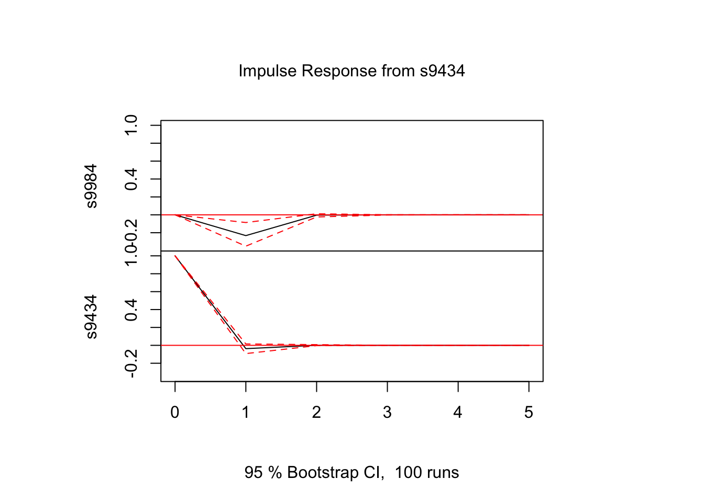
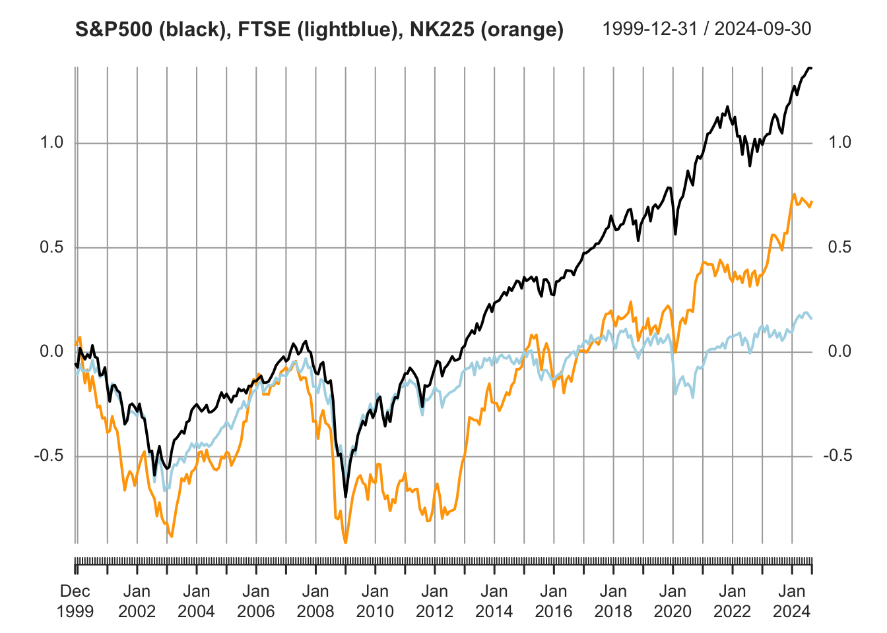

## VAR解析 (データ分析例)
VARモデルによる変数間の動学的関係性の分析

### 事例1: ソフトバンク(9434) vs ソフトバンクグループ(9984) {-}
- ソフトバンク(9434): 上場日 2018年12月19日
- 親会社ソフトバンクG (9984)
  - 保有比率(%): 66.49 (2019.03), 67.13 (2020.03), 40.86 (2021.03), 40.68 (2022.03), 40.47 (2023.03)
  - cf. https://www.buffett-code.com/company/9434/mainshareholder

- データをYahoo!ファイナンスより入手

```r
library(quantmod)
```

```
## Loading required package: xts
```

```
## Loading required package: zoo
```

```
## 
## Attaching package: 'zoo'
```

```
## The following objects are masked from 'package:base':
## 
##     as.Date, as.Date.numeric
```

```
## Loading required package: TTR
```

```
## Registered S3 method overwritten by 'quantmod':
##   method            from
##   as.zoo.data.frame zoo
```

```r
s9984 <- getSymbols('9984.T', from = '2018-12-19', auto.assign = FALSE)
s9434 <- getSymbols('9434.T', from = '2018-12-19', auto.assign = FALSE)

s9984ret <- diff(log(s9984$`9984.T.Adjusted`))[-1]
s9434ret <- diff(log(s9434$`9434.T.Adjusted`))[-1]
sb <- merge.xts(s9984ret, s9434ret, join = "inner")
colnames(sb) <- c("s9984", "s9434")
```

- 各変数の単位根検定

```r
library(fUnitRoots)
#unitrootTest(s9984, type = "c", lags = 1)	# type: "nc", "c", "ct"
unitrootTest(s9984ret, type = "c", lags = 1)
```

```
## 
## Title:
##  Augmented Dickey-Fuller Test
## 
## Test Results:
##   PARAMETER:
##     Lag Order: 1
##   STATISTIC:
##     DF: -23.7902
##   P VALUE:
##     t: < 2.2e-16 
##     n: 0.004413 
## 
## Description:
##  Thu Dec 21 22:48:04 2023 by user:
```

```r
unitrootTest(s9434ret, type = "c", lags = 1)
```

```
## 
## Title:
##  Augmented Dickey-Fuller Test
## 
## Test Results:
##   PARAMETER:
##     Lag Order: 1
##   STATISTIC:
##     DF: -26.6918
##   P VALUE:
##     t: < 2.2e-16 
##     n: 0.002129 
## 
## Description:
##  Thu Dec 21 22:48:04 2023 by user:
```
- --> 帰無仮説($\phi_1 = 1$)を棄却 (単位根なし)

- 標本自己共分散行列

```r
acf(sb)
```


#### VARモデルの推定 {-}
- 以下, パッケージ**vars**を利用
- VAR(p)モデルの次数の決定

```r
library(vars)
```

```
## Loading required package: MASS
```

```
## Loading required package: strucchange
```

```
## Loading required package: sandwich
```

```
## Loading required package: urca
```

```
## 
## Attaching package: 'urca'
```

```
## The following objects are masked from 'package:fUnitRoots':
## 
##     punitroot, qunitroot, unitrootTable
```

```
## Loading required package: lmtest
```

```r
vars::VARselect(sb, lag.max = 5,  type = "const")	# "const"(定数項有), trend:("トレンド有"), "both", "none"
```

```
## $selection
## AIC(n)  HQ(n)  SC(n) FPE(n) 
##      3      1      1      3 
## 
## $criteria
##                    1             2             3             4             5
## AIC(n) -1.643053e+01 -1.643284e+01 -1.643585e+01 -1.643141e+01 -1.642647e+01
## HQ(n)  -1.642104e+01 -1.641703e+01 -1.641372e+01 -1.640295e+01 -1.639169e+01
## SC(n)  -1.640533e+01 -1.639085e+01 -1.637706e+01 -1.635582e+01 -1.633408e+01
## FPE(n)  7.316636e-08  7.299743e-08  7.277807e-08  7.310216e-08  7.346430e-08
```
- --> AIC, FPEでは3, HQ, SCでは1が最適

- VAR(1)モデルの推定 (OLS推定)

```r
var1 <- vars::VAR(sb, p = 1, type = "const")
summary(var1)
```

```
## 
## VAR Estimation Results:
## ========================= 
## Endogenous variables: s9984, s9434 
## Deterministic variables: const 
## Sample size: 1219 
## Log Likelihood: 6551.186 
## Roots of the characteristic polynomial:
## 0.05631 0.03926
## Call:
## vars::VAR(y = sb, p = 1, type = "const")
## 
## 
## Estimation results for equation s9984: 
## ====================================== 
## s9984 = s9984.l1 + s9434.l1 + const 
## 
##            Estimate Std. Error t value Pr(>|t|)    
## s9984.l1  0.0444823  0.0290643   1.530 0.126158    
## s9434.l1 -0.2681082  0.0783560  -3.422 0.000643 ***
## const     0.0004995  0.0007821   0.639 0.523158    
## ---
## Signif. codes:  0 '***' 0.001 '**' 0.01 '*' 0.05 '.' 0.1 ' ' 1
## 
## 
## Residual standard error: 0.02728 on 1216 degrees of freedom
## Multiple R-Squared: 0.01015,	Adjusted R-squared: 0.008524 
## F-statistic: 6.236 on 2 and 1216 DF,  p-value: 0.002021 
## 
## 
## Estimation results for equation s9434: 
## ====================================== 
## s9434 = s9984.l1 + s9434.l1 + const 
## 
##            Estimate Std. Error t value Pr(>|t|)  
## s9984.l1 -0.0036948  0.0108395  -0.341   0.7333  
## s9434.l1 -0.0274348  0.0292229  -0.939   0.3480  
## const     0.0004829  0.0002917   1.655   0.0981 .
## ---
## Signif. codes:  0 '***' 0.001 '**' 0.01 '*' 0.05 '.' 0.1 ' ' 1
## 
## 
## Residual standard error: 0.01017 on 1216 degrees of freedom
## Multiple R-Squared: 0.0009603,	Adjusted R-squared: -0.0006828 
## F-statistic: 0.5844 on 2 and 1216 DF,  p-value: 0.5576 
## 
## 
## 
## Covariance matrix of residuals:
##           s9984     s9434
## s9984 7.440e-04 5.482e-05
## s9434 5.482e-05 1.035e-04
## 
## Correlation matrix of residuals:
##        s9984  s9434
## s9984 1.0000 0.1976
## s9434 0.1976 1.0000
```
- --> 2式とも, 9984_{t-1}の係数, 有意でない. 一方, 9434_{t-1} → 9984_tの係数, 有意


#### インパルス応答 {-}
- **直交化インパルス応答**

```r
# s9434 --> 将来のs9434, s9984の変動を調べる
ip <- vars::irf(var1, impulse = c("s9434"), response = c("s9434", "s9984"),
                n.ahead = 5, boot = TRUE)
#ip <- vars::irf(var1, impulse = c("s9984"), response = c("s9984", "s9434"),
#                n.ahead = 5, boot = TRUE)
# ortho = T (デフォルト): 直交化インパルス応答; ortho = F: 非直交化インパルス応答
# boot = T: ブートストラップ法により, 信頼区間計算
# cumulative = T: 累積インパルス応答. デフォルトはF.
plot(ip)
```


```r
# 破線は信頼区間
ip
```

```
## 
## Impulse response coefficients
## $s9434
##              s9984         s9434
## [1,]  0.000000e+00  9.972441e-03
## [2,] -2.673693e-03 -2.735917e-04
## [3,] -4.557996e-05  1.738477e-05
## [4,] -6.688503e-06 -3.085372e-07
## [5,] -2.147990e-07  3.317754e-08
## [6,] -1.844993e-08 -1.165725e-10
## 
## 
## Lower Band, CI= 0.95 
## $s9434
##              s9984         s9434
## [1,]  0.000000e+00  9.177181e-03
## [2,] -4.205260e-03 -8.888821e-04
## [3,] -2.521648e-04 -3.199214e-05
## [4,] -4.510445e-05 -9.468737e-06
## [5,] -2.382412e-06 -3.119641e-08
## [6,] -5.707879e-07 -1.123451e-07
## 
## 
## Upper Band, CI= 0.95 
## $s9434
##              s9984        s9434
## [1,]  0.000000e+00 1.072020e-02
## [2,] -1.318749e-03 2.540259e-04
## [3,]  2.012880e-04 1.100048e-04
## [4,]  2.140303e-06 3.235183e-06
## [5,]  2.168235e-06 1.387381e-06
## [6,]  1.039391e-08 4.344533e-08
```


```r
ip_2 <- vars::irf(var1, impulse = c("s9984"), response = c("s9984", "s9434"),
                n.ahead = 5, boot = TRUE)
plot(ip_2)
```


```r
ip_2
```

```
## 
## Impulse response coefficients
## $s9984
##             s9984         s9434
## [1,] 2.727697e-02  2.009806e-03
## [2,] 6.744982e-04 -1.559224e-04
## [3,] 7.180732e-05  1.785539e-06
## [4,] 2.715441e-06 -3.143018e-07
## [5,] 2.050561e-07 -1.410294e-09
## [6,] 9.499487e-09 -7.189564e-10
## 
## 
## Lower Band, CI= 0.95 
## $s9984
##              s9984         s9434
## [1,]  2.525930e-02  1.214171e-03
## [2,] -8.048462e-04 -6.473644e-04
## [3,] -5.635468e-05 -1.732487e-05
## [4,] -5.645969e-06 -6.292207e-06
## [5,] -7.161346e-08 -3.059057e-07
## [6,] -8.326693e-08 -1.055196e-07
## 
## 
## Upper Band, CI= 0.95 
## $s9984
##             s9984        s9434
## [1,] 2.898089e-02 2.952165e-03
## [2,] 2.336642e-03 4.128241e-04
## [3,] 3.531654e-04 3.560512e-05
## [4,] 3.263530e-05 8.089438e-07
## [5,] 5.223653e-06 4.936534e-07
## [6,] 4.802351e-07 7.489385e-09
```

- **非直交化インパルス応答**

```r
ip_3 <- vars::irf(var1, impulse = c("s9434"), response = c("s9434", "s9984"),
                  ortho = F, n.ahead = 5, boot = TRUE)
plot(ip_3)
```



```r
ip_3
```

```
## 
## Impulse response coefficients
## $s9434
##              s9984         s9434
## [1,]  0.000000e+00  1.000000e+00
## [2,] -2.681082e-01 -2.743478e-02
## [3,] -4.570592e-03  1.743282e-03
## [4,] -6.706987e-04 -3.093898e-05
## [5,] -2.153926e-05  3.326923e-06
## [6,] -1.850092e-06 -1.168947e-08
## 
## 
## Lower Band, CI= 0.95 
## $s9434
##              s9984         s9434
## [1,]  0.0000000000  1.000000e+00
## [2,] -0.4328842468 -8.030885e-02
## [3,] -0.0295216934 -4.745515e-03
## [4,] -0.0051470691 -1.009429e-03
## [5,] -0.0003754103 -7.587480e-06
## [6,] -0.0000714332 -1.169252e-05
## 
## 
## Upper Band, CI= 0.95 
## $s9434
##              s9984        s9434
## [1,]  0.000000e+00 1.000000e+00
## [2,] -9.527659e-02 2.602563e-02
## [3,]  1.655887e-02 1.088928e-02
## [4,]  7.119054e-04 4.564396e-04
## [5,]  2.152073e-04 1.444814e-04
## [6,]  3.915594e-06 6.971783e-06
```

- **累積インパルス応答**

```r
ip_cum <- vars::irf(var1, impulse = c("s9434"), response = c("s9434", "s9984"),
                    n.ahead = 5, boot = TRUE, cumulative = T)
plot(ip_cum)
```


#### Grangerの因果性検定 {-}

```r
vars::causality(var1, cause = "s9434")	# VAR(1)の推定結果var1を用い, 9434をcauseとするGranger因果性検定
```

```
## $Granger
## 
## 	Granger causality H0: s9434 do not Granger-cause s9984
## 
## data:  VAR object var1
## F-Test = 11.708, df1 = 1, df2 = 2432, p-value = 0.0006327
## 
## 
## $Instant
## 
## 	H0: No instantaneous causality between: s9434 and s9984
## 
## data:  VAR object var1
## Chi-squared = 45.792, df = 1, p-value = 1.315e-11
```
- --> 帰無仮説(因果性なし)棄却　→　9434をcauseとするGranger因果性の存在を示唆


```r
vars::causality(var1, cause = "s9984")
```

```
## $Granger
## 
## 	Granger causality H0: s9984 do not Granger-cause s9434
## 
## data:  VAR object var1
## F-Test = 0.11619, df1 = 1, df2 = 2432, p-value = 0.7332
## 
## 
## $Instant
## 
## 	H0: No instantaneous causality between: s9984 and s9434
## 
## data:  VAR object var1
## Chi-squared = 45.792, df = 1, p-value = 1.315e-11
```
- --> 帰無仮説(因果性なし)棄却できず　→　9984をcauseとするGranger因果性存在せず
- 一方、Grangerの瞬時因果性, 9984, 9434, いずれの方向も棄却できず → 存在を示唆


### 事例2: 米英日3株式市場 (S&P500, FTSE, 日経平均) {-}
- データをYahoo!ファイナンスより入手

```r
library(vars)

gspc <- getSymbols('^GSPC', periodicity = "monthly", from = '1999-12-31', auto.assign = FALSE)
ftse <- getSymbols('^FTSE', periodicity = "monthly", from = '1999-12-31', auto.assign = FALSE)
n225 <- getSymbols('^N225', periodicity = "monthly", from = '1999-12-31', auto.assign = FALSE)

us <- diff(log(gspc$GSPC.Adjusted))[-1]
uk <- diff(log(ftse$FTSE.Adjusted))[-1]
jp <- diff(log(n225$N225.Adjusted))[-1]
mkt <- cbind(us, uk, jp)

idx <- complete.cases(mkt) # 欠損値(NA)のあるレコードの除去
mkt <- mkt[idx]
colnames(mkt) <- c("us", "uk", "jp")

plot(cumsum(mkt), type = "l", col = c("black", "blue", "red"),
     main = "Market indices: S&P500 (black), FTSE (blue), NK225 (red)")
```



#### VARモデルの推定 {-}
- 以下, 引き続きパッケージ**vars**を利用
- 3変量VAR(2)モデルを仮定した場合の推定

```r
usukjp <- data.frame(mkt$us, mkt$uk, mkt$jp)
head(usukjp, 5)
```

```
##                     us           uk          jp
## 2000-02-01 -0.02031300 -0.005743495  0.02125795
## 2000-03-01  0.09232375  0.048174179  0.01875144
## 2000-04-01 -0.03127991 -0.033078382 -0.12354810
## 2000-05-01 -0.02215875  0.005044624 -0.09575560
## 2000-06-01  0.02365163 -0.007370510  0.06395117
```

```r
var2usukjp <- vars::VAR(usukjp, p = 2, type = "const")
#summary(var2usukjp)

# 係数推定値 (値のみ）
coef(var2usukjp)
```

```
## $us
##           Estimate  Std. Error    t value   Pr(>|t|)
## us.l1 -0.098366211 0.107245232 -0.9172082 0.35982854
## uk.l1  0.052154361 0.114076391  0.4571880 0.64789296
## jp.l1  0.106098331 0.065362581  1.6232274 0.10567417
## us.l2 -0.134442286 0.108105768 -1.2436181 0.21468784
## uk.l2  0.024561762 0.114609346  0.2143085 0.83046357
## jp.l2  0.048196279 0.065157097  0.7396935 0.46011017
## const  0.004629363 0.002708948  1.7089157 0.08858263
## 
## $uk
##           Estimate  Std. Error    t value   Pr(>|t|)
## us.l1  0.089803762 0.093616627  0.9592715 0.33825552
## uk.l1 -0.146331204 0.099579690 -1.4694885 0.14283109
## jp.l1  0.072566294 0.057056376  1.2718350 0.20449468
## us.l2 -0.159211069 0.094367806 -1.6871333 0.09269939
## uk.l2  0.100300932 0.100044917  1.0025590 0.31694552
## jp.l2 -0.008197911 0.056877005 -0.1441340 0.88549907
## const  0.000733407 0.002364698  0.3101484 0.75668052
## 
## $jp
##           Estimate  Std. Error    t value  Pr(>|t|)
## us.l1 -0.040003349 0.131655833 -0.3038479 0.7614711
## uk.l1  0.125197816 0.140041865  0.8940028 0.3720937
## jp.l1  0.073726787 0.080240071  0.9188275 0.3589823
## us.l2 -0.205453556 0.132712239 -1.5481131 0.1227327
## uk.l2  0.087750268 0.140696128  0.6236864 0.5333449
## jp.l2  0.079655295 0.079987816  0.9958429 0.3201925
## const  0.002344731 0.003325544  0.7050670 0.4813589
```

```r
# 係数推定値の行列表示 (t値や標準誤差は非表示)
vars::Acoef(var2usukjp)		# as a list of matrices
```

```
## [[1]]
##          us.l1       uk.l1      jp.l1
## us -0.09836621  0.05215436 0.10609833
## uk  0.08980376 -0.14633120 0.07256629
## jp -0.04000335  0.12519782 0.07372679
## 
## [[2]]
##         us.l2      uk.l2        jp.l2
## us -0.1344423 0.02456176  0.048196279
## uk -0.1592111 0.10030093 -0.008197911
## jp -0.2054536 0.08775027  0.079655295
```

```r
vars::Bcoef(var2usukjp)		# as a matrix
```

```
##          us.l1       uk.l1      jp.l1      us.l2      uk.l2        jp.l2
## us -0.09836621  0.05215436 0.10609833 -0.1344423 0.02456176  0.048196279
## uk  0.08980376 -0.14633120 0.07256629 -0.1592111 0.10030093 -0.008197911
## jp -0.04000335  0.12519782 0.07372679 -0.2054536 0.08775027  0.079655295
##          const
## us 0.004629363
## uk 0.000733407
## jp 0.002344731
```

- 次数$p$を選択する場合
- VAR()関数によって, 情報量規準により最適な次数を選択
  - 最大次数lag.max と採用する情報量規準icを指定

```r
varusukjp <- vars::VAR(usukjp, type = "const", lag.max = 5, ic = "AIC")
summary(varusukjp)
```

```
## 
## VAR Estimation Results:
## ========================= 
## Endogenous variables: us, uk, jp 
## Deterministic variables: const 
## Sample size: 286 
## Log Likelihood: 1661.778 
## Roots of the characteristic polynomial:
## 0.2008 0.1097 0.1021
## Call:
## vars::VAR(y = usukjp, type = "const", lag.max = 5, ic = "AIC")
## 
## 
## Estimation results for equation us: 
## =================================== 
## us = us.l1 + uk.l1 + jp.l1 + const 
## 
##        Estimate Std. Error t value Pr(>|t|)  
## us.l1 -0.091179   0.105869  -0.861   0.3898  
## uk.l1  0.043224   0.111943   0.386   0.6997  
## jp.l1  0.104531   0.065042   1.607   0.1091  
## const  0.004473   0.002682   1.668   0.0965 .
## ---
## Signif. codes:  0 '***' 0.001 '**' 0.01 '*' 0.05 '.' 0.1 ' ' 1
## 
## 
## Residual standard error: 0.04496 on 282 degrees of freedom
## Multiple R-Squared: 0.01087,	Adjusted R-squared: 0.0003438 
## F-statistic: 1.033 on 3 and 282 DF,  p-value: 0.3785 
## 
## 
## Estimation results for equation uk: 
## =================================== 
## uk = us.l1 + uk.l1 + jp.l1 + const 
## 
##         Estimate Std. Error t value Pr(>|t|)  
## us.l1  0.1067524  0.0924070   1.155   0.2490  
## uk.l1 -0.1706150  0.0977090  -1.746   0.0819 .
## jp.l1  0.0691963  0.0567711   1.219   0.2239  
## const  0.0002765  0.0023413   0.118   0.9061  
## ---
## Signif. codes:  0 '***' 0.001 '**' 0.01 '*' 0.05 '.' 0.1 ' ' 1
## 
## 
## Residual standard error: 0.03924 on 282 degrees of freedom
## Multiple R-Squared: 0.01669,	Adjusted R-squared: 0.006228 
## F-statistic: 1.595 on 3 and 282 DF,  p-value: 0.1907 
## 
## 
## Estimation results for equation jp: 
## =================================== 
## jp = us.l1 + uk.l1 + jp.l1 + const 
## 
##        Estimate Std. Error t value Pr(>|t|)
## us.l1 -0.010457   0.129260  -0.081    0.936
## uk.l1  0.098224   0.136677   0.719    0.473
## jp.l1  0.068652   0.079412   0.864    0.388
## const  0.001684   0.003275   0.514    0.608
## 
## 
## Residual standard error: 0.05489 on 282 degrees of freedom
## Multiple R-Squared: 0.01362,	Adjusted R-squared: 0.003126 
## F-statistic: 1.298 on 3 and 282 DF,  p-value: 0.2754 
## 
## 
## 
## Covariance matrix of residuals:
##          us       uk       jp
## us 0.002021 0.001409 0.001630
## uk 0.001409 0.001540 0.001267
## jp 0.001630 0.001267 0.003013
## 
## Correlation matrix of residuals:
##        us     uk     jp
## us 1.0000 0.7988 0.6605
## uk 0.7988 1.0000 0.5881
## jp 0.6605 0.5881 1.0000
```

```r
# ic = AIC, HQ, SC, FPE
# HQ: Hannan-Quinn 情報量規準,  FPE: forecast prediction error 規準
```
- --> $p=1$を選択

- 推定されたVARモデルによる予測

```r
predict(var2usukjp, n.ahead = 10, ci = 0.95) 	# 95%区間予測を 10期先まで
```

```
## $us
##               fcst       lower      upper         CI
##  [1,] -0.002850571 -0.09067302 0.08497188 0.08782245
##  [2,]  0.001145018 -0.08718551 0.08947554 0.08833052
##  [3,]  0.004255887 -0.08437414 0.09288591 0.08863002
##  [4,]  0.004125680 -0.08450590 0.09275726 0.08863158
##  [5,]  0.003980478 -0.08465179 0.09261274 0.08863226
##  [6,]  0.004003315 -0.08462895 0.09263558 0.08863227
##  [7,]  0.004009239 -0.08462303 0.09264151 0.08863227
##  [8,]  0.004008362 -0.08462391 0.09264064 0.08863227
##  [9,]  0.004006993 -0.08462528 0.09263927 0.08863227
## [10,]  0.004007225 -0.08462505 0.09263950 0.08863227
## 
## $uk
##                fcst       lower      upper         CI
##  [1,] -0.0138577396 -0.09051981 0.06280433 0.07666207
##  [2,]  0.0011811761 -0.07604333 0.07840568 0.07722450
##  [3,] -0.0003778686 -0.07828125 0.07752551 0.07790338
##  [4,]  0.0012238198 -0.07669747 0.07914511 0.07792129
##  [5,]  0.0003394923 -0.07758835 0.07826733 0.07792784
##  [6,]  0.0006130563 -0.07731547 0.07854158 0.07792852
##  [7,]  0.0005179819 -0.07741064 0.07844660 0.07792862
##  [8,]  0.0005533697 -0.07737526 0.07848200 0.07792863
##  [9,]  0.0005387375 -0.07738990 0.07846737 0.07792863
## [10,]  0.0005438698 -0.07738476 0.07847250 0.07792863
## 
## $jp
##               fcst      lower     upper        CI
##  [1,] -0.003515401 -0.1113275 0.1042967 0.1078121
##  [2,] -0.001846269 -0.1104276 0.1067351 0.1085814
##  [3,]  0.001400307 -0.1076724 0.1104730 0.1090727
##  [4,]  0.001951749 -0.1071236 0.1110271 0.1090754
##  [5,]  0.001680803 -0.1073955 0.1107571 0.1090763
##  [6,]  0.001767145 -0.1073092 0.1108435 0.1090764
##  [7,]  0.001737497 -0.1073389 0.1108139 0.1090764
##  [8,]  0.001749362 -0.1073270 0.1108258 0.1090764
##  [9,]  0.001742780 -0.1073336 0.1108192 0.1090764
## [10,]  0.001744748 -0.1073317 0.1108211 0.1090764
```

#### Granger因果性の検定 {-}
- 日本をcauseとする因果性

```r
var3usukjp <- vars::VAR(usukjp, p = 3, type = "const")
head(var3usukjp$y)		#
```

```
##                     us           uk          jp
## 2000-02-01 -0.02031300 -0.005743495  0.02125795
## 2000-03-01  0.09232375  0.048174179  0.01875144
## 2000-04-01 -0.03127991 -0.033078382 -0.12354810
## 2000-05-01 -0.02215875  0.005044624 -0.09575560
## 2000-06-01  0.02365163 -0.007370510  0.06395117
## 2000-07-01 -0.01647627  0.008297825 -0.10169496
```

```r
vars::causality(var3usukjp, cause = "jp") # jp --> us, uk
```

```
## $Granger
## 
## 	Granger causality H0: jp do not Granger-cause us uk
## 
## data:  VAR object var3usukjp
## F-Test = 0.77537, df1 = 6, df2 = 822, p-value = 0.5894
## 
## 
## $Instant
## 
## 	H0: No instantaneous causality between: jp and us uk
## 
## data:  VAR object var3usukjp
## Chi-squared = 87.237, df = 2, p-value < 2.2e-16
```
- --> Gragnerの意味での因果性なし. 同時因果性あり

- 日英をcauseとする因果性

```r
vars::causality(var3usukjp, cause = c("jp", "uk"))	# jp, uk --> us
```

```
## $Granger
## 
## 	Granger causality H0: uk jp do not Granger-cause us
## 
## data:  VAR object var3usukjp
## F-Test = 0.63007, df1 = 6, df2 = 822, p-value = 0.7063
## 
## 
## $Instant
## 
## 	H0: No instantaneous causality between: uk jp and us
## 
## data:  VAR object var3usukjp
## Chi-squared = 116.26, df = 2, p-value < 2.2e-16
```
- --> Grangerの意味での因果性なし. 同時因果性あり
```
- vars::causality()
  - causeを指定なし (デフォルト) では, 第1列の変数がcause
  - K変量VARモデルに対する因果性検定 (対応する係数にゼロ制約を課す)
  - ← 特定の2変量のみの因果性を調べる検定ではない
```

#### 予測誤差分散分解 (forecast error variance decomposition) {-}
- 直交化インパルス応答関数を使い, 第j変数の第k変数のh先予測誤差分散への寄与

```r
# library(vars)
var3_fevd <- vars::fevd(var3usukjp, n.ahead = 10) 	# 10期先まで評価する
plot(var3_fevd)

varmkt <- vars::VAR(mkt, p = 3, type = "const")
varmkt_fevd <- vars::fevd(varmkt, n.ahead = 10) 	# 10期先まで評価する
plot(varmkt_fevd)
```


- 変数の順番の影響の確認
- 分散分解 (変数の順序入れ替え)

```r
usjpuk <- data.frame(mkt$us, mkt$jp, mkt$uk)
cov(usukjp)
```

```
##             us          uk          jp
## us 0.002017123 0.001398409 0.001627248
## uk 0.001398409 0.001544378 0.001256618
## jp 0.001627248 0.001256618 0.003013484
```

```r
cov(usjpuk)
```

```
##             us          jp          uk
## us 0.002017123 0.001627248 0.001398409
## jp 0.001627248 0.003013484 0.001256618
## uk 0.001398409 0.001256618 0.001544378
```

```r
var3usjpuk <- vars::VAR(usjpuk, p = 3, type = "const")
var3_fevd_2 <- vars::fevd(var3usjpuk, n.ahead = 10) 	# 10期先まで評価する
plot(var3_fevd_2)
```


- 直交インパルス応答
- 米国 → 他市場
  - (米国, 英国, 日本)の順序 vs (米国, 日本, 英国)の順序

```r
# (us, uk, jp)
ip1 <- vars::irf(var3usukjp, impulse = c("us"), n.ahead = 5, boot = TRUE)
# ortho = T (デフォルト): 直交化インパルス応答; ortho = F: 非直交化インパルス応答
# boot = T: ブートストラップ法により, 信頼区間計算
# cumulative = T: 累積インパルス応答. デフォルトはF.
plot(ip1)
```


```r
#
# (us, jp, uk)
ip2 <- vars::irf(var3usjpuk, impulse = c("us"), n.ahead = 5, boot = TRUE)
plot(ip2)
```


- 日本 → 他市場

```r
# (us, uk, jp)
#ip3 <- vars::irf(var3usukjp, impulse = c("uk"), n.ahead = 5, boot = TRUE)
ip3 <- vars::irf(var3usukjp, impulse = c("jp"), n.ahead = 5, boot = TRUE)
plot(ip3)
```


```r
# (us, jp, uk)
ip4 <- vars::irf(var3usjpuk, impulse = c("jp"), n.ahead = 5, boot = TRUE)
plot(ip4)
```


- 確認: Choleski分解: $\Sigma = P P'$

```r
#chol(cov(usjpuk))	# 上三角行列P'
# (us, uk, jp)
t(chol(cov(usukjp)))	# 下三角行列P'
```

```
##            us          uk         jp
## us 0.04491240 0.000000000 0.00000000
## uk 0.03113638 0.023977159 0.00000000
## jp 0.03623161 0.005359133 0.04089052
```

```r
# (us, jp, uk)
t(chol(cov(usjpuk)))	# 下三角行列P'
```

```
##            us          jp         uk
## us 0.04491240 0.000000000 0.00000000
## jp 0.03623161 0.041240209 0.00000000
## uk 0.03113638 0.003115813 0.02377385
```

- (参考) Tsay氏作成パッケージMTS

```r
library(MTS)	# 'vars'との同時使用は避ける (VAR()関数が重複)
var3 <- MTS::VAR(usukjp, p = 3)	# include.mean = T (デフォルト), VAR係数の最小2乗推定
MTS::GrangerTest(usukjp, p = 3)	# include.mean = T (デフォルト)
MTS::VARMAirf(Phi = var3$Phi, Sigma = var3$Sigma)		# Theta = NULL (デフォルト): VMA係数行列
```

#### その他: Granger因果性検定の関数 {-}

- パッケージ**lmtest**
```
- grangertest(): 2変量間のGranger因果性検定
  - usage: grangertest(x, y, order = 1, na.action = na.omit, ...)
```

```r
#library(lmtest)
data(ChickEgg)	# mts, tsクラス
plot(ChickEgg)
```


```r
lmtest::grangertest(egg ~ chicken, order = 3, data = ChickEgg)	# → 有意でない
```

```
## Granger causality test
## 
## Model 1: egg ~ Lags(egg, 1:3) + Lags(chicken, 1:3)
## Model 2: egg ~ Lags(egg, 1:3)
##   Res.Df Df      F Pr(>F)
## 1     44                 
## 2     47 -3 0.5916 0.6238
```

```r
lmtest::grangertest(chicken ~ egg, order = 3, data = ChickEgg)	# → 有意(1%)
```

```
## Granger causality test
## 
## Model 1: chicken ~ Lags(chicken, 1:3) + Lags(egg, 1:3)
## Model 2: chicken ~ Lags(chicken, 1:3)
##   Res.Df Df     F   Pr(>F)   
## 1     44                     
## 2     47 -3 5.405 0.002966 **
## ---
## Signif. codes:  0 '***' 0.001 '**' 0.01 '*' 0.05 '.' 0.1 ' ' 1
```

```r
ccf(ChickEgg[, "chicken"], ChickEgg[, "egg"])		# 1: chicken, 2: egg
```


- パッケージ**NlinTS**:	非線形時系列解析, 因果性検出
```
- causality.test(): 2変量間のGranger因果性検定
  - usage: causality.test(ts1, ts2, lag, diff = FALSE)
```

```r
library (NlinTS)		# 非線形時系列解析, 因果性検出. causality.test()
```

```
## Loading required package: Rcpp
```

```r
res1 <- NlinTS::causality.test(ChickEgg[, "egg"], ChickEgg[, "chicken"], lag = 3)
res2 <- NlinTS::causality.test(ChickEgg[, "chicken"], ChickEgg[, "egg"], lag = 3)
res1$summary()
```

```
## --------------------
##     Test summary
## --------------------
## The lag parameter: p = 3
## The Granger causality Index: GCI = 0.0395451
## The value of the F-test: 0.591615
## The p_value of the F-test: 0.623786
## The critical value with 5% of risk:: 2.822
```

```r
res2$summary()
```

```
## --------------------
##     Test summary
## --------------------
## The lag parameter: p = 3
## The Granger causality Index: GCI = 0.313731
## The value of the F-test: 5.40498
## The p_value of the F-test: 0.0029664
## The critical value with 5% of risk:: 2.822
```
- --> 上のgrangertst()の結果と同一

- パッケージ**MTS**
```
- GrangerTest(): p変量のGranger因果性検定
  - usage: GrangerTest(X,p=1,include.mean=T,locInput=c(1))
```

```r
library(MTS)
```

```
## 
## Attaching package: 'MTS'
```

```
## The following object is masked from 'package:vars':
## 
##     VAR
```

```
## The following object is masked from 'package:TTR':
## 
##     VMA
```

```r
EggChick <- data.frame(egg = ChickEgg[, "egg"], chicken = ChickEgg[, "chicken"])
MTS::GrangerTest(EggChick, p = 3)	# カイ2乗検定 (F値x3 〜 (漸近的に)Chisq(3))
```

```
## Number of targeted zero parameters:  3 
## Chi-square test for Granger Causality and p-value:  1.774846 0.620424 
## Constant term: 
## Estimates:  306.1473 133544.6 
## Std.Error:  132.5194 41073.51 
## AR coefficient matrix 
## AR( 1 )-matrix 
##      [,1]  [,2]
## [1,]  1.3 0.000
## [2,] 76.6 0.292
## standard error 
##        [,1]  [,2]
## [1,]  0.143 0.000
## [2,] 25.279 0.184
## AR( 2 )-matrix 
##         [,1]  [,2]
## [1,]  -0.361 0.000
## [2,] -47.078 0.445
## standard error 
##        [,1]  [,2]
## [1,]  0.234 0.000
## [2,] 39.387 0.186
## AR( 3 )-matrix 
##          [,1]    [,2]
## [1,]   0.0042 0.00000
## [2,] -35.9327 0.00407
## standard error 
##        [,1]  [,2]
## [1,]  0.141 0.000
## [2,] 28.538 0.174
##   
## Residuals cov-mtx: 
##            [,1]      [,2]
## [1,]   22800.12   1843210
## [2,] 1843210.37 412998788
##   
## det(SSE) =  6.018998e+12 
## AIC =  29.75928 
## BIC =  30.09077 
## HQ  =  29.88712
```

```r
# MTS::GrangerTest(ChickEgg, p = 3)
```
- --> 上のgrangertst()の結果とやや異なる
