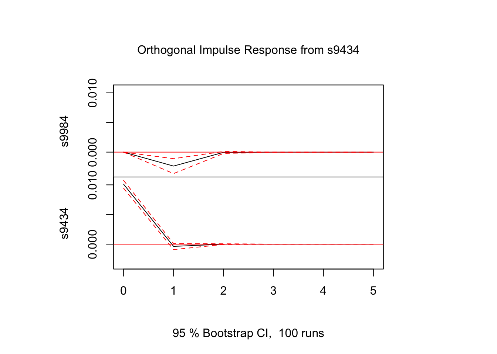
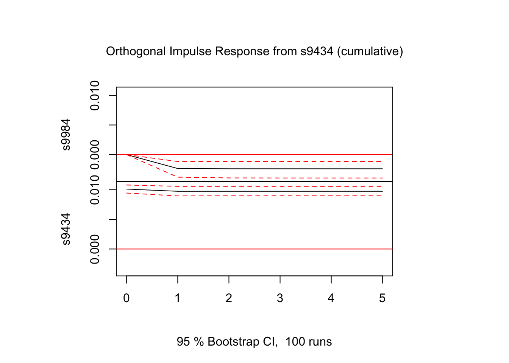
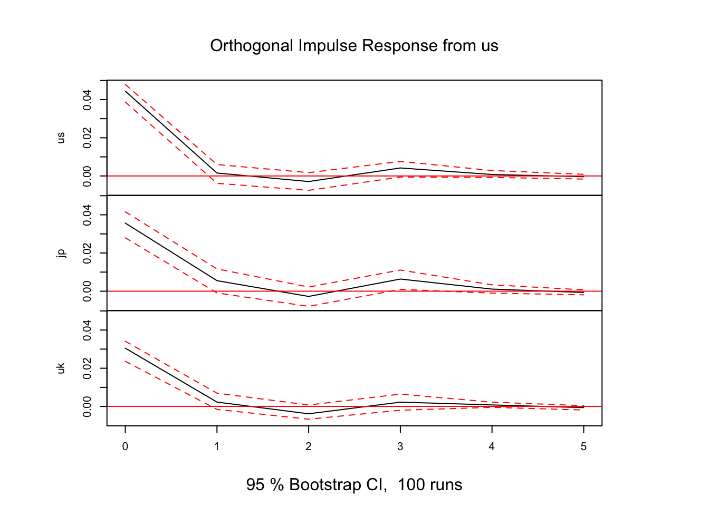

## VAR解析 (データ分析例)
VARモデルによる変数間の動学的関係性の分析

### 事例1: ソフトバンク(9434) vs ソフトバンクグループ(9984) {-}
- ソフトバンク(9434): 上場日 2018年12月19日
- 親会社ソフトバンクG (9984)
  - 保有比率(%): 66.49 (2019.03), 67.13 (2020.03), 40.86 (2021.03), 40.68 (2022.03), 40.47 (2023.03)
  - cf. https://www.buffett-code.com/company/9434/mainshareholder

- データをYahoo!ファイナンスより入手

```r
library(quantmod)
```

```
## Loading required package: xts
```

```
## Loading required package: zoo
```

```
## 
## Attaching package: 'zoo'
```

```
## The following objects are masked from 'package:base':
## 
##     as.Date, as.Date.numeric
```

```
## Loading required package: TTR
```

```
## Registered S3 method overwritten by 'quantmod':
##   method            from
##   as.zoo.data.frame zoo
```

```r
s9984 <- getSymbols('9984.T', from = '2018-12-19', auto.assign = FALSE)
s9434 <- getSymbols('9434.T', from = '2018-12-19', auto.assign = FALSE)

s9984ret <- diff(log(s9984$`9984.T.Adjusted`))[-1]
s9434ret <- diff(log(s9434$`9434.T.Adjusted`))[-1]
sb <- merge.xts(s9984ret, s9434ret, join = "inner")
colnames(sb) <- c("s9984", "s9434")
```

- 各変数の単位根検定

```r
library(fUnitRoots)
#unitrootTest(s9984, type = "c", lags = 1)	# type: "nc", "c", "ct"
unitrootTest(s9984ret, type = "c", lags = 1)
```

```
## 
## Title:
##  Augmented Dickey-Fuller Test
## 
## Test Results:
##   PARAMETER:
##     Lag Order: 1
##   STATISTIC:
##     DF: -23.8976
##   P VALUE:
##     t: < 2.2e-16 
##     n: 0.004297 
## 
## Description:
##  Wed Jan 10 22:48:24 2024 by user:
```

```r
unitrootTest(s9434ret, type = "c", lags = 1)
```

```
## 
## Title:
##  Augmented Dickey-Fuller Test
## 
## Test Results:
##   PARAMETER:
##     Lag Order: 1
##   STATISTIC:
##     DF: -26.6528
##   P VALUE:
##     t: < 2.2e-16 
##     n: 0.00215 
## 
## Description:
##  Wed Jan 10 22:48:24 2024 by user:
```
- --> 帰無仮説($\phi_1 = 1$)を棄却 (単位根なし)

- 標本自己共分散行列

```r
acf(sb)
```


#### VARモデルの推定 {-}
- 以下, パッケージ**vars**を利用
- VAR(p)モデルの次数の決定

```r
library(vars)
```

```
## Loading required package: MASS
```

```
## Loading required package: strucchange
```

```
## Loading required package: sandwich
```

```
## Loading required package: urca
```

```
## 
## Attaching package: 'urca'
```

```
## The following objects are masked from 'package:fUnitRoots':
## 
##     punitroot, qunitroot, unitrootTable
```

```
## Loading required package: lmtest
```

```r
vars::VARselect(sb, lag.max = 5,  type = "const")	# "const"(定数項有), trend:("トレンド有"), "both", "none"
```

```
## $selection
## AIC(n)  HQ(n)  SC(n) FPE(n) 
##      3      1      1      3 
## 
## $criteria
##                    1             2             3             4             5
## AIC(n) -1.643647e+01 -1.643821e+01 -1.644141e+01 -1.643703e+01 -1.643200e+01
## HQ(n)  -1.642706e+01 -1.642251e+01 -1.641943e+01 -1.640877e+01 -1.639746e+01
## SC(n)  -1.641144e+01 -1.639649e+01 -1.638300e+01 -1.636194e+01 -1.634022e+01
## FPE(n)  7.273269e-08  7.260640e-08  7.237469e-08  7.269222e-08  7.305886e-08
```
- --> AIC, FPEでは3, HQ, SCでは1が最適

- VAR(1)モデルの推定 (OLS推定)

```r
var1 <- vars::VAR(sb, p = 1, type = "const")
summary(var1)
```

```
## 
## VAR Estimation Results:
## ========================= 
## Endogenous variables: s9984, s9434 
## Deterministic variables: const 
## Sample size: 1229 
## Log Likelihood: 6608.558 
## Roots of the characteristic polynomial:
## 0.05812 0.03697
## Call:
## vars::VAR(y = sb, p = 1, type = "const")
## 
## 
## Estimation results for equation s9984: 
## ====================================== 
## s9984 = s9984.l1 + s9434.l1 + const 
## 
##            Estimate Std. Error t value Pr(>|t|)    
## s9984.l1  0.0441578  0.0289444   1.526 0.127365    
## s9434.l1 -0.2636134  0.0780204  -3.379 0.000751 ***
## const     0.0005447  0.0007779   0.700 0.483880    
## ---
## Signif. codes:  0 '***' 0.001 '**' 0.01 '*' 0.05 '.' 0.1 ' ' 1
## 
## 
## Residual standard error: 0.02723 on 1226 degrees of freedom
## Multiple R-Squared: 0.009847,	Adjusted R-squared: 0.008232 
## F-statistic: 6.096 on 2 and 1226 DF,  p-value: 0.00232 
## 
## 
## Estimation results for equation s9434: 
## ====================================== 
## s9434 = s9984.l1 + s9434.l1 + const 
## 
##            Estimate Std. Error t value Pr(>|t|)  
## s9984.l1 -0.0042953  0.0107963  -0.398   0.6908  
## s9434.l1 -0.0230106  0.0291018  -0.791   0.4293  
## const     0.0005340  0.0002901   1.841   0.0659 .
## ---
## Signif. codes:  0 '***' 0.001 '**' 0.01 '*' 0.05 '.' 0.1 ' ' 1
## 
## 
## Residual standard error: 0.01016 on 1226 degrees of freedom
## Multiple R-Squared: 0.0007685,	Adjusted R-squared: -0.0008616 
## F-statistic: 0.4714 on 2 and 1226 DF,  p-value: 0.6242 
## 
## 
## 
## Covariance matrix of residuals:
##           s9984     s9434
## s9984 7.416e-04 5.451e-05
## s9434 5.451e-05 1.032e-04
## 
## Correlation matrix of residuals:
##       s9984 s9434
## s9984 1.000 0.197
## s9434 0.197 1.000
```
- --> 2式とも, 9984_{t-1}の係数, 有意でない. 一方, 9434_{t-1} → 9984_tの係数, 有意


#### インパルス応答 {-}
- **直交化インパルス応答**

```r
# s9434 --> 将来のs9434, s9984の変動を調べる
ip <- vars::irf(var1, impulse = c("s9434"), response = c("s9434", "s9984"),
                n.ahead = 5, boot = TRUE)
#ip <- vars::irf(var1, impulse = c("s9984"), response = c("s9984", "s9434"),
#                n.ahead = 5, boot = TRUE)
# ortho = T (デフォルト): 直交化インパルス応答; ortho = F: 非直交化インパルス応答
# boot = T: ブートストラップ法により, 信頼区間計算
# cumulative = T: 累積インパルス応答. デフォルトはF.
plot(ip)
```



```r
# 破線は信頼区間
ip
```

```
## 
## Impulse response coefficients
## $s9434
##              s9984         s9434
## [1,]  0.000000e+00  9.958863e-03
## [2,] -2.625290e-03 -2.291597e-04
## [3,] -5.551734e-05  1.654952e-05
## [4,] -6.814198e-06 -1.423512e-07
## [5,] -2.633740e-07  3.254463e-08
## [6,] -2.020921e-08  3.823986e-10
## 
## 
## Lower Band, CI= 0.95 
## $s9434
##              s9984         s9434
## [1,]  0.000000e+00  9.282217e-03
## [2,] -3.898924e-03 -7.661479e-04
## [3,] -2.978868e-04 -2.592093e-05
## [4,] -3.748442e-05 -5.930741e-06
## [5,] -3.937480e-06 -4.303484e-08
## [6,] -4.484316e-07 -4.963171e-08
## 
## 
## Upper Band, CI= 0.95 
## $s9434
##              s9984        s9434
## [1,]  0.000000e+00 1.069466e-02
## [2,] -1.409200e-03 2.325911e-04
## [3,]  2.097308e-04 8.069041e-05
## [4,]  4.328690e-06 5.403201e-06
## [5,]  1.399636e-06 8.797613e-07
## [6,]  1.867677e-08 7.626171e-08
```


```r
ip_2 <- vars::irf(var1, impulse = c("s9984"), response = c("s9984", "s9434"),
                n.ahead = 5, boot = TRUE)
plot(ip_2)
```


```r
ip_2
```

```
## 
## Impulse response coefficients
## $s9984
##             s9984         s9434
## [1,] 2.723306e-02  2.001428e-03
## [2,] 6.749478e-04 -1.630283e-04
## [3,] 7.278064e-05  8.522802e-07
## [4,] 2.989157e-06 -3.322264e-07
## [5,] 2.195738e-07 -5.194597e-09
## [6,] 1.106525e-08 -8.236050e-10
## 
## 
## Lower Band, CI= 0.95 
## $s9984
##              s9984         s9434
## [1,]  2.490183e-02  9.097260e-04
## [2,] -3.758415e-04 -6.199940e-04
## [3,] -4.494124e-05 -1.893036e-05
## [4,] -4.075746e-06 -5.459267e-06
## [5,] -4.616249e-08 -2.819966e-07
## [6,] -2.990034e-08 -5.769059e-08
## 
## 
## Upper Band, CI= 0.95 
## $s9984
##             s9984        s9434
## [1,] 2.907511e-02 2.778748e-03
## [2,] 2.319746e-03 3.054000e-04
## [3,] 2.842498e-04 2.097190e-05
## [4,] 2.662661e-05 9.335768e-07
## [5,] 3.792513e-06 2.115538e-07
## [6,] 3.994694e-07 7.064685e-09
```

- **非直交化インパルス応答**

```r
ip_3 <- vars::irf(var1, impulse = c("s9434"), response = c("s9434", "s9984"),
                  ortho = F, n.ahead = 5, boot = TRUE)
plot(ip_3)
```


```r
ip_3
```

```
## 
## Impulse response coefficients
## $s9434
##              s9984         s9434
## [1,]  0.000000e+00  1.000000e+00
## [2,] -2.636134e-01 -2.301063e-02
## [3,] -5.574667e-03  1.661788e-03
## [4,] -6.842346e-04 -1.429392e-05
## [5,] -2.644619e-05  3.267906e-06
## [6,] -2.029269e-06  3.839782e-08
## 
## 
## Lower Band, CI= 0.95 
## $s9434
##              s9984         s9434
## [1,]  0.000000e+00  1.000000e+00
## [2,] -3.876262e-01 -8.256076e-02
## [3,] -2.406738e-02 -2.828052e-03
## [4,] -3.207438e-03 -5.602510e-04
## [5,] -3.295904e-04 -2.862251e-06
## [6,] -3.907209e-05 -4.730794e-06
## 
## 
## Upper Band, CI= 0.95 
## $s9434
##              s9984        s9434
## [1,]  0.000000e+00 1.000000e+00
## [2,] -1.262426e-01 2.160862e-02
## [3,]  1.519510e-02 8.265452e-03
## [4,]  5.021998e-04 3.701600e-04
## [5,]  1.233569e-04 7.234583e-05
## [6,]  1.652151e-07 4.966565e-06
```

- **累積インパルス応答**

```r
ip_cum <- vars::irf(var1, impulse = c("s9434"), response = c("s9434", "s9984"),
                    n.ahead = 5, boot = TRUE, cumulative = T)
plot(ip_cum)
```



#### Grangerの因果性検定 {-}

```r
vars::causality(var1, cause = "s9434")	# VAR(1)の推定結果var1を用い, 9434をcauseとするGranger因果性検定
```

```
## $Granger
## 
## 	Granger causality H0: s9434 do not Granger-cause s9984
## 
## data:  VAR object var1
## F-Test = 11.416, df1 = 1, df2 = 2452, p-value = 0.0007395
## 
## 
## $Instant
## 
## 	H0: No instantaneous causality between: s9434 and s9984
## 
## data:  VAR object var1
## Chi-squared = 45.928, df = 1, p-value = 1.227e-11
```
- --> 帰無仮説(因果性なし)棄却　→　9434をcauseとするGranger因果性の存在を示唆


```r
vars::causality(var1, cause = "s9984")
```

```
## $Granger
## 
## 	Granger causality H0: s9984 do not Granger-cause s9434
## 
## data:  VAR object var1
## F-Test = 0.15828, df1 = 1, df2 = 2452, p-value = 0.6908
## 
## 
## $Instant
## 
## 	H0: No instantaneous causality between: s9984 and s9434
## 
## data:  VAR object var1
## Chi-squared = 45.928, df = 1, p-value = 1.227e-11
```
- --> 帰無仮説(因果性なし)棄却できず　→　9984をcauseとするGranger因果性存在せず
- 一方、Grangerの瞬時因果性, 9984, 9434, いずれの方向も棄却できず → 存在を示唆


### 事例2: 米英日3株式市場 (S&P500, FTSE, 日経平均) {-}
- データをYahoo!ファイナンスより入手

```r
library(vars)

gspc <- getSymbols('^GSPC', periodicity = "monthly", from = '1999-12-31', auto.assign = FALSE)
ftse <- getSymbols('^FTSE', periodicity = "monthly", from = '1999-12-31', auto.assign = FALSE)
n225 <- getSymbols('^N225', periodicity = "monthly", from = '1999-12-31', auto.assign = FALSE)

us <- diff(log(gspc$GSPC.Adjusted))[-1]
uk <- diff(log(ftse$FTSE.Adjusted))[-1]
jp <- diff(log(n225$N225.Adjusted))[-1]
mkt <- cbind(us, uk, jp)

idx <- complete.cases(mkt) # 欠損値(NA)のあるレコードの除去
mkt <- mkt[idx]
colnames(mkt) <- c("us", "uk", "jp")

plot(cumsum(mkt), type = "l", col = c("black", "blue", "red"),
     main = "Market indices: S&P500 (black), FTSE (blue), NK225 (red)")
```


#### VARモデルの推定 {-}
- 以下, 引き続きパッケージ**vars**を利用
- 3変量VAR(2)モデルを仮定した場合の推定

```r
usukjp <- data.frame(mkt$us, mkt$uk, mkt$jp)
head(usukjp, 5)
```

```
##                     us           uk          jp
## 2000-02-01 -0.02031300 -0.005743495  0.02125795
## 2000-03-01  0.09232375  0.048174179  0.01875144
## 2000-04-01 -0.03127991 -0.033078382 -0.12354810
## 2000-05-01 -0.02215875  0.005044624 -0.09575560
## 2000-06-01  0.02365163 -0.007370510  0.06395117
```

```r
var2usukjp <- vars::VAR(usukjp, p = 2, type = "const")
#summary(var2usukjp)

# 係数推定値 (値のみ）
coef(var2usukjp)
```

```
## $us
##           Estimate  Std. Error    t value   Pr(>|t|)
## us.l1 -0.093434005 0.106997485 -0.8732355 0.38328567
## uk.l1  0.047873074 0.113961172  0.4200823 0.67474864
## jp.l1  0.106718905 0.065193738  1.6369502 0.10276828
## us.l2 -0.131778787 0.107231874 -1.2289143 0.22013943
## uk.l2  0.020835535 0.113960430  0.1828313 0.85506317
## jp.l2  0.047857750 0.065066575  0.7355197 0.46264089
## const  0.004667024 0.002704711  1.7255169 0.08554161
## 
## $uk
##            Estimate  Std. Error    t value   Pr(>|t|)
## us.l1  0.0914737454 0.093344955  0.9799538 0.32795789
## uk.l1 -0.1468747394 0.099420098 -1.4773144 0.14071928
## jp.l1  0.0720365305 0.056875230  1.2665712 0.20636501
## us.l2 -0.1566369248 0.093549437 -1.6743759 0.09517729
## uk.l2  0.0978702938 0.099419451  0.9844180 0.32576295
## jp.l2 -0.0079398019 0.056764292 -0.1398732 0.88886111
## const  0.0007544966 0.002359599  0.3197563 0.74939235
## 
## $jp
##           Estimate  Std. Error    t value  Pr(>|t|)
## us.l1 -0.041678023 0.131250385 -0.3175459 0.7510669
## uk.l1  0.127027510 0.139792515  0.9086861 0.3643001
## jp.l1  0.073209011 0.079971069  0.9154437 0.3607493
## us.l2 -0.205663869 0.131537902 -1.5635331 0.1190608
## uk.l2  0.088530313 0.139791605  0.6333021 0.5270552
## jp.l2  0.079924931 0.079815081  1.0013763 0.3175126
## const  0.002335404 0.003317782  0.7039053 0.4820788
```

```r
# 係数推定値の行列表示 (t値や標準誤差は非表示)
vars::Acoef(var2usukjp)		# as a list of matrices
```

```
## [[1]]
##          us.l1       uk.l1      jp.l1
## us -0.09343401  0.04787307 0.10671891
## uk  0.09147375 -0.14687474 0.07203653
## jp -0.04167802  0.12702751 0.07320901
## 
## [[2]]
##         us.l2      uk.l2        jp.l2
## us -0.1317788 0.02083553  0.047857750
## uk -0.1566369 0.09787029 -0.007939802
## jp -0.2056639 0.08853031  0.079924931
```

```r
vars::Bcoef(var2usukjp)		# as a matrix
```

```
##          us.l1       uk.l1      jp.l1      us.l2      uk.l2        jp.l2
## us -0.09343401  0.04787307 0.10671891 -0.1317788 0.02083553  0.047857750
## uk  0.09147375 -0.14687474 0.07203653 -0.1566369 0.09787029 -0.007939802
## jp -0.04167802  0.12702751 0.07320901 -0.2056639 0.08853031  0.079924931
##           const
## us 0.0046670242
## uk 0.0007544966
## jp 0.0023354043
```

- 次数$p$を選択する場合
- VAR()関数によって, 情報量規準により最適な次数を選択
  - 最大次数lag.max と採用する情報量規準icを指定

```r
varusukjp <- vars::VAR(usukjp, type = "const", lag.max = 5, ic = "AIC")
summary(varusukjp)
```

```
## 
## VAR Estimation Results:
## ========================= 
## Endogenous variables: us, uk, jp 
## Deterministic variables: const 
## Sample size: 287 
## Log Likelihood: 1668.6 
## Roots of the characteristic polynomial:
## 0.1973 0.1094 0.102
## Call:
## vars::VAR(y = usukjp, type = "const", lag.max = 5, ic = "AIC")
## 
## 
## Estimation results for equation us: 
## =================================== 
## us = us.l1 + uk.l1 + jp.l1 + const 
## 
##        Estimate Std. Error t value Pr(>|t|)  
## us.l1 -0.087307   0.105707  -0.826   0.4095  
## uk.l1  0.039224   0.111787   0.351   0.7259  
## jp.l1  0.105517   0.064890   1.626   0.1050  
## const  0.004499   0.002676   1.681   0.0938 .
## ---
## Signif. codes:  0 '***' 0.001 '**' 0.01 '*' 0.05 '.' 0.1 ' ' 1
## 
## 
## Residual standard error: 0.04492 on 283 degrees of freedom
## Multiple R-Squared: 0.01098,	Adjusted R-squared: 0.000496 
## F-statistic: 1.047 on 3 and 283 DF,  p-value: 0.372 
## 
## 
## Estimation results for equation uk: 
## =================================== 
## uk = us.l1 + uk.l1 + jp.l1 + const 
## 
##         Estimate Std. Error t value Pr(>|t|)  
## us.l1  0.1070895  0.0922051   1.161   0.2464  
## uk.l1 -0.1714394  0.0975087  -1.758   0.0798 .
## jp.l1  0.0695786  0.0566015   1.229   0.2200  
## const  0.0002702  0.0023340   0.116   0.9079  
## ---
## Signif. codes:  0 '***' 0.001 '**' 0.01 '*' 0.05 '.' 0.1 ' ' 1
## 
## 
## Residual standard error: 0.03918 on 283 degrees of freedom
## Multiple R-Squared: 0.01684,	Adjusted R-squared: 0.006421 
## F-statistic: 1.616 on 3 and 283 DF,  p-value: 0.1858 
## 
## 
## Estimation results for equation jp: 
## =================================== 
## jp = us.l1 + uk.l1 + jp.l1 + const 
## 
##        Estimate Std. Error t value Pr(>|t|)
## us.l1 -0.012762   0.128969  -0.099    0.921
## uk.l1  0.099263   0.136388   0.728    0.467
## jp.l1  0.068900   0.079170   0.870    0.385
## const  0.001644   0.003265   0.504    0.615
## 
## 
## Residual standard error: 0.0548 on 283 degrees of freedom
## Multiple R-Squared: 0.01349,	Adjusted R-squared: 0.00303 
## F-statistic:  1.29 on 3 and 283 DF,  p-value: 0.2782 
## 
## 
## 
## Covariance matrix of residuals:
##          us       uk       jp
## us 0.002017 0.001406 0.001623
## uk 0.001406 0.001535 0.001262
## jp 0.001623 0.001262 0.003003
## 
## Correlation matrix of residuals:
##        us     uk     jp
## us 1.0000 0.7989 0.6596
## uk 0.7989 1.0000 0.5877
## jp 0.6596 0.5877 1.0000
```

```r
# ic = AIC, HQ, SC, FPE
# HQ: Hannan-Quinn 情報量規準,  FPE: forecast prediction error 規準
```
- --> $p=1$を選択

- 推定されたVARモデルによる予測

```r
predict(var2usukjp, n.ahead = 10, ci = 0.95) 	# 95%区間予測を 10期先まで
```

```
## $us
##                fcst       lower      upper         CI
##  [1,] -0.0006977499 -0.08843265 0.08703715 0.08773490
##  [2,]  0.0041398863 -0.08410511 0.09238489 0.08824500
##  [3,]  0.0043048558 -0.08424012 0.09284983 0.08854498
##  [4,]  0.0040587995 -0.08448793 0.09260553 0.08854673
##  [5,]  0.0040475911 -0.08449988 0.09259506 0.08854747
##  [6,]  0.0040608759 -0.08448660 0.09260835 0.08854747
##  [7,]  0.0040596172 -0.08448786 0.09260709 0.08854748
##  [8,]  0.0040579301 -0.08448955 0.09260541 0.08854748
##  [9,]  0.0040579406 -0.08448954 0.09260542 0.08854748
## [10,]  0.0040579965 -0.08448948 0.09260547 0.08854748
## 
## $uk
##                fcst       lower      upper         CI
##  [1,] -0.0019827980 -0.07852301 0.07455742 0.07654021
##  [2,]  0.0004161951 -0.07668851 0.07752090 0.07710470
##  [3,]  0.0011228777 -0.07664141 0.07888716 0.07776428
##  [4,]  0.0005053021 -0.07727553 0.07828613 0.07778083
##  [5,]  0.0005970479 -0.07719011 0.07838421 0.07778716
##  [6,]  0.0005614320 -0.07722638 0.07834924 0.07778781
##  [7,]  0.0005779842 -0.07720992 0.07836589 0.07778790
##  [8,]  0.0005702095 -0.07721771 0.07835812 0.07778792
##  [9,]  0.0005726775 -0.07721524 0.07836059 0.07778792
## [10,]  0.0005719094 -0.07721601 0.07835983 0.07778792
## 
## $jp
##               fcst      lower     upper        CI
##  [1,] -0.004139235 -0.1117608 0.1034824 0.1076216
##  [2,]  0.001425911 -0.1069598 0.1098116 0.1083857
##  [3,]  0.001957256 -0.1069198 0.1108343 0.1088770
##  [4,]  0.001741298 -0.1071387 0.1106213 0.1088800
##  [5,]  0.001728396 -0.1071526 0.1106094 0.1088810
##  [6,]  0.001718244 -0.1071628 0.1105993 0.1088811
##  [7,]  0.001721819 -0.1071593 0.1106029 0.1088811
##  [8,]  0.001717539 -0.1071635 0.1105986 0.1088811
##  [9,]  0.001718318 -0.1071628 0.1105994 0.1088811
## [10,]  0.001718005 -0.1071631 0.1105991 0.1088811
```

#### Granger因果性の検定 {-}
- 日本をcauseとする因果性

```r
var3usukjp <- vars::VAR(usukjp, p = 3, type = "const")
head(var3usukjp$y)		#
```

```
##                     us           uk          jp
## 2000-02-01 -0.02031300 -0.005743495  0.02125795
## 2000-03-01  0.09232375  0.048174179  0.01875144
## 2000-04-01 -0.03127991 -0.033078382 -0.12354810
## 2000-05-01 -0.02215875  0.005044624 -0.09575560
## 2000-06-01  0.02365163 -0.007370510  0.06395117
## 2000-07-01 -0.01647627  0.008297825 -0.10169496
```

```r
vars::causality(var3usukjp, cause = "jp") # jp --> us, uk
```

```
## $Granger
## 
## 	Granger causality H0: jp do not Granger-cause us uk
## 
## data:  VAR object var3usukjp
## F-Test = 0.77421, df1 = 6, df2 = 825, p-value = 0.5903
## 
## 
## $Instant
## 
## 	H0: No instantaneous causality between: jp and us uk
## 
## data:  VAR object var3usukjp
## Chi-squared = 87.383, df = 2, p-value < 2.2e-16
```
- --> Gragnerの意味での因果性なし. 同時因果性あり

- 日英をcauseとする因果性

```r
vars::causality(var3usukjp, cause = c("jp", "uk"))	# jp, uk --> us
```

```
## $Granger
## 
## 	Granger causality H0: uk jp do not Granger-cause us
## 
## data:  VAR object var3usukjp
## F-Test = 0.6185, df1 = 6, df2 = 825, p-value = 0.7156
## 
## 
## $Instant
## 
## 	H0: No instantaneous causality between: uk jp and us
## 
## data:  VAR object var3usukjp
## Chi-squared = 116.62, df = 2, p-value < 2.2e-16
```
- --> Grangerの意味での因果性なし. 同時因果性あり
```
- vars::causality()
  - causeを指定なし (デフォルト) では, 第1列の変数がcause
  - K変量VARモデルに対する因果性検定 (対応する係数にゼロ制約を課す)
  - ← 特定の2変量のみの因果性を調べる検定ではない
```

#### 予測誤差分散分解 (forecast error variance decomposition) {-}
- 直交化インパルス応答関数を使い, 第j変数の第k変数のh先予測誤差分散への寄与

```r
# library(vars)
var3_fevd <- vars::fevd(var3usukjp, n.ahead = 10) 	# 10期先まで評価する
plot(var3_fevd)

varmkt <- vars::VAR(mkt, p = 3, type = "const")
varmkt_fevd <- vars::fevd(varmkt, n.ahead = 10) 	# 10期先まで評価する
plot(varmkt_fevd)
```


- 変数の順番の影響の確認
- 分散分解 (変数の順序入れ替え)

```r
usjpuk <- data.frame(mkt$us, mkt$jp, mkt$uk)
cov(usukjp)
```

```
##             us          uk          jp
## us 0.002013516 0.001395736 0.001621005
## uk 0.001395736 0.001539665 0.001251566
## jp 0.001621005 0.001251566 0.003003028
```

```r
cov(usjpuk)
```

```
##             us          jp          uk
## us 0.002013516 0.001621005 0.001395736
## jp 0.001621005 0.003003028 0.001251566
## uk 0.001395736 0.001251566 0.001539665
```

```r
var3usjpuk <- vars::VAR(usjpuk, p = 3, type = "const")
var3_fevd_2 <- vars::fevd(var3usjpuk, n.ahead = 10) 	# 10期先まで評価する
plot(var3_fevd_2)
```


- 直交インパルス応答
- 米国 → 他市場
  - (米国, 英国, 日本)の順序 vs (米国, 日本, 英国)の順序

```r
# (us, uk, jp)
ip1 <- vars::irf(var3usukjp, impulse = c("us"), n.ahead = 5, boot = TRUE)
# ortho = T (デフォルト): 直交化インパルス応答; ortho = F: 非直交化インパルス応答
# boot = T: ブートストラップ法により, 信頼区間計算
# cumulative = T: 累積インパルス応答. デフォルトはF.
plot(ip1)
```


```r
#
# (us, jp, uk)
ip2 <- vars::irf(var3usjpuk, impulse = c("us"), n.ahead = 5, boot = TRUE)
plot(ip2)
```



- 日本 → 他市場

```r
# (us, uk, jp)
#ip3 <- vars::irf(var3usukjp, impulse = c("uk"), n.ahead = 5, boot = TRUE)
ip3 <- vars::irf(var3usukjp, impulse = c("jp"), n.ahead = 5, boot = TRUE)
plot(ip3)
```


```r
# (us, jp, uk)
ip4 <- vars::irf(var3usjpuk, impulse = c("jp"), n.ahead = 5, boot = TRUE)
plot(ip4)
```


- 確認: Choleski分解: $\Sigma = P P'$

```r
#chol(cov(usjpuk))	# 上三角行列P'
# (us, uk, jp)
t(chol(cov(usukjp)))	# 下三角行列P'
```

```
##            us          uk         jp
## us 0.04487221 0.000000000 0.00000000
## uk 0.03110469 0.023919941 0.00000000
## jp 0.03612491 0.005347501 0.04085857
```

```r
# (us, jp, uk)
t(chol(cov(usjpuk)))	# 下三角行列P'
```

```
##            us          jp         uk
## us 0.04487221 0.000000000 0.00000000
## jp 0.03612491 0.041207020 0.00000000
## uk 0.03110469 0.003104129 0.02371767
```

- (参考) Tsay氏作成パッケージMTS

```r
library(MTS)	# 'vars'との同時使用は避ける (VAR()関数が重複)
var3 <- MTS::VAR(usukjp, p = 3)	# include.mean = T (デフォルト), VAR係数の最小2乗推定
MTS::GrangerTest(usukjp, p = 3)	# include.mean = T (デフォルト)
MTS::VARMAirf(Phi = var3$Phi, Sigma = var3$Sigma)		# Theta = NULL (デフォルト): VMA係数行列
```

#### その他: Granger因果性検定の関数 {-}

- パッケージ**lmtest**
```
- grangertest(): 2変量間のGranger因果性検定
  - usage: grangertest(x, y, order = 1, na.action = na.omit, ...)
```

```r
#library(lmtest)
data(ChickEgg)	# mts, tsクラス
plot(ChickEgg)
```


```r
lmtest::grangertest(egg ~ chicken, order = 3, data = ChickEgg)	# → 有意でない
```

```
## Granger causality test
## 
## Model 1: egg ~ Lags(egg, 1:3) + Lags(chicken, 1:3)
## Model 2: egg ~ Lags(egg, 1:3)
##   Res.Df Df      F Pr(>F)
## 1     44                 
## 2     47 -3 0.5916 0.6238
```

```r
lmtest::grangertest(chicken ~ egg, order = 3, data = ChickEgg)	# → 有意(1%)
```

```
## Granger causality test
## 
## Model 1: chicken ~ Lags(chicken, 1:3) + Lags(egg, 1:3)
## Model 2: chicken ~ Lags(chicken, 1:3)
##   Res.Df Df     F   Pr(>F)   
## 1     44                     
## 2     47 -3 5.405 0.002966 **
## ---
## Signif. codes:  0 '***' 0.001 '**' 0.01 '*' 0.05 '.' 0.1 ' ' 1
```

```r
ccf(ChickEgg[, "chicken"], ChickEgg[, "egg"])		# 1: chicken, 2: egg
```


- パッケージ**NlinTS**:	非線形時系列解析, 因果性検出
```
- causality.test(): 2変量間のGranger因果性検定
  - usage: causality.test(ts1, ts2, lag, diff = FALSE)
```

```r
library (NlinTS)		# 非線形時系列解析, 因果性検出. causality.test()
```

```
## Loading required package: Rcpp
```

```r
res1 <- NlinTS::causality.test(ChickEgg[, "egg"], ChickEgg[, "chicken"], lag = 3)
res2 <- NlinTS::causality.test(ChickEgg[, "chicken"], ChickEgg[, "egg"], lag = 3)
res1$summary()
```

```
## --------------------
##     Test summary
## --------------------
## The lag parameter: p = 3
## The Granger causality Index: GCI = 0.0395451
## The value of the F-test: 0.591615
## The p_value of the F-test: 0.623786
## The critical value with 5% of risk:: 2.822
```

```r
res2$summary()
```

```
## --------------------
##     Test summary
## --------------------
## The lag parameter: p = 3
## The Granger causality Index: GCI = 0.313731
## The value of the F-test: 5.40498
## The p_value of the F-test: 0.0029664
## The critical value with 5% of risk:: 2.822
```
- --> 上のgrangertst()の結果と同一

- パッケージ**MTS**
```
- GrangerTest(): p変量のGranger因果性検定
  - usage: GrangerTest(X,p=1,include.mean=T,locInput=c(1))
```

```r
library(MTS)
```

```
## 
## Attaching package: 'MTS'
```

```
## The following object is masked from 'package:vars':
## 
##     VAR
```

```
## The following object is masked from 'package:TTR':
## 
##     VMA
```

```r
EggChick <- data.frame(egg = ChickEgg[, "egg"], chicken = ChickEgg[, "chicken"])
MTS::GrangerTest(EggChick, p = 3)	# カイ2乗検定 (F値x3 〜 (漸近的に)Chisq(3))
```

```
## Number of targeted zero parameters:  3 
## Chi-square test for Granger Causality and p-value:  1.774846 0.620424 
## Constant term: 
## Estimates:  306.1473 133544.6 
## Std.Error:  132.5194 41073.51 
## AR coefficient matrix 
## AR( 1 )-matrix 
##      [,1]  [,2]
## [1,]  1.3 0.000
## [2,] 76.6 0.292
## standard error 
##        [,1]  [,2]
## [1,]  0.143 0.000
## [2,] 25.279 0.184
## AR( 2 )-matrix 
##         [,1]  [,2]
## [1,]  -0.361 0.000
## [2,] -47.078 0.445
## standard error 
##        [,1]  [,2]
## [1,]  0.234 0.000
## [2,] 39.387 0.186
## AR( 3 )-matrix 
##          [,1]    [,2]
## [1,]   0.0042 0.00000
## [2,] -35.9327 0.00407
## standard error 
##        [,1]  [,2]
## [1,]  0.141 0.000
## [2,] 28.538 0.174
##   
## Residuals cov-mtx: 
##            [,1]      [,2]
## [1,]   22800.12   1843210
## [2,] 1843210.37 412998788
##   
## det(SSE) =  6.018998e+12 
## AIC =  29.75928 
## BIC =  30.09077 
## HQ  =  29.88712
```

```r
# MTS::GrangerTest(ChickEgg, p = 3)
```
- --> 上のgrangertst()の結果とやや異なる
