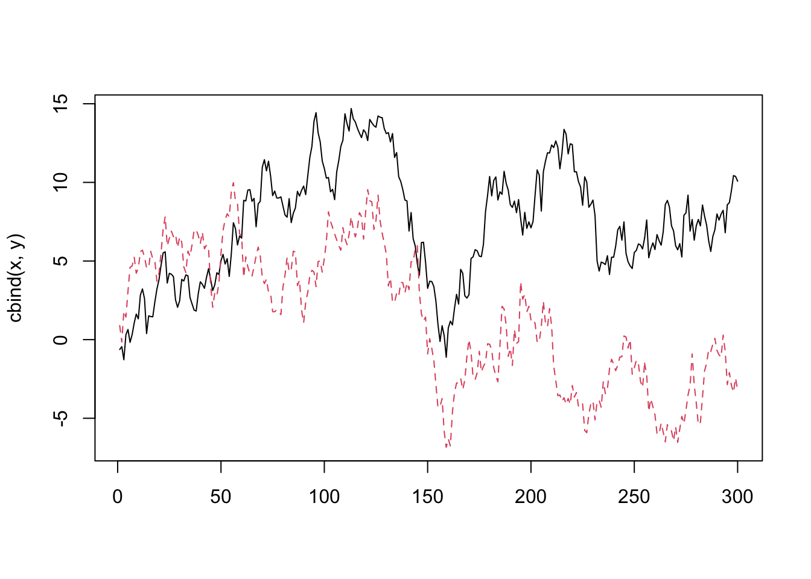

# 共和分分析・誤差修正モデル

## 見せかけの回帰
- 単位根検定で扱った内容の再掲
- 参考: 福地・伊藤, 10.1


```r
Tlen <- 300
Seedv <- 1
set.seed(Seedv)
w1 <- rnorm(Tlen)
w2 <- rnorm(Tlen)
x <- cumsum(w1)
y <- cumsum(w2)
matplot(cbind(x,y), type = "l")
```



```r
reslm <- lm(y ~ x)
summary(reslm)
```

```
## 
## Call:
## lm(formula = y ~ x)
## 
## Residuals:
##     Min      1Q  Median      3Q     Max 
## -8.0778 -3.6190  0.0812  3.9438  8.6039 
## 
## Coefficients:
##             Estimate Std. Error t value Pr(>|t|)  
## (Intercept)  0.13230    0.55381   0.239   0.8114  
## x            0.16810    0.06713   2.504   0.0128 *
## ---
## Signif. codes:  0 '***' 0.001 '**' 0.01 '*' 0.05 '.' 0.1 ' ' 1
## 
## Residual standard error: 4.284 on 298 degrees of freedom
## Multiple R-squared:  0.02061,	Adjusted R-squared:  0.01733 
## F-statistic: 6.272 on 1 and 298 DF,  p-value: 0.0128
```

```r
plot(x, y); abline(reslm, col = "red")
```


- 残差に自己相関が残ることの確認

```r
reslm_resid = resid(reslm)
plot(reslm_resid, type = "l")
```


```r
acf(reslm_resid)
```


### Durbin-Watson検定 {-}
- Durbin-Watson統計量
- 回帰残差の系列相関の有無を検定
- $DW \approx 2(1-\rho)$.
- $0<DW<4$. 無相関⇔ $DW=2$
- 見せかけの回帰の場合. $DW$が小さい傾向(正の系列相関)

```r
library(lmtest)
```

```
## Loading required package: zoo
```

```
## 
## Attaching package: 'zoo'
```

```
## The following objects are masked from 'package:base':
## 
##     as.Date, as.Date.numeric
```

```r
dwtest(reslm)
```

```
## 
## 	Durbin-Watson test
## 
## data:  reslm
## DW = 0.060411, p-value < 2.2e-16
## alternative hypothesis: true autocorrelation is greater than 0
```

- 単位根検定のためのR関数
  - ADF検定: "tseries"内, adf.test(); "fUnitRoots"内, unitrootTest(), adfTest()	
  - Phillips-Perron検定: "urca"内, ur.pp(); "tseries"内, pp.test()
  - KPSS検定: "urca"内, ur.kpss(); "tseries"内, kpss.test()

## 共和分検定
- 沖本, 問題6.3, p.144, を参考に4系列 ${\bf y}_t=(y_{1,t},y_{2,t},y_{3,t},y_{4,t})'$ を生成
  - $w_{1,t},w_{2,t}$は, 互いに独立な単位根過程
  - $u_{1,t},u_{2,t},u_{3,t},u_{4,t}$は互いに独立な定常過程. $w_{1,t},w_{2,t}$とも独立

$$
\left\{
\begin{split}
 y_{1,t} &= w_{1,t}+u_{1,t}    \\
 y_{2,t} &= 2 w_{1,t} + u_{1,t}  \\
 y_{3,t} &= w_{2,t} + u_{3,t}    \\ 
 y_{4,t} &= w_{1,t}+ 2 w_{2,t} + u_{4,t}
\end{split}
\right.
$$

- この時, 線形独立な共和分ベクトル $\beta_1 = (1,-0.5,0,0)$, $\beta_2 = (1,0,2,-1)$. 
それ以外の共和分ベクトルは$\beta_1,\beta_2$の線形和で表現される.

- 以下では, 全て正規乱数によりサンプルパス生成 (長さ=300)


```r
Tlen <- 300
Seedv <- 1
set.seed(Seedv)
w1 <- cumsum(rnorm(Tlen))
w2 <- cumsum(rnorm(Tlen))
u1 <- rnorm(Tlen); u2 <- rnorm(Tlen)
u3 <- rnorm(Tlen); u4 <- rnorm(Tlen)
#
y1 <- w1 + u1
y2 <- 2 * w1 + u2
y3 <- w2 + u3
y4 <- w1 + 2 * w2 + u4
#
# beta1 = (1, -0.5, 0, 0)
# beta2 = (1, 0, 2, -1)
#
ymat <- cbind(y1, y2, y3, y4)
matplot(ymat, type = "l")
```


- 各成分が単位根過程 $I(1)$ であることを確認

```r
fUnitRoots::adfTest(y1)
```

```
## 
## Title:
##  Augmented Dickey-Fuller Test
## 
## Test Results:
##   PARAMETER:
##     Lag Order: 1
##   STATISTIC:
##     Dickey-Fuller: -1.0735
##   P VALUE:
##     0.2742 
## 
## Description:
##  Wed Jan 10 22:07:45 2024 by user:
```

```r
fUnitRoots::adfTest(y2)
```

```
## 
## Title:
##  Augmented Dickey-Fuller Test
## 
## Test Results:
##   PARAMETER:
##     Lag Order: 1
##   STATISTIC:
##     Dickey-Fuller: -0.6699
##   P VALUE:
##     0.4028 
## 
## Description:
##  Wed Jan 10 22:07:45 2024 by user:
```

```r
fUnitRoots::adfTest(y3)
```

```
## 
## Title:
##  Augmented Dickey-Fuller Test
## 
## Test Results:
##   PARAMETER:
##     Lag Order: 1
##   STATISTIC:
##     Dickey-Fuller: -2.429
##   P VALUE:
##     0.01647 
## 
## Description:
##  Wed Jan 10 22:07:45 2024 by user:
```

```r
fUnitRoots::adfTest(y4)
```

```
## 
## Title:
##  Augmented Dickey-Fuller Test
## 
## Test Results:
##   PARAMETER:
##     Lag Order: 1
##   STATISTIC:
##     Dickey-Fuller: -1.4105
##   P VALUE:
##     0.1668 
## 
## Description:
##  Wed Jan 10 22:07:45 2024 by user:
```


### Engle-Grangerの方法
- 共和分検定
- Philips-Ouliaris検定
```
- 'urca'パッケージ内, ca.po関数
  - demean (使用するランダムウォーク・モデルのトレンドの指定): "none", "const"(定数項), "trend"(定数項+時間トレンド)
  - type (検定種類): "Pu"(デフォルト), "Pz"
```


```r
library(urca)
test_po <- ca.po(ymat[, 1:2], demean = "const")
summary(test_po)
```

```
## 
## ######################################## 
## # Phillips and Ouliaris Unit Root Test # 
## ######################################## 
## 
## Test of type Pu 
## detrending of series with constant only 
## 
## 
## Call:
## lm(formula = z[, 1] ~ z[, -1])
## 
## Residuals:
##     Min      1Q  Median      3Q     Max 
## -2.9862 -0.8963  0.0480  0.8510  3.7398 
## 
## Coefficients:
##             Estimate Std. Error t value Pr(>|t|)    
## (Intercept) 0.011865   0.159168   0.075    0.941    
## z[, -1]     0.496697   0.009679  51.315   <2e-16 ***
## ---
## Signif. codes:  0 '***' 0.001 '**' 0.01 '*' 0.05 '.' 0.1 ' ' 1
## 
## Residual standard error: 1.232 on 298 degrees of freedom
## Multiple R-squared:  0.8983,	Adjusted R-squared:  0.898 
## F-statistic:  2633 on 1 and 298 DF,  p-value: < 2.2e-16
## 
## 
## Value of test-statistic is: 237.1763 
## 
## Critical values of Pu are:
##                   10pct   5pct    1pct
## critical values 27.8536 33.713 48.0021
```
- --> 帰無仮説棄却. y1とy2には共和分関係あり


```r
test_po <- ca.po(ymat[, c(1, 3)], demean = "const")
summary(test_po)
```

```
## 
## ######################################## 
## # Phillips and Ouliaris Unit Root Test # 
## ######################################## 
## 
## Test of type Pu 
## detrending of series with constant only 
## 
## 
## Call:
## lm(formula = z[, 1] ~ z[, -1])
## 
## Residuals:
##     Min      1Q  Median      3Q     Max 
## -9.0665 -2.7199  0.2856  2.6610  8.5926 
## 
## Coefficients:
##             Estimate Std. Error t value Pr(>|t|)    
## (Intercept)  7.16688    0.23222  30.863   <2e-16 ***
## z[, -1]      0.10689    0.04944   2.162   0.0314 *  
## ---
## Signif. codes:  0 '***' 0.001 '**' 0.01 '*' 0.05 '.' 0.1 ' ' 1
## 
## Residual standard error: 3.833 on 298 degrees of freedom
## Multiple R-squared:  0.01545,	Adjusted R-squared:  0.01214 
## F-statistic: 4.675 on 1 and 298 DF,  p-value: 0.0314
## 
## 
## Value of test-statistic is: 49.2634 
## 
## Critical values of Pu are:
##                   10pct   5pct    1pct
## critical values 27.8536 33.713 48.0021
```
- --> 帰無仮説棄却されず. y1とy3には共和分関係なし

### Johansenの方法
- 観測時系列がGaussian VAR(p)に従う場合

#### (1) 最大固有値検定 {-}
- $H_0$: 共和分ランク$=r$, $H_1$: 共和分ランク$=r+1$
```
- 'urca'パッケージ内, ca.jo関数:
  - type (検定の種類):	‘eigen’(最大固有値検定) or ‘trace’(トレース検定)
  - ecdet (トレンド種類): ‘none’(切片項なし), ‘const’(定数項あり),‘trend’(トレンド項あり)
  - K (時系列(水準)のVAR表現におけるラグ次数)
  - spec (VECMの定式化の2つの方法の一つを選択): "longrun"(デフォルト), or "transitory"
  - season (季節ダミー):	データの頻度を指定(例, 四半期の場合は4)
```

- $y_{1,t}$ vs $y_{2,t}$

```r
# Y1 vs Y2
result_e1 <- ca.jo(ymat[, 1:2], ecdet = "none", type = "eigen", spec = "longrun")
# result_e1 <- ca.jo(ymat[, 1:2], ecdet = "const", type = "eigen", spec = "longrun")
summary(result_e1)
```

```
## 
## ###################### 
## # Johansen-Procedure # 
## ###################### 
## 
## Test type: maximal eigenvalue statistic (lambda max) , with linear trend 
## 
## Eigenvalues (lambda):
## [1] 0.3905716 0.0248999
## 
## Values of teststatistic and critical values of test:
## 
##            test 10pct  5pct  1pct
## r <= 1 |   7.51  6.50  8.18 11.65
## r = 0  | 147.58 12.91 14.90 19.19
## 
## Eigenvectors, normalised to first column:
## (These are the cointegration relations)
## 
##            y1.l2    y2.l2
## y1.l2  1.0000000 1.000000
## y2.l2 -0.5067464 1.605612
## 
## Weights W:
## (This is the loading matrix)
## 
##           y1.l2       y2.l2
## y1.d -1.0278147 -0.01135393
## y2.d  0.2537971 -0.02386878
```

```r
# Test type: maximal eigenvalue statistic (lambda max) , without linear trend and constant in cointegration 
```
- --> $r=0$棄却. $r=1$採択
  - --> $r=1$棄却されず
  - --> 共和分ベクトルの個数$=1$


- $y_{1,t}$ vs $y_{3,t}$

```r
result_e2 <- ca.jo(ymat[, c(1, 3)], ecdet = "none", type = "eigen", spec = "longrun")
summary(result_e2)
```

```
## 
## ###################### 
## # Johansen-Procedure # 
## ###################### 
## 
## Test type: maximal eigenvalue statistic (lambda max) , with linear trend 
## 
## Eigenvalues (lambda):
## [1] 0.03647142 0.01989793
## 
## Values of teststatistic and critical values of test:
## 
##           test 10pct  5pct  1pct
## r <= 1 |  5.99  6.50  8.18 11.65
## r = 0  | 11.07 12.91 14.90 19.19
## 
## Eigenvectors, normalised to first column:
## (These are the cointegration relations)
## 
##            y1.l2    y3.l2
## y1.l2  1.0000000 1.000000
## y3.l2 -0.2931313 3.722196
## 
## Weights W:
## (This is the loading matrix)
## 
##            y1.l2        y3.l2
## y1.d -0.08988397 -0.001808379
## y3.d  0.00931081 -0.012801165
```
- --> 共和分ベクトルの個数 = 0
  - --> 共和分関係の有無はシステムに含まれる (分析対象の) 変数に依存する


- 全変数

```r
result_e3 <- ca.jo(ymat, ecdet = "none", type = "eigen", spec = "longrun")
summary(result_e3)
```

```
## 
## ###################### 
## # Johansen-Procedure # 
## ###################### 
## 
## Test type: maximal eigenvalue statistic (lambda max) , with linear trend 
## 
## Eigenvalues (lambda):
## [1] 0.41152190 0.31843086 0.03070008 0.01518851
## 
## Values of teststatistic and critical values of test:
## 
##            test 10pct  5pct  1pct
## r <= 3 |   4.56  6.50  8.18 11.65
## r <= 2 |   9.29 12.91 14.90 19.19
## r <= 1 | 114.24 18.90 21.07 25.75
## r = 0  | 158.00 24.78 27.14 32.14
## 
## Eigenvectors, normalised to first column:
## (These are the cointegration relations)
## 
##            y1.l2     y2.l2      y3.l2     y4.l2
## y1.l2  1.0000000  1.000000  1.0000000  1.000000
## y2.l2 -0.4152868 -1.203804  1.6984235 -0.709649
## y3.l2  0.4077782 -2.778127 -0.4655081  2.308246
## y4.l2 -0.1932126  1.416298 -0.4252644  2.950571
## 
## Weights W:
## (This is the loading matrix)
## 
##           y1.l2       y2.l2        y3.l2         y4.l2
## y1.d -0.9686408 -0.07197835 -0.013303876  1.041764e-05
## y2.d  0.1872784  0.08900271 -0.027317212  3.384301e-04
## y3.d -0.2500354  0.21295281  0.001268037 -3.840195e-03
## y4.d  0.3195356 -0.10057155 -0.012859058 -8.212798e-03
```
- --> 共和分ベクトルの個数$=2$

##### (2) トレース検定 {-}
- $H_0$: 共和分ランク$=r$, $H_1$: 共和分ランク$=m$ (原系列は定常)

```r
result_t1 <- ca.jo(ymat, ecdet = "none", type = "trace", spec = "longrun")
#result_t1 <- ca.jo(ymat, ecdet = "const", type = "trace", spec = "longrun")
summary(result_t1)
```

```
## 
## ###################### 
## # Johansen-Procedure # 
## ###################### 
## 
## Test type: trace statistic , with linear trend 
## 
## Eigenvalues (lambda):
## [1] 0.41152190 0.31843086 0.03070008 0.01518851
## 
## Values of teststatistic and critical values of test:
## 
##            test 10pct  5pct  1pct
## r <= 3 |   4.56  6.50  8.18 11.65
## r <= 2 |  13.85 15.66 17.95 23.52
## r <= 1 | 128.09 28.71 31.52 37.22
## r = 0  | 286.10 45.23 48.28 55.43
## 
## Eigenvectors, normalised to first column:
## (These are the cointegration relations)
## 
##            y1.l2     y2.l2      y3.l2     y4.l2
## y1.l2  1.0000000  1.000000  1.0000000  1.000000
## y2.l2 -0.4152868 -1.203804  1.6984235 -0.709649
## y3.l2  0.4077782 -2.778127 -0.4655081  2.308246
## y4.l2 -0.1932126  1.416298 -0.4252644  2.950571
## 
## Weights W:
## (This is the loading matrix)
## 
##           y1.l2       y2.l2        y3.l2         y4.l2
## y1.d -0.9686408 -0.07197835 -0.013303876  1.041764e-05
## y2.d  0.1872784  0.08900271 -0.027317212  3.384301e-04
## y3.d -0.2500354  0.21295281  0.001268037 -3.840195e-03
## y4.d  0.3195356 -0.10057155 -0.012859058 -8.212798e-03
```
- --> 共和分ベクトルの個数$=2$

- 共和分ベクトルをウェイトとする$Yt$の各成分の線形和計算
  - → 定常性の確認

```r
tmp <- ymat %*% summary(result_t1)@V
fUnitRoots::adfTest(tmp[, 1])
```

```
## Warning in fUnitRoots::adfTest(tmp[, 1]): p-value smaller than printed p-value
```

```
## 
## Title:
##  Augmented Dickey-Fuller Test
## 
## Test Results:
##   PARAMETER:
##     Lag Order: 1
##   STATISTIC:
##     Dickey-Fuller: -13.8251
##   P VALUE:
##     0.01 
## 
## Description:
##  Wed Jan 10 22:07:46 2024 by user:
```

```r
fUnitRoots::adfTest(tmp[, 2])
```

```
## Warning in fUnitRoots::adfTest(tmp[, 2]): p-value smaller than printed p-value
```

```
## 
## Title:
##  Augmented Dickey-Fuller Test
## 
## Test Results:
##   PARAMETER:
##     Lag Order: 1
##   STATISTIC:
##     Dickey-Fuller: -11.6347
##   P VALUE:
##     0.01 
## 
## Description:
##  Wed Jan 10 22:07:46 2024 by user:
```

```r
##fUnitRoots::adfTest(tmp[, 3])
##fUnitRoots::adfTest(tmp[, 4])
```

