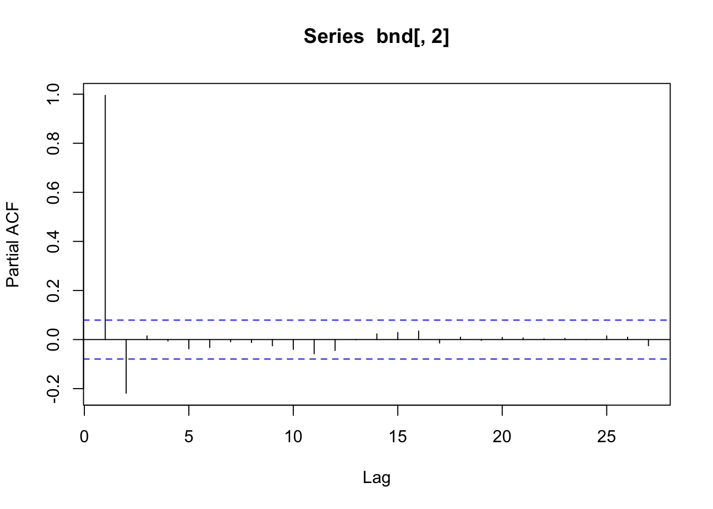
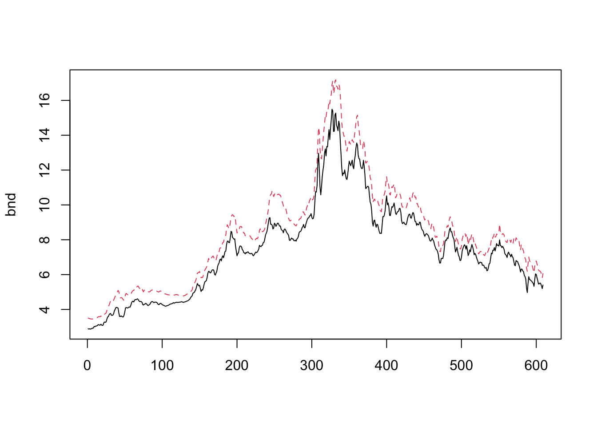

## 誤差修正モデル: データ分析例 (Tsay, MTS, Ch5)
- 出所: Tsay, MTS, Ch5より抜粋（適宜, 補足説明挿入, または修正)
  - https://faculty.chicagobooth.edu/ruey-s-tsay/research/multivariate-time-series-analysis-with-r-and-financial-applications


### 共和分検定
- Tsay, 5.9, pp.310--

```r
require(fUnitRoots)	# adfTest
```

```
## Loading required package: fUnitRoots
```

```r
require(urca)		# ca.jo
```

```
## Loading required package: urca
```

```
## 
## Attaching package: 'urca'
```

```
## The following objects are masked from 'package:fUnitRoots':
## 
##     punitroot, qunitroot, unitrootTable
```

```r
require(MTS)		# VARorder()
```

```
## Loading required package: MTS
```

#### 分析に使用するデータ{-}
- 月次社債イールド, 1954.7--2005.3
- FRB St. Louisのデータ
- 系列(Aaa, Baa)が2変量VAR($p$)モデルに従うと仮定し. 次数$p$を決定:

```r
ifl <- file.path(dir_MTS, "m-bnd.txt")  # dir_MTS: m-bnd.txtを格納しているディレクトリ
da <- read.table(ifl)
head(da)
```

```
##     V1 V2 V3   V4   V5
## 1 1954  7  1 2.89 3.50
## 2 1954  8  1 2.87 3.49
## 3 1954  9  1 2.89 3.47
## 4 1954 10  1 2.87 3.46
## 5 1954 11  1 2.89 3.45
## 6 1954 12  1 2.90 3.45
```

```r
bnd <- da[, 4:5]
colnames(bnd) <- c("Aaa", "Baa")
m1 <- MTS::VARorder(bnd)		# original function, now in 'MTS'
```

```
## selected order: aic =  11 
## selected order: bic =  3 
## selected order: hq =  3 
## Summary table:  
##        p     AIC     BIC      HQ      M(p) p-value
##  [1,]  0 -0.5697 -0.5697 -0.5697    0.0000  0.0000
##  [2,]  1 -7.8664 -7.8374 -7.8551 4331.0806  0.0000
##  [3,]  2 -8.1844 -8.1264 -8.1618  195.5266  0.0000
##  [4,]  3 -8.2589 -8.1720 -8.2251   51.6109  0.0000
##  [5,]  4 -8.2552 -8.1393 -8.2101    5.5112  0.2387
##  [6,]  5 -8.2481 -8.1032 -8.1917    3.5073  0.4768
##  [7,]  6 -8.2751 -8.1013 -8.2075   23.4161  0.0001
##  [8,]  7 -8.2803 -8.0775 -8.2014   10.6262  0.0311
##  [9,]  8 -8.2826 -8.0507 -8.1924    8.9080  0.0634
## [10,]  9 -8.2784 -8.0176 -8.1769    5.1613  0.2711
## [11,] 10 -8.2775 -7.9877 -8.1648    7.0457  0.1335
## [12,] 11 -8.2840 -7.9652 -8.1600   11.2224  0.0242
## [13,] 12 -8.2812 -7.9334 -8.1459    5.8956  0.2071
## [14,] 13 -8.2716 -7.8949 -8.1251    2.0355  0.7292
```
- → BIC, HQ(Nannan-Quinn情報量規準), $p=3$を選択

次に,

- 各系列の単位根検定 (ADF検定)
  - $H_0$: 単位根有り

```r
pacf(bnd[, 1])
```


```r
pacf(bnd[, 2])
```



```r
# または,
# ar(bnd[, 1])		# --> AIC, p = 3
# ar(bnd[, 2])		# --> AIC, p = 2
#
fUnitRoots::adfTest(bnd[, 1], lags = 3, type = "c")
```

```
## 
## Title:
##  Augmented Dickey-Fuller Test
## 
## Test Results:
##   PARAMETER:
##     Lag Order: 3
##   STATISTIC:
##     Dickey-Fuller: -1.7007
##   P VALUE:
##     0.425 
## 
## Description:
##  Wed Jan 10 22:07:47 2024 by user:
```

```r
fUnitRoots::adfTest(bnd[, 2], lags = 2, type = "c")
```

```
## 
## Title:
##  Augmented Dickey-Fuller Test
## 
## Test Results:
##   PARAMETER:
##     Lag Order: 2
##   STATISTIC:
##     Dickey-Fuller: -1.6221
##   P VALUE:
##     0.4544 
## 
## Description:
##  Wed Jan 10 22:07:47 2024 by user:
```
- --> Aaa, Baa系列のADF検定、棄却されない (H0: 単位根非定常)


```r
matplot(bnd, type="l")
```



```r
# Tsay本の内容に沿って, 以下を挿入
apply(apply(bnd, 2, diff), 2, mean)/
  apply(apply(bnd, 2, diff), 2, sd)
```

```
##        Aaa        Baa 
## 0.01862195 0.02077461
```

```r
#apply(apply(bnd, 2, diff), 2, fBasics::stdev)
```
- 階階差列の平均値ベクトルは, ゼロから有意に離れていない → 共和分検定に, 定数項入れない (Tsay, p.310)
- 共和分検定におけるトレンドの指定. Tsay, p.304を参照

### Johansenの方法 (Johansen-Procedure)
- Johansenの方法 → 共和分関係の検定, 共和分ベクトルや共和分ランク(個数)の推定

#### 最大固有値法 {-}
- $H_0$: 多くても$r$個の共和分関係しか存在しない vs $H_1$: $(r+1)$個の共和分関係が存在する
- ($H_0$: 共和分ランク$=r$ vs $H_1$: 共和分ランク$=r+1$)

```
- urca::ca.jp関数
  - x: 共和分を調べたいデータ行列 (原系列)
  - type: 検定方法の種類. 'eigen'(最大固有値法), 'trace' (トレース法)
  - ecdet: トレンド指定. 'none' (なし), 'const' (定数項有), 'trend' (線形トレンド有)
    - $\Delta {\bf y}_t = {\bf \mu}_0 + {\bf \mu}_1 t+\cdots$
    - (→ 共和分関係にも定数項や線形トレンドが含まれる)
  - K: 系列(水準)のVARラグ次数
  - spec: VECMの特定化. "longrun" ($ {\bf Γ}_i , 長期的(累積)インパクト), "transitory" ((${\bf Γ}_i$,  一時的インパクト)
)
```

```r
m2 <- urca::ca.jo(bnd, K = 2, ecdet = c("none"))		# spec = "longrun" (デフォルト)
summary(m2)
```

```
## 
## ###################### 
## # Johansen-Procedure # 
## ###################### 
## 
## Test type: maximal eigenvalue statistic (lambda max) , with linear trend 
## 
## Eigenvalues (lambda):
## [1] 0.054773196 0.004665298
## 
## Values of teststatistic and critical values of test:
## 
##           test 10pct  5pct  1pct
## r <= 1 |  2.84  6.50  8.18 11.65
## r = 0  | 34.19 12.91 14.90 19.19
## 
## Eigenvectors, normalised to first column:
## (These are the cointegration relations)
## 
##            Aaa.l2    Baa.l2
## Aaa.l2  1.0000000  1.000000
## Baa.l2 -0.8856789 -2.723912
## 
## Weights W:
## (This is the loading matrix)
## 
##            Aaa.l2      Baa.l2
## Aaa.d -0.04696894 0.002477064
## Baa.d  0.04046524 0.002139536
```
- → $r=0$は棄却. $r=1$は棄却されず
- → $r=1$ (共和分有. 共和分ベクトルの個数 ($\Pi$ 行列のランク))


```r
#m3 <- urca::ca.jo(bnd, K = 2, ecdet = c("none"), spec = c("transitory"))
#summary(m3)
# 定数項有のケース
m3 <- urca::ca.jo(bnd, K = 2, ecdet = c("const"), spec = c("longrun"))
summary(m3)
```

```
## 
## ###################### 
## # Johansen-Procedure # 
## ###################### 
## 
## Test type: maximal eigenvalue statistic (lambda max) , without linear trend and constant in cointegration 
## 
## Eigenvalues (lambda):
## [1] 5.477346e-02 4.878009e-03 6.308723e-20
## 
## Values of teststatistic and critical values of test:
## 
##           test 10pct  5pct  1pct
## r <= 1 |  2.97  7.52  9.24 12.97
## r = 0  | 34.19 13.75 15.67 20.20
## 
## Eigenvectors, normalised to first column:
## (These are the cointegration relations)
## 
##                Aaa.l2    Baa.l2   constant
## Aaa.l2    1.000000000  1.000000   1.000000
## Baa.l2   -0.885675435 -2.701784  -3.315369
## constant -0.003491742 16.399576 -13.776952
## 
## Weights W:
## (This is the loading matrix)
## 
##            Aaa.l2      Baa.l2      constant
## Aaa.d -0.04699903 0.002507156  1.086407e-18
## Baa.d  0.04043910 0.002165681 -1.197343e-18
```

#### トレース法 {-}
- $H_0$: 多くても$r$個の共和分関係しか存在しない vs $H_1$: 全ての変数が定常
- ($H_0$: 共和分ランク$=r$ vs $H_1$: 共和分ランク$=m$ (原系列は定常))

```r
m4 <- urca::ca.jo(bnd, K = 2, ecdet = c("none"), type = c("trace"), spec = c("transitory"))
summary(m4)
```

```
## 
## ###################### 
## # Johansen-Procedure # 
## ###################### 
## 
## Test type: trace statistic , with linear trend 
## 
## Eigenvalues (lambda):
## [1] 0.054773196 0.004665298
## 
## Values of teststatistic and critical values of test:
## 
##           test 10pct  5pct  1pct
## r <= 1 |  2.84  6.50  8.18 11.65
## r = 0  | 37.03 15.66 17.95 23.52
## 
## Eigenvectors, normalised to first column:
## (These are the cointegration relations)
## 
##            Aaa.l1    Baa.l1
## Aaa.l1  1.0000000  1.000000
## Baa.l1 -0.8856789 -2.723912
## 
## Weights W:
## (This is the loading matrix)
## 
##            Aaa.l1      Baa.l1
## Aaa.d -0.04696894 0.002477064
## Baa.d  0.04046524 0.002139536
```
- → $r=0$は棄却. $r=1$は棄却されず
- → $r=1$ (同)


```r
(coint_vec <- summary(m4)@V)
```

```
##            Aaa.l1    Baa.l1
## Aaa.l1  1.0000000  1.000000
## Baa.l1 -0.8856789 -2.723912
```
- → 共和分ベクトル: $(1, -0.886)$

- 得られた``cointegration''系列 $w_t=1 \cdot Aaa_t - 0.886 \cdot Baa_t$に対して単位根検定

```r
# wt <- bnd[, 1] - 0.886 * bnd[, 2]
wt <- as.matrix(bnd) %*% coint_vec[, 1]
#
fUnitRoots::adfTest(wt, lags = 3, type = "c")
```

```
## Warning in fUnitRoots::adfTest(wt, lags = 3, type = "c"): p-value smaller than
## printed p-value
```

```
## 
## Title:
##  Augmented Dickey-Fuller Test
## 
## Test Results:
##   PARAMETER:
##     Lag Order: 3
##   STATISTIC:
##     Dickey-Fuller: -4.6052
##   P VALUE:
##     0.01 
## 
## Description:
##  Wed Jan 10 22:07:47 2024 by user:
```
- → $p$値$=0.01$ (単位根無)

```r
plot(wt, type = "l")
```


- → ``定常時系列の特徴を示す''

### 誤差修正モデル(ECM)の推定
- 前提: VARモデルの次数$p$,共和分ベクトルの数は既知 (上で得られた)

#### ECMのOLS推定 {-}
- 共和分ベクトル$\beta_t$が既知の場合:
- 上で得られた ``cointegrating系列''wt=bnd[,1]-0.886*bnd[,2] 
を所与として $(p=3, r=1)$, ECMをOLS推定

```
- MTS::ECMvar1(x, p, wt=wt, include.const = FALSE, fixed = NULL, output = TRUE)
  - ECM VAR(p)モデルのOLS推定 (wtが既知の場合)
  - x: (Txk), k次元共和分VAR過程
  - wt: (Txm), m次元共和分過程
  - include.const: 定数項の有無 (デフォルト=F)
```

```r
m1 <- MTS::ECMvar1(bnd, 3, wt) ## Given the co-integrated vector
```

```
## alpha:  
##           Aaa    Baa
## [1,] -0.00122 0.0634
## standard error 
##        [,1]   [,2]
## [1,] 0.0347 0.0306
## AR coefficient matrix 
## AR( 1 )-matrix 
##       Aaa      Baa
## Aaa 0.452 -0.00149
## Baa 0.293  0.20380
## standard error 
##        [,1]   [,2]
## [1,] 0.0879 0.1008
## [2,] 0.0774 0.0887
## AR( 2 )-matrix 
##        Aaa    Baa
## Aaa -0.300 0.0535
## Baa -0.151 0.0274
## standard error 
##        [,1]   [,2]
## [1,] 0.0860 0.0940
## [2,] 0.0757 0.0827
## ----- 
## Residuals cov-mtx: 
##           Aaa        Baa
## Aaa 0.0400851 0.03167180
## Baa 0.0316718 0.03105888
##        
## det(sse) =  0.0002418953 
## AIC =  -8.294165 
## BIC =  -8.221721
```

```r
m1$coef	# 表示の向きに注意 (xmtx調整行列, 左辺の各成分が列方向に, 右辺のARラグ項が行方向に)
```

```
##               Aaa         Baa
## xmtx -0.001217005  0.06339082
## Aaa   0.451993390  0.29303941
## Baa  -0.001491101  0.20379673
## Aaa  -0.299907502 -0.15075817
## Baa   0.053499341  0.02742606
```

```r
m1$secoef	# 同
```

```
##            [,1]       [,2]
## [1,] 0.03471368 0.03055639
## [2,] 0.08790257 0.07737541
## [3,] 0.10080919 0.08873634
## [4,] 0.08600254 0.07570293
## [5,] 0.09396739 0.08271391
```

```r
m1$coef / m1$secoef	# 同
```

```
##              Aaa        Baa
## xmtx -0.03505836  2.0745518
## Aaa   5.14198170  3.7872419
## Baa  -0.01479132  2.2966546
## Aaa  -3.48719367 -1.9914443
## Baa   0.56933946  0.3315773
```

- 推定されたECM ($w_t=\beta'{\bf y}_t=(1,- 0.886){\bf y}_t$)
$$ \Delta {\bf y}_t = \left[\begin{array}{r}
      -0.001 \\ 0.064
    \end{array}\right] w_t  + 
    \left[\begin{array}{rr}
      0.452 & -0.001 \\ 0.293 & 0.204
    \end{array} \right] \Delta {\bf y}_{t-1}
    $$
    $$
        +\left[\begin{array}{rr}
      -0.300 & 0.054 \\ -0.151 & 0.028
    \end{array} \right] \Delta {\bf y}_{t-2} + \epsilon_t,\quad
    \hat{\Sigma}= \frac{1}{100} \left[\begin{array}{rr}
      4.01 & 3.17 \\ 3.17 & 3.11
    \end{array} \right]
    $$

#### OLS推定されたECMの修正 {-}
- ECMの修正 (パラメータ数削減)
  - 有意でない係数を0に置く 

```
- MTS::refECMvar1(m1, thres = 1)
  - ECM VAR(p)モデルの制約付きOLS推定 (wtが既知の場合)
  - thres: t-ratioの閾値(デフォルト=1)
  - |t-ratio| < thres の推定係数を0に置き換える
```

```r
m2 <- MTS::refECMvar1(m1) ####### Refine the model fit
```

```
## Equation:  1  npar =  2 
## Equation:  2  npar =  4 
## alpha:  
##      [,1]   [,2]
## [1,]    0 0.0625
## standard error 
##      [,1]   [,2]
## [1,]    1 0.0304
## AR coefficient matrix 
## AR( 1 )-matrix 
##       [,1]  [,2]
## [1,] 0.448 0.000
## [2,] 0.286 0.212
## standard error 
##        [,1]   [,2]
## [1,] 0.0393 1.0000
## [2,] 0.0746 0.0855
## AR( 2 )-matrix 
##        [,1] [,2]
## [1,] -0.256    0
## [2,] -0.129    0
## standard error 
##        [,1] [,2]
## [1,] 0.0393    1
## [2,] 0.0382    1
## ----- 
## Residuals cov-mtx: 
##            [,1]       [,2]
## [1,] 0.04010853 0.03168277
## [2,] 0.03168277 0.03106450
##        
## det(sse) =  0.0002421536 
## AIC =  -8.306234 
## BIC =  -8.262768
```

- 推定されたECM (修正後)
$$ \Delta {\bf y}_t = \left[\begin{array}{r}
      0.000 \\ 0.063
    \end{array}\right] w_t  + 
    \left[\begin{array}{rr}
      0.448 & 0.000 \\ 0.286 & 0.212
    \end{array} \right] \Delta {\bf y}_{t-1}
    $$
      $$
        +\left[\begin{array}{rr}
      -0.256 & 0.000 \\ -0.129 & 0.000
    \end{array} \right] \Delta {\bf y}_{t-2} + \epsilon_t,\quad
    \hat{\Sigma}= \frac{1}{100} \left[\begin{array}{rr}
      4.01 & 3.17 \\ 3.17 & 3.11
    \end{array} \right]
    $$

```r
# pacf(m2$residuals)
# --> model checking, 若干の系列相関, 相互相関有り(教科書の記述と齟齬?)
# --> alpha(1,1)=0 <-- Aaa系列の1階階差系列は定常
m2$coef
```

```
##            [,1]        [,2]
## [1,]  0.0000000  0.06250339
## [2,]  0.4484522  0.28620026
## [3,]  0.0000000  0.21172072
## [4,] -0.2559947 -0.12908889
## [5,]  0.0000000  0.00000000
```

```r
m2$secoef
```

```
##            [,1]       [,2]
## [1,] 1.00000000 0.03044171
## [2,] 0.03929053 0.07458234
## [3,] 1.00000000 0.08546551
## [4,] 0.03930742 0.03821387
## [5,] 1.00000000 1.00000000
```

```r
m2$coef / m1$secoef
```

```
##           [,1]      [,2]
## [1,]  0.000000  2.045509
## [2,]  5.101696  3.698853
## [3,]  0.000000  2.385953
## [4,] -2.976594 -1.705203
## [5,]  0.000000  0.000000
```

#### ECMのQML推定 {-}
- 共和分ベクトル$\beta_t$が未知の場合:
  - 仮定:イノベーション系列 ${\epsilon_t}$ がGaussian

```
- MTS::ECMvar(x,p,ibeta)
  - ECM VAR(p)モデルのQML推定 (wtが未知の場合)
  - ibeta: co-integrating matrix初期値
  - alpha: alpha行列の初期値 (デフォルト=NULL)
```

```r
# beta <- c(1, -0.886) ### Initial value of co-integration
beta <- coint_vec[, 1]
m3 <- MTS::ECMvar(bnd, p = 3, ibeta = beta, include.const = F) #### Joint estimation
```

```
## Order p:  3  Co-integrating rank:  1 
## Number of parameters:  11 
## initial estimates:  -0.001217005 0.06339082 -0.8856789 0.4519934 -0.001491101 -0.2999075 0.05349934 0.2930394 0.2037967 -0.1507582 0.02742606 
## Par. Lower-bounds:  -0.05328753 0.01755623 -0.9464619 0.3201395 -0.1527049 -0.4289113 -0.08745174 0.1769763 0.07069222 -0.2643126 -0.09664481 
## Par. Upper-bounds:  0.05085352 0.1092254 -0.8248958 0.5838472 0.1497227 -0.1709037 0.1944504 0.4091025 0.3369012 -0.03720378 0.1514969 
## Final   Estimates:  -0.0007844935 0.06377964 -0.8865271 0.451819 -0.001406126 -0.3000979 0.05359478 0.2928488 0.2039182 -0.150974 0.02759907 
## 
## Coefficient(s):
##          Estimate  Std. Error  t value Pr(>|t|)    
##        -0.0007845   0.0359051   -0.022 0.982568    
##         0.0637796   0.0314069    2.031 0.042280 *  
## Baa.l1 -0.8865271   0.0055004 -161.176  < 2e-16 ***
##         0.4518190   0.0878174    5.145 2.68e-07 ***
##        -0.0014061   0.1022704   -0.014 0.989030    
##        -0.3000979   0.0864320   -3.472 0.000516 ***
##         0.0535948   0.0948894    0.565 0.572201    
##         0.2928488   0.0772944    3.789 0.000151 ***
##         0.2039182   0.0897482    2.272 0.023080 *  
##        -0.1509740   0.0760263   -1.986 0.047054 *  
##         0.0275991   0.0833998    0.331 0.740701    
## ---
## Signif. codes:  0 '***' 0.001 '**' 0.01 '*' 0.05 '.' 0.1 ' ' 1
## alpha:  
##           [,1]
## [1,] -0.000784
## [2,]  0.063780
## standard error 
##        [,1]
## [1,] 0.0359
## [2,] 0.0314
## beta:  
##        [,1]
## [1,]  1.000
## [2,] -0.887
## standard error 
##        [,1]
## [1,] 1.0000
## [2,] 0.0055
## AR coefficient matrix 
## AR( 1 )-matrix 
##       [,1]     [,2]
## [1,] 0.452 -0.00141
## [2,] 0.293  0.20392
## standard error 
##        [,1]   [,2]
## [1,] 0.0878 0.1023
## [2,] 0.0773 0.0897
## AR( 2 )-matrix 
##        [,1]   [,2]
## [1,] -0.300 0.0536
## [2,] -0.151 0.0276
## standard error 
##        [,1]   [,2]
## [1,] 0.0864 0.0949
## [2,] 0.0760 0.0834
## ----- 
## Residuals cov-mtx: 
##           Aaa        Baa
## Aaa 0.0399535 0.03156630
## Baa 0.0315663 0.03095427
##        
## det(sse) =  0.0002403005 
## AIC =  -8.297496 
## BIC =  -8.217807
```

```r
#
m3$ncoint		# 共和分ベクトル数
```

```
## [1] 1
```

```r
m3$alpha		# 調整行列
```

```
##               [,1]
## [1,] -0.0007844935
## [2,]  0.0637796425
```

```r
m3$beta		# 共和分行列
```

```
##            [,1]
## [1,]  1.0000000
## [2,] -0.8865271
```

```r
m3$Phip
```

```
##              [,1]        [,2]
## [1,]  0.451818972  0.29284885
## [2,] -0.001406126  0.20391818
## [3,] -0.300097916 -0.15097397
## [4,]  0.053594777  0.02759907
```

```r
m3$se.Phip
```

```
##            [,1]       [,2]
## [1,] 0.08781738 0.07729435
## [2,] 0.10227039 0.08974821
## [3,] 0.08643197 0.07602634
## [4,] 0.09488937 0.08339984
```

- 推定されたECM (修正後)
$$ \Delta {\bf y}_t = \left[\begin{array}{r}
      -0.001 \\ 0.064
    \end{array}\right] [1,-0.887] {\bf y}_t  + 
    \left[\begin{array}{rr}
      0.452 & -0.001 \\ 0.293 & 0.204
    \end{array} \right] \Delta {\bf y}_{t-1}
    $$
      $$
        +\left[\begin{array}{rr}
      -0.300 & 0.054 \\ -0.151 & 0.028
    \end{array} \right] \Delta {\bf y}_{t-2} + \epsilon_t,\quad
    \hat{\Sigma}= \frac{1}{100} \left[\begin{array}{rr}
      4.00 & 3.16 \\ 3.16 & 3.10
    \end{array} \right]
    $$

- → 初期モデル(m1)と近い結果 
- ``サンプルサイズが比較的大きい一方で低次元であり, 驚くことでない''

- (補足): $w_t=1 \cdot Aaa_t - 0.887 \cdot Baa_t$が定常過程
  - $w_t>0$ →  Aaa_tのイールドが相対高, Baa_tが相対安　→ スプレッド"縮小"時
  - →  ${\bf y}_t$への影響; $[-0.001,0.064]'w_t$
    - 翌月のAaa_tイールドを$0.001\cdot w_t$押し下げる
    - 翌月のBaa_tイールドを$0.064\cdot w_t$押し上げる
    - →  翌月のスプレッドが"拡大"する方向に作用
