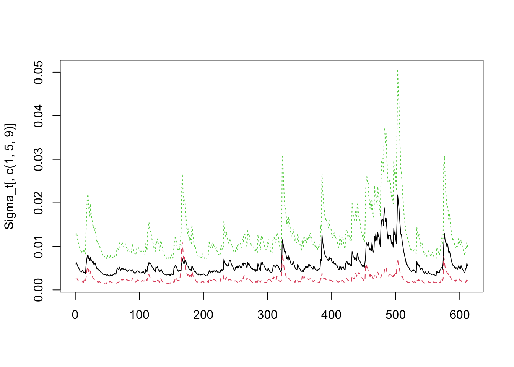

# 多変量ボラティリティ・モデル

- 出所:
  Tsay, Ch.7 (http://faculty.chicagobooth.edu/ruey.tsay/teaching/introTS/) (一部改変)

## 多変量時系列データの条件付不均一分散性の検定
- Tsay, pp.406--

- シミュレーション系列の生成

```r
library(MTS)
zt = matrix(rnorm(2000), 400, 5) ### Another set of random noises
```

```
- 複数の検定方法
 - (1)Ljung-Box検定 (1変量の標準化残差に変換した系列に対して)
 - Q(m) of squared series(LM test) 

 - (2)順位自己相関 (rank autocorrelation) を用いた検定
 - Rank-based Test

 - (3)多変量Ljung-Box検定
 - Q_k(m) of squared series

 - (4)同, 上位5%のデータを刈込み (trim)
 - Robust Test(5%) 
```
```
- MTS::MarchTest
```

```r
MarchTest(zt) #### Multivariate volatility tests
```

```
## Q(m) of squared series(LM test):  
## Test statistic:  13.81572  p-value:  0.1815644 
## Rank-based Test:  
## Test statistic:  8.506661  p-value:  0.5794726 
## Q_k(m) of squared series:  
## Test statistic:  226.733  p-value:  0.8519022 
## Robust Test(5%) :  216.6933  p-value:  0.9371367
```


### 分析例 {-}
- Tsay, pp.415--
- IBM and SP log returns

```r
ifl <- file.path(dir_MTS, "m-ibmsp-6111.txt")
da <- read.table(ifl, header = T)
rtn <- log(da[, 2:3] + 1)
at <- scale(rtn, scale = F) ## Remove sample means

MarchTest(at)
```

```
## Q(m) of squared series(LM test):  
## Test statistic:  38.06663  p-value:  3.695138e-05 
## Rank-based Test:  
## Test statistic:  108.3798  p-value:  0 
## Q_k(m) of squared series:  
## Test statistic:  109.4194  p-value:  2.276873e-08 
## Robust Test(5%) :  118.7134  p-value:  9.894441e-10
```

## 指数加重移動平均法 (EWMA)
- Exponentially Weighted Moving Average Approach
<!--- 
8/26/22: Build Book時, MartchTest内でエラー発生
-->

```r
ifl <- file.path(dir_MTS, "m-dec125910-6111.txt")
da <- read.table(ifl, header = T)
# CRSP(1, 2, 5, 9, 10十分位ポートフォリオ)の月次対数収益率
head(da)
```

```
##       date      dec1      dec2      dec5      dec9     dec10
## 1 19610131  0.058011  0.067392  0.081767  0.096754  0.087207
## 2 19610228  0.029241  0.042784  0.055524  0.056564  0.060245
## 3 19610330  0.025896  0.025474  0.041304  0.060563  0.071875
## 4 19610428  0.005667  0.001365  0.000780  0.011911  0.023328
## 5 19610531  0.019208  0.036852  0.049590  0.046248  0.050362
## 6 19610630 -0.024670 -0.025225 -0.040046 -0.050651 -0.051434
```

```r
rtn <- log(da[, 2:4] + 1)
m1 <- VAR(rtn, 1) ## Fit VAR(1) model to remove serial correlations
```

```
## Constant term: 
## Estimates:  0.006376978 0.007034631 0.007342962 
## Std.Error:  0.001759562 0.001950008 0.002237004 
## AR coefficient matrix 
## AR( 1 )-matrix 
##        [,1]  [,2]     [,3]
## [1,] -0.194 0.224  0.00836
## [2,] -0.232 0.366 -0.04186
## [3,] -0.313 0.452  0.00238
## standard error 
##       [,1]  [,2]  [,3]
## [1,] 0.108 0.160 0.101
## [2,] 0.120 0.177 0.111
## [3,] 0.138 0.204 0.128
##   
## Residuals cov-mtx: 
##             [,1]        [,2]        [,3]
## [1,] 0.001814678 0.001859113 0.001962277
## [2,] 0.001859113 0.002228760 0.002420858
## [3,] 0.001962277 0.002420858 0.002933081
##   
## det(SSE) =  1.712927e-10 
## AIC =  -22.45809 
## BIC =  -22.39289 
## HQ  =  -22.43273
```

```r
at <- m1$residuals ## ARCH test
# MarchTest(at)
```
```
- MTS::EWMAvol(rtn, lambda = 0.96)		# lambda: 減衰率
 - lambda = 正値 --> 固定値を指定して実行 (lambdaの推定なし)
 - lambda = 負値 --> lambda推定
```
<!--- 8/26/22: 同様のエラー, EWMAvolにて発生
--->

```r
m2 = EWMAvol(at, lambda = -0.1) ### Estimation of decaying rate
Sigma.t = m2$Sigma.t ### Volatility matrices
m3 = MCHdiag(at, Sigma.t)		# モデル診断
```

```
- MTS::MCHdiag
  - Apply four portmanteau test statistics to check the validity of a fitted multivariate volatility model
    - at:	A T-by-k matrix of residuals for a k-dimensional asset return series
    - Sigma.t: The fitted volatility matrices. The dimension is T-by-k^2 matrix
    - m: The number of lags used in the tests. Default is 10.
```

- ※ 以下を挿入:

```r
m2_2 <- EWMAvol(at, lambda = 0.9) ### 減衰率 = 0.9に設定
matplot(m2$Sigma.t, type = "l")
matplot(m2_2$Sigma.t, type = "l")
```

- CRSP(1, 2, 5十分位ポートフォリオ)の月次対数収益率のボラティリティ行列の各要素の時系列プロット
- p.415--

```r
par(mfcol = c(3, 2)) ### Create Figure 7.3 of the text
tdx <- c(2:609)/12+1961
plot(tdx, Sigma.t[, 1], xlab = 'Year', ylab = "Variance", type = 'l')
title(main = "(a) Dec 1")
plot(tdx, Sigma.t[, 5], xlab = 'Year', ylab = "Variance", type = 'l')
title(main = "(b) Dec 2")
plot(tdx, Sigma.t[, 9], xlab = 'Year', ylab = "Variance", type = 'l')
title(main = "(c) Dec 5")
plot(tdx, Sigma.t[, 2], xlab = 'Year', ylab = "Covariance", type = 'l')
title(main = "(d) Dec 1 vs Dec 2")
plot(tdx, Sigma.t[, 3], xlab = 'Year', ylab = "Covariance", type = 'l')
title(main = "(e) Dec 1 vs Dec 5")
plot(tdx, Sigma.t[, 6], xlab = 'Year', ylab = "Covariance", type = 'l')
title(main = "(f) Dec 2 vs Dec 5")
```

## BEKK(1, 1)モデル
- p.417--
```
- MTS::BEKK11
 - 注) 実行時間を要する (ここでは不実行)
```

```r
ifl <- file.path(dir_MTS, "m-ibmsp-6111.txt")
da <- read.table(ifl, header = T)
# IBM株, S&P, 月次収益率, 1961年1月--2011年12月
rtn <- log(da[, 2:3] + 1)
m1a <- BEKK11(rtn) # 時間かかる

names(m1a)
Sigma_t <- m1a$Sigma.t
at <- cbind(rtn[, 1] -  - m1a$estimates[1], rtn[, 2] -  - m1a$estimates[2])
MCHdiag(at, Sigma_t)
```

## Cholesky分解を利用したボラティリティ推定
- Cholesky Decomposition
- Tsay, p.426--

```r
ifl <- file.path(dir_MTS, "m-ibmspko-6111.txt")
da <- read.table(ifl, header = T)
# IBM株, S&P指数, コカコーラ株
# 月次リターン, 1961年1月--2011年12月
rtn <- log(da[, 2:4] + 1)
```
```
# 多変量Choleskyボラティリティ・モデル
- MTS::MCholV
  - Use recursive least squares to perform the time-varying Cholesky decomposition. The least squares estimates are then smoothed via the exponentially weighted moving-average method with decaying rate 0.96. University GARCH(1, 1) model is used for the innovations of each linear regression.
```

```r
#library(fGarch)
m3 <- MCholV(rtn)
```

```
## Sample means:  0.007728 0.005024 0.010595 
## Estimation of the first component 
## Estimate (alpha0, alpha1, beta1):  0.000356 0.117515 0.810288 
## s.e.                            :  0.000157 0.037004 0.057991 
## t-value                         :  2.262897 3.175772 13.97261 
## Component  2  Estimation Results (residual series): 
## Estimate (alpha0, alpha1, beta1):  6.4e-05 0.099156 0.858354 
## s.e.                            :  3.1e-05 0.027785 0.037238 
## t-value                         :  2.034528 3.568616 23.05076 
## Component  3  Estimation Results (residual series): 
## Estimate (alpha0, alpha1, beta1):  0.000173 0.117506 0.818722 
## s.e.                            :  6.2e-05 0.028651 0.038664 
## t-value                         :  2.808075 4.101297 21.17521
```

```r
names(m3)
```

```
## [1] "betat"   "bt"      "Vol"     "Sigma.t"
```

```r
# betat: Recursive least squares estimates of the linear transformations in Cholesky decomposition
# bt: The transformation residual series
# Vol: The volatility series of individual innovations
# Sigma.t: Volatility matrices
```


```r
at <- scale(rtn[-(1:36), ], center = T, scale = F)
Sigma_t <- m3$Sigma.t

MCHdiag(at, Sigma_t)
```

```
## Test results:  
## Q(m) of et: 
## Test and p-value:  15.94978 0.1010791 
## Rank-based test: 
## Test and p-value:  21.99727 0.01511849 
## Qk(m) of epsilon_t: 
## Test and p-value:  123.7687 0.01057302 
## Robust Qk(m):  
## Test and p-value:  95.49626 0.3259654
```

```r
MCHdiag(at, Sigma_t, m = 5)
```

```
## Test results:  
## Q(m) of et: 
## Test and p-value:  5.717035 0.3347333 
## Rank-based test: 
## Test and p-value:  5.579834 0.3492711 
## Qk(m) of epsilon_t: 
## Test and p-value:  59.837 0.06842123 
## Robust Qk(m):  
## Test and p-value:  58.97874 0.07891472
```

```r
matplot(Sigma_t, type = "l")
```


```r
matplot(m3$Vol, type = "l")
```


```r
matplot(m3$betat, type = "l")
```


```r
matplot(m3$bt, type = "l")
```


## DCC (Dynamic Conditional Correlation) モデル
- MTS, p.432--
- (引き続き) IBM, SP, KO 対数収益率の使用

** 事前フィッティング**
- 各成分に単変量GARCHを適合
- → DCC推定のための標準化残差系列の生成
```
- MTS::dccPre
  - 注) 実行時間ややかかる
```

```r
m1 <- dccPre(rtn, include.mean = T, p = 0)
```

```
## Sample mean of the returns:  0.00772774 0.005023909 0.01059521 
## Component:  1 
## Estimates:  0.000419 0.126739 0.788307 
## se.coef  :  0.000162 0.035405 0.055645 
## t-value  :  2.593448 3.57973 14.16662 
## Component:  2 
## Estimates:  9e-05 0.127725 0.836053 
## se.coef  :  4.1e-05 0.03084 0.031723 
## t-value  :  2.20126 4.141592 26.35486 
## Component:  3 
## Estimates:  0.000256 0.098705 0.830358 
## se.coef  :  8.5e-05 0.022361 0.033441 
## t-value  :  3.015321 4.414112 24.83088
```

```r
names(m1)
```

```
## [1] "marVol"  "sresi"   "est"     "se.coef"
```

```r
rtn1 <- m1$sresi	# 標準化残差系列
Vol <- m1$marVol
```

### Tse and Tsui (2002) モデル {-}
```
- MTS::docFit (rt, type = "TseTsui") (デフォルト)
 - 標準化残差系列に対してDCCモデルを適合
```

```r
m2 <- dccFit(rtn1) ### Use Tse and Tsui model
```

```
## Estimates:  0.8087994 0.04027416 7.959064 
## st.errors:  0.1491731 0.02259899 1.135874 
## t-values:   5.421885 1.782122 7.006998
```

```r
names(m2)
```

```
## [1] "estimates" "Hessian"   "rho.t"
```

```r
S2_t <- m2$rho.t
```

### Engle (2002) モデル {-}
```
- MTS::docFit (rt, type = "Engle") (デフォルト)
- 注) 実行時間ややかかる
```

```r
m3 = dccFit(rtn1, type = "Engle") ## Use Engle model
```

```
## Estimates:  0.9126534 0.04531519 8.624321 
## st.errors:  0.02947897 0.01274031 1.332704 
## t-values:   30.95947 3.556835 6.471295
```

```r
S3_t = m3$rho.t
```

- 以下を追加:
 - 時点$t$の相関行列$R_t$ (Tsay本では$\rho_t$)
 - ← 3x3 対称行列

```r
head(S2_t)
```

```
##      [,1]      [,2]      [,3]      [,4] [,5]      [,6]      [,7]      [,8] [,9]
## [1,]    1 0.5842955 0.2772491 0.5842955    1 0.5600389 0.2772491 0.5600389    1
## [2,]    1 0.5842955 0.2772491 0.5842955    1 0.5600389 0.2772491 0.5600389    1
## [3,]    1 0.5842955 0.2772491 0.5842955    1 0.5600389 0.2772491 0.5600389    1
## [4,]    1 0.5842955 0.2772491 0.5842955    1 0.5600389 0.2772491 0.5600389    1
## [5,]    1 0.5930112 0.2898027 0.5930112    1 0.5485945 0.2898027 0.5485945    1
## [6,]    1 0.5867309 0.3016936 0.5867309    1 0.5596515 0.3016936 0.5596515    1
```

```r
head(S3_t)
```

```
##      [,1]      [,2]      [,3]      [,4] [,5]      [,6]      [,7]      [,8] [,9]
## [1,]    1 0.5842955 0.2772491 0.5842955    1 0.5600389 0.2772491 0.5600389    1
## [2,]    1 0.6037264 0.2712637 0.6037264    1 0.5383299 0.2712637 0.5383299    1
## [3,]    1 0.6081221 0.3065183 0.6081221    1 0.5405505 0.3065183 0.5405505    1
## [4,]    1 0.6095527 0.3048562 0.6095527    1 0.5392283 0.3048562 0.5392283    1
## [5,]    1 0.6065274 0.2795197 0.6065274    1 0.5274868 0.2795197 0.5274868    1
## [6,]    1 0.6077643 0.2881606 0.6077643    1 0.5297445 0.2881606 0.5297445    1
```

```r
matplot(S2_t[, c(2, 3, 6)], type = "l", main = "Tse and Tsui model")
```


```r
matplot(S3_t[, c(2, 3, 6)], type = "l", main = "Engle model")
```


```r
MCHdiag(rtn1, S2_t) ### Model checking
```

```
## Test results:  
## Q(m) of et: 
## Test and p-value:  20.74249 0.02296253 
## Rank-based test: 
## Test and p-value:  30.20662 0.0007924436 
## Qk(m) of epsilon_t: 
## Test and p-value:  132.4228 0.002425954 
## Robust Qk(m):  
## Test and p-value:  109.9671 0.07501572
```

```r
MCHdiag(rtn1, S3_t)
```

```
## Test results:  
## Q(m) of et: 
## Test and p-value:  20.02928 0.02897696 
## Rank-based test: 
## Test and p-value:  27.60836 0.002084952 
## Qk(m) of epsilon_t: 
## Test and p-value:  131.9812 0.002626131 
## Robust Qk(m):  
## Test and p-value:  111.3537 0.06306805
```

## Go-GARCHモデル
```
- gogarch::gogarch
 - estby: "ica"(Independent Component Analysis), "mm" (モーメント法), "ml" (最尤法), "nls" (非線形最小二乗法)
 ```
- Tsay, p.437--

```r
library(gogarch)
```

```
## Loading required package: fGarch
```

```
## NOTE: Packages 'fBasics', 'timeDate', and 'timeSeries' are no longer
## attached to the search() path when 'fGarch' is attached.
## 
## If needed attach them yourself in your R script by e.g.,
##         require("timeSeries")
```

```
## Loading required package: fastICA
```

```r
crtn <- scale(rtn, center = T, scale = F)
m1 <- gogarch::gogarch(crtn, ~garch(1, 1), estby = "ica")
# "ica": Independent Component Analysisx (非正規データの場合)
m1
```

```
## 
## **************** 
## *** GO-GARCH *** 
## **************** 
## 
## Components estimated by: fast ICA
## Dimension of data matrix: (612 x 3).
## Formula for component GARCH models: ~ garch(1, 1) 
## 
## Orthogonal Matrix U:
##            [,1]       [,2]       [,3]
## [1,]  0.4768226  0.3731952  0.7958427
## [2,] -0.3313546 -0.7622868  0.5559882
## [3,]  0.8141525 -0.5288139 -0.2398157
## 
## Linear Map Z:
##             [,1]         [,2]          [,3]
## [1,] 0.032478029  0.008798645  0.0610619943
## [2,] 0.006939834 -0.030393013  0.0308030341
## [3,] 0.047149872 -0.039758234 -0.0006269423
## 
## Estimated GARCH coefficients:
##         omega     alpha1     beta1
## y1 0.28520667 0.12654031 0.7357619
## y2 0.23342861 0.09399449 0.8429021
## y3 0.01561313 0.05648151 0.9305709
## 
## Convergence codes of component GARCH models:
## y1 y2 y3 
##  1  1  1
```

```r
# Convergence codes of component GARCH models:
Sigma_t <- NULL ### obtain the volatility matrix
for (i in 1:612){
  Sigma_t <- rbind(Sigma_t, c(m1@H[[i]]))
}

MCHdiag(crtn, Sigma_t) ### Model checking
```

```
## Test results:  
## Q(m) of et: 
## Test and p-value:  23.75818 0.008268776 
## Rank-based test: 
## Test and p-value:  35.43474 0.0001052299 
## Qk(m) of epsilon_t: 
## Test and p-value:  179.4905 6.551299e-08 
## Robust Qk(m):  
## Test and p-value:  97.4621 0.2772916
```

```r
M <- m1@Z
Minv <- solve(M)		# 逆行列
bt <- crtn %*% t(Minv)
cor(bt^2)
```

```
##           [,1]      [,2]      [,3]
## [1,] 1.0000000 0.1708308 0.1061009
## [2,] 0.1708308 1.0000000 0.3458836
## [3,] 0.1061009 0.3458836 1.0000000
```

```r
matplot(Sigma_t[, c(1, 5, 9)], type = "l")	# 追加
```



## コピュラに基づくアプローチ
- Tsay, p.452--

```r
ifl <- file.path(dir_MTS, "m-ibmspko-6111.txt")
da = read.table(ifl, header = T)
rtn <- log(da[, -1] + 1)

m1 <- dccPre(rtn, cond.dist = "std")
```

```
## Sample mean of the returns:  0.00772774 0.005023909 0.01059521 
## Component:  1 
## Estimates:  0.000388 0.115626 0.805129 9.209269 
## se.coef  :  0.000177 0.036827 0.059471 3.054817 
## t-value  :  2.195398 3.139719 13.5382 3.014671 
## Component:  2 
## Estimates:  0.00012 0.130898 0.814531 7.274928 
## se.coef  :  5.7e-05 0.037012 0.046044 1.913333 
## t-value  :  2.102768 3.536655 17.69028 3.802228 
## Component:  3 
## Estimates:  0.000216 0.104706 0.837217 7.077137 
## se.coef  :  8.9e-05 0.028107 0.037157 1.847525 
## t-value  :  2.437323 3.725341 22.53208 3.830605
```

```r
names(m1)
```

```
## [1] "marVol"  "sresi"   "est"     "se.coef"
```

```r
Vol <- m1$marVol; eta = m1$sresi

matplot(Vol, type = "l")	# 追加
```


### 多変量 t-Copula ボラティリティ・モデル {-}
```
- MTS::mtCopula
  - Fits a t-copula to a k-dimensional standardized return series. The correlation matrices are parameterized by angles and the angles evolve over time via a DCC-type equation.

 - 注) 実行時間ややかかる
```

```r
m2 <- mtCopula(eta, g1 = 0.8, g2 = 0.04)
# -> 時間ややかかる
names(m2)

MCHdiag(eta, m2$rho.t)

m3 <- mtCopula(eta, g1 = 0.8, g2 = 0.04, include.th0 = F)
```

#### Example 7.6 {-}

```r
ifl <- file.path(dir_MTS, "d-xomspaapl.txt")
da <- read.table(ifl, header = T)
head(da)
rtn <- log(da[, -1] + 1) * 100
# 日次リターン, 2007.9--2012.9, Exxon Mobil, S&P, Apple

mm1 <-  dccPre(rtn, cond.dist = "std")

rtn1 <- mm1$sresi
Vol <- mm1$marVol
dim(rtn1)

matplot(Vol, type = "l")	# 追加

mm2 <- mtCopula(rtn1, 0.8, 0.04)
# -> 時間ややかかる
MCHdiag(rtn1, mm2$rho.t)
```

## 主成分分析に基づくアプローチ (PVC)
- Tsay, p.460--
- "Principal volatility component analysis" (Hu and Tsay, 2014)
```
- MTS::comVol
 - Compute the principal volatility components based on the residuals of a VAR(p) model.
```

```r
ifl <- file.path(dir_MTS, "w-fx7.txt")
da = read.table(ifl, header = T)
head(da)
```

```
##   Mon day year  GBPUSD NOKUSD SEKUSD CHFUSD CADUSD SGDUSD AUDUSD
## 1   3  22 2000 0.63397 8.4066 8.6470 1.6560 1.4691 1.7156 1.6480
## 2   3  29 2000 0.62935 8.4148 8.6232 1.6595 1.4556 1.7152 1.6354
## 3   4   5 2000 0.62890 8.4670 8.6555 1.6435 1.4543 1.7160 1.6563
## 4   4  12 2000 0.63029 8.5327 8.6773 1.6450 1.4659 1.7161 1.6744
## 5   4  19 2000 0.63290 8.6515 8.7601 1.6646 1.4793 1.6999 1.6837
## 6   4  26 2000 0.63519 8.8426 8.8844 1.7064 1.4763 1.7047 1.6940
```

```r
dim(da)
```

```
## [1] 606  10
```

```r
fx <- log(da[, 4:10])
rtn <- diffM(fx)
# 週次為替データ, 2000.3.2--2011.10.26
# GBPUSD NOKUSD SEKUSD CHFUSD CADUSD SGDUSD AUDUSD

m1 <- comVol(rtn, p = 5)
```

```
## eigen-values:  4.07592 1.906457 1.646785 1.199888 1.081506 0.7761643 0.4490305 
## proportion:    0.3660211 0.1712015 0.1478827 0.107751 0.09712014 0.06970022 0.04032333 
## Checking:  
## Results of individual F-test for ARCH effect 
## Numbers of lags used: 10, 20, 30 
## Component,(F-ratio P-val) (F-ratio P-val) (F-ratio P-Val) 
##      [,1]  [,2]     [,3]   [,4]     [,5]  [,6]     [,7]
## [1,]    1 21.66 0.00e+00 11.421 0.00e+00 7.725 0.00e+00
## [2,]    2  5.78 2.54e-08  4.114 8.66e-09 3.169 7.06e-08
## [3,]    3  7.24 7.95e-11  3.804 7.17e-08 2.659 6.66e-06
## [4,]    4  4.58 2.76e-06  2.859 3.70e-05 2.279 1.63e-04
## [5,]    5  1.49 1.38e-01  0.824 6.85e-01 0.776 7.99e-01
## [6,]    6  2.38 9.18e-03  1.872 1.23e-02 1.271 1.55e-01
## [7,]    7  1.42 1.68e-01  1.121 3.23e-01 1.126 2.96e-01
```

```r
# 使用するラグ本数=10, 20, 30本に対する, (F比, p値)の各ペア
# Compute the principal volatility components based on the residuals of a VAR(p) model.

names(m1)
```

```
## [1] "residuals" "values"    "vectors"   "M"
```

```r
print(round(m1$M, 4))
```

```
##         [,1]    [,2]    [,3]    [,4]    [,5]    [,6]    [,7]
## [1,] -0.1965 -0.2139 -0.0020  0.6560  0.1648  0.3660 -0.2319
## [2,] -0.3089  0.0292 -0.1021  0.1588  0.1776 -0.7538 -0.1865
## [3,] -0.2351  0.3511 -0.3311 -0.3132 -0.3295  0.5094 -0.2157
## [4,]  0.6307 -0.1982  0.1428 -0.0160 -0.2357 -0.0725 -0.2187
## [5,] -0.0375  0.0600  0.6978  0.2937 -0.3994 -0.0540  0.5686
## [6,]  0.6409  0.8503 -0.0782  0.3649  0.7624  0.1732  0.6629
## [7,]  0.0279 -0.2534  0.6055 -0.4761  0.1910  0.0124 -0.2332
```

```r
rt <- m1$residuals %*% m1$M　# obtain PVCs

# 追加
head(rt)
```

```
##               [,1]         [,2]          [,3]         [,4]          [,5]
## [1,] -0.0005443728  0.007231997  0.0035809562  0.011902447  0.0013887967
## [2,] -0.0091648754 -0.001250578 -0.0005656099  0.002735395  0.0065290543
## [3,] -0.0008562153 -0.003833748  0.0079452277  0.001723361  0.0012852971
## [4,] -0.0050102372  0.002552756  0.0053976258  0.007384312 -0.0000975068
## [5,]  0.0057846902 -0.001636014 -0.0007673213 -0.007862622  0.0061655758
## [6,] -0.0020099186 -0.001653639 -0.0072930663  0.004103353  0.0051016169
##              [,6]          [,7]
## [1,] -0.001718935 -0.0017096491
## [2,]  0.005899341  0.0006295078
## [3,]  0.004559308 -0.0032395258
## [4,]  0.004915362  0.0044671253
## [5,] -0.002378963  0.0068035867
## [6,]  0.002806629  0.0089839116
```

```r
par(mfcol = c(2, 2))
plot(rt[, 1], type = "l", ylab = "pvc1"); plot(rt[, 7], type = "l", ylab = "pvc7")
acf(rt[, 1]^2, main = "pvc1-square"); acf(rt[, 7]^2, main = "pvc7-square")
```


