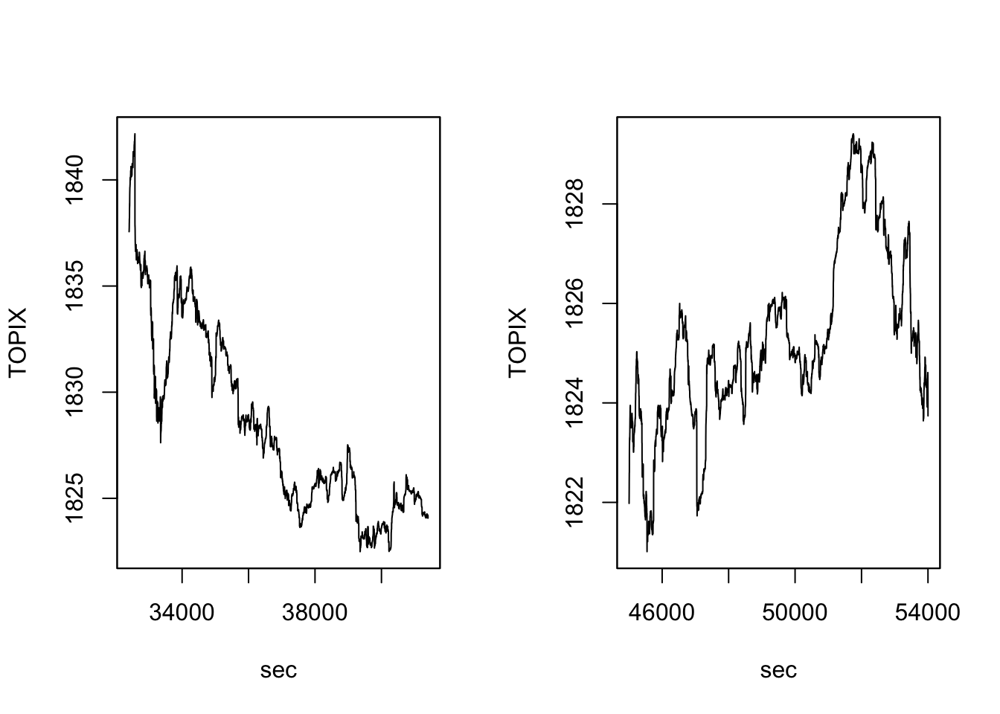
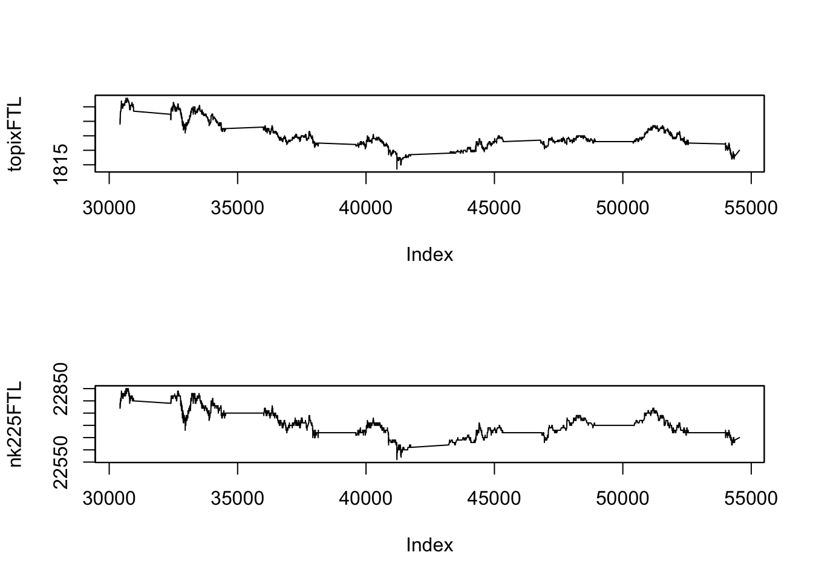

# 高頻度データ分析


## ボラティリティ推定
一日内の取引データ (高頻度データ) を使って, 日次ボラティリティを推定したい.

### データセット1: TOPIX指数データ {-}
1日分 (2018年2月5日), 1秒間隔の東証株価指数 (TOPIX) データ.

```r
require(zoo)
# TOPIX指数データ. 2018年2月5日. 1秒間隔
# 各8998件 (共通)
# 9:00:05 -- 11:30:02, 12:30:05--15:00:02
idir <- file.path("./")

# TOPIX指数
ifl1 <- paste(idir, "topix1s_20180205_1.csv", sep = "/")
topix1s_1 <- read.csv(ifl1)
ifl2 <- paste(idir, "topix1s_20180205_2.csv", sep = "/")
topix1s_2 <- read.csv(ifl2)

topix_1 <- zoo(topix1s_1$price, topix1s_1$sec)
topix_2 <- zoo(topix1s_2$price, topix1s_2$sec)

par(mfrow=c(1,2))
plot(topix_1, xlab = "sec", ylab = "TOPIX")
plot(topix_2, xlab = "sec", ylab = "TOPIX")
```



株価指数そのものは取引されていないが,
現実に取引されている証券の高頻度データを使ってボラティリティを推定する場合には,
**マイクロストラクチャノイズ**に対する対応が必要となる.
簡便法としては, 実現ボラティリティの代わりに始値と終値のみや,
四本値のみを使う推定法 (例, Parkinsonボラティリティ) を用いる,
実現ボラティリティの計算に
用いる取引データの間隔を間引き (5分間隔程度) するやり方がある.
さらには, 実現ボラティリティを改良し,
マイクロストラクチャノイズに対応したより"精緻な"推定法が
数多く提案されている. これらは, **yuima**パッケージの中で
cce()関数として実装されている (以下の「共分散・相関の推定」パート参照).


### 実現ボラティリティの計算 {-}
真の価格系列が連続時間の拡散過程 (伊藤過程) に従っていて
それが離散時間で観測されていると仮定.

```r
# 実現ボラティリティの計算
# 分散ではなく標準偏差表示. 年率換算せず
# prcvec: (対数を取る前の) 価格系列
calc_RV <- function(prcvec, dgts = 6){
  prcvec2 <- na.omit(prcvec)
  if(length(prcvec2) == 0 || any(prcvec <= 0)) return(NA)		# -Infを回避
  rv <- sum(diff(log(prcvec2))^2) ** 0.5
  return(round(rv, dgts))
}

(RV_1 <- calc_RV(topix_1))
#> [1] 0.004188
(RV_2 <- calc_RV(topix_2))
#> [1] 0.002204
#(RV.1 <- calc_RV(topix1s_1$price))
#(RV.2 <- calc_RV(topix1s_2$price))
```

### Parkionsonボラティリティの計算 {-}

```r
# Parkionsonボラティリティの計算
# 分散ではなく標準偏差表示. 年率換算せず
calc_vParkinson <- function(prcvec, freq = 1){
  prcvec2 <- na.omit(prcvec)
  if(length(prcvec2) == 0) return(NA)		# -Infを回避
  LH <- range(prcvec2)
  if (LH[1] * LH[2] <= 0) return(F)
  vola <- abs(log(LH[2] / LH[1]))/sqrt(4 * freq * log(2))
  return(vola)
}

(vPark_1 <- calc_vParkinson(topix_1))
#> [1] 0.006450344
(vPark_2 <- calc_vParkinson(topix_2))
#> [1] 0.002763914
#(vPark_1 <- calc_vParkinson(topix1s_1$price))
#(vPark_2 <- calc_vParkinson(topix1s_2$price))
```


## 共分散・相関の推定
2つの証券の一日内の取引データを使って, 両者の共分散や相関係数を推定したい.
しかし, 個別取引のデータは等間隔に並んでないことから, 
データが同時観測されていない (非同期) 点を考慮する必要がある.

### データセット2: 株価指数先物データ {-}
1日分 (2018年2月5日)のTOPIX, 日経平均それぞれの株価指数先物データ (中心限月, ラージサイズ).
時間解像度は1ミリ秒.
同時点タイムスタンプを持つ複数レコードが存在する. ここでは, 1タイムスタンプ1レコードに集約. 価格はVWAPを使用.

```r
library(yuima)
yyyymmdd <- 20180205
ifl1.0 <- paste0("TXFTL-", yyyymmdd, "-D.csv")
ifl1 <- paste(idir, ifl1.0, sep = "/")
TXFTL <- read.csv(ifl1, header = F)
ifl2.0 <- paste0("NKFTL-", yyyymmdd, "-D.csv")
ifl2 <- paste(idir, ifl2.0, sep = "/")
NKFTL <- read.csv(ifl2, header = F)

tx_zoo <- zoo(TXFTL$V2, TXFTL$V1/1000) # Warning: uniqueでない
nk_zoo <- zoo(NKFTL$V2, NKFTL$V1/1000)

topixFTL <- aggregate(tx_zoo, index(tx_zoo), mean)  # unique timestamp
nk225FTL <- aggregate(nk_zoo, index(nk_zoo), mean)  # unique timestamp

par(mfrow=c(2,1))
plot(topixFTL)
plot(nk225FTL)
```



```r

topixFTL_ret <- diff(log(topixFTL))
nk225FTL_ret <- diff(log(nk225FTL))
# 関数に入力する系列が, 価格か対数リターンかに注意すること
```

- 高頻度の価格時系列データの特徴 (stylized facts)
  - ティック単位での動きが観察される
  - 値段が動かない時間も散発的に発生
  - ジャンプ?
  - (ティックデータの場合) 1変量は非等間隔観察. 2変量間では非同期観察
- → "連続拡散過程"の実現値の特徴から乖離
  - "マーケット・マイクロストラクチャ・ノイズ"への対応
  - ジャンプへの対応

### 共分散・相関の推定 {-}

```
cce: (非同期なタイムスタンプを持つ) 伊藤過程間の共分散を推定
- 用法: cce(x, method="HY", theta, kn, g=function(x)min(x,1-x), refreshing = TRUE,
    cwise = TRUE, delta = 0, adj = TRUE, K, c.two, J = 1, c.multi, kernel, H,
    c.RK, eta = 3/5, m = 2, ftregion = 0, vol.init = NA,
    covol.init = NA, nvar.init = NA, ncov.init = NA, mn, alpha = 0.4,
    frequency = 300, avg = TRUE, threshold, utime, psd = FALSE)
- 詳細はマニュアル参照のこと 
- 一変量の時系列データを引数xに指定すれば, ボラティリティを推定することができる.
# cf. https://cran.r-project.org/web/packages/yuima/yuima.pdf
```


```r
# yuima class data
ft2 <- Quote(yuima::setData(list(topixFTL_ret, nk225FTL_ret)))
yuima::cce(ft2) # the Hayashi-Yoshida estimator; Hayashi and Yoshida (2005)
```
- 注) 執筆時点でのsetData()の仕様に基づいたコード (変更される可能性)

<!--
cce(eval(ft2))$covmat **0.5
は
sum(topixFTL_ret^2)
calc_RV(topixFTL)
と値が異なる!. 区間のnormalizationの違い?
昨年度配布のRコード, cceに価格系列を入力していたが
どうやら, リターン系列の入力が必要?!
-->
<!-- (TH) cce(refreshing = T)となっている. HYにおいては, refreshしても値は多分変わらない?? -->

```r
# the Pre-averaged Hayashi-Yoshida estimator; Christensen et al. (2010)
yuima::cce(ft2, method = "PHY")$cormat

# Pre-averaged Truncated Hayashi-Yoshida estimator
yuima::cce(ft2, method = "PTHY")$cormat

# the Modulated Realized Covariance based on refresh time sampling; Christensen et al. (2010)
yuima::cce(ft2, method = "MRC")$cormat

# Generalized multiscale estimator
#yuima::cce(ft2, method = "GME")$cormat

# Multivariate realized kernel
#yuima::cce(ft2, method = "RK")$cormat

# Method "TSCV" is an implementation of the previous tick Two Scales realized CoVariance based on refresh time sampling; Zhang (2011)
#yuima::cce(ft2, method = "TSCV")$cormat

# the nonparametric Quasi Maximum Likelihood Estimator; Ait-Sahalia et al. (2010)
yuima::cce(ft2, method = "QMLE")$cormat

# the Separating Information Maximum Likelihood estimator in Kunitomo and Sato (2013), with the basis of refresh time sampling
yuima::cce(ft2, method = "SIML")$cormat

# the Truncated Hayashi-Yoshida estimator; Mancini and Gobbi (2012)
yuima::cce(ft2, method = "THY")$cormat

# an implementation of the calendar time Subsampled realized BiPower Covariation
#yuima::cce(ft2, method = "SBPC")$cormat
```


<!--- 010623: ACDモデルも加えたい! --->
## ACDモデル
ランダムに到着する取引の間隔データに対して, 自己回帰条件付デュレーション (ACD) モデルを仮定し, モデル適合する. ACDモデルは, 自己励起 (self-excitment) を表現することができる.
上で使用した株価指数先物データセット (topixFTL, nk225FTL) をここでも使用.


**デュレーション (取引間隔) 系列**:

```r
library(tidyverse)
library(lubridate)
library(stringr)
options(digits = 3)

# デュレーション (取引間隔)
dur_tx <- diff(index(topixFTL))
dur_nk <- diff(index(nk225FTL))

head(dur_tx)
#> [1] 0.030 0.336 0.001 0.002 0.001 0.003
head(dur_nk)
#> [1] 0.030 0.001 0.001 0.092 0.062 0.019
length(dur_tx)
#> [1] 10899
length(dur_nk)
#> [1] 7501

plot(dur_tx[1:300], type = "l", main = "duration (first 300)")
```


**モデルの適合**:
```
acdFit: ACDモデルの適合
- 用法: acdFit(durations = NULL, model = "ACD", dist = "exponential", 
    order = NULL, startPara = NULL,  dailyRestart = 0, optimFnc = "optim",
    method = "Nelder-Mead", output = TRUE, bootstrapErrors = FALSE, 
    forceErrExpec = TRUE, fixedParamPos = NULL, bp = NULL, 
    exogenousVariables = NULL, control = list())
  - model: 条件付平均の特定. "ACD", "LACD1", "LACD2", "AMACD", "BACD", "ABACD", "SNIACD", "LSNIACD"の中から一つ選択.
  - dist: 誤差項の確率分布. "exponential", "weibull", "burr", "gengamma", "genf", "qweibull", "mixqwe", "mixqww", "mixinvgauss"の中から一つ選択. 
  - order: ACDモデルの次数. 例えば, ACD(p, q)ならば, order = c(p, q)を指定.
```


以下では, 誤差項の確率分布として指数分布を, モデルとしてACD(1,1), LACD1(1,1), LACD2(1,1)の3つを選択.
モデルは定常性を仮定することから, 実際に実証分析を行う際には, "非定常"な時間帯, 具体的には市場のオープン後やクローズ前の一定期間 (５分間, 10分間等) のデータを除いたり, また1日内の非確率的な季節性変動予め除去した系列に対して, これらのモデルの適合が行われる (diurnal adjustmentと呼ばれる).

```r
library(ACDm)
distn <- "exponential"
mod0 <- "ACD"
mod1 <- "LACD1"
mod2 <- "LACD2"
```


```r
# TOPIX先物
# ACD(1,1)
fit_acd_tx <- ACDm::acdFit(durations = dur_tx, model = mod0, dist = distn, order = c(1, 1), output = T)
#> 
#> ACD model estimation by (Quasi) Maximum Likelihood 
#> 
#> Call:
#>   ACDm::acdFit(durations = dur_tx, model = mod0, dist = distn,      order = c(1, 1), output = T) 
#> 
#> Model:
#>   ACD(1, 1)
#> 
#> Distribution:
#>   exponential
#> 
#> N: 10899
#> 
#> Parameter estimate:
#>          Coef     SE PV robustSE
#> omega  1.4904 0.0523  0    0.373
#> alpha1 0.6144 0.0334  0    0.281
#> beta1  0.0871 0.0222  0    0.067
#> 
#> 
#> The fixed/unfree mean distribution parameter: 
#>  lambda: 1
#> 
#> QML robust correlations:
#>         omega alpha1  beta1
#> omega   1.000 -0.217 -0.387
#> alpha1 -0.217  1.000 -0.313
#> beta1  -0.387 -0.313  1.000
#> 
#> 
#> Goodness of fit:
#>                value
#> LogLikelihood -19293
#> AIC            38592
#> BIC            38614
#> MSE             1895
#> 
#> Convergence: 0 
#> 
#> Number of log-likelihood function evaluations: 193 
#> 
#> Estimation time: 0.0421 secs 
#> 
#> Description: Estimated at 2024-01-10 22:48:49 by user takaki
# LACD1(1,1)
fit_lacd1_tx <- ACDm::acdFit(durations = dur_tx, model = mod1, dist = distn, order = c(1, 1), output = T)
#> 
#> ACD model estimation by (Quasi) Maximum Likelihood 
#> 
#> Call:
#>   ACDm::acdFit(durations = dur_tx, model = mod1, dist = distn,      order = c(1, 1), output = T) 
#> 
#> Model:
#>   LACD1(1, 1)
#> 
#> Distribution:
#>   exponential
#> 
#> N: 10899
#> 
#> Parameter estimate:
#>         Coef      SE PV
#> omega  0.940 0.02007  0
#> alpha1 0.161 0.00371  0
#> beta1  0.349 0.01807  0
#> 
#> 
#> The fixed/unfree mean distribution parameter: 
#>  lambda: 1
#> 
#> Goodness of fit:
#>                value
#> LogLikelihood -18491
#> AIC            36987
#> BIC            37009
#> MSE             1373
#> 
#> Convergence: 0 
#> 
#> Number of log-likelihood function evaluations: 140 
#> 
#> Estimation time: 0.11 secs 
#> 
#> Description: Estimated at 2024-01-10 22:48:49 by user takaki
# LACD2(1,1)
fit_lacd2_tx <- ACDm::acdFit(durations = dur_tx, model = mod2, dist = distn, order = c(1, 1), output = T)
#> 
#> ACD model estimation by (Quasi) Maximum Likelihood 
#> 
#> Call:
#>   ACDm::acdFit(durations = dur_tx, model = mod2, dist = distn,      order = c(1, 1), output = T) 
#> 
#> Model:
#>   LACD2(1, 1)
#> 
#> Distribution:
#>   exponential
#> 
#> N: 10899
#> 
#> Parameter estimate:
#>           Coef       SE PV
#> omega   0.0832 0.012233  0
#> alpha1 -0.0019 0.000276  0
#> beta1   0.8975 0.015240  0
#> 
#> 
#> The fixed/unfree mean distribution parameter: 
#>  lambda: 1
#> 
#> Goodness of fit:
#>                value
#> LogLikelihood -19540
#> AIC            39085
#> BIC            39107
#> MSE             1373
#> 
#> Convergence: 0 
#> 
#> Number of log-likelihood function evaluations: 192 
#> 
#> Estimation time: 0.0893 secs 
#> 
#> Description: Estimated at 2024-01-10 22:48:49 by user takaki
```


```r
# 日経平均先物
# ACD(1,1)
fit_acd_nk <- ACDm::acdFit(durations = dur_nk, model = mod0, dist = distn, order = c(1, 1), output = T)
#> 
#> ACD model estimation by (Quasi) Maximum Likelihood 
#> 
#> Call:
#>   ACDm::acdFit(durations = dur_nk, model = mod0, dist = distn,      order = c(1, 1), output = T) 
#> 
#> Model:
#>   ACD(1, 1)
#> 
#> Distribution:
#>   exponential
#> 
#> N: 7501
#> 
#> Parameter estimate:
#>           Coef      SE PV robustSE
#> omega  0.00734 0.00153  0  0.00612
#> alpha1 0.14555 0.00761  0  0.02283
#> beta1  0.91804 0.00310  0  0.00858
#> 
#> 
#> The fixed/unfree mean distribution parameter: 
#>  lambda: 1
#> 
#> QML robust correlations:
#>         omega alpha1  beta1
#> omega   1.000 -0.410 -0.692
#> alpha1 -0.410  1.000 -0.137
#> beta1  -0.692 -0.137  1.000
#> 
#> 
#> Goodness of fit:
#>                value
#> LogLikelihood -14762
#> AIC            29531
#> BIC            29552
#> MSE             2277
#> 
#> Convergence: 0 
#> 
#> Number of log-likelihood function evaluations: 184 
#> 
#> Estimation time: 0.0252 secs 
#> 
#> Description: Estimated at 2024-01-10 22:48:49 by user takaki
# LACD1(1,1)
fit_lacd1_nk <- ACDm::acdFit(durations = dur_nk, model = mod1, dist = distn, order = c(1, 1), output = T)
#> 
#> ACD model estimation by (Quasi) Maximum Likelihood 
#> 
#> Call:
#>   ACDm::acdFit(durations = dur_nk, model = mod1, dist = distn,      order = c(1, 1), output = T) 
#> 
#> Model:
#>   LACD1(1, 1)
#> 
#> Distribution:
#>   exponential
#> 
#> N: 7501
#> 
#> Parameter estimate:
#>          Coef       SE PV
#> omega  0.1423 0.004049  0
#> alpha1 0.0508 0.001426  0
#> beta1  1.0041 0.000623  0
#> 
#> 
#> The fixed/unfree mean distribution parameter: 
#>  lambda: 1
#> 
#> Goodness of fit:
#>                value
#> LogLikelihood -13235
#> AIC            26476
#> BIC            26496
#> MSE             2001
#> 
#> Convergence: 0 
#> 
#> Number of log-likelihood function evaluations: 182 
#> 
#> Estimation time: 0.0924 secs 
#> 
#> Description: Estimated at 2024-01-10 22:48:49 by user takaki
# LACD2(1,1)
fit_lacd2_nk <- ACDm::acdFit(durations = dur_nk, model = mod2, dist = distn, order = c(1, 1), output = T)
#> 
#> ACD model estimation by (Quasi) Maximum Likelihood 
#> 
#> Call:
#>   ACDm::acdFit(durations = dur_nk, model = mod2, dist = distn,      order = c(1, 1), output = T) 
#> 
#> Model:
#>   LACD2(1, 1)
#> 
#> Distribution:
#>   exponential
#> 
#> N: 7501
#> 
#> Parameter estimate:
#>          Coef       SE PV
#> omega  0.0229 0.001847  0
#> alpha1 0.0028 0.000278  0
#> beta1  0.9779 0.001666  0
#> 
#> 
#> The fixed/unfree mean distribution parameter: 
#>  lambda: 1
#> 
#> Goodness of fit:
#>                value
#> LogLikelihood -16185
#> AIC            32377
#> BIC            32398
#> MSE             2003
#> 
#> Convergence: 0 
#> 
#> Number of log-likelihood function evaluations: 160 
#> 
#> Estimation time: 0.0546 secs 
#> 
#> Description: Estimated at 2024-01-10 22:48:49 by user takaki
```


**推定パラメータ**:

```r
# TOPIX先物
# summary(fit_acd_tx)
# summary(fit_lacd1_tx)
# summary(fit_lacd2_tx)
fit_acd_tx$mPara
#>  omega alpha1  beta1 
#> 1.4904 0.6144 0.0871
fit_lacd1_tx$mPara
#>  omega alpha1  beta1 
#>  0.940  0.161  0.349
fit_lacd2_tx$mPara
#>   omega  alpha1   beta1 
#>  0.0832 -0.0019  0.8975
# 日経平均先物
fit_acd_nk$mPara
#>   omega  alpha1   beta1 
#> 0.00734 0.14555 0.91804
fit_lacd1_nk$mPara
#>  omega alpha1  beta1 
#> 0.1423 0.0508 1.0041
fit_lacd2_nk$mPara
#>  omega alpha1  beta1 
#> 0.0229 0.0028 0.9779
```
