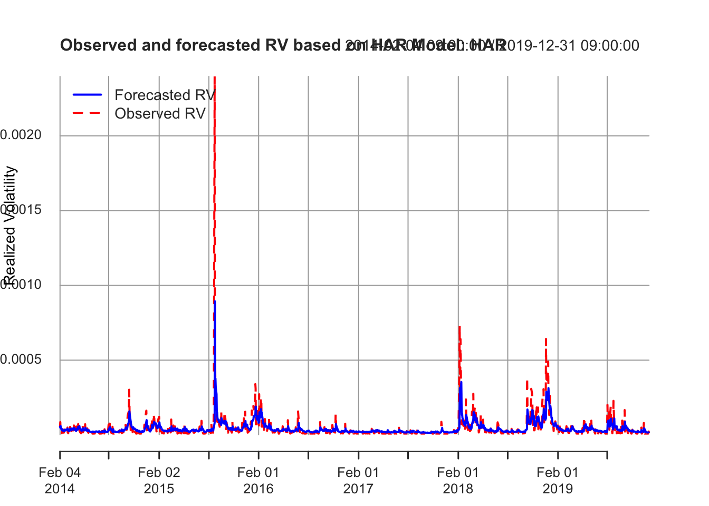
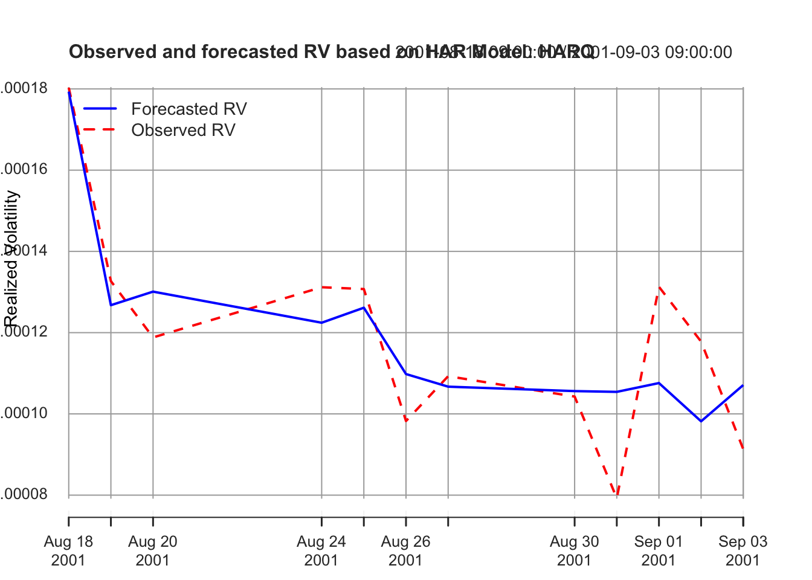
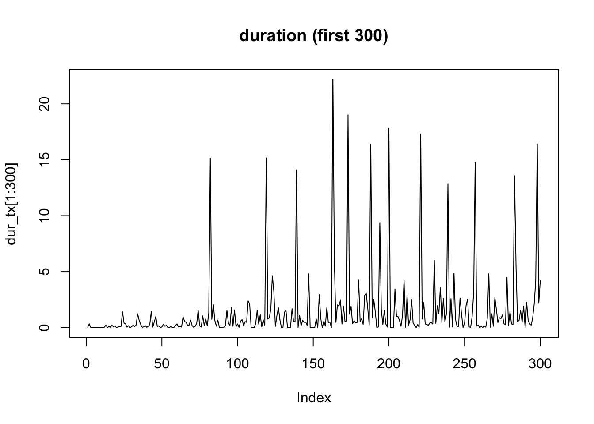

# 高頻度データ分析


## ボラティリティ推定
一日内の取引データ (高頻度データ) を使って, 日次ボラティリティを推定したい.

### データセット1: TOPIX指数データ {-}
1日分 (2018年2月5日), 1秒間隔の東証株価指数 (TOPIX) データ.

```r
require(zoo)
# TOPIX指数データ. 2018年2月5日. 1秒間隔
# 各8998件 (共通)
# 9:00:05 -- 11:30:02, 12:30:05--15:00:02
idir <- file.path("./")

# TOPIX指数
ifl1 <- paste(idir, "topix1s_20180205_1.csv", sep = "/")
topix1s_1 <- read.csv(ifl1)
ifl2 <- paste(idir, "topix1s_20180205_2.csv", sep = "/")
topix1s_2 <- read.csv(ifl2)

topix_1 <- zoo(topix1s_1$price, topix1s_1$sec)
topix_2 <- zoo(topix1s_2$price, topix1s_2$sec)

par(mfrow=c(1,2))
plot(topix_1, xlab = "sec", ylab = "TOPIX")
plot(topix_2, xlab = "sec", ylab = "TOPIX")
```


株価指数そのものは取引されていないが,
現実に取引されている証券の高頻度データを使ってボラティリティを推定する場合には,
**マイクロストラクチャノイズ**に対する対応が必要となる.
簡便法としては, 実現ボラティリティの代わりに始値と終値のみや,
四本値のみを使う推定法 (例, Parkinsonボラティリティ) を用いる,
実現ボラティリティの計算に
用いる取引データの間隔を間引き (5分間隔程度) するやり方がある.
さらには, 実現ボラティリティを改良し,
マイクロストラクチャノイズに対応したより"精緻な"推定法が
数多く提案されている. これらは, **yuima**パッケージの中で
cce()関数として実装されている (以下の「共分散・相関の推定」パート参照).


### 実現ボラティリティの計算 {-}
真の価格系列が連続時間の拡散過程 (伊藤過程) に従っていて
それが離散時間で観測されていると仮定.

```r
# 実現ボラティリティの計算
# 分散ではなく標準偏差表示. 年率換算せず
# prcvec: (対数を取る前の) 価格系列
calc_RV <- function(prcvec, dgts = 6){
  prcvec2 <- na.omit(prcvec)
  if(length(prcvec2) == 0 || any(prcvec <= 0)) return(NA)		# -Infを回避
  rv <- sum(diff(log(prcvec2))^2) ** 0.5
  return(round(rv, dgts))
}

(RV_1 <- calc_RV(topix_1))
#> [1] 0.004188
(RV_2 <- calc_RV(topix_2))
#> [1] 0.002204
#(RV.1 <- calc_RV(topix1s_1$price))
#(RV.2 <- calc_RV(topix1s_2$price))
```

### Parkionsonボラティリティの計算 {-}

```r
# Parkionsonボラティリティの計算
# 分散ではなく標準偏差表示. 年率換算せず
calc_vParkinson <- function(prcvec, freq = 1){
  prcvec2 <- na.omit(prcvec)
  if(length(prcvec2) == 0) return(NA)		# -Infを回避
  LH <- range(prcvec2)
  if (LH[1] * LH[2] <= 0) return(F)
  vola <- abs(log(LH[2] / LH[1]))/sqrt(4 * freq * log(2))
  return(vola)
}

(vPark_1 <- calc_vParkinson(topix_1))
#> [1] 0.006450344
(vPark_2 <- calc_vParkinson(topix_2))
#> [1] 0.002763914
#(vPark_1 <- calc_vParkinson(topix1s_1$price))
#(vPark_2 <- calc_vParkinson(topix1s_2$price))
```

### HAR-RVモデルによる予測 {-}

HAR-RVモデルは, 日次RV時系列の示す長期記憶性をうまく近似し, ボラティリティ予測性能が高いとされるモデルである.
**highfrequency**パッケージの関数HARmodel()により, HARモデルの推定, ボラティリティの予測が可能である. パラメータ指定により,
HARモデルのバリエーションの指定や,
説明変数に使う日次・週次・月次の合算日数の変更,
RV以外の有用な実現測度 (realized measures) の推定・予測も可能である.
ジャンプ検定も可能である.

```
HARmodel(): HARモデルの推定. 過去の高頻度データより1日先のボラティリティ予測
- usage: HARmodel(
      data,　# xtsオブジェクト. 日内対数リターン, または計算済の実現測度 (realized measures)
      periods = c(1, 5, 22), # 実現測度の合算 (集約) 日数のベクトル (1 day, 1 week, 1 monthに対応)
      periodsJ = c(1, 5, 22), # ジャンプ項の合算日数のベクトル
      periodsQ = c(1), # 実現4乗量 (quarticity) の合算日数のベクトル
      leverage = NULL, # 負のリターンを合算する日数のベクトル
      RVest = c("rCov", "rBPCov", "rQuar"), # 出力の種類: デフォルトは, 日次累積分散 (ジャンプ-robust), 実現bi-power変動, 実現4乗量. それ以外の指定はマニュアルを見よ.
      inputType = "RM", # 入力dataの形式]: realized measure (デフォルト). それ以外は, リターン
      jumpTest = "ABDJumptest", # ジャンプ検定
      alpha = 0.05, # ジャンプ検定の有意水準
      h = 1, # 従属変数を合算する日数
      transform = NULL, # 従属変数や説明変数を(同時に)変換する関数. 典型例, "log", "sqrt"
      externalRegressor = NULL, # 外部説明変数
      periodsExternal = c(1), # 外部説明変数を合算する日数
      ...
```


```r
library(highfrequency)
library(xts)
#  Forecasting daily Realized volatility for the S&P 500 using the basic HARmodel: HAR
str(SPYRM) # S&P500 (SPY) ETFの各種実現測度 (１分, 5分)
#> Classes 'data.table' and 'data.frame':	1495 obs. of  14 variables:
#>  $ DT    : Date, format: "2014-01-02" "2014-01-03" ...
#>  $ RV1   : num  2.68e-05 1.58e-05 2.72e-05 1.08e-05 3.11e-05 ...
#>  $ RV5   : num  2.57e-05 1.78e-05 2.56e-05 9.95e-06 2.68e-05 ...
#>  $ BPV1  : num  2.54e-05 1.55e-05 2.18e-05 1.00e-05 2.58e-05 ...
#>  $ BPV5  : num  2.37e-05 1.67e-05 1.89e-05 9.75e-06 2.35e-05 ...
#>  $ medRV1: num  2.45e-05 1.54e-05 2.24e-05 1.06e-05 2.64e-05 ...
#>  $ medRV5: num  1.93e-05 1.63e-05 1.64e-05 9.32e-06 2.32e-05 ...
#>  $ RK1   : num  2.59e-05 1.60e-05 3.20e-05 9.42e-06 1.98e-05 ...
#>  $ RK5   : num  2.64e-05 1.63e-05 2.59e-05 9.96e-06 1.94e-05 ...
#>  $ RQ1   : num  0.0534 0.0302 0.0621 0.0213 0.0889 ...
#>  $ RQ5   : num  0.0543 0.0304 0.05 0.017 0.0538 ...
#>  $ medRQ1: num  0.0473 0.0296 0.0419 0.0207 0.0823 ...
#>  $ medRQ5: num  0.0473 0.0296 0.0419 0.0207 0.0823 ...
#>  $ CLOSE : num  183 183 182 183 184 ...
#>  - attr(*, ".internal.selfref")=<externalptr> 
#>  - attr(*, "sorted")= chr "DT"
RVSPY <- as.xts(SPYRM$RV5, order.by = SPYRM$DT)
x <- HARmodel(data = RVSPY , periods = c(1,5,22), RVest = c("rCov"),
                  type = "HAR", h = 1, transform = NULL, inputType = "RM")
class(x)
#> [1] "HARmodel" "lm"
plot(x)
```




```r
# Estimate the HAR model of type HARQ
dat <- as.xts(sampleOneMinuteData[, makeReturns(STOCK), by = list(DATE = as.Date(DT))])
x <- HARmodel(dat, periods = c(1,5,10), periodsJ = c(1,5,10),
              periodsQ = c(1), RVest = c("rCov", "rQuar"),
              type="HARQ", inputType = "returns")
class(x)
#> [1] "HARmodel" "lm"
x
#> 
#> Model:
#> RV1 = beta0  +  beta1 * RV1 +  beta2 * RV5 +  beta3 * RV10 +  beta4 * RQ1
#> 
#> Coefficients:
#>      beta0       beta1       beta2       beta3       beta4  
#>  7.046e-05  -1.545e-01   1.686e-01   3.025e-01   1.023e+03  
#> Newey-West Standard Errors:
#>     beta0      beta1      beta2      beta3      beta4  
#> 1.471e-05  9.588e-02  1.061e-01  9.461e-02  2.886e+02  
#> 
#> 
#>     r.squared  adj.r.squared  
#>        0.6944         0.5198
plot(x)
```



```r
predict(x)
#> [1] 0.0001071019
```

## 共分散・相関の推定
2つの証券の一日内の取引データを使って, 両者の共分散や相関係数を推定したい.
しかし, 個別取引のデータは等間隔に並んでないことから, 
データが同時観測されていない (非同期) 点を考慮する必要がある.
上記, **highfrequency**パッケージの他, **yuima**パッケージも利用可能である.

### データセット2: 株価指数先物データ {-}
1日分 (2018年2月5日)のTOPIX, 日経平均それぞれの株価指数先物データ (中心限月, ラージサイズ).
時間解像度は1ミリ秒.
同時点タイムスタンプを持つ複数レコードが存在する. ここでは, 1タイムスタンプ1レコードに集約. 価格はVWAPを使用.


```r
library(yuima)
yyyymmdd <- 20180205
ifl1.0 <- paste0("TXFTL-", yyyymmdd, "-D.csv")
ifl1 <- paste(idir, ifl1.0, sep = "/")
TXFTL <- read.csv(ifl1, header = F)
ifl2.0 <- paste0("NKFTL-", yyyymmdd, "-D.csv")
ifl2 <- paste(idir, ifl2.0, sep = "/")
NKFTL <- read.csv(ifl2, header = F)

tx_zoo <- zoo(TXFTL$V2, TXFTL$V1/1000) # Warning: uniqueでない
nk_zoo <- zoo(NKFTL$V2, NKFTL$V1/1000)

topixFTL <- aggregate(tx_zoo, index(tx_zoo), mean)  # unique timestamp
nk225FTL <- aggregate(nk_zoo, index(nk_zoo), mean)  # unique timestamp

par(mfrow=c(2,1))
plot(topixFTL)
plot(nk225FTL)
```


```r

topixFTL_ret <- diff(log(topixFTL))
nk225FTL_ret <- diff(log(nk225FTL))
# 関数に入力する系列が, 価格か対数リターンかに注意すること
```

- 高頻度の価格時系列データの特徴 (stylized facts)
  - ティック単位での動きが観察される
  - 値段が動かない時間も散発的に発生
  - ジャンプ?
  - (ティックデータの場合) 1変量は非等間隔観察. 2変量間では非同期観察
- → "連続拡散過程"の実現値の特徴から乖離
  - "マーケット・マイクロストラクチャ・ノイズ"への対応
  - ジャンプへの対応

### 共分散・相関の推定 {-}

```
highfrequency::rHYCov(): Hayashi-Yoshida共分散推定量の計算
- 用法:
   rHYCov(
      rData,
      cor = FALSE,
      period = 1,
      alignBy = "seconds",
      alignPeriod = 1,
      makeReturns = FALSE,
      makePsd = TRUE,
      ...
    )
  - rData: (複数日・複数銘柄の) リターンまたは価格系列 (xts, またはdata.frame)
  - cor: 返す値は, 相関か共分散か
  - period: サンプル期間
  - alignBy: alignPeriodの時間スケール. "ticks", "secs", "seconds", "mins", "minutes", "hours"
  - alignPeriod: 合算する期間長. 例えば, alighnPeriod = 5, alighBy = "mins"なら５分間隔に集約
  - makeReturns: リターンに変換するか. rDataが価格系列ならTを指定のこと. デフォルトはF
  - makePsd: Tならば, 正定値行列に修正. デフォルトはF 
```

※ rHYCov()を実行する場合には, あらかじめ異なるタイムスタンプを持つ非同期のxtsオブジェクトを一つ (共通のタイムスタンプを持つ) オブジェクトにマージしておく必要.


<!-- 使えるようにしたい. 210行目は, aaa <- をしなければOK. assignがうまくいかないらしい
-->

```
yuima::cce: (非同期なタイムスタンプを持つ) 伊藤過程間の共分散を推定
- 用法: 
cce(x, method="HY", theta, kn, g=function(x)min(x,1-x), refreshing = TRUE,
    cwise = TRUE, delta = 0, adj = TRUE, K, c.two, J = 1, c.multi, kernel, H,
    c.RK, eta = 3/5, m = 2, ftregion = 0, vol.init = NA,
    covol.init = NA, nvar.init = NA, ncov.init = NA, mn, alpha = 0.4,
    frequency = 300, avg = TRUE, threshold, utime, psd = FALSE)
- 詳細はマニュアル参照のこと 
- 一変量の時系列データを引数xに指定すれば, ボラティリティを推定することができる.
# cf. https://cran.r-project.org/web/packages/yuima/yuima.pdf
```


```r
# yuima class data
ft2 <- Quote(yuima::setData(list(topixFTL_ret, nk225FTL_ret)))
yuima::cce(ft2) # the Hayashi-Yoshida estimator; Hayashi and Yoshida (2005)
```
- 注) 執筆時点でのsetData()の仕様に基づいたコード (変更される可能性)

<!--
cce(eval(ft2))$covmat **0.5
は
sum(topixFTL_ret^2)
calc_RV(topixFTL)
と値が異なる!. 区間のnormalizationの違い?
昨年度配布のRコード, cceに価格系列を入力していたが
どうやら, リターン系列の入力が必要?!
-->
<!-- (TH) cce(refreshing = T)となっている. HYにおいては, refreshしても値は多分変わらない?? -->

```r
# the Pre-averaged Hayashi-Yoshida estimator; Christensen et al. (2010)
yuima::cce(ft2, method = "PHY")$cormat

# Pre-averaged Truncated Hayashi-Yoshida estimator
yuima::cce(ft2, method = "PTHY")$cormat

# the Modulated Realized Covariance based on refresh time sampling; Christensen et al. (2010)
yuima::cce(ft2, method = "MRC")$cormat

# Generalized multiscale estimator
#yuima::cce(ft2, method = "GME")$cormat

# Multivariate realized kernel
#yuima::cce(ft2, method = "RK")$cormat

# Method "TSCV" is an implementation of the previous tick Two Scales realized CoVariance based on refresh time sampling; Zhang (2011)
#yuima::cce(ft2, method = "TSCV")$cormat

# the nonparametric Quasi Maximum Likelihood Estimator; Ait-Sahalia et al. (2010)
yuima::cce(ft2, method = "QMLE")$cormat

# the Separating Information Maximum Likelihood estimator in Kunitomo and Sato (2013), with the basis of refresh time sampling
yuima::cce(ft2, method = "SIML")$cormat

# the Truncated Hayashi-Yoshida estimator; Mancini and Gobbi (2012)
yuima::cce(ft2, method = "THY")$cormat

# an implementation of the calendar time Subsampled realized BiPower Covariation
#yuima::cce(ft2, method = "SBPC")$cormat
```


<!--- 010623: ACDモデルも加えたい! --->
## ACDモデル
ランダムに到着する取引の間隔データの持つ時系列構造を表現するモデルとして, 自己回帰条件付デュレーション (ACD) モデルを取り上げる. 
ここでは, 上で使用した株価指数先物データセット (topixFTL, nk225FTL) を使用する.


**デュレーション (取引間隔) 系列**:

```r
library(tidyverse)
library(lubridate)
library(stringr)
options(digits = 3)

# デュレーション (取引間隔)
dur_tx <- diff(index(topixFTL))
dur_nk <- diff(index(nk225FTL))

head(dur_tx)
#> [1] 0.030 0.336 0.001 0.002 0.001 0.003
head(dur_nk)
#> [1] 0.030 0.001 0.001 0.092 0.062 0.019
length(dur_tx)
#> [1] 10899
length(dur_nk)
#> [1] 7501

plot(dur_tx[1:300], type = "l", main = "duration (first 300)")
```



ランダムに到着する取引の間隔データにおいても, クラスタリング現象が観察される.
これを表現するためのモデルが自己回帰条件付デュレーション (ACD) モデルである. ACDモデルやそのバリエーションは, 取引が活発  (取引間隔が短く) なると, さらにそれがあらたな取引を呼び込むといった, 自己励起 (self-excitment) の現象を表現することができる.


**モデルの適合**:
```
acdFit: ACDモデルの適合
- 用法: acdFit(durations = NULL, model = "ACD", dist = "exponential", 
    order = NULL, startPara = NULL,  dailyRestart = 0, optimFnc = "optim",
    method = "Nelder-Mead", output = TRUE, bootstrapErrors = FALSE, 
    forceErrExpec = TRUE, fixedParamPos = NULL, bp = NULL, 
    exogenousVariables = NULL, control = list())
  - model: 条件付平均の特定. "ACD", "LACD1", "LACD2", "AMACD", "BACD", "ABACD", "SNIACD", "LSNIACD"の中から一つ選択.
  - dist: 誤差項の確率分布. "exponential", "weibull", "burr", "gengamma", "genf", "qweibull", "mixqwe", "mixqww", "mixinvgauss"の中から一つ選択. 
  - order: ACDモデルの次数. 例えば, ACD(p, q)ならば, order = c(p, q)を指定.
```


以下では, 誤差項の確率分布として指数分布を, モデルとしてACD(1,1), LACD1(1,1), LACD2(1,1)の3つを選択.
モデルは定常性を仮定することから, 実際に実証分析を行う際には, "非定常"な時間帯, 具体的には市場のオープン後やクローズ前の一定期間 (５分間, 10分間等) のデータを除いたり, また1日内の非確率的な季節性変動予め除去した系列に対して, これらのモデルの適合が行われる (diurnal adjustmentと呼ばれる).

```r
library(ACDm)
distn <- "exponential"
mod0 <- "ACD"
mod1 <- "LACD1"
mod2 <- "LACD2"
```


```r
# TOPIX先物
# ACD(1,1)
fit_acd_tx <- ACDm::acdFit(durations = dur_tx, model = mod0, dist = distn, order = c(1, 1), output = T)
#> 
#> ACD model estimation by (Quasi) Maximum Likelihood 
#> 
#> Call:
#>   ACDm::acdFit(durations = dur_tx, model = mod0, dist = distn,      order = c(1, 1), output = T) 
#> 
#> Model:
#>   ACD(1, 1)
#> 
#> Distribution:
#>   exponential
#> 
#> N: 10899
#> 
#> Parameter estimate:
#>          Coef     SE PV robustSE
#> omega  1.4904 0.0523  0    0.373
#> alpha1 0.6144 0.0334  0    0.281
#> beta1  0.0871 0.0222  0    0.067
#> 
#> 
#> The fixed/unfree mean distribution parameter: 
#>  lambda: 1
#> 
#> QML robust correlations:
#>         omega alpha1  beta1
#> omega   1.000 -0.217 -0.387
#> alpha1 -0.217  1.000 -0.313
#> beta1  -0.387 -0.313  1.000
#> 
#> 
#> Goodness of fit:
#>                value
#> LogLikelihood -19293
#> AIC            38592
#> BIC            38614
#> MSE             1895
#> 
#> Convergence: 0 
#> 
#> Number of log-likelihood function evaluations: 193 
#> 
#> Estimation time: 0.0394 secs 
#> 
#> Description: Estimated at 2024-01-18 13:58:25 by user takaki
# LACD1(1,1)
fit_lacd1_tx <- ACDm::acdFit(durations = dur_tx, model = mod1, dist = distn, order = c(1, 1), output = T)
#> 
#> ACD model estimation by (Quasi) Maximum Likelihood 
#> 
#> Call:
#>   ACDm::acdFit(durations = dur_tx, model = mod1, dist = distn,      order = c(1, 1), output = T) 
#> 
#> Model:
#>   LACD1(1, 1)
#> 
#> Distribution:
#>   exponential
#> 
#> N: 10899
#> 
#> Parameter estimate:
#>         Coef      SE PV
#> omega  0.940 0.02007  0
#> alpha1 0.161 0.00371  0
#> beta1  0.349 0.01807  0
#> 
#> 
#> The fixed/unfree mean distribution parameter: 
#>  lambda: 1
#> 
#> Goodness of fit:
#>                value
#> LogLikelihood -18491
#> AIC            36987
#> BIC            37009
#> MSE             1373
#> 
#> Convergence: 0 
#> 
#> Number of log-likelihood function evaluations: 140 
#> 
#> Estimation time: 0.11 secs 
#> 
#> Description: Estimated at 2024-01-18 13:58:25 by user takaki
# LACD2(1,1)
fit_lacd2_tx <- ACDm::acdFit(durations = dur_tx, model = mod2, dist = distn, order = c(1, 1), output = T)
#> 
#> ACD model estimation by (Quasi) Maximum Likelihood 
#> 
#> Call:
#>   ACDm::acdFit(durations = dur_tx, model = mod2, dist = distn,      order = c(1, 1), output = T) 
#> 
#> Model:
#>   LACD2(1, 1)
#> 
#> Distribution:
#>   exponential
#> 
#> N: 10899
#> 
#> Parameter estimate:
#>           Coef       SE PV
#> omega   0.0832 0.012233  0
#> alpha1 -0.0019 0.000276  0
#> beta1   0.8975 0.015240  0
#> 
#> 
#> The fixed/unfree mean distribution parameter: 
#>  lambda: 1
#> 
#> Goodness of fit:
#>                value
#> LogLikelihood -19540
#> AIC            39085
#> BIC            39107
#> MSE             1373
#> 
#> Convergence: 0 
#> 
#> Number of log-likelihood function evaluations: 192 
#> 
#> Estimation time: 0.0898 secs 
#> 
#> Description: Estimated at 2024-01-18 13:58:25 by user takaki
```


```r
# 日経平均先物
# ACD(1,1)
fit_acd_nk <- ACDm::acdFit(durations = dur_nk, model = mod0, dist = distn, order = c(1, 1), output = T)
#> 
#> ACD model estimation by (Quasi) Maximum Likelihood 
#> 
#> Call:
#>   ACDm::acdFit(durations = dur_nk, model = mod0, dist = distn,      order = c(1, 1), output = T) 
#> 
#> Model:
#>   ACD(1, 1)
#> 
#> Distribution:
#>   exponential
#> 
#> N: 7501
#> 
#> Parameter estimate:
#>           Coef      SE PV robustSE
#> omega  0.00734 0.00153  0  0.00612
#> alpha1 0.14555 0.00761  0  0.02283
#> beta1  0.91804 0.00310  0  0.00858
#> 
#> 
#> The fixed/unfree mean distribution parameter: 
#>  lambda: 1
#> 
#> QML robust correlations:
#>         omega alpha1  beta1
#> omega   1.000 -0.410 -0.692
#> alpha1 -0.410  1.000 -0.137
#> beta1  -0.692 -0.137  1.000
#> 
#> 
#> Goodness of fit:
#>                value
#> LogLikelihood -14762
#> AIC            29531
#> BIC            29552
#> MSE             2277
#> 
#> Convergence: 0 
#> 
#> Number of log-likelihood function evaluations: 184 
#> 
#> Estimation time: 0.0218 secs 
#> 
#> Description: Estimated at 2024-01-18 13:58:25 by user takaki
# LACD1(1,1)
fit_lacd1_nk <- ACDm::acdFit(durations = dur_nk, model = mod1, dist = distn, order = c(1, 1), output = T)
#> 
#> ACD model estimation by (Quasi) Maximum Likelihood 
#> 
#> Call:
#>   ACDm::acdFit(durations = dur_nk, model = mod1, dist = distn,      order = c(1, 1), output = T) 
#> 
#> Model:
#>   LACD1(1, 1)
#> 
#> Distribution:
#>   exponential
#> 
#> N: 7501
#> 
#> Parameter estimate:
#>          Coef       SE PV
#> omega  0.1423 0.004049  0
#> alpha1 0.0508 0.001426  0
#> beta1  1.0041 0.000623  0
#> 
#> 
#> The fixed/unfree mean distribution parameter: 
#>  lambda: 1
#> 
#> Goodness of fit:
#>                value
#> LogLikelihood -13235
#> AIC            26476
#> BIC            26496
#> MSE             2001
#> 
#> Convergence: 0 
#> 
#> Number of log-likelihood function evaluations: 182 
#> 
#> Estimation time: 0.0925 secs 
#> 
#> Description: Estimated at 2024-01-18 13:58:25 by user takaki
# LACD2(1,1)
fit_lacd2_nk <- ACDm::acdFit(durations = dur_nk, model = mod2, dist = distn, order = c(1, 1), output = T)
#> 
#> ACD model estimation by (Quasi) Maximum Likelihood 
#> 
#> Call:
#>   ACDm::acdFit(durations = dur_nk, model = mod2, dist = distn,      order = c(1, 1), output = T) 
#> 
#> Model:
#>   LACD2(1, 1)
#> 
#> Distribution:
#>   exponential
#> 
#> N: 7501
#> 
#> Parameter estimate:
#>          Coef       SE PV
#> omega  0.0229 0.001847  0
#> alpha1 0.0028 0.000278  0
#> beta1  0.9779 0.001666  0
#> 
#> 
#> The fixed/unfree mean distribution parameter: 
#>  lambda: 1
#> 
#> Goodness of fit:
#>                value
#> LogLikelihood -16185
#> AIC            32377
#> BIC            32398
#> MSE             2003
#> 
#> Convergence: 0 
#> 
#> Number of log-likelihood function evaluations: 160 
#> 
#> Estimation time: 0.0549 secs 
#> 
#> Description: Estimated at 2024-01-18 13:58:25 by user takaki
```


**推定パラメータ**:

```r
# TOPIX先物
# summary(fit_acd_tx)
# summary(fit_lacd1_tx)
# summary(fit_lacd2_tx)
fit_acd_tx$mPara
#>  omega alpha1  beta1 
#> 1.4904 0.6144 0.0871
fit_lacd1_tx$mPara
#>  omega alpha1  beta1 
#>  0.940  0.161  0.349
fit_lacd2_tx$mPara
#>   omega  alpha1   beta1 
#>  0.0832 -0.0019  0.8975
# 日経平均先物
fit_acd_nk$mPara
#>   omega  alpha1   beta1 
#> 0.00734 0.14555 0.91804
fit_lacd1_nk$mPara
#>  omega alpha1  beta1 
#> 0.1423 0.0508 1.0041
fit_lacd2_nk$mPara
#>  omega alpha1  beta1 
#> 0.0229 0.0028 0.9779
```
