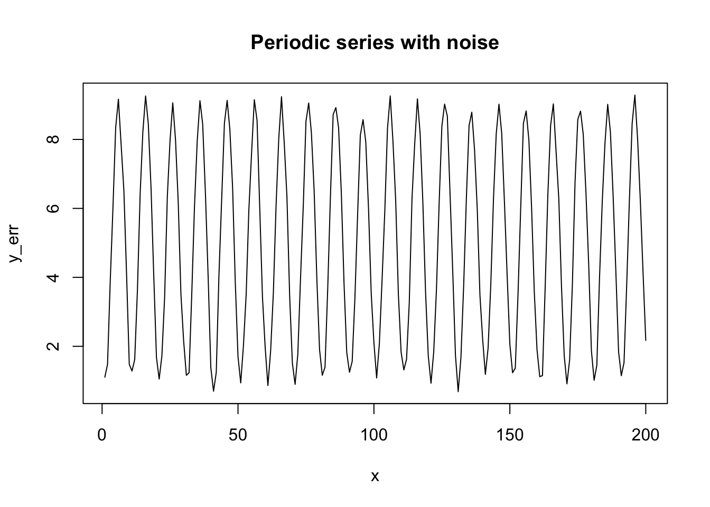
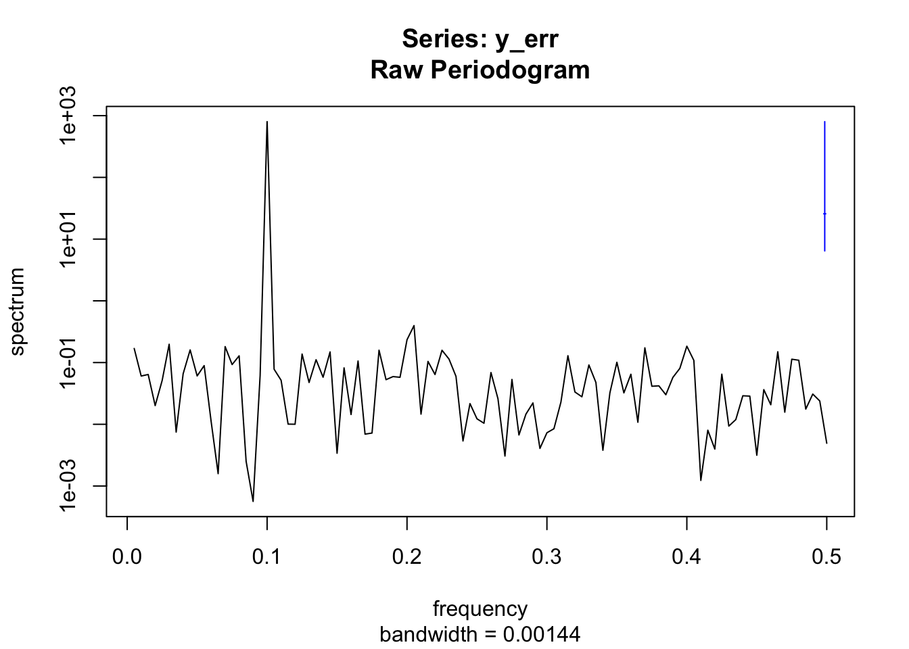
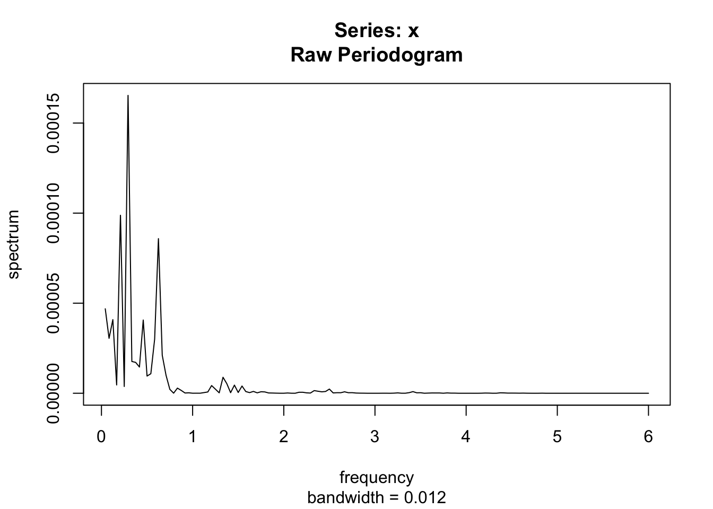
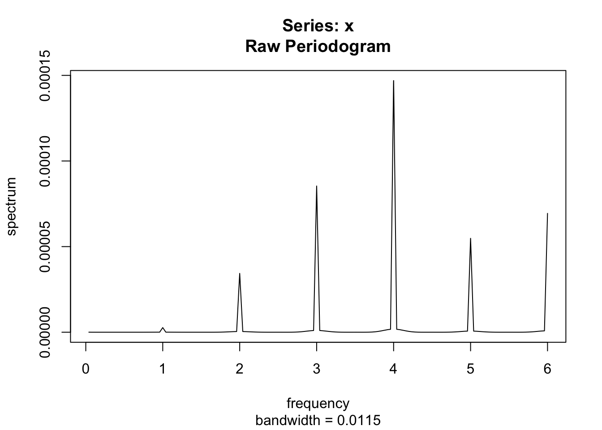
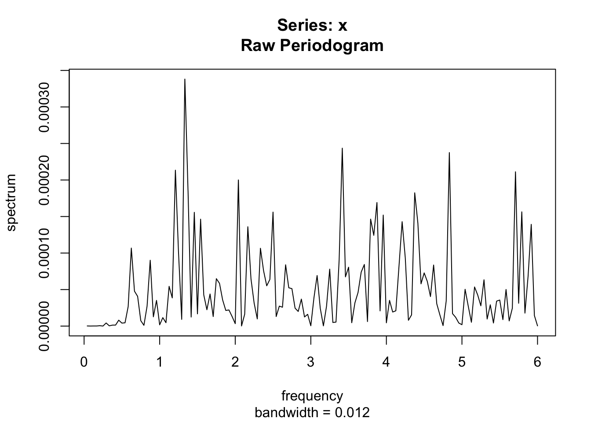
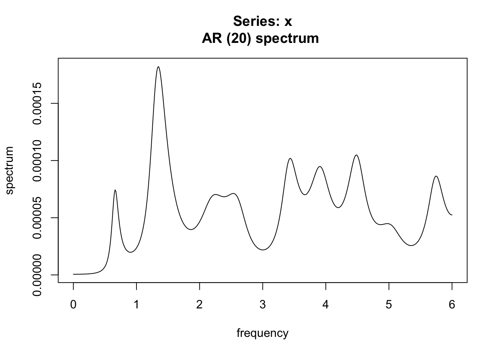

# スペクトル解析

<!-- 090922: 作成開始 --> 
<!-- 120923
金融時系列?
為替データ, 日次データ? 高頻度データ?
暗号資産データ?
株価データ, リターン, ボラティリティ, 
quantmodにより入手, 
水準? リターン?
-->


## ARMAモデルのスペクトル密度
- スペクトル密度の推定方法
  - パラメトリック推定 vs ノンパラメトリック推定
- BD, Ch.4
  - AR(1), MA(1)
  - シミュレーション・データによる計算例
  
```
- spectrum
  - spectrum is a wrapper function which calls the methods spec.pgram and spec.ar.
- spec.ar (パラメトリック推定: ARモデル専用)
  - Fits an AR model to x (or uses the existing fit) and computes (and by default plots) the spectral density of the fitted model.
- spec.pgram (ノンパラメトリック推定 → "ピリオドグラム")
  - spec.pgram calculates the periodogram using a fast Fourier transform, and optionally smooths the result with a series of modified Daniell smoothers (moving averages giving half weight to the end values).
```

- AR(1)モデル

```r
#par(mfrow=c(3,1))
Tlen <- 100
phi <- c(0.7); theta = NULL; sigma <- 1
set.seed(10)
x <- arima.sim(n = Tlen, model = list(order = c(1, 0, 0), ar = phi, ma = theta), sd = sigma)
#plot(x, type = "l") # 時系列プロット

# ACF/PACFの計算
par(mfrow = c(1, 2))
acf(x) # 自己相関(ACF)
pacf(x)	# 偏自己相関(PACF)
```


```r

# パラメトリック推定
x.spec <- spec.ar(x)  # AR次数(order)は無指定の場合, AICで自動選択

# ピリオドグラム
x.spec <- spectrum(x)
```


```r
x.spec <- spectrum(x, spans = 2)  # 平滑化ピリオドグラム
x.spec <- spectrum(x, spans = 4)
```


```r

# AR1過程のスペクトル密度(理論値)
specden.AR1.true <- function(lambda, phi, sigma){
  sigma^2 / (2 * pi) /(1 - 2 * phi * cos(lambda) + phi^2)
}
#curve(specden.AR1.true, from = 0, to = 3)
x.freq <- seq(0, 3, 0.01)
gmain <- paste0("Spectral density of AR(1):\nphi1=", phi) 
x.spec.true <- specden.AR1.true(x.freq, phi, sigma)
plot(x.freq, x.spec.true, type = "l", main = gmain, ylab = "spectral density", xlab = "frequency")
```


- MA(1)モデル

```r
phi <- NULL; theta <- c(0.9); sigma <- 1
set.seed(10)
x <- arima.sim(n = Tlen, model = list(order = c(0, 0, 1), ar = phi, ma = theta))
#plot(x, type = "l") # 時系列プロット

# ACF/PACFの計算
par(mfrow = c(1, 2))
acf(x) # 自己相関(ACF)
pacf(x)	# 偏自己相関(PACF)
```


```r

# ピリオドグラム
x.spec <- spectrum(x)
x.spec <- spectrum(x, span = 2) # 平滑化ピリオドグラム
```


```r
x.spec <- spectrum(x, span = 4) # 平滑化ピリオドグラム

# MA(1)過程のスペクトル密度(理論値)
specden.MA1.true <- function(lambda, theta, sigma){
  sigma^2 / (2 * pi) * (1 + 2 * theta * cos(lambda) + theta^2)
}
#curve(specden.AR1.true, from = 0, to = 3)
x.freq <- seq(0, 3, 0.01)
gmain <- paste0("Spectral density of MA(1):\ntheta1=", theta) 
x.spec.true <- specden.MA1.true(x.freq, theta, sigma)
plot(x.freq, x.spec.true, type = "l", main = gmain, ylab = "spectral density", xlab = "frequency")
```


<!-- 
出所: https://mcs.utm.utoronto.ca/~nosedal/sta457/frequency-domain.pdf
解説はないが, こちらの方がスペクトル解析の例として良さそう -->

## 周期変動時系列のスペクトル密度
- 正弦波でスペクトル密度の形状を確認

```r
n <- 200
x <- c(1:n)
y <- 5 + 4*cos(2 * pi * x / 10 + 2.5)
plot(x, y, type = "l"); title("Pure periodic series")
```


```r

# smoothed peridogram
z <- spec.pgram(y, fast = F, taper = 0.0)
```


```r

n <- 200
x <- c(1:n)
y <- 5+4*cos(2*pi*x/10 + 2.5)
err <- rnorm(n,0,0.25)
y_err <- y + err
plot(x, y_err, type = "l"); title("Periodic series with noise")
```



```r

z_err <- spec.pgram(y_err, fast = F, taper = 0.0)
```



## データ分析例
### データセット1: sunspots {-}

```r
newsun <- sunspots[12:100] - sunspots[1:89]
sun.ar <- ar.yw(newsun)
plot.ts(sun.ar$aic, xlab = "Order", ylab = "AIC")
```


```r
plot.ts(sun.ar$resid, xlab = "Year", ylab = "Residual from AR Model") #abline(h = 0, col = "red") # R Markdownでエラー → コメントアウト
```


```r
acf(sun.ar$resid[-1]) # エラー発生 → 第1要素除去
```


```r
z_sun <- spec.pgram(sunspots, fast = F, taper = 0.0)
```


```r

names(z_sun)
##  [1] "freq"      "spec"      "coh"       "phase"     "kernel"    "df"       
##  [7] "bandwidth" "n.used"    "orig.n"    "series"    "snames"    "method"   
## [13] "taper"     "pad"       "detrend"   "demean"
plot(z_sun$freq, z_sun$spec, type = "l")
```


### データセット2: SOI Index {-}
- Rパッケージ"rsoi"
```
- download_soi(): Download Southern Oscillation Index data
  - Date: Date object that uses the first of the month as a placeholder. Date formatted as date on the first of the month because R only supports one partial of date time
  - Month: Month of record
  - Year: Year of record
  - SOI: Southern Oscillation Index
  - SOI_3MON_AVG: 3 Month Average Southern Oscillation Index
-3ヶ月平均は対称平均
```

```r
#install.packages("rsoi")
require(rsoi)
require(tidyverse)

soi = download_soi()

soi.2 <- soi %>% drop_na(SOI) # 未観測月除去

soi.ts <- ts(soi.2$SOI, start = 1951, frequency = 12)
dsoi.ts <- diff(soi.ts)

library(forecast)
soi.ma12 <- ma(soi.ts, order = 12, centre = TRUE)

layout(1:3)
plot.ts(soi.ts, main = "SOI Index")
plot.ts(dsoi.ts, main = "First difference of SOI Index")
plot.ts(soi.ma12, main = "Centered 12-month moving average of SOI Index")

# Periodogram
#layout(1:3)
soi.spec.pgram <- spec.pgram(soi.ts, spans = 2, fast = F, taper = 0.0, log = "no")
soi.spec.pgram <- spec.pgram(soi.ts, spans = 4, fast = F, taper = 0.0, log = "no")
soi.spec.pgram <- spec.pgram(soi.ts, spans = 6, fast = F, taper = 0.0, log = "no")
soi.spec.pgram <- spec.pgram(soi.ts, fast = F, taper = 0.0, log = "no")
soi.spec.pgram <- spec.pgram(soi.ts, fast = F, taper = 0.1, log = "no")
soi.spec.pgram <- spec.pgram(soi.ts, fast = F, taper = 0.2, log = "no")

# Parametric estimation
soi.spec.ar <- spec.ar(soi.ts) 
```

### データセット3: Bank loan rate {-}
- 出所: CM, Ch.9
```
- "mprime.txt"
- the monthly percentage US Federal Reserve Bank prime loan rate, courtesy of the Board of Governors of the Federal Reserve System, from January 1949 until November 2007
- Data downloaded from Federal Reserve Economic Data at the Federal Reserve Bank of St. Louis.
```

```r
# p.190
ifl <- "mprime.txt"
Interest <- read.csv(ifl, skip = 1) %>% unlist()
layout(1:3)
plot(as.ts(Interest), ylab = "Interest rate")
acf(Interest)
#spectrum(Interest, spans = sqrt(length(Interest))/4) # ERROR(9/9/22)
spectrum(Interest, spans = 4)
```

- → 長期記憶性を示唆

<!---
## 分解モデル (revisited)
- 周期成分のみならず, トレンド成分を考える (古典的分解モデル)

### データセット4: Accidental deaths {-}
- 出所: BD(96)

```
- deaths.dat
- monthly accidental death figures in the U. S. A. from 1973 to 1978.
```
--->


## 金融時系列データの分析
- 為替水準に対するスペクトル解析を試みる


```r
library('quantmod')
library('tidyverse')
#
getSymbols("DEXUSEU", src = "FRED") # USD/EUR daily spot rate from FRED
## [1] "DEXUSEU"
head(DEXUSEU)
##            DEXUSEU
## 1999-01-04  1.1812
## 1999-01-05  1.1760
## 1999-01-06  1.1636
## 1999-01-07  1.1672
## 1999-01-08  1.1554
## 1999-01-11  1.1534
tail(DEXUSEU)
##            DEXUSEU
## 2024-01-05  1.0957
## 2024-01-08  1.0976
## 2024-01-09  1.0935
## 2024-01-10  1.0960
## 2024-01-11  1.0943
## 2024-01-12  1.0959
# 休日(NA)処理
eurusd <- DEXUSEU %>% na.locf() # NAは直近の値を埋める

# 月次データ化
# 月末だけのインデックス抽出 (最終データは月末とは限らないので除去)
idx_mlast <- endpoints(eurusd)
# 為替水準 (月次)
eurusd_m <- eurusd[idx_mlast[- length(idx_mlast)]]
# 為替リターン (月次)
eurusd_m_lret <- diff(log(eurusd_m)) %>% na.omit()
```


```r
d1 <- first(index(eurusd_m))
eu_m_ts <- ts(eurusd_m, start = c(year(d1), month(d1)) , frequency = 12)

spectrum(eu_m_ts, log = "no")
```


```r
spectrum(eu_m_ts, method = "ar", log = "no")
```


- → トレンドの存在 (非定常性) を示唆


```r
d1 <- first(index(eurusd_m_lret))
eu_m_ts <- ts(eurusd_m_lret, start = c(year(d1), month(d1)) , frequency = 12)
spectrum(eu_m_ts)
```


```r
spectrum(eu_m_ts, method = "ar")
```


- → (ほぼ)白色ノイズ


```r
spectrum(eu_m_ts^2, method = "ar") # → AR(3)
```


```r
spectrum(eu_m_ts^2)
```


```r
#spectrum(abs(eu_m_ts), method = "ar") # → AR(2)
```
- ARCH効果を反映

### 為替水準に対する分解 & スペクトル解析{-}
-  (古典的)分解モデルを使って, 為替水準を周期成分・トレンド成分・定常成分に分解し, それぞれのスペクトル密度を確認してみる

```r
# 古典的分解
eu_decom <- decompose(eu_m_ts)		# additive
#eu_decom <- decompose(eu, type = "mult")	# multiplicative
plot(eu_decom)
```


```r

# 乗法モデル
# eu_decom_mult <- decompose(eu_m_ts, type = "multiplicative")
# plot(eu_decom_mult)

# 代替的方法
# stl(), Seasonal Decomposition of Time Series by Loess
# loess(locally weighted regression)によるsmoothingを行い, 3成分に分解
#stl(eu_m_ts, s.window = "periodic")
#stl(eu_m_ts, s.window = 7)

# トレンドおよびランダム成分は, NA有り → 欠損値処理が必要
spectrum(eu_decom$trend %>% na.omit(), log = "no")
```



```r
spectrum(eu_decom$seasonal, log = "no") # → decomp()のアルゴリズム反映
```



```r
spectrum(eu_decom$random %>% na.omit(), log = "no")
```



```r
spectrum(eu_decom$random %>% na.omit(), method = "ar", log = "no")
```



```r
# y軸のスケールは, デフォルトはlogスケール ("yes")
```

- トレンドの存在. 絶対値の大きさ, 圧倒的に大
- 季節性はfreq = 1,...6 (1年当たりのサイクル数) → Nyquist freq = 1月に0.5サイクル
- 但し, 絶対値は3要素の内最小 (→ (抽出された方法での)季節性成分は無視出来るほど小さい)
- 定常成分 (ランダム項) は1位55, 2位115, 3位198でピーク(500点中, ARのケース) (ARだと季節性よりは桁が1桁大きいがトレンドより圧倒的に小さい)
- 周波数が2/3, 4/3付近にピーク (1年間に3分の2回, 3分の4回の回転相当)

### 為替リターンに対する分解 & スペクトル解析{-}
-  (古典的)分解モデルを使って, 為替リターンを周期成分・トレンド成分・定常成分に分解し, それぞれのスペクトル密度を確認してみる

```r
# 古典的分解
eu_decom <- decompose(eu_m_ts)		# additive
#eu_decom <- decompose(eu, type = "mult")	# multiplicative
plot(eu_decom)
```


```r

# トレンドおよびランダム成分は, NA有り → 欠損値処理が必要
spectrum(eu_decom$trend %>% na.omit(), log = "no")#, main = "monthly EURUSD: return\ntrend")
```


```r
spectrum(eu_decom$seasonal, log = "no")#, main = "monthly EURUSD: return\nseasonality") # → decomp()のアルゴリズム反映
```


```r
spectrum(eu_decom$random %>% na.omit(), log = "no")#, main = "monthly EURUSD: return\nrandom")
```


```r
spectrum(eu_decom$random %>% na.omit(), method = "ar", log = "no")#, main = "monthly EURUSD: return\nrandom")
```


- 3成分の桁, 差なし. 最大値はむしろ定常成分 (ランダム項)
- そもそも白色ノイズを無理に分解しようとしているため

- ここでは, スペクトル解析への理解を深めることを主眼に, 成分分解 → スペクトル解析 (スペクトル密度の形状確認) を行ったが, モデリングの観点では, スペクトル解析 → 分解モデルの構築のフローも重要 (特に, 季節性成分のモデリングにおいて, 分析対象の周期性に関する事前の知識がない場合)
- prophetモデルでは, 季節性成分に調和回帰が使われる (正弦波・余弦波を説明変数に持つ回帰モデル)  
  cf. https://facebook.github.io/prophet/docs/multiplicative_seasonality.html
